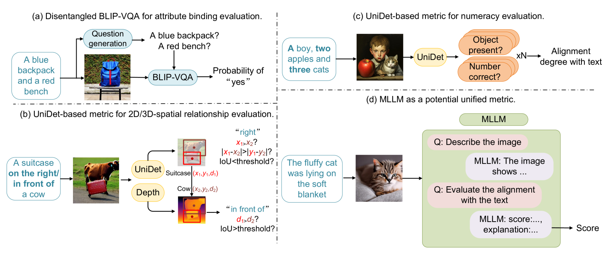
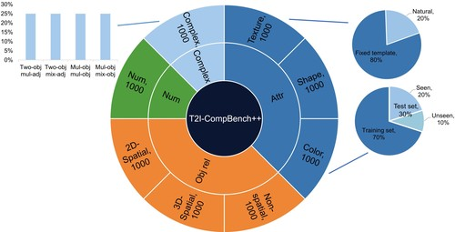

# T2I-CompBench

## 📌 核心贡献

> 提出首个系统性的组合性文本到图像生成评估基准 T2I-CompBench++，包含 8000 条组合性提示词、覆盖 8 个子类别，并设计了针对不同组合性维度的专用自动评估指标（Disentangled BLIP-VQA、UniDet-based、MLLM-based），在与人类判断的对齐上显著优于通用 CLIP/BLIP 指标。

## 📖 摘要

We propose T2I-CompBench++, an enhanced and comprehensive benchmark for evaluating compositional text-to-image generation. T2I-CompBench++ comprises 8,000 compositional text prompts categorized into four primary groups: attribute binding, object relationships, generative numeracy, and complex compositions. These groups are further divided into eight sub-categories to provide a thorough evaluation. We introduce enhanced evaluation metrics that incorporate detection-based approaches and Multimodal Large Language Models (MLLMs) such as GPT-4V, and we benchmark 11 state-of-the-art text-to-image generative models. Our benchmark and metrics provide a systematic framework for evaluating and improving compositional text-to-image generation capabilities.

## 🔍 关键信息

| 字段 | 内容 |
|------|------|
| 机构 | The University of Hong Kong, Tsinghua University, Huawei Noah's Ark Lab |
| 发表 | 2023-07-12 |
| 分类 | cs.CV |
| 链接 | [arXiv](https://arxiv.org/abs/2307.06350) |

## 📝 我的笔记

### 方法总览

### 动机与问题定义

现有 T2I 模型在组合性生成方面存在严重不足——当提示词包含多个对象、多种属性、空间关系或数量要求时，生成质量显著下降。然而，现有的评估指标（如 CLIPScore、FID）无法有效捕捉这些组合性维度的细粒度差异。T2I-CompBench 旨在填补这一空白，提供系统性的组合性评估框架。

### 基准数据集构建

T2I-CompBench++ 包含 **8000 条提示词**，分为 4 大类、8 个子类别（每个子类别 1000 条，700 训练 + 300 测试）：

| 大类 | 子类别 | 说明 |
|------|--------|------|
| **属性绑定** | Color | 颜色属性与对象的绑定（480 CC500 + 200 COCO + 320 ChatGPT） |
| | Shape | 32 种形状属性（long, cubic, cylindrical, spherical 等） |
| | Texture | 8 种材质属性（rubber, plastic, metallic, wooden, fabric 等） |
| **对象关系** | 2D-Spatial | 7 种平面空间关系（left of, right of, top of, bottom of 等） |
| | 3D-Spatial | 3 种深度空间关系（in front of, behind, hidden by） |
| | Non-Spatial | 交互关系（wear, hold, play with 等，ChatGPT 生成） |
| **生成计数** | Numeracy | 数量 1-8，150 种对象类型 |
| **复杂组合** | Complex | 多对象 + 多属性 + 多关系的组合提示 |

### 评估指标设计

论文的核心贡献在于为不同组合性维度设计了专门的自动评估指标：

#### 1. Disentangled BLIP-VQA（属性绑定）

将复杂提示词分解为单独的对象-属性对，分别进行 VQA 提问。例如对于 "a green bench and a red car"，分别问 "a green bench?" 和 "a red car?"，然后将 "yes" 的概率相乘：

$$\text{Score} = \prod_i P(\text{yes} \mid \text{question}_i)$$

这种解耦方式避免了复杂属性-对象对应关系带来的歧义。

#### 2. UniDet-based（空间关系 & 数量）

**2D 空间关系**：使用 UniDet 检测对象边界框，根据中心点坐标判断空间关系。对于两个对象中心 $(x_1, y_1)$ 和 $(x_2, y_2)$：
- "left of"：$x_1 < x_2$ 且 $|x_1 - x_2| > |y_1 - y_2|$ 且 IoU < 0.1

**3D 空间关系**：结合深度估计，通过对象的平均深度值 $d_1, d_2$ 判断前后遮挡关系：
- "in front of"：$d_1 > d_2$ 且 IoU > 0.5

**数量评估**：提取提示词中的对象名称和数量，与检测结果对比。设 $n$ 为对象类别数，每检测到一个正确对象得 $\frac{1}{2n}$ 分，每个类别数量正确再得 $\frac{1}{2n}$ 分。

#### 3. MLLM-based（非空间关系 & 复杂组合）

采用两步提问策略：
1. 描述性问题："Describe the image"（50 词）
2. 评估问题：预测图文对齐分数（0-100）

支持 Chain-of-Thought 变体，通过分步推理提高准确度。使用 GPT-4V 和 ShareGPT4V 等模型。

#### 4. 3-in-1 指标（复杂组合的替代方案）

$$\text{Score}_{\text{3-in-1}} = \frac{\text{CLIPScore} + \text{BLIP-VQA} + \text{UniDet}}{3}$$

### 与人类判断的对齐

通过 Amazon Mechanical Turk 进行人类评估（每子类别 25 个提示，每个提示 2 张图，3 名标注者，5 级 Likert 量表），计算 Kendall's $\tau$ 和 Spearman's $\rho$：

| 指标 | 最佳适用维度 | Kendall $\tau$ | Spearman $\rho$ |
|------|------------|----------------|-----------------|
| **B-VQA** | Color | 0.6297 | 0.7958 |
| **B-VQA** | Texture | 0.5177 | 0.6995 |
| **UniDet** | 2D-Spatial | 0.4756 | 0.5136 |
| **UniDet** | Numeracy | 0.4251 | 0.5273 |
| **GPT-4V** | Non-spatial | 0.4756 | 0.5337 |
| **GPT-4V** | Complex | 0.5070 | 0.5942 |

关键发现：**专用指标在对应维度上显著优于通用 CLIP/BLIP-CLIP 指标**。

### 模型基准测试结果（部分）

| 模型 | Color | Shape | Texture | 2D-Spatial | Numeracy | Non-spatial | Complex |
|------|-------|-------|---------|------------|----------|-------------|---------|
| SD v2 | 0.5065 | 0.4221 | — | 0.1342 | 0.4582 | 0.8153 | — |
| DALLE-3 | 0.7785 | — | — | — | — | 0.9170 | — |
| SD3 | 0.8132 | — | 0.7334 | — | 0.6174 | — | — |
| FLUX.1 | — | — | — | — | — | 0.9213 | 0.7927 |

### GORS 微调方法

论文还提出了基于组合性奖励的微调方法 GORS（Generation with Online Reward Selection）：

1. 对每个提示生成 $k$ 张图像
2. 计算文本-图像对齐分数作为奖励
3. 选择超过阈值的样本
4. 使用加权损失微调：

$$\mathcal{L}(\theta) = \mathbb{E}_{(x,y,s) \in \mathcal{D}_s} \left[s \cdot \|\epsilon - \epsilon_\theta(z_t, t, y)\|_2^2\right]$$

使用 LoRA 同时微调 CLIP 文本编码器和 U-Net 注意力层，在 SD v2 上取得了一致的提升（如 Color 从 0.5065 提升到 0.6603，+30.3%）。

### T2I-CompBench++ 相比 T2I-CompBench 的改进

| 方面 | T2I-CompBench | T2I-CompBench++ |
|------|---------------|-----------------|
| 提示词总数 | ~4,000 | 8,000 |
| 子类别数 | 6 | 8 |
| 新增子类别 | — | Numeracy, 3D-Spatial |
| 属性类型 | 仅 Color | Color, Shape, Texture |
| 评估指标 | 有限 | 全面（BLIP-VQA, UniDet, MLLM） |
| 基准模型数 | 6-7 | 11（含 FLUX.1, SD3, DALLE-3） |
| 深度估计 | 无 | 有（3D 指标） |
| MLLM 分析 | 有限 | 广泛（GPT-4V, ShareGPT4V 等） |

### 总结性评价

T2I-CompBench 是组合性 T2I 评估领域最具影响力的基准之一。其核心洞察在于：**不同组合性维度需要不同的评估策略**——通用指标（如 CLIP）无法有效区分细粒度的组合性差异。Disentangled BLIP-VQA 通过解耦属性-对象对来评估属性绑定的思路尤其优雅。局限性在于尚缺乏统一的组合性评估指标，且检测模型的能力上限制约了空间关系评估的准确性。

## 🔗 相关论文

**对比基线：** [[CLIPScore]]

**同方向：** [[ImageReward]], [[GenAI-Bench]], [[VBench]]
