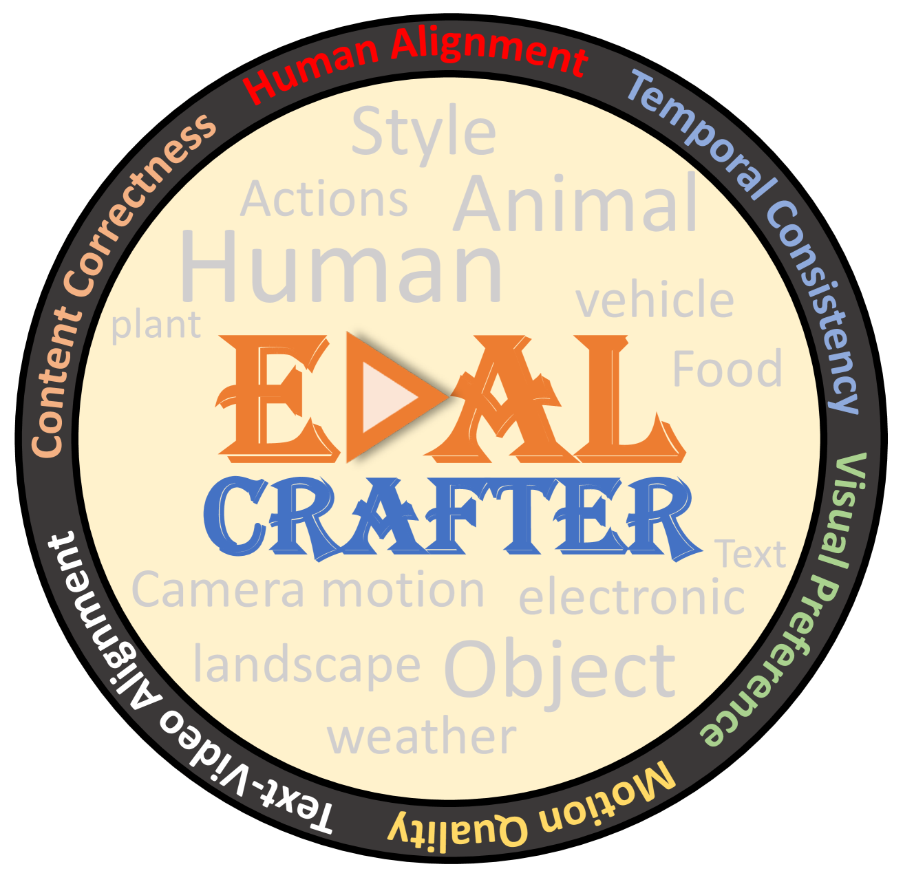
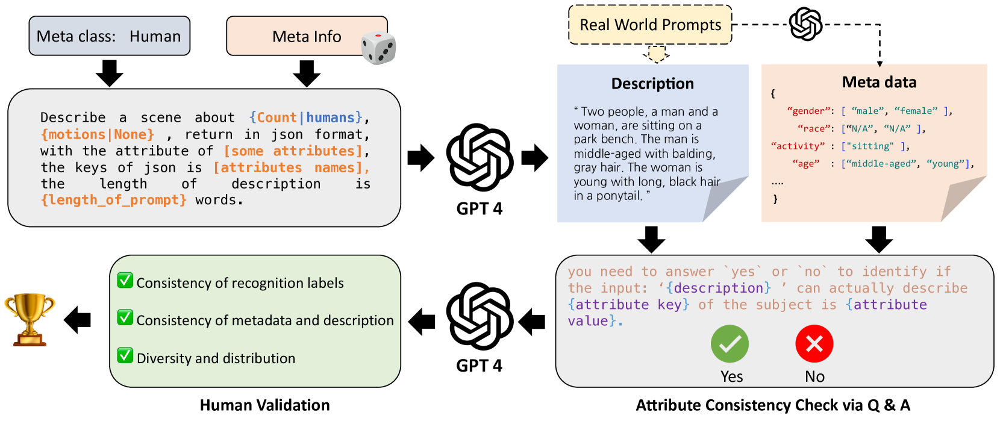
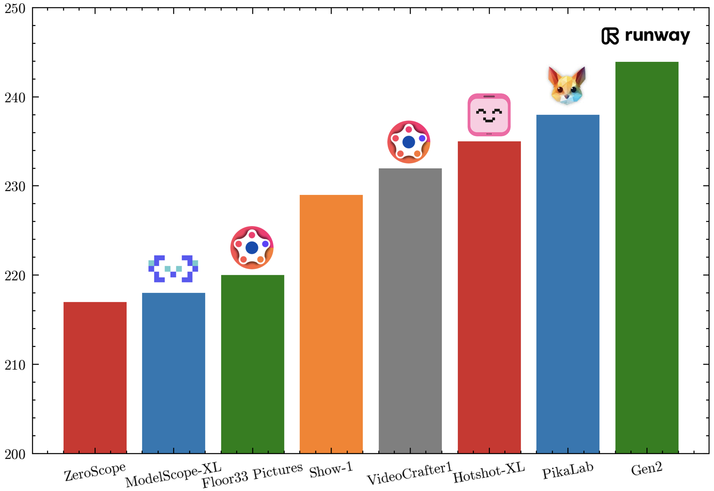

# EvalCrafter

## 📌 核心贡献

> 提出首个系统性的文本到视频生成模型评估框架，包含 700 个基于真实用户数据的评估 prompt、17 个客观指标覆盖四大维度，并通过人类偏好对齐的线性回归方法得到与人类判断高度相关的综合评分。

## 📖 摘要

The vision and language generative models have been overgrown in recent years. For video generation, various open-sourced models and public-available services have been developed to generate high-quality videos. However, these methods often use a few metrics, e.g., FVD or IS, to evaluate the performance. We argue that it is hard to judge the large conditional generative models from the simple metrics since these models are often trained on very large datasets with multi-aspect abilities. Thus, we propose a novel framework and pipeline for exhaustively evaluating the performance of the generated videos. Our approach involves generating a diverse and comprehensive list of 700 prompts for text-to-video generation, which is based on an analysis of real-world user data and generated with the assistance of a large language model. Then, we evaluate the state-of-the-art video generative models on our carefully designed benchmark, in terms of visual qualities, content qualities, motion qualities, and text-video alignment with 17 well-selected objective metrics. To obtain the final leaderboard of the models, we further fit a series of coefficients to align the objective metrics to the users' opinions. Based on the proposed human alignment method, our final score shows a higher correlation than simply averaging the metrics, showing the effectiveness of the proposed evaluation method.

## 🔍 关键信息

| 字段 | 内容 |
|------|------|
| 机构 | Tencent AI Lab / City University of Hong Kong / University of Macau / CUHK |
| 发表 | 2023-10-17 |
| 分类 | cs.CV |
| 链接 | [arXiv](https://arxiv.org/abs/2310.11440) |

## 📝 我的笔记

### 方法总览

### 动机与问题定义

现有视频生成模型的评估存在严重不足：

1. **指标单一**：大多数工作仅使用 FVD 或 IS 评估，无法全面反映模型能力
2. **Prompt 不足**：评估用的文本提示缺乏多样性，无法覆盖真实用户需求
3. **缺乏人类对齐**：客观指标与人类主观偏好之间存在较大差距

### 评估 Prompt 设计（700 prompts）

**数据来源分析**：从 PikaLab 和 FullJourney Discord 服务器收集 60 万条 prompt，筛选至 20 万条进行分析：
- Prompt 长度：90% 分布在 3-40 词之间
- 四大元类别：人物（human）、动物（animal）、物体（object）、风景（landscape）

**自动生成流程**：
1. 使用 GPT-4 基于随机采样的元数据生成场景描述
2. 自检验证（Self-check）：交叉验证元数据与描述的一致性
3. 人工筛选：确保正确性和 T2V 相关性
4. 整合来源：真实用户 prompt + DALL-Eval + Draw-Bench prompt

**最终构成**：
- 700 条 prompt，平均 12.3 词
- 4 种元类型 x 3 种子类型
- 50 种风格变化
- 20 条相机运动 prompt
- 每条 prompt 标注：对象、颜色、数量、动作、风格等元数据

### 四大评估维度与 17 项指标

#### 1. 视觉质量（Visual Quality）

| 指标 | 方法 | 说明 |
|------|------|------|
| VQAA (Aesthetic) | Dover | 视觉美感评分 |
| VQAT (Technical) | Dover | 技术质量（噪声、伪影等） |
| IS (Inception Score) | Inception Network | 内容多样性 |

#### 2. 文本-视频对齐（Text-Video Alignment）

| 指标 | 方法 | 说明 |
|------|------|------|
| CLIP-Score | CLIP | 文本与帧的余弦相似度 |
| SD-Score | SDXL | 与参考图像的相似度 |
| BLIP-BLEU | BLIP2 + BLEU | 生成描述与原始 prompt 的匹配度 |
| Detection-Score | SAM-Track | 目标对象是否出现 |
| Count-Score | - | 对象数量准确性 |
| Color-Score | - | 颜色正确性 |
| Celebrity ID Score | DeepFace | 名人面部识别准确度 |
| OCR-Score | PaddleOCR | 文本生成质量（WER, NED, CER） |

#### 3. 运动质量（Motion Quality）

| 指标 | 方法 | 说明 |
|------|------|------|
| Action-Score | VideoMAE V2 | 人体动作识别准确率（Kinetics-400） |
| Flow-Score | RAFT | 平均光流大小 |
| Motion AC-Score | - | 运动幅度分类一致性 |

#### 4. 时序一致性（Temporal Consistency）

| 指标 | 方法 | 说明 |
|------|------|------|
| Warping Error | 光流 | 基于光流的逐像素差异 |
| CLIP-Temp | CLIP | 连续帧语义相似度 |
| Face Consistency | DeepFace | 跨帧人脸一致性 |

### 关键公式

**SD-Score**（与 SDXL 参考图像的相似度）：

$$S_{SD}=\frac{1}{M}\sum_{i=1}^{M}\left(\frac{1}{N}\sum_{t=1}^{N}\left(\frac{1}{N_1}\sum_{k=1}^{N_1}\mathcal{C}(emb(x_t^i),emb(d_k^i))\right)\right)$$

其中 $M$ 为视频数量，$N$ 为帧数，$N_1=5$ 为 SDXL 生成的参考图像数量。

**BLIP-BLEU**（描述与 prompt 的匹配）：

$$S_{BB}=\frac{1}{M}\sum_{i=1}^{M}\left(\frac{1}{N_2}\sum_{k=1}^{N_2}\mathcal{B}(p^i,l_k^i)\right)$$

其中 $N_2=5$ 为采样的描述数量。

### 人类偏好对齐

- **用户研究规模**：5 个模型 x 700 prompt = 2,500 个视频
- **标注**：每个指标 7 名标注员，1-5 分评分
- **数据量**：8,647 条初始评分 -> 1,024 条专业评分（过滤后）
- **对齐方法**：线性回归（80% 训练 / 20% 验证），最小化残差平方和，优化各指标的加权系数

### 关键实验结果

#### 总体排名（人类对齐后）

| 排名 | 模型 | 综合分数 |
|------|------|----------|
| 1 | Gen2 | 62.51 |
| 2 | VideoCrafter1 | 60.85 |
| 3 | PikaLab | 60.77 |
| 4 | Hotshot-XL | 60.38 |
| 5 | Floor33 Pictures | 58.78 |
| 6 | ZeroScope | 53.41 |
| 7 | ModelScope | 53.09 |
| 8 | Show-1 | 52.19 |

#### 各维度表现

| 维度 | Top-1 | Top-2 | Top-3 |
|------|-------|-------|-------|
| 视觉质量 | Gen2 (62.51) | Hotshot-XL (60.38) | PikaLab (60.77) |
| 文本-视频对齐 | Show-1 (62.07) | VideoCrafter1 (61.95) | Hotshot-XL (61.52) |
| 运动质量 | Gen2 (56.43) | PikaLab (55.77) | Show-1 (53.74) |
| 时序一致性 | PikaLab (65.41) | Gen2 (64.41) | Show-1 (60.83) |

#### 与人类判断的相关性

| 维度 | 方法 | Spearman's rho | Kendall's tau |
|------|------|----------------|---------------|
| 视觉质量 | 简单平均 | 55.0 | 41.0 |
| 视觉质量 | EvalCrafter | **55.4** | **41.1** |
| 运动幅度 | 简单平均 | -38.2 | -27.7 |
| 运动幅度 | EvalCrafter | **45.0** | **32.4** |
| 时序一致性 | 简单平均 | 54.4 | 38.9 |
| 时序一致性 | EvalCrafter | **56.7** | **41.5** |
| 文本-视频对齐 | 简单平均 | 31.9 | 22.7 |
| 文本-视频对齐 | EvalCrafter | **32.3** | **22.5** |

**关键发现**：运动幅度维度改善最为显著（从负相关变为正相关）；CLIP-Score 与人类判断相关性很差（rho=6.3），而 BLIP-BLEU 明显更优（rho=26.7）。

### 十大发现

1. 单维度评估不够充分——不同维度下模型排名差异显著
2. 按元类型评估必要——模型在人物 vs. 风景等不同类型上表现差异大
3. 用户更重视视觉美感而非文本对齐
4. 所有模型均缺乏通过文本控制相机运动的能力
5. 分辨率与视觉美感不相关
6. 更大的运动幅度并不保证用户偏好
7. 文本生成对所有方法仍具挑战性
8. 灾难性遗忘导致部分模型严重失败
9. 有效指标：Warping Error、CLIP-Temp、VQAT、VQAA；无效指标：CLIP-Score
10. 当前所有模型仍不够好，Gen2 在复杂场景和实体细节上仍有困难

### 总结性评价

EvalCrafter 是视频生成评估领域的重要工作，其主要价值在于：

1. **系统性**：首次从四个维度、17 个指标全面评估视频生成模型
2. **数据驱动**：基于真实用户数据设计 prompt，比随机构造更有代表性
3. **人类对齐**：通过线性回归将客观指标与主观偏好对齐，解决了单一指标的局限性

**局限性**：
- 评估的模型（2023 年 10 月）已较过时，当前 SOTA 模型（如 Sora、Kling 等）远超当时水平
- 线性回归对齐方法较为简单，可能无法捕捉指标间的非线性交互
- 700 prompt 虽然比之前的工作多，但对于全面评估仍可能不够

## 🔗 相关论文

**同方向：** [[VBench]], [[VideoScore]]
