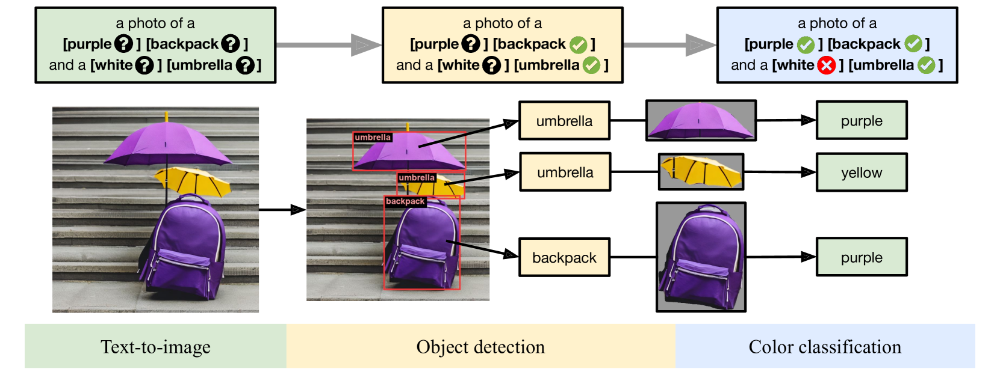
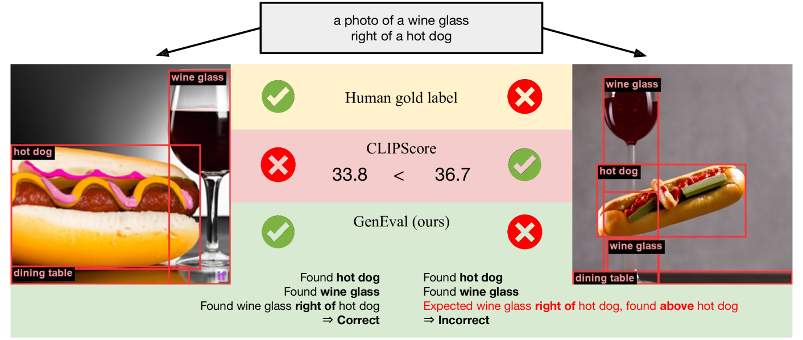
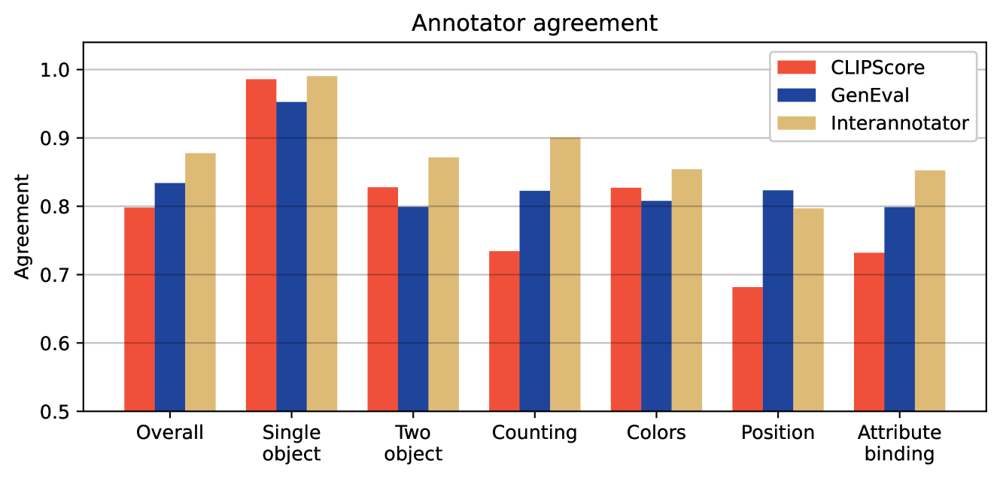

# GenEval

## 📌 核心贡献

> 提出基于目标检测的文本到图像对齐评估框架 GenEval，通过将组合性提示词分解为可验证的对象属性（共现、位置、数量、颜色、属性绑定），实现了比 CLIPScore 更细粒度且与人类判断高度一致（83%）的自动化评估。

## 📖 摘要

Recent breakthroughs in diffusion models, multimodal pretraining, and efficient architectures have led to an explosion of text-to-image generative models. Given this rapid proliferation, a natural question is how to compare their generation capabilities. However, current automated evaluation metrics like FID or CLIPScore only offer a holistic measure of image quality or image-text alignment, and are unsuited for fine-grained or compositional evaluation. In this work, we propose GenEval, an object-focused framework to evaluate compositional image properties such as object co-occurrence, position, count, and color. We show that current object detection models can effectively evaluate the performance of leading text-to-image models like Stable Diffusion and DALL-E 2. We find that recent models have significantly improved in correctly generating single objects, but still have difficulty in bindning attributes to the right objects and in correctly placing objects in relation to each other. We publicly release our evaluation framework and benchmark.

## 🔍 关键信息

| 字段 | 内容 |
|------|------|
| 机构 | Meta AI, Carnegie Mellon University |
| 发表 | 2023-10-17 |
| 分类 | cs.CV, cs.LG |
| 链接 | [arXiv](https://arxiv.org/abs/2310.11513) |

## 📝 我的笔记

### 方法总览

### 动机与问题定义

现有 T2I 评估指标（如 FID、CLIPScore）只能提供整体性的图像质量或图文对齐度量，无法对组合性生成能力进行细粒度评估。例如，CLIPScore 无法区分"生成了正确对象但颜色错误"和"完全生成了错误对象"的情况。GenEval 的核心思路是：**将组合性提示词分解为可独立验证的对象级属性，利用目标检测模型进行逐项评估**。

### 评估框架设计

GenEval 测试六种组合性属性，使用模板化的文本提示词生成评估样本：

| 任务 | 描述 | 示例 |
|------|------|------|
| **Single Object** | 生成单个指定对象 | "a bus" |
| **Two Object** | 同时生成两个不同对象 | "a cat and a dog" |
| **Counting** | 生成指定数量（2/3/4）的同类对象 | "three apples" |
| **Colors** | 生成指定颜色的对象（11 种 Berlin-Kay 基本颜色） | "a red car" |
| **Position** | 两个对象的相对空间关系 | "a cat left of a dog" |
| **Attribute Binding** | 两个对象各具有不同颜色 | "a green bench and a red car" |

对象名称来自 MS-COCO 80 类。总计 553 条提示词，每条生成 4 张图像。

### 检测与评估流水线

**目标检测**：使用 Mask2Former（Swin-S backbone），在 MS-COCO 上训练的实例分割模型（来自 MMDetection）。

- 默认置信度阈值：0.3
- 计数任务阈值：0.9（抑制同类对象的低置信度重复检测）

**颜色分类**：使用 CLIP ViT-L/14 零样本分类器，通过三种文本模板的平均嵌入进行分类：
- "a photo of a [COLOR] [OBJECT]"
- "a photo of a [COLOR]-colored [OBJECT]"
- "a photo of a [COLOR] object"

预处理包括裁剪到边界框 + 灰色掩码替换背景，两步处理显著提升了颜色分类准确度。

**位置判定**：基于边界框中心点坐标，引入距离阈值 $c = 0.1$：

$$x_B > x_A + c(w_A + w_B) \Rightarrow B \text{ right of } A$$

$$y_B > y_A + c(h_A + h_B) \Rightarrow B \text{ below } A$$

**评分**：每张图像输出二值正确/错误判定，按任务取平均，再跨六个任务取平均得到 Overall 分数。

### 关键实验结果

| 模型 | Overall | Single | Two | Counting | Colors | Position | Attribute |
|------|---------|--------|-----|----------|--------|----------|-----------|
| CLIP retrieval | 0.35 | 0.89 | 0.22 | 0.37 | 0.62 | 0.03 | 0.00 |
| minDALL-E | 0.23 | 0.73 | 0.11 | 0.12 | 0.37 | 0.02 | 0.01 |
| SDv1.5 | 0.43 | 0.97 | 0.38 | 0.35 | 0.76 | 0.04 | 0.06 |
| SDv2.1 | 0.50 | 0.98 | 0.51 | 0.44 | 0.85 | 0.07 | 0.17 |
| SD-XL | 0.55 | 0.98 | 0.74 | 0.39 | 0.85 | 0.15 | 0.23 |
| IF-XL | **0.61** | 0.97 | 0.74 | **0.66** | 0.81 | 0.13 | **0.35** |

核心发现：
- IF-XL 取得最佳整体表现（61%），但复杂任务仍然很难
- 单对象和颜色任务相对简单（大多数模型 >75%）
- 位置（最高 15%）、属性绑定（最高 35%）是最具挑战性的任务
- 新模型（SD-XL、IF-XL）在双对象任务上有显著进步

### 人类一致性分析

在 6000 条标注（5 名标注者 x 1200 张图像）上进行人类评估：

| 指标 | 整体一致率 | 全体一致样本一致率 |
|------|-----------|-------------------|
| **GenEval** | **83%** | **91%** |
| CLIPScore | 80% | 87% |
| 标注者间一致率 | 88% | — |

GenEval 在复杂组合任务上的优势尤其显著：
- 计数任务：GenEval ~82% vs CLIPScore ~60%（**+22pp**）
- 位置任务：GenEval ~82% vs CLIPScore ~68%（**+14pp**）
- 属性绑定：GenEval ~80% vs CLIPScore 更低

### Ablation 分析

**颜色分类预处理**（SDv2.1 上测试）：

| 预处理 | Colors | Attribute Binding |
|--------|--------|-------------------|
| 无裁剪无掩码 | 0.32 | 0.01 |
| 仅裁剪 | 0.37 | 0.33 |
| 仅掩码 | 0.43 | 0.47 |
| 裁剪 + 掩码 | **0.45** | **0.49** |

**模型规模效应**：IF 系列从 IF-M（0.52）到 IF-L（0.54）到 IF-XL（0.61），整体分数随规模一致提升，但位置任务不随规模改善。

**文本编码器的影响**：SDv1.1-1.5 之间提升微弱，但 SDv2（切换为 OpenCLIP ViT-H/14 文本编码器）出现显著跳跃（0.43 -> 0.51），表明**文本编码器的变化比预训练迭代次数更重要**。

### T2I 模型失败模式分析

- **IF-XL 位置偏见**：提示词中先提到的对象倾向被放在左侧（20% vs 5%），尽管提示词中左右分布均匀
- **SDv2.1 颜色交换**：显著倾向于将颜色分配给错误的对象（属性绑定失败）

### 总结性评价

GenEval 是 T2I 组合性评估领域的重要工作，核心优势在于：（1）利用成熟的目标检测模型而非端到端的对齐分数来评估组合性，思路简洁且可解释；（2）与人类判断的一致性在复杂任务上显著优于 CLIPScore。局限性包括：受限于 MS-COCO 80 类的检测能力、仅支持基本的组合性维度（无材质、动作等）、且 553 条提示词的规模相比后续工作（如 T2I-CompBench 的 8000 条）较小。该工作为后续更全面的评估框架（如 T2I-CompBench++、GenAI-Bench）奠定了基础。

## 🔗 相关论文

**对比基线：** [[CLIPScore]]

**同方向：** [[T2I-CompBench]], [[GenAI-Bench]], [[TIFA]]
