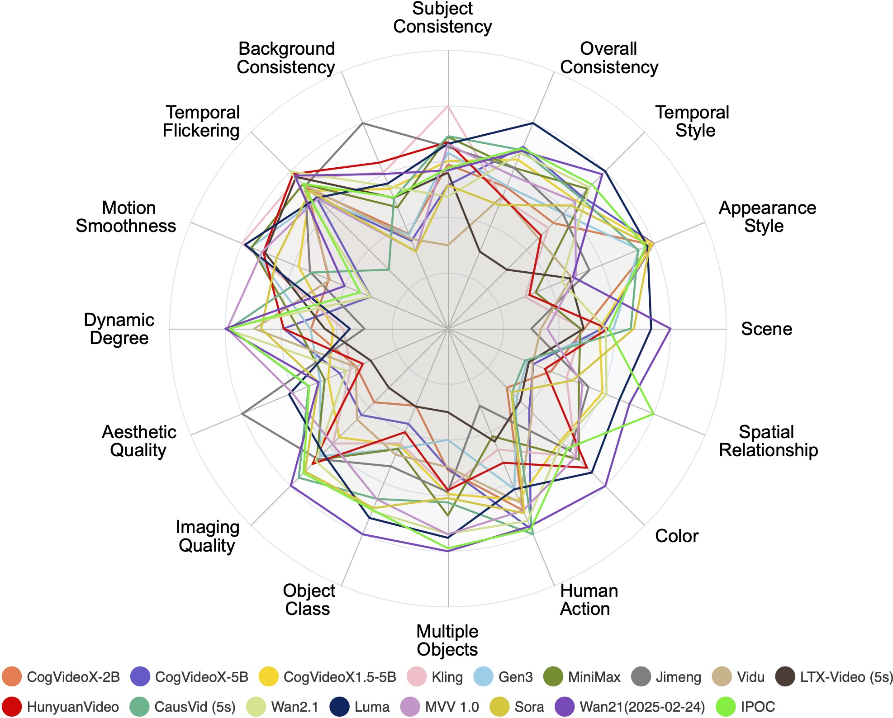
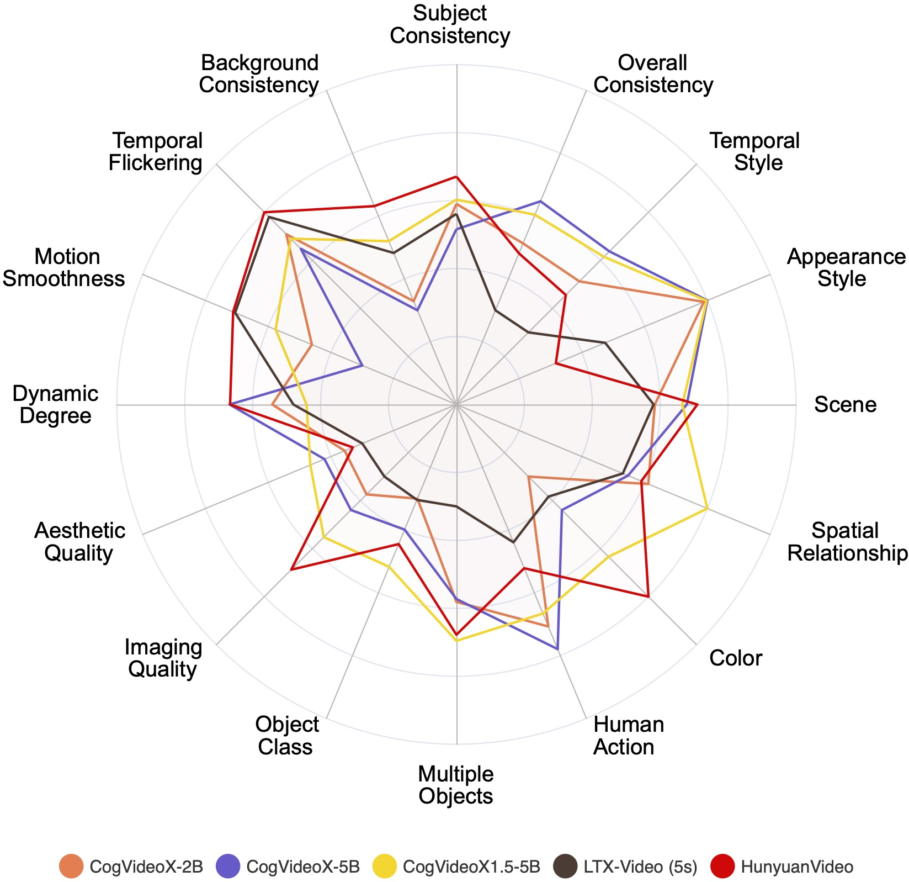

# VBench

## 📌 核心贡献

> 提出首个全面的视频生成模型评估基准 VBench，将"视频生成质量"解耦为 16 个层次化、细粒度的评估维度，每个维度配备专门的提示集和自动评估方法，并通过人类偏好标注验证了与人类感知的高度一致性。

## 📖 摘要

Video generation has witnessed significant advancements, yet evaluating these models remains a challenge. A comprehensive evaluation benchmark for video generation is indispensable for two reasons: 1) Existing metrics do not fully align with human perceptions; 2) An ideal evaluation system should provide insights to inform future developments of video generation. To this end, we present VBench, a comprehensive benchmark suite that dissects "video generation quality" into specific, hierarchical, and disentangled dimensions, each with tailored prompts and evaluation methods. VBench has three appealing properties: 1) Comprehensive Dimensions: VBench comprises 16 dimensions in video generation (e.g., subject identity inconsistency, motion smoothness, temporal flickering, and spatial relationship, etc). The evaluation metrics with fine-grained levels reveal individual models' strengths and weaknesses. 2) Human Alignment: We also provide a dataset of human preference annotations to validate our benchmarks' alignment with human perception, for each evaluation dimension respectively. 3) Valuable Insights: We look into current models' ability across various evaluation dimensions, and various content types. We also investigate the gaps between video and image generation models. We will open-source VBench, including all prompts, evaluation methods, generated videos, and human preference annotations, and also include more video generation models in VBench to drive forward the field of video generation.

## 🔍 关键信息

| 字段 | 内容 |
|------|------|
| 机构 | Nanyang Technological University (S-Lab), Shanghai AI Laboratory, CUHK, Nanjing University |
| 发表 | 2023-11-29 (CVPR 2024) |
| 分类 | cs.CV |
| 链接 | [arXiv](https://arxiv.org/abs/2311.17982) |

## 📝 我的笔记

### 方法总览

### 核心问题与动机

现有视频生成评估存在两大问题：

1. **现有指标与人类感知不一致**：FVD、IS 等传统指标是在数据集层面计算分布距离，无法有效评估单个视频质量，且对生成质量的细粒度差异不敏感。
2. **缺乏系统性评估框架**：单一指标无法反映视频生成的多维度质量，无法指导模型改进方向。

VBench 的核心设计哲学是：将"视频生成质量"这个笼统概念**解耦**为具体的、层次化的、互相独立的维度，逐一评估。

### 16 个评估维度

VBench 将评估维度分为两大类：**视频质量 (Video Quality)** 和 **视频-条件一致性 (Video-Condition Consistency)**。

**视频质量维度 (Quality Score, 7 个)：**

| 维度 | 评估内容 | 评估工具 |
|------|----------|----------|
| Subject Consistency | 主体在时序上的一致性 | DINO 特征相似度 |
| Background Consistency | 背景在时序上的一致性 | CLIP 特征相似度 |
| Temporal Flickering | 时序闪烁/抖动 | 帧间像素差异 |
| Motion Smoothness | 运动平滑性 | RAFT 光流 + AMT 插帧误差 |
| Dynamic Degree | 动态程度（非静态视频） | RAFT 光流幅度 |
| Aesthetic Quality | 画面美学质量 | LAION Aesthetic Predictor |
| Imaging Quality | 成像质量（噪声、模糊等） | MUSIQ (IQA) |

**视频-条件一致性维度 (Semantic Score, 9 个)：**

| 维度 | 评估内容 | 评估工具 |
|------|----------|----------|
| Object Class | 生成物体类别是否正确 | GRiT 检测 |
| Multiple Objects | 多物体生成的准确性 | GRiT 检测 |
| Human Action | 人体动作生成准确性 | UMT 视频理解 |
| Color | 颜色生成是否准确 | CLIP + 颜色检测 |
| Spatial Relationship | 物体空间关系是否正确 | GRiT + 空间推理 |
| Scene | 场景生成准确性 | CLIP 场景分类 |
| Temporal Style | 时序风格一致性 | ViCLIP |
| Appearance Style | 外观风格一致性 | CLIP 风格匹配 |
| Overall Consistency | 整体文本-视频一致性 | ViCLIP 相似度 |

### Prompt Suite 设计

VBench 为每个维度设计了专门的提示集（Prompt Suite），关键设计原则：

- **针对性**：每个维度的提示专门测试该维度的能力，避免维度间混淆
- **多样性**：覆盖多种内容类别（动物、人物、场景、物体等）
- **可控性**：通过精心设计的提示控制评估变量

总计约 946 条提示，分布在 16 个维度上。后续 VBench++ 还增加了 GPT-4o 增强的更长、更具描述性的提示版本。

### 评估 Pipeline

VBench 的自动评估流程：

1. 使用待评估模型根据 Prompt Suite 生成视频
2. 对每个维度，使用专门的评估方法计算得分
3. 汇总为 Quality Score（7 维平均）和 Semantic Score（9 维平均），再计算 Total Score

整体得分计算：

$$\text{Total Score} = \lambda \cdot \text{Quality Score} + (1 - \lambda) \cdot \text{Semantic Score}$$

### 与人类判断的对齐

VBench 在每个维度上收集了人类偏好标注，验证自动指标与人类感知的一致性。实验表明 VBench 的维度级指标与人类判断呈现高度正相关，远优于 FVD 和 IS 等传统指标。

### 关键结果

**原始论文评估的模型包括：**

| 模型 | 类型 |
|------|------|
| LaVie | 开源 T2V |
| ModelScope | 开源 T2V |
| VideoCrafter-0.9 / 1.0 | 开源 T2V |
| Show-1 | 开源 T2V |
| CogVideo | 开源 T2V |
| Pika | 商业 T2V |
| Gen-2 | 商业 T2V |

**主要发现：**

1. **没有全能模型**：每个模型都有自己的强项和弱项，细粒度维度评估可以揭示这些差异
2. **质量 vs 语义权衡**：部分模型在视频质量上表现好但语义一致性差，反之亦然
3. **动态程度普遍偏低**：大多数模型倾向于生成近似静态的视频
4. **图像生成 vs 视频生成差距**：视频生成模型在单帧质量上仍落后于图像生成模型

### 后续发展：VBench++

VBench 后续扩展为 VBench++，增加了：
- **Image-to-Video (I2V)** 评估维度
- **Trustworthiness** 评估维度（评估生成模型的可信度）
- 更多模型支持（目前 Leaderboard 已覆盖 40+ T2V 模型）

### 对视频 RM 研究的影响

VBench 对视频奖励模型研究有重要影响：

1. **维度设计参考**：VBench 的 16 维度分解为视频 RM 的多维度评估提供了标准化框架，后续如 [[VideoScore]] 的 5 维度评估明显受其影响
2. **评估基准**：VBench 可作为验证视频 RM 有效性的基准——一个好的视频 RM 应该在 VBench 维度上与人类判断一致
3. **训练数据指导**：VBench 的人类偏好标注可用于视频 RM 的训练和验证
4. **自动化评估工具**：VBench 的评估 pipeline 可直接用于视频生成后训练中的自动化奖励信号

### 总结

VBench 是视频生成评估领域的里程碑工作。其核心价值在于：(1) 提出了细粒度、层次化的评估维度体系；(2) 为每个维度设计了专门的自动评估方法；(3) 通过人类标注验证了评估方法的可靠性。该工作为后续视频生成模型的开发和视频奖励模型的研究奠定了评估基础设施。发表于 CVPR 2024。

## 🔗 相关论文

**同方向：** [[VideoScore]], [[VideoAlign]], [[SoliReward]]
