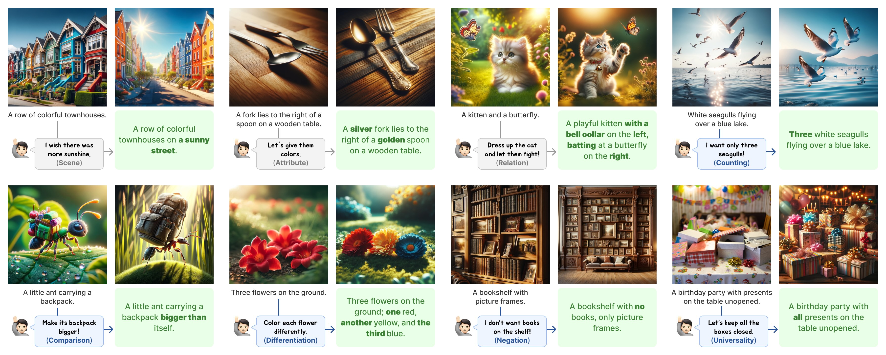
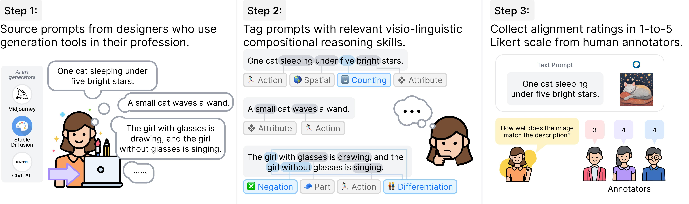
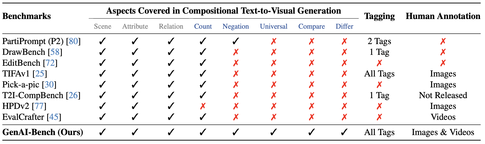

# GenAI-Bench

## 📌 核心贡献

> 提出 GenAI-Bench 基准，包含 1600 条组合性文本提示和超过 38,400 条人类评分，系统评估文本到图像/视频生成模型的组合性能力，并验证 VQAScore 作为自动评估指标显著优于 CLIPScore 等先前方法。

## 📖 摘要

While text-to-visual models now produce photo-realistic images and videos, they still struggle with compositional text prompts involving attributes, relationships, and higher-order reasoning such as logic and comparison. We present GenAI-Bench, a benchmark for evaluating compositional text-to-visual generation. GenAI-Bench contains 1,600 compositional text prompts collected from professional graphic designers, covering both basic skills (attributes, scenes, relations) and advanced reasoning (counting, comparison, differentiation, logic). We collect over 38,400 human ratings across 10 text-to-image and text-to-video models, and show that VQAScore—computed as the probability of "Yes" from an off-the-shelf VQA model—correlates better with human judgments than all prior metrics including CLIPScore, PickScore, ImageReward, HPSv2, TIFA, VQ2, and Davidsonian Scene Graph. Furthermore, we demonstrate that selecting the highest-VQAScore candidates from a few generated samples can improve generation quality, even enhancing state-of-the-art API-based models like DALL-E 3 without any fine-tuning.

## 🔍 关键信息

| 字段 | 内容 |
|------|------|
| 机构 | Carnegie Mellon University, Meta |
| 发表 | 2024-06-19 |
| 分类 | cs.CV, cs.AI, cs.CL, cs.LG, cs.MM |
| 链接 | [arXiv](https://arxiv.org/abs/2406.13743) |

## 📝 我的笔记

### 方法总览

### 动机与问题定义

当前文本到视觉生成模型（T2I 和 T2V）虽然能生成逼真的图像和视频，但在处理**组合性文本提示**时仍然表现不佳。具体来说，模型在属性绑定、空间关系、逻辑推理（如否定、比较）等方面存在明显缺陷。现有评估指标（如 CLIPScore）采用 bag-of-words 方式处理文本，无法有效评估组合性能力。因此需要：
1. 一个专注于组合性能力的评估基准
2. 一个与人类判断高度相关的自动评估指标

### 基准构建

**提示收集**：1,600 条文本提示由专业图形设计师（日常使用 Midjourney 等 T2V 工具的从业者）编写，涵盖一般主题（食物、动物、家居物品等），不含版权内容。

**组合性技能分类体系**：

| 类别 | 子类 | 说明 |
|------|------|------|
| **基础组合** | 物体 (Objects) | 多个物体的正确生成 |
| | 场景 (Scenes) | 场景描述的准确呈现 |
| | 属性 (Attributes) | 颜色、材质等属性的正确绑定 |
| | 空间关系 (Spatial) | 物体间的空间位置关系 |
| | 动作关系 (Action) | 物体的动作描述 |
| | 部件关系 (Part) | 物体部件的描述 |
| **高级推理** | 计数 (Counting) | 正确数量的物体 |
| | 比较 (Comparison) | 物体间的比较关系 |
| | 区分 (Differentiation) | 相似物体的区分 |
| | 逻辑 (Logic) | 否定和全称命题 |

### 评估流程

**人类评估协议**：
- 评分量表：1-5 Likert 量表
- 总评分数：38,400+ 条人类评分
- 评估对象：10 个生成模型的输出

**评估的生成模型**：

| 类型 | 模型 |
|------|------|
| **文本到图像 (T2I)** | Stable Diffusion v2.1, Stable Diffusion XL, SD-XL Turbo, DeepFloyd-IF, Midjourney v6, DALL-E 3 |
| **文本到视频 (T2V)** | ModelScope, Floor33, Pika v1, Gen2 |

### VQAScore 自动评估指标

VQAScore 的核心思想非常简洁：使用现成的视觉问答 (VQA) 模型计算给定图像与文本的对齐程度。

**计算方式**：

$$\text{VQAScore}(I, T) = P(\text{"Yes"} \mid I, Q(T))$$

其中 $Q(T)$ 是将文本 $T$ 转换为问题形式，如 `"Does this figure show '{text}'? Please answer yes or no."`

**使用的 VQA 模型**：CLIP-FlanT5（在公开 VQA 数据集上微调的双向图像-问题编码器）

**相比 CLIPScore 的优势**：CLIPScore 基于 CLIP 的对比学习目标，本质上是 bag-of-words 方式处理文本，难以捕捉组合语义；VQAScore 使用生成式 VQA 模型的双向注意力机制，能更好地理解组合性文本。

### 关键结果

**自动指标对比**：VQAScore 在与人类评分的相关性上显著优于所有先前指标：

| 指标 | 特点 |
|------|------|
| CLIPScore | 基于 CLIP 对比学习，bag-of-words 方式 |
| PickScore | 基于人类偏好训练 |
| HPSv2 | 基于人类偏好训练 v2 |
| ImageReward | 基于人类偏好训练 |
| TIFA | 基于 VQA 的细粒度评估 |
| VQ2 | 基于 VQA |
| Davidsonian Scene Graph | 基于场景图分解 |
| **VQAScore** | **最高相关性，端到端简洁** |

### VQAScore 排序提升生成质量 (GenAI-Rank)

GenAI-Rank 子基准（800 条提示，每条 9 张候选图）验证了一个重要发现：仅通过从少量候选图中选择 VQAScore 最高的图像，即可显著提升生成质量，甚至能提升 DALL-E 3 等 API-based 黑盒模型的效果，**无需任何模型微调**。

### 总结性评价

GenAI-Bench 的核心价值在于：
1. **系统性的组合评估体系**：首次从基础组合到高级推理全面覆盖，揭示了当前模型的具体短板
2. **高质量提示来源**：来自专业设计师的真实使用场景，比学术构造的提示更贴近实际需求
3. **VQAScore 的简洁有效**：不需要复杂的分解步骤（如 TIFA 的问题生成），端到端计算即可获得最佳相关性
4. **实用的免微调提升方案**：VQAScore 排序策略为现有模型提供了即插即用的质量提升手段

**局限性**：评估的模型范围受限于 2024 年中的可用模型，随着 Flux、SD3 等新模型的出现，基准的覆盖面需要持续更新。

## 🔗 相关论文

**基于/改进自：** [[CLIPScore]]

**同方向：** [[VBench]], [[ImageReward]], [[HPSv2]], [[PickScore]], [[VideoScore]]
