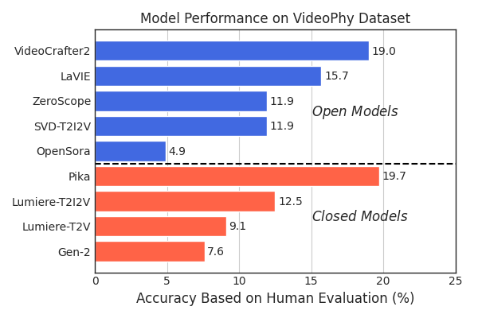
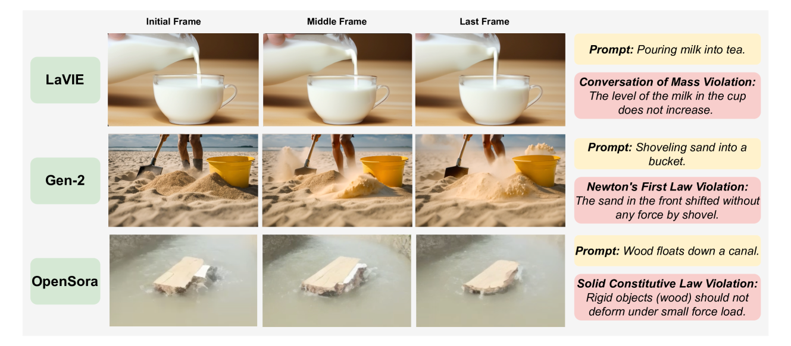
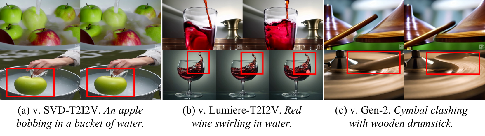

# VideoPhy

## 📌 核心贡献

> 提出 VideoPhy 基准，系统评估文本到视频生成模型对物理常识的遵循程度，揭示当前最优模型仅有 39.6% 的视频同时满足语义一致性和物理合理性，并提出自动评估器 VideoCon-Physics。

## 📖 摘要

Recent advances in internet-scale video data pretraining have led to the development of text-to-video generative models that can create high-quality videos across a broad range of visual concepts, synthesize realistic motions and render complex objects. Hence, these generative models have the potential to become general-purpose simulators of the physical world. However, it is unclear how far we are from this goal with the existing text-to-video generative models. To this end, we present VideoPhy, a benchmark designed to assess whether the generated videos follow physical commonsense for real-world activities (e.g. marbles will roll down when placed on a slanted surface). Specifically, we curate diverse prompts that involve interactions between various material types in the physical world (e.g., solid-solid, solid-fluid, fluid-fluid). We then generate videos conditioned on these captions from diverse state-of-the-art text-to-video generative models, including open models (e.g., CogVideoX) and closed models (e.g., Lumiere, Dream Machine). Our human evaluation reveals that the existing models severely lack the ability to generate videos adhering to the given text prompts, while also lack physical commonsense. Specifically, the best performing model, CogVideoX-5B, generates videos that adhere to the caption and physical laws for 39.6% of the instances. VideoPhy thus highlights that the video generative models are far from accurately simulating the physical world. Finally, we propose an auto-evaluator, VideoCon-Physics, to assess the performance reliably for the newly released models.

## 🔍 关键信息

| 字段 | 内容 |
|------|------|
| 机构 | UCLA |
| 发表 | 2024-06-05 |
| 分类 | cs.CV, cs.AI, cs.LG |
| 链接 | [arXiv](https://arxiv.org/abs/2406.03520) |

## 📝 我的笔记

### 动机与问题定义

当前文本到视频（T2V）生成模型在视觉质量上取得了显著进展，但一个关键问题尚未系统回答：**这些模型生成的视频是否遵循物理常识？** 例如，大理石放在斜面上是否会滚下来？水倒入杯中是否会正常流动？

现有评估基准（如 VBench）主要关注视觉质量、时间一致性等方面，而对物理合理性的评估几乎空白。VideoPhy 填补了这一空白，专门评估 T2V 模型的物理常识。

### 方法总览

#### Benchmark 构建流程（三阶段）

**Stage 1 - LLM 生成 Prompt：** 使用 GPT-4 生成 1000 个候选 caption，覆盖三种材料交互类型：
- **固体-固体交互**（Solid-Solid）：289 条
- **固体-流体交互**（Solid-Fluid）：291 条
- **流体-流体交互**（Fluid-Fluid）：108 条

**Stage 2 - 人工验证：** 作者对 caption 进行筛选，确保清晰度、适当复杂度和准确分类，排除相变和磁场效应。最终保留 **688 条**人工验证的 caption。

**Stage 3 - 难度标注：** 两名物理学博士独立将 caption 分类为 easy/hard，基于使用最先进物理引擎模拟的难度。分歧率 < 5%，通过讨论解决。

#### 评估维度

VideoPhy 评估两个核心维度：

1. **语义一致性（Semantic Adherence, SA）：** 生成视频是否准确描绘了条件文本 caption 中的动作、事件、实体及其关系。
2. **物理合理性（Physical Commonsense, PC）：** 视频中描绘的动作和物体状态是否遵循现实世界的物理定律。

评分为二值标注（0/1），联合指标 **SA,PC** 要求两个维度同时满足。

#### 人工评估

- 每个视频由 3 名标注者评分，多数投票决定最终标签
- 标注者间一致率：SA 为 75%，PC 为 70%
- 总标注量：测试集 18,500+ 条，训练集 12,000+ 条
- 标注者薪酬：$18/小时（Amazon Mechanical Turk）

#### 自动评估器：VideoCon-Physics

基于 VideoCon（7B 视频-语言模型）微调，使用生成视频的人工标注数据训练。

### 关键结果

#### 模型整体表现（v1 结果）

| 模型 | SA,PC (%) | SA (%) | PC (%) |
|------|-----------|--------|--------|
| Pika | 19.7 | 41.1 | 36.5 |
| VideoCrafter2 | 19.0 | 48.5 | 34.6 |
| LaVIE | 15.7 | 48.7 | 28.0 |
| SVD-T2I2V | 11.9 | 42.4 | 30.8 |

v2 更新后加入 CogVideoX 和 Dream Machine 的评估，**CogVideoX-5B 以 39.6% 的 SA,PC 成为最优模型**，但距离物理世界模拟器仍有巨大差距。

#### 按材料交互类型

以 Pika 为例：
| 交互类型 | SA,PC (%) |
|----------|-----------|
| 固体-固体 | 13.6 |
| 固体-流体 | 16.3 |
| 流体-流体 | 44.0 |

模型在**固体-固体交互上表现最差**，这是物理模拟中最具挑战性的场景。

#### 按难度

以 VideoCrafter2 为例：
| 难度 | SA (%) | PC (%) |
|------|--------|--------|
| Easy | 53.4 | 38.1 |
| Hard | 42.6 | 30.3 |

所有模型在困难 prompt 上均有显著性能下降。

#### 常见物理违反类型

模型生成视频中常见的物理定律违反包括：
- **质量守恒违反**：物体体积不一致
- **牛顿第一定律**：无动机的速度变化
- **牛顿第二定律**：动量违反
- **固体本构律**：刚性物体不合理变形
- **流体动力学**：不自然的流动
- **非穿透约束**：物体相互穿透

#### VideoCon-Physics 自动评估器

| 评估方法 | SA (ROC-AUC) | PC (ROC-AUC) |
|----------|-------------|-------------|
| Random | 50 | 50 |
| GPT-4-Vision | 53 | 53 |
| Gemini-1.5-Pro | 73 | 58 |
| VideoCon | 65 | 54 |
| **VideoCon-Physics** | **82** | **73** |

VideoCon-Physics 在未见模型上泛化测试：相比 VideoCon 基线，SA 提升 15 点（64 -> 79），PC 提升 15 点（57 -> 72）。

### 与 SoliReward 的关系

VideoPhy 作为评估基准，揭示了视频生成模型在物理常识方面的严重不足。[[SoliReward]] 则从奖励模型角度出发，关注物理维度的评估和优化。VideoPhy 的发现为 SoliReward 等后续工作提供了动机——既然模型缺乏物理常识，那么设计能评估物理合理性的奖励信号来指导模型训练就变得尤为重要。

### 总结与评价

VideoPhy 的核心价值在于系统地量化了 T2V 模型与"物理世界模拟器"目标之间的差距。39.6% 的最优表现意味着超过 60% 的生成视频要么语义不一致，要么违反物理常识。这一基准为视频生成领域指明了重要的改进方向：**不仅要生成视觉上逼真的视频，更要生成物理上合理的视频**。

## 🔗 相关论文

**同方向：** [[VBench]], [[VideoScore]], [[SoliReward]]
