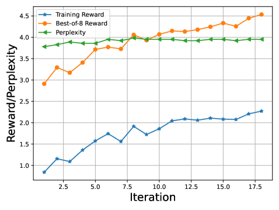
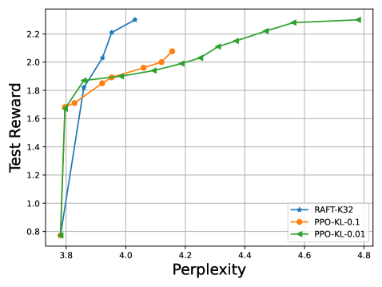
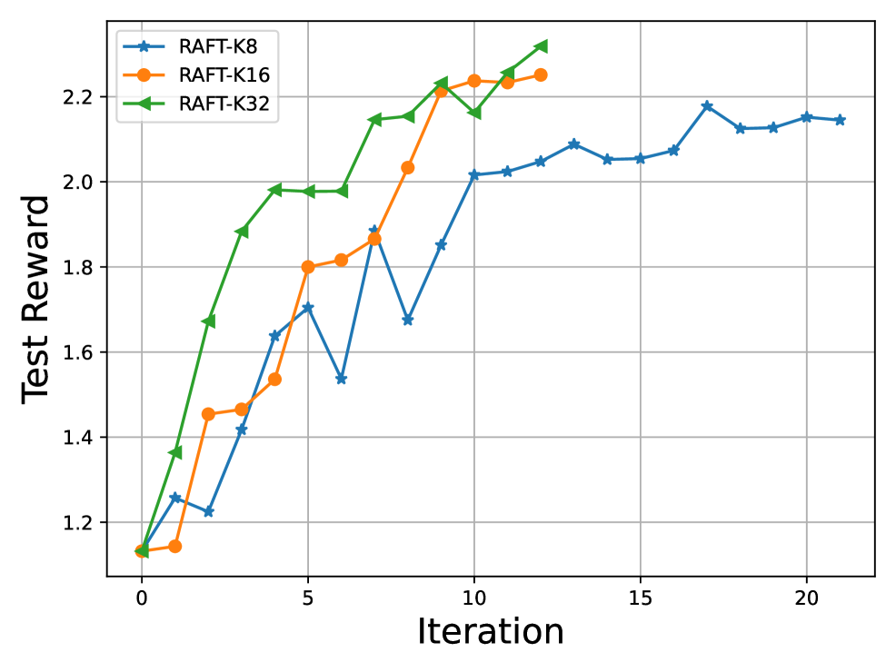
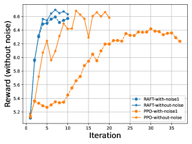

# RAFT

## 📌 核心贡献

> 提出一种"生成-评分-筛选-微调"的循环对齐框架，利用奖励模型从大量生成样本中挑选高质量"黄金数据"。通过对这些筛选后的样本进行监督微调，为扩散模型提供了一种极其稳定且不依赖复杂RL过程的对齐路径。

## 📖 摘要

Generative foundation models are susceptible to implicit biases that can arise from extensive unsupervised training data. Such biases can produce suboptimal samples, skewed outcomes, and unfairness, with potentially serious consequences. Consequently, aligning these models with human ethics and preferences is an essential step toward ensuring their responsible and effective deployment in real-world applications. Prior research has primarily employed Reinforcement Learning from Human Feedback (RLHF) to address this problem, where generative models are fine-tuned with RL algorithms guided by a human-feedback-informed reward model. However, the inefficiencies and instabilities associated with RL algorithms frequently present substantial obstacles to the successful alignment, necessitating the development of a more robust and streamlined approach. To this end, we introduce a new framework, Reward rAnked FineTuning (RAFT), designed to align generative models effectively. Utilizing a reward model and a sufficient number of samples, our approach selects the high-quality samples, discarding those that exhibit undesired behavior, and subsequently enhancing the model by fine-tuning on these filtered samples. Our studies show that RAFT can effectively improve the model performance in both reward learning and other automated metrics in both large language models and diffusion models.

## 🔍 关键信息

| 字段 | 内容 |
|------|------|
| 机构 | HKUST |
| 发表 | 2023-04-13 |
| 分类 | cs.LG, cs.AI, cs.CL, cs.CV, stat.ML |
| 链接 | [arXiv](https://arxiv.org/abs/2304.06767) |

## 📝 我的笔记

Published in Transactions on Machine Learning Research (TMLR)。同时适用于 LLM 和扩散模型。核心思路：用奖励排序代替强化学习，简化训练流程。

### 动机与问题定义

RLHF 是对齐生成模型与人类偏好的主流方案，但 PPO 等 RL 算法存在两个核心痛点：

1. **训练不稳定**：PPO 需要同时维护 actor、critic、reference、reward 四个模型，超参敏感，容易出现 reward hacking 或训练崩溃。
2. **计算开销大**：四模型并行加载对显存要求极高，训练效率低。

RAFT 的核心洞察是：**对齐本质上不需要复杂的 RL 优化，只需从模型自身采样中筛选出高质量样本，再做监督微调即可**。这将对齐问题从 RL 简化为"采样 + 排序 + SFT"的迭代流程。

### 方法细节

#### 优化目标

RAFT 的目标与 RLHF 相同，最大化生成样本的期望奖励：

$$\max_{w} \mathbb{E}_{x \sim \mathcal{D},\, y \sim p_g(\cdot|w,x)} [r(x, y)]$$

理想解将概率集中在最高奖励的输出上：

$$p_g(\cdot|w^*, x) = \begin{cases} 1 & \text{if } y = \arg\max r(x, y) \\ 0 & \text{otherwise} \end{cases}$$

加入 KL 正则化后，修正奖励为：

$$\tilde{r}(x, y) = r(x, y) - \beta \log \frac{p_g(y|w, x)}{p_{G_0}(y|w_0, x)}$$

其中 $\beta$ 控制与初始模型的偏离程度。

#### RAFT 算法流程

算法由三个解耦的步骤组成，迭代执行直至收敛：

**Step 1 — 数据收集（Data Collection）**：对每个 prompt $x$，用当前模型以温度 $\lambda$ 采样 $K$ 个响应 $\{y_1, y_2, \dots, y_K\}$。

**Step 2 — 奖励排序（Reward Ranking）**：用奖励模型对 $K$ 个响应打分，选出得分最高的 $1/K$ 比例样本（即 best-of-K 策略），组成筛选后的高质量数据集 $\mathcal{D}_{\text{filtered}}$。

**Step 3 — 监督微调（SFT on Filtered Data）**：在 $\mathcal{D}_{\text{filtered}}$ 上对模型做标准的监督微调，更新模型参数。

这三步构成一个循环，每轮迭代用更新后的模型重新采样，逐步提升生成质量。

#### 关键超参数

| 参数 | 含义 | 作用 |
|------|------|------|
| $K$ | 每个 prompt 的采样数量 | 越大则筛选越严格，近似 best-of-K 策略 |
| $\lambda$ | 采样温度 | 越高多样性越强，但单条质量可能下降 |
| $\beta$ | KL 惩罚系数 | 防止模型过度偏离初始分布 |
| $b$ | 批大小 | 每轮迭代处理的 prompt 数量 |

#### 理论分析

论文证明了两个关键性质：

1. **与 best-of-K 的关系**：RAFT 的筛选过程等价于学习 best-of-K 采样策略的分布。当 $K \to \infty$ 时，筛选后的数据分布趋近于最优解。
2. **奖励提升的下界**：best-of-K 采样相比原始分布的期望奖励提升为 $\Omega(\sqrt{\log K})$，即 $K$ 增大带来递减收益。

#### 与 PPO 的核心区别

| 特性 | PPO | RAFT |
|------|-----|------|
| 训练范式 | 在线 RL，需同时维护 4 个模型 | 离线 SFT，每次只需加载 1 个模型 |
| 奖励利用方式 | 绝对奖励值驱动梯度更新 | 排序筛选，对奖励尺度不敏感 |
| 稳定性 | 超参敏感，容易崩溃 | 基于 SFT，训练稳定 |
| 显存需求 | 高（4 模型并行） | 低（采样与训练解耦） |

### 关键实验结果

#### LLM 实验（LLaMA-7B, HH-RLHF 数据集）

**主要指标对比：**

| 模型 | Reward ↑ | Perplexity ↓ | Distinct-1 | Distinct-2 | Length |
|------|----------|-------------|-----------|-----------|--------|
| LLaMA-7B-SFT (baseline) | 0.772 | 3.781 | 0.031 | 0.250 | 145.4 |
| PPO-$\beta$0.1 | 2.077 | 4.156 | 0.033 | 0.262 | 127.8 |
| RAFT-K32-$\lambda$1.0 | **2.294** | **4.031** | 0.032 | 0.258 | 156.2 |

RAFT-K32 在奖励和困惑度上全面优于 PPO，且生成更长、更详细的回复。

**GPT-4 与人类评估（100 条测试 prompt）：**

| 对比 | 评估方式 | RAFT 胜 | RAFT 负 | 平局 |
|------|---------|---------|---------|------|
| RAFT-K32 vs PPO-$\beta$0.1 | GPT-4 | 65 | 32 | 3 |
| RAFT-K32 vs PPO-$\beta$0.1 | 人类 | 66 | 14 | 20 |

RAFT 在 GPT-4 和人类评估中均大幅领先 PPO。

**蒸馏实验（LLaMA-7B → GPT-Neo-2.7B）：**

| 配置 | Reward | Perplexity |
|------|--------|-----------|
| GPT-Neo baseline | -1.23 | 6.875 |
| RAFT-GPT-Neo (自生成) | 0.210 | 6.468 |
| RAFT-LLaMA (教师生成) | **0.739** | 6.625 |

使用更强教师模型生成的候选样本能显著提升小模型的对齐效果。

#### 扩散模型实验（Stable Diffusion 1.5）

| 指标 | Pretrained | DDPO | RAFT |
|------|-----------|------|------|
| CLIP score (域内) | 23.4±4.8 | 28.8±1.2 | 27.3±1.4 |
| Aesthetic score (域内) | 4.63±0.44 | 6.04±0.49 | **6.14±0.49** |
| CLIP score (域外) | — | 30.2±1.8 | 26.7±4.5 |
| Aesthetic score (域外) | — | 5.76±0.59 | **6.07±0.60** |
| 训练时间 (A40) | — | 415 min | **8.4 min** |

关键发现：RAFT 在美学评分上与 DDPO 持平甚至略优，但**训练速度快约 50 倍**。DDPO 在 CLIP score 上更优，可能因为其在线 RL 优化更直接地最大化了 CLIP 奖励。

### Ablation 分析

**K 值的影响（采样数量）：**

| K | 最终 Reward | 收敛速度 |
|---|-----------|---------|
| 8 | 2.180 | 较慢 |
| 16 | 2.251 | 中等 |
| 32 | 2.329 | 最快 |

$K$ 越大，筛选越严格，最终性能越高，但提升幅度随 $K$ 增大而递减（$\Omega(\sqrt{\log K})$）。

**温度 $\lambda$ 的影响（K=8）：**

| $\lambda$ | Reward | Distinct-1 | Distinct-2 |
|-----------|--------|-----------|-----------|
| 0.7 | 2.198 | 低 | 低 |
| 0.85 | 2.180 | 中 | 中 |
| 1.0 | 2.143 | 高 | 高 |

低温度有利于奖励最大化，高温度有利于多样性。

**KL 惩罚 $\beta$ 的影响（K=8, $\lambda$=1.0）：**

| $\beta$ | Reward | KL 散度 |
|---------|--------|---------|
| 0 | 2.143 | 最大 |
| 0.005 | 2.087 | 中 |
| 0.01 | 2.038 | 较小 |
| 0.1 | 2.029 | 最小 |

$\beta$ 越大，模型越接近初始分布，但奖励优化受限。

**对奖励噪声的鲁棒性：**

论文测试了三种噪声场景：(1) 高斯噪声 $\mathcal{N}(0,1)$；(2) 20% prompt 依赖偏差；(3) 20% 样本特定偏差。RAFT 在所有噪声条件下均保持稳定训练，而 PPO 出现明显退化。这是因为 RAFT 基于排序而非绝对奖励值进行筛选，对奖励尺度变化天然鲁棒。

**计算效率：**

| 方法 | 训练时间 | 迭代轮次 |
|------|---------|---------|
| RAFT-K8 | 5 小时 | 15-18 轮 |
| RAFT-K16 | 6 小时 | 10-12 轮 |
| RAFT-K32 | 7 小时 | 10-12 轮 |
| PPO (最优配置) | 8.7 小时 | — |

RAFT 的显存优势更加突出：训练时只需加载一个模型，而 PPO 需要同时加载四个模型。

### 总结性评价

RAFT 的核心贡献是将 RLHF 中复杂的 RL 优化简化为"采样-排序-SFT"的迭代流程。方法极其简洁，理论上等价于学习 best-of-K 策略的分布，实践中在 LLM 和扩散模型上都展现了与 PPO/DDPO 相当甚至更优的性能。

**优势：**
- 实现简单：无需 critic、reference model 等额外组件，只需 reward model + SFT
- 训练稳定：基于排序的筛选对奖励噪声天然鲁棒
- 计算高效：采样与训练解耦，显存需求低，扩散模型实验中比 DDPO 快 50 倍
- 通用性强：同一框架适用于 LLM 和扩散模型

**局限：**
- 采样效率低：每个 prompt 需采样 $K$ 个样本但只用 1 个（$K=32$ 时利用率仅 3%）
- 没有负样本信号：只从正样本学习，无法像 DPO 那样利用偏好对的对比信息
- 依赖奖励模型质量：虽然对噪声鲁棒，但如果奖励模型系统性偏差，筛选结果同样有偏

本文是后续 rejection sampling 类方法（如 ReST、BOND）的重要先驱，证明了"不需要 RL 也能做对齐"这一关键洞察。

## 🔗 相关论文

**基于/改进自：** —

**同方向：** [[DDPO]], [[ImageReward]], [[DPO-Diffusion]]
