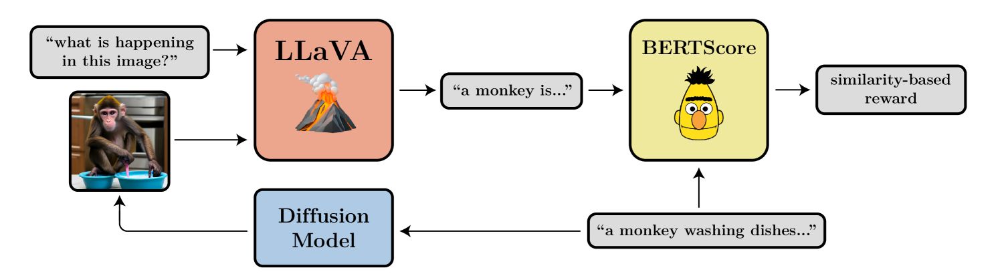
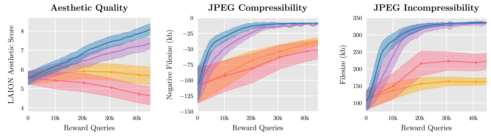
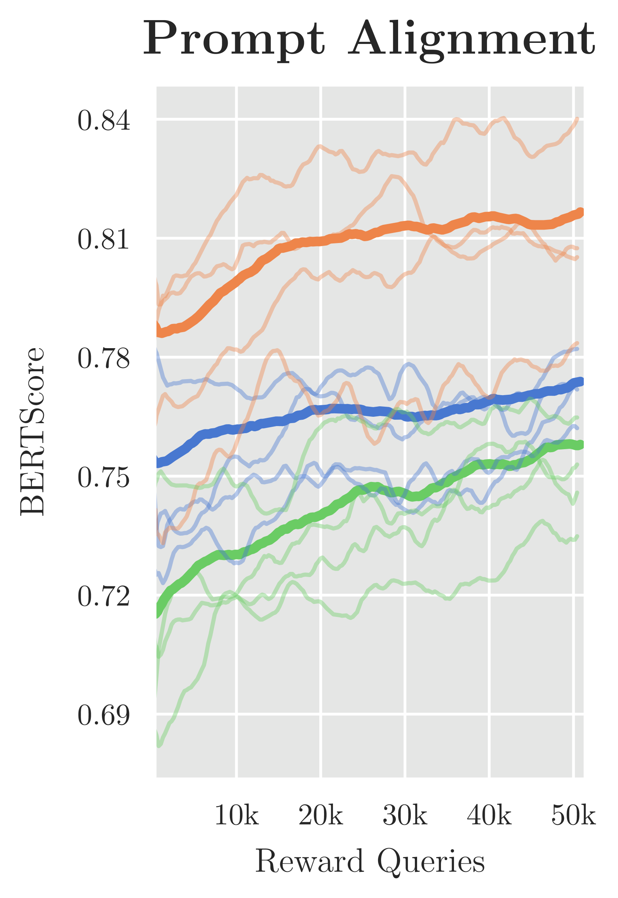

# DDPO

## 📌 核心贡献

> 将扩散模型的去噪过程建模为多步马尔可夫决策过程（MDP），提出 DDPO 策略梯度算法，使扩散模型能够直接优化不可微的黑盒奖励函数（如图像压缩性、美学评分、VLM 对齐反馈），性能显著优于基于奖励加权回归的替代方案。

## 📖 摘要

Diffusion models are a class of flexible generative models trained with an approximation to the log-likelihood objective. However, most use cases of diffusion models are not concerned with likelihoods, but instead with downstream objectives such as human-perceived image quality or drug effectiveness. In this paper, we investigate reinforcement learning methods for directly optimizing diffusion models for such objectives. We describe how posing denoising as a multi-step decision-making problem enables a class of policy gradient algorithms, which we refer to as denoising diffusion policy optimization (DDPO), that are more effective than alternative reward-weighted likelihood approaches. Empirically, DDPO is able to adapt text-to-image diffusion models to objectives that are difficult to express via prompting, such as image compressibility, and those derived from human feedback, such as aesthetic quality. Finally, we show that DDPO can improve prompt-image alignment using feedback from a vision-language model without the need for additional data collection or human annotation.

## 🔍 关键信息

| 字段 | 内容 |
|------|------|
| 机构 | UC Berkeley, MIT |
| 发表 | 2023-05-22 |
| 分类 | cs.LG, cs.AI, cs.CV |
| 链接 | [arXiv](https://arxiv.org/abs/2305.13301) |

## 📝 我的笔记

### 动机与问题定义

扩散模型通常通过对数似然近似（DDPM loss）进行训练，但实际应用中关注的往往是下游目标（如人类感知的图像质量、可压缩性等），而非似然本身。这些下游目标通常是不可微的黑盒函数，无法直接通过反向传播进行优化。

此前的方法如奖励加权回归（RWR）将去噪过程视为单步 MDP，用奖励加权 DDPM loss 来近似优化。但 DDPM loss 并非精确的对数似然，而是变分下界，因此 RWR 在理论上缺乏严格保证。

DDPO 的核心洞察：将去噪过程的每一步都视为独立决策步骤，利用每步精确可计算的高斯转移概率，构建严格的策略梯度估计。

### 方法

#### MDP 建模

将去噪扩散过程定义为 MDP：

- **状态**：$s_t \triangleq (\mathbf{c}, t, \mathbf{x}_t)$，包含文本条件、时间步和当前噪声图像
- **动作**：$a_t \triangleq \mathbf{x}_{t-1}$，即去噪后的图像
- **策略**：$\pi(a_t|s_t) \triangleq p_\theta(\mathbf{x}_{t-1}|\mathbf{x}_t, \mathbf{c})$，高斯反向过程
- **奖励**：$R(s_t, a_t) = r(\mathbf{x}_0, \mathbf{c})$（仅在 $t=0$ 时），其余步为 0
- **转移**：确定性地从时间步 $T$ 推进到 $0$

核心优化目标：

$$\mathcal{J}_{\text{DDRL}}(\theta) = \mathbb{E}_{\mathbf{c} \sim p(\mathbf{c}),\, \mathbf{x}_0 \sim p_\theta(\mathbf{x}_0|\mathbf{c})}[r(\mathbf{x}_0, \mathbf{c})]$$

#### DDPO-SF（Score Function 变体）

使用 REINFORCE 似然比方法：

$$\nabla_\theta \mathcal{J}_{\text{DDRL}} = \mathbb{E}\left[\sum_{t=0}^{T} \nabla_\theta \log p_\theta(\mathbf{x}_{t-1}|\mathbf{x}_t, \mathbf{c})\, r(\mathbf{x}_0, \mathbf{c})\right]$$

局限性：每次数据收集只能进行一步优化。

#### DDPO-IS（Importance Sampling 变体）

通过重要性采样实现多步优化（类似 PPO）：

$$\nabla_\theta \mathcal{J}_{\text{DDRL}} = \mathbb{E}\left[\sum_{t=0}^{T} \frac{p_\theta(\mathbf{x}_{t-1}|\mathbf{x}_t, \mathbf{c})}{p_{\theta_{\text{old}}}(\mathbf{x}_{t-1}|\mathbf{x}_t, \mathbf{c})} \nabla_\theta \log p_\theta(\mathbf{x}_{t-1}|\mathbf{x}_t, \mathbf{c})\, r(\mathbf{x}_0, \mathbf{c})\right]$$

使用 clipping 约束信任域，防止策略偏离过大。

#### 与 RWR 的比较

RWR 将扩散视为单步 MDP，使用奖励加权 DDPM loss：

$$w_{\text{RWR}}(\mathbf{x}_0, \mathbf{c}) = \frac{1}{Z} \exp(\beta\, r(\mathbf{x}_0, \mathbf{c}))$$

关键问题：DDPM loss 不是精确的对数似然，而是变分下界，因此 RWR 缺乏理论保证。而 DDPO 利用每步精确的高斯转移概率，梯度估计是严格正确的。

### 实验设置

- **基础模型**：Stable Diffusion v1.4，仅微调 UNet 权重（text encoder 和 VAE 冻结）
- **训练方式**：交替采样-训练循环

#### 奖励函数

| 奖励类型 | 评估指标 | Prompt 来源 |
|---------|---------|------------|
| 可压缩性 | JPEG 文件大小（最小化） | 398 种 ImageNet 动物 |
| 不可压缩性 | JPEG 文件大小（最大化） | 398 种 ImageNet 动物 |
| 美学质量 | LAION 美学评分器（CLIP 嵌入上的线性模型） | 45 种常见动物 |
| Prompt 对齐 | LLaVA 描述 + BERTScore recall | 45 种动物 × 3 种活动 |

### 关键结果

| 对比维度 | 结果 |
|---------|------|
| DDPO vs RWR | DDPO 在所有任务（压缩性、美学、对齐）上均显著优于 RWR |
| DDPO-IS vs DDPO-SF | DDPO-IS 略优，因支持多步优化，样本效率更高 |
| Prompt 对齐 | 训练后图像显著更忠实于 prompt，但出现卡通化风格偏移 |
| 泛化能力 | 在窄分布上微调后仍可泛化到新动物、非动物物体和新活动 |

### 过优化现象

论文观察到若干有趣的过优化行为：

- **不可压缩性**：模型生成不可识别的高频噪声以最大化文件大小
- **VLM 对齐**：模型发现"排版攻击"（在图像中直接写数字而非画出对应数量的物体）
- 目前尚无通用的过优化防范方法

### 总结性评价

DDPO 是将 RL 应用于扩散模型后训练的开创性工作。其核心贡献在于发现去噪过程每步的高斯转移概率是精确可计算的，从而可以构建严格的策略梯度，避免了 RWR 等方法依赖变分下界的理论缺陷。该方法对后续的扩散模型 RLHF 工作（如 DPOK、AlignProp、DPO-Diffusion 等）产生了深远影响。

## 🔗 相关论文

**基于/改进自：** [[DDPM]]

**同方向：** [[DPO]], [[ImageReward]], [[DPOK]], [[AlignProp]], [[ReFL]]
