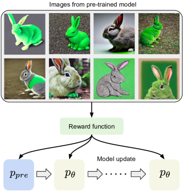
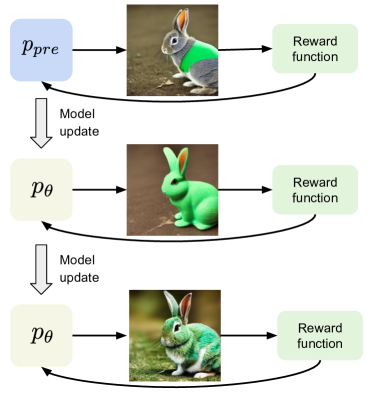
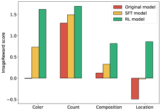
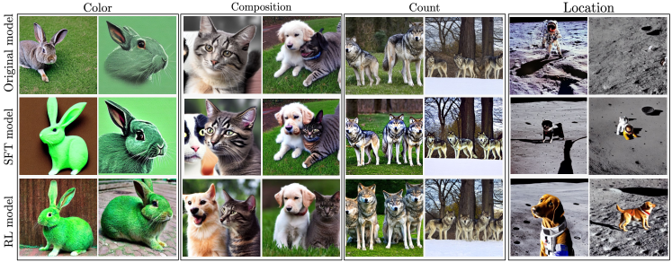
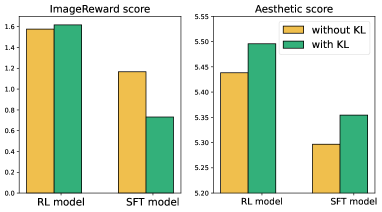
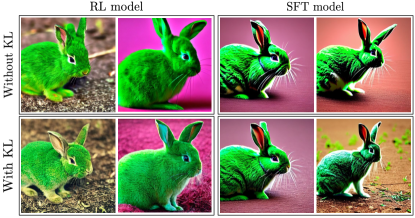

# DPOK

## 📌 核心贡献

> 提出一种在线强化学习微调框架，通过策略梯度法最大化预定义的奖励函数。其核心创新在于引入了KL散度正则化项，在提升图文对齐度和图像质量的同时，有效防止模型偏离预训练分布，确保了生成结果的稳定性。

## 📖 摘要

Learning from human feedback has been shown to improve text-to-image models. These techniques first learn a reward function that captures what humans care about in the task and then improve the models based on the learned reward function. Even though relatively simple approaches (e.g., rejection sampling based on reward scores) have been investigated, fine-tuning text-to-image models with the reward function remains challenging. In this work, we propose using online reinforcement learning (RL) to fine-tune text-to-image models. We focus on diffusion models, defining the fine-tuning task as an RL problem, and updating the pre-trained text-to-image diffusion models using policy gradient to maximize the feedback-trained reward. Our approach, coined DPOK, integrates policy optimization with KL regularization. We conduct an analysis of KL regularization for both RL fine-tuning and supervised fine-tuning. In our experiments, we show that DPOK is generally superior to supervised fine-tuning with respect to both image-text alignment and image quality.

## 🔍 关键信息

| 字段 | 内容 |
|------|------|
| 机构 | Google Research / UC Berkeley |
| 发表 | 2023-05-25 |
| 分类 | cs.LG, cs.CV |
| 链接 | [arXiv](https://arxiv.org/abs/2305.16381) |

## 📝 我的笔记

NeurIPS 2023

### 方法总览

### 动机与问题定义

文本到图像扩散模型（如 Stable Diffusion）虽然生成质量高，但在图文对齐（compositional generation）方面仍有明显不足，例如颜色绑定、物体计数、空间关系等。已有方法通过训练奖励模型（如 ImageReward）来捕捉人类偏好，但如何利用奖励信号有效微调扩散模型仍是难题。

**现有方法的局限：**

- **拒绝采样（Rejection Sampling）**：简单但效率低，无法更新模型参数
- **监督微调（SFT）**：用奖励加权的预训练数据进行微调，但只能在预训练分布的支撑集上优化，无法探索新的高奖励区域
- **DDPO 等在线 RL 方法**：缺乏正则化机制，容易导致模型过拟合奖励函数（reward hacking），生成过饱和、不自然的图像

DPOK 的核心思路：将扩散去噪过程建模为 MDP，使用策略梯度最大化奖励，同时引入 KL 散度正则化防止模型偏离预训练分布。

### Diffusion MDP 建模

将扩散模型的去噪过程形式化为有限时域 MDP：

| 组件 | 定义 |
|------|------|
| 状态 | $$s_t = (z, x_{T-t})$$，其中 $z$ 为文本 prompt，$x_{T-t}$ 为第 $T-t$ 步的噪声潜变量 |
| 动作 | $$a_t = x_{T-t-1}$$，即下一步去噪结果 |
| 初始分布 | $$P_0(s_0) = (p(z), \mathcal{N}(0, I))$$ |
| 转移函数 | $$P(s_{t+1} \mid s_t, a_t) = (\delta_z, \delta_{a_t})$$（确定性转移） |
| 奖励 | $$R(s_t, a_t) = r(x_0, z) \cdot \mathbf{1}[t = T-1]$$，仅在最后一步给出奖励 |
| 策略 | $$\pi_\theta(a_t \mid s_t) = p_\theta(x_{T-t-1} \mid x_{T-t}, z)$$ |

这种建模方式将整个去噪链视为一条轨迹，每一步去噪是一个动作，最终生成图像的质量作为回报信号。

### 策略梯度目标

**基本目标（Eq. 5）：** 最小化负期望奖励：

$$\min_\theta \; \mathbb{E}_{p(z)} \mathbb{E}_{p_\theta(x_0 \mid z)} [-r(x_0, z)]$$

**Lemma 4.1（策略梯度）：** 目标函数的梯度等价于：

$$\nabla_\theta \mathbb{E}_{p(z)} \mathbb{E}_{p_\theta(x_0 \mid z)} [-r(x_0, z)] = \mathbb{E}_{p(z)} \mathbb{E}_{p_\theta(x_{0:T} \mid z)} \left[ -r(x_0, z) \sum_{t=1}^{T} \nabla_\theta \log p_\theta(x_{t-1} \mid x_t, z) \right]$$

这是标准的 REINFORCE 形式：奖励信号乘以整条去噪轨迹上每一步对数概率的梯度之和。

### KL 正则化

**Lemma 4.2（KL 上界）：** 最终图像分布之间的 KL 散度可以被逐步条件 KL 的和所上界：

$$\mathbb{E}_{p(z)} \left[ \mathrm{KL}(p_\theta(x_0 \mid z) \| p_{\text{pre}}(x_0 \mid z)) \right] \leq \mathbb{E}_{p(z)} \left[ \sum_{t=1}^{T} \mathbb{E}_{p_\theta(x_t \mid z)} \left[ \mathrm{KL}(p_\theta(x_{t-1} \mid x_t, z) \| p_{\text{pre}}(x_{t-1} \mid x_t, z)) \right] \right]$$

这个上界非常重要：直接计算 $p_\theta(x_0 \mid z)$ 和 $p_{\text{pre}}(x_0 \mid z)$ 之间的 KL 是不可行的（需要边际化所有中间步），但逐步条件 KL 可以高效计算，因为每一步的条件分布都是高斯分布。

### DPOK 目标函数

**Eq. 8 — 正则化训练目标：**

$$\mathbb{E}_{p(z)} \left[ \alpha \, \mathbb{E}_{p_\theta(x_{0:T} \mid z)} [-r(x_0, z)] + \beta \sum_{t=1}^{T} \mathbb{E}_{p_\theta(x_t \mid z)} \left[ \mathrm{KL}(p_\theta(x_{t-1} \mid x_t, z) \| p_{\text{pre}}(x_{t-1} \mid x_t, z)) \right] \right]$$

其中 $\alpha$ 控制奖励项权重，$\beta$ 控制 KL 正则化强度。

**Eq. 9 — 梯度更新公式：**

$$\mathbb{E}_{p(z)} \mathbb{E}_{p_\theta(x_{0:T} \mid z)} \left[ -\alpha \, r(x_0, z) \sum_{t=1}^{T} \nabla_\theta \log p_\theta(x_{t-1} \mid x_t, z) + \beta \sum_{t=1}^{T} \nabla_\theta \mathrm{KL}(p_\theta(x_{t-1} \mid x_t, z) \| p_{\text{pre}}(x_{t-1} \mid x_t, z)) \right]$$

梯度由两部分组成：(1) REINFORCE 策略梯度项驱动奖励最大化；(2) KL 梯度项将模型拉回预训练分布。

### 在线 RL vs 监督微调的关键差异

| 维度 | 在线 RL（DPOK） | 监督微调（SFT） |
|------|----------------|----------------|
| 数据分布 | 在线采样，可以探索新区域 | 固定预训练分布的数据 |
| KL 正则化 | 在更新后的分布上计算条件 KL | 仅在预训练数据上计算 |
| 奖励泛化 | 可以利用奖励模型在新区域的泛化能力 | 受限于训练数据覆盖的区域 |

论文同时为 SFT 提出了两种 KL 变体：
- **KL-D（Eq. 13）**：通过奖励偏移因子 $\gamma$ 调整加权
- **KL-O（Eq. 14）**：直接惩罚去噪输出与预训练模型输出的偏差

### 实验设置

| 参数 | RL 训练 | SFT 训练 |
|------|---------|---------|
| 基础模型 | Stable Diffusion v1.5 | Stable Diffusion v1.5 |
| 微调方式 | LoRA（UNet） | LoRA（UNet） |
| 奖励模型 | ImageReward | ImageReward |
| 学习率 | $10^{-5}$ | $2 \times 10^{-5}$ |
| 采样批次 | $m=10$ | - |
| 梯度批次 | $n=32$ | $128$ |
| $\alpha, \beta$ | $10, 0.01$ | - |
| $\gamma$（KL 偏移） | - | $2.0$ |
| 梯度裁剪 | $0.1$ | - |
| 训练样本数 | 20K（在线采样） | 20K（预生成） |
| 梯度步数 | ~10K | ~8K |

### 关键实验结果

#### 单 Prompt 训练（Figure 3）

| Prompt | 方法 | ImageReward | Aesthetic |
|--------|------|-------------|-----------|
| A green colored rabbit | Original | ~0.20 | 5.40 |
| | SFT | ~0.65 | 5.15 |
| | **RL (DPOK)** | **~0.80** | **5.50** |
| A cat and a dog | Original | ~0.30 | 5.35 |
| | SFT | ~0.70 | 5.05 |
| | **RL (DPOK)** | **~0.85** | **5.45** |
| Four wolves in the park | Original | ~0.15 | 5.30 |
| | SFT | ~0.60 | 5.10 |
| | **RL (DPOK)** | **~0.75** | **5.48** |
| A dog on the moon | Original | ~0.25 | 5.45 |
| | SFT | ~0.75 | 5.20 |
| | **RL (DPOK)** | **~0.90** | **5.60** |

**人工评估结果**（8 名评估者，每种方法 160 张图像，RL vs SFT 胜率）：

| Prompt | 图文对齐胜率 | 图像质量胜率 |
|--------|------------|------------|
| A green colored rabbit | 75% | 70% |
| A cat and a dog | 78% | 72% |
| Four wolves in the park | 72% | 68% |
| A dog on the moon | 80% | 75% |

#### 多 Prompt 训练（Table 1）

| 数据集 | 指标 | Original | RL (DPOK) |
|--------|------|----------|-----------|
| MS-COCO（104 prompts） | ImageReward | 0.22 | **0.55** |
| | Aesthetic | 5.39 | **5.43** |
| DrawBench（183 prompts） | ImageReward | 0.13 | **0.58** |
| | Aesthetic | 5.31 | **5.35** |

多 prompt 设置下 DPOK 同样有效：ImageReward 提升 0.33-0.45，同时 Aesthetic 分数保持甚至略有提升。

#### 定性对比

### Ablation 分析：KL 正则化的效果

| 方法 | ImageReward | Aesthetic |
|------|-------------|-----------|
| RL（无 KL） | ~0.65 | **5.02**（显著下降） |
| RL（有 KL，DPOK） | **~0.80** | **5.50** |
| SFT（无 KL） | ~0.60 | 5.18 |
| SFT + KL-O | ~0.65 | 5.32 |

**关键发现：**

1. **KL 对 RL 至关重要**：无 KL 正则化的 RL 虽然提升了 ImageReward，但 Aesthetic 分数从 5.40 暴跌至 5.02，生成的图像出现过饱和颜色和不自然形状（典型的 reward hacking）
2. **KL 同时提升两个指标**：加入 KL 后，RL 不仅获得更高的 ImageReward（0.80 vs 0.65），Aesthetic 也显著提升（5.50 vs 5.02），说明 KL 有效防止了奖励过拟合
3. **KL-O 优于 KL-D**：在 SFT 设置中，KL-O（惩罚输出偏差）比 KL-D（奖励偏移）在保持图像质量方面更有效
4. **$\beta$ 的选择**：实验使用 $\beta = 0.01$（相对较小），作为隐式奖励防止分布偏移，而非主导优化目标

### 总结性评价

**优势：**
- 理论清晰：将扩散微调严格形式化为 MDP，策略梯度和 KL 正则化都有清晰的数学推导（Lemma 4.1, 4.2）
- KL 正则化设计优雅：利用逐步条件 KL 的上界避免了不可行的边际分布 KL 计算
- 实验全面：单 prompt / 多 prompt、自动指标 / 人工评估、RL / SFT 对比、消融实验均覆盖
- 在线 RL 相比 SFT 能探索预训练分布之外的高奖励区域，这是理论和实验的一致结论

**局限：**
- 计算开销大：在线 RL 需要在训练过程中反复采样完整的去噪轨迹并计算奖励，比 SFT 慢很多
- 奖励模型依赖：效果受限于 ImageReward 的质量和泛化能力
- 单 prompt 训练为主：虽然展示了多 prompt 结果，但规模有限（104/183 prompts）
- 未与 DDPO 直接数值对比，只在方法层面讨论了 KL 正则化的优势

## 🔗 相关论文

**基于/改进自：** [[DDPO]]

**同方向：** [[RAFT]], [[ReFL]]
