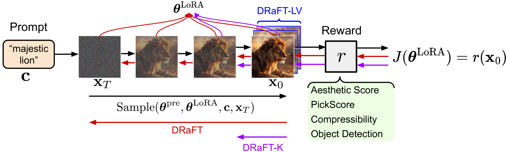
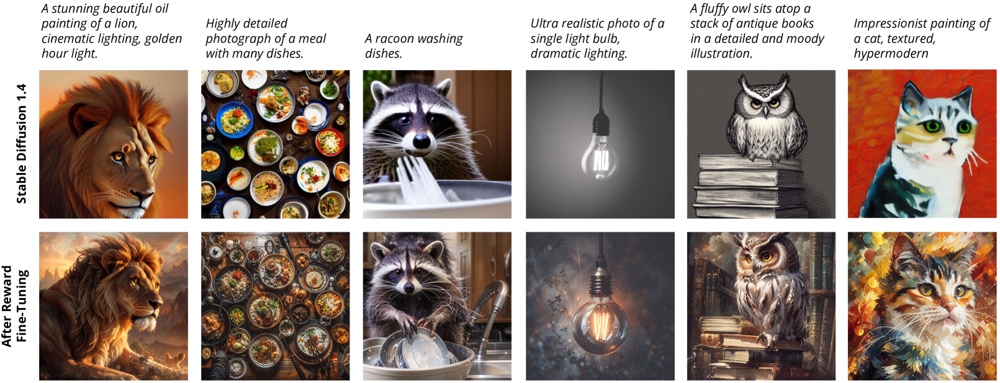
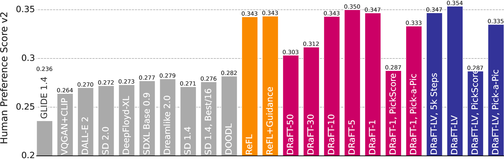

# DRaFT

## 📌 核心贡献

> 提出 DRaFT（Direct Reward Fine-Tuning），通过将可微奖励函数的梯度反向传播穿过完整扩散采样过程来直接微调扩散模型，并提出截断反向传播变体 DRaFT-K 和低方差变体 DRaFT-LV 大幅提升训练效率，统一了 ReFL 等方法作为特殊情况。

## 📖 摘要

We present Direct Reward Fine-Tuning (DRaFT), a simple and effective method for fine-tuning diffusion models to maximize differentiable reward functions, such as scores from human preference models. We first show that it is possible to backpropagate the reward function gradient through the full sampling procedure, and that doing so achieves strong performance on a variety of rewards, outperforming reinforcement learning-based approaches. We then propose more efficient variants: DRaFT-K, which truncates backpropagation to the final K steps of sampling, and DRaFT-LV, a low-variance method for the K=1 case. We demonstrate that our methods can be used to substantially improve the aesthetic quality of images generated by Stable Diffusion 1.4 for a variety of reward functions, including aesthetic quality, human preference scores, object detection, and compressibility.

## 🔍 关键信息

| 字段 | 内容 |
|------|------|
| 机构 | Google DeepMind |
| 发表 | 2023-09-29 |
| 分类 | cs.CV, cs.LG |
| 链接 | [arXiv](https://arxiv.org/abs/2309.17400) |

## 📝 我的笔记

### 方法总览

### 动机与问题

基于 RL 的扩散模型微调方法（如 DDPO）将采样过程视为黑盒，忽略了奖励模型可微的特性。如果奖励函数可微，理论上可以直接通过反向传播来优化，效率远高于 RL 方法的方差估计。然而直接反传面临显存消耗大的挑战。

### 核心方法

**DRaFT 目标函数**

直接对采样过程做梯度上升：

$$J(\theta) = \mathbb{E}_{c \sim p(c), x_T \sim \mathcal{N}(0,I)}[r(\text{sample}(\theta, c, x_T), c)]$$

通过 LoRA 参数化（冻结预训练权重，注入低秩矩阵 $BA$）减少可训练参数量，结合 gradient checkpointing（每步只存输入 latent，反向传播时重新计算 UNet 激活）降低显存。

**DRaFT-K：截断反向传播**

只对最后 K 步反向传播梯度，前面步骤使用 stop_gradient：

$$J_K(\theta) = \mathbb{E}[r(\text{sample}_K(\theta, c, \text{sg}[x_{T-K}]), c)]$$

当 K=1 时等价于 ReFL，但 DRaFT 框架统一了不同 K 值的方法。

**DRaFT-LV：低方差 K=1 变体**

对生成图像进行 $n$ 次前向扩散加噪，取平均梯度以降低方差：

通过对 $x_0$ 添加不同噪声水平 $t \sim U[0, T_{max}]$，用模型预测去噪后计算奖励梯度，平均多次估计。

**统一框架**

Algorithm 1 将 DRaFT、DRaFT-K、DRaFT-LV 和 ReFL 统一为同一算法的不同 stop_gradient 配置。

### 关键实验结果

**训练效率对比：**

| 方法 | 相对速度 | 说明 |
|------|----------|------|
| DRaFT (full) | 基准 | 全采样反向传播 |
| DRaFT-K (K=1) | ~200x vs RL | 比 DDPO 等 RL 方法快 200 倍以上 |
| DRaFT-LV | ~2x vs ReFL | 比 ReFL 训练更快 |

**HPSv2 优化：**

| 方法 | 效果 |
|------|------|
| DRaFT-LV (10k steps) | 最优整体性能 |
| DRaFT-1 | 优于 ReFL，实现更简单 |

**泛化性：**
- 在 45 个动物提示词上训练，可泛化到新提示词
- 存在一定的跨奖励泛化能力（PickScore -> HPSv2）

**多样化奖励应用：**
- 美学评分（LAION Aesthetic）
- 人类偏好（HPSv2, PickScore）
- JPEG 可压缩/不可压缩性
- 目标检测（OWL-ViT）
- 对抗样本（ResNet-50）

### 总结

DRaFT 的核心洞察是"可微奖励就应该用梯度来优化"，绕过了 RL 的高方差问题。DRaFT-K 提供了效率-质量的灵活权衡，而统一框架揭示了 ReFL 是 DRaFT-1 的特殊情况。该工作对后续基于梯度的扩散模型对齐方法（如 AlignProp）影响很大。

## 🔗 相关论文

**基于/改进自：** [[ReFL]]

**同方向：** [[DDPO]], [[AlignProp]], [[Flow-GRPO]]
