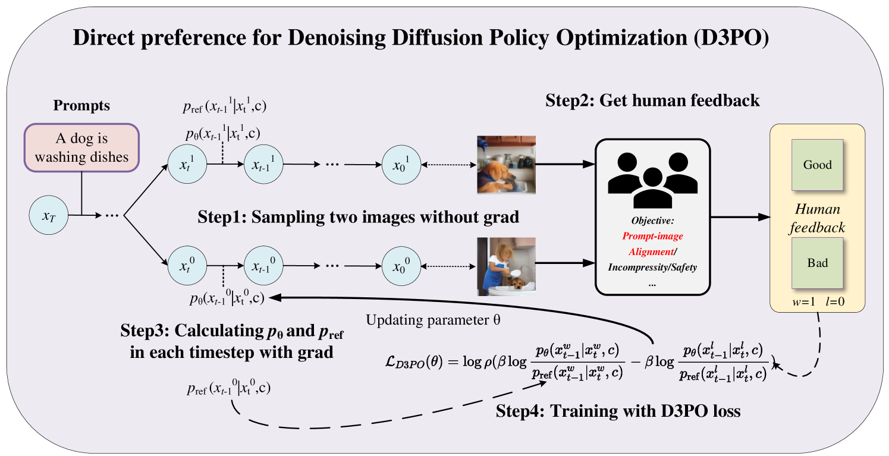
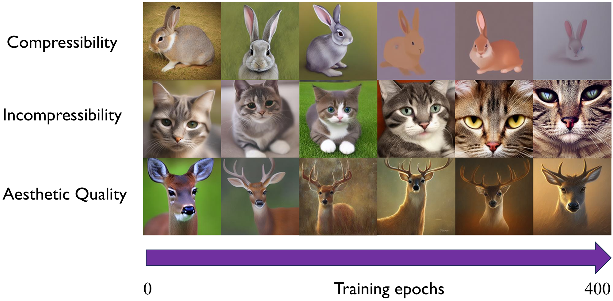

# D3PO

## 📌 核心贡献

> 将 DPO 扩展到多步 MDP 设定，提出 D3PO 方法直接微调扩散模型而无需训练奖励模型，理论证明其等效于使用最优奖励模型，并在图像质量、安全性和文本对齐任务上验证有效性。

## 📖 摘要

Using reinforcement learning with human feedback (RLHF) has shown significant promise in fine-tuning diffusion models. Previous methods start by training a reward model that aligns with human preferences, then leverage RL techniques to fine-tune the underlying models. However, crafting an efficient reward model demands extensive datasets, optimal architecture, and manual hyperparameter tuning, making the process both time and cost-intensive. The direct preference optimization (DPO) method, effective in fine-tuning large language models, eliminates the necessity for a reward model. However, the extensive GPU memory requirement of the diffusion model's denoising process hinders the direct application of the DPO method. To address this issue, we introduce the Direct Preference for Denoising Diffusion Policy Optimization (D3PO) method to directly fine-tune diffusion models. The theoretical analysis demonstrates that although D3PO omits training a reward model, it effectively functions as the optimal reward model trained using human feedback data to guide the learning process. This approach requires no training of a reward model, proving to be more direct, cost-effective, and minimizing computational overhead. In experiments, our method uses the relative scale of objectives as a proxy for human preference, delivering comparable results to methods using ground-truth rewards. Moreover, D3PO demonstrates the ability to reduce image distortion rates and generate safer images, overcoming challenges lacking robust reward models. Our code is publicly available at https://github.com/yk7333/D3PO.

## 🔍 关键信息

| 字段 | 内容 |
|------|------|
| 机构 | Tsinghua University |
| 发表 | 2023-11-22 |
| 分类 | cs.LG, cs.AI, cs.CV |
| 链接 | [arXiv](https://arxiv.org/abs/2311.13231) |

## 📝 我的笔记

### 方法总览

### 动机与问题

现有 RLHF 微调扩散模型的方法（如 DDPO）需要先训练奖励模型，这需要大量数据集、架构设计和超参调优。DPO 在 LLM 中已证明可以绕过奖励模型，但扩散模型的多步去噪过程带来巨大 GPU 内存需求，阻碍了直接应用。

### 核心方法

**将去噪过程建模为多步 MDP：**
- 状态：$s_t = (c, t, x_{T-t})$
- 动作：$a_t = x_{T-1-t}$
- 策略：$\pi(a_t|s_t) = p_\theta(x_{T-1-t}|c, t, x_{T-t})$

**D3PO 损失函数：**

将 DPO 理论扩展到 MDP，在每个去噪步骤更新策略：

$$\mathcal{L}_i(\theta) = -\mathbb{E}_{(s_i, \sigma_w, \sigma_l)}\left[\log \rho\left(\beta \log \frac{\pi_\theta(a_i^w|s_i^w)}{\pi_{ref}(a_i^w|s_i^w)} - \beta \log \frac{\pi_\theta(a_i^l|s_i^l)}{\pi_{ref}(a_i^l|s_i^l)}\right)\right]$$

每个去噪轨迹处理 $T$ 个子段，数据利用率提高 $T$ 倍。

**理论保证：**
- 命题 1：最优策略 $\pi^*(a|s) = \pi_{ref}(a|s) \exp(Q^*(s,a)/\beta)$
- 命题 2：偏好分布与 Q 函数表示之间的近似误差界

### 关键结果

| 任务 | D3PO | Baseline |
|------|------|----------|
| 人类偏好 (Prompt-Image 对齐) | 55.7% | 18.7% (RW), 14.7% (no FT) |
| CLIP Score | 31.9 | 30.7 |
| BLIP Score | 2.06 | 1.95 |
| ImageReward | 0.27 | 0.04 |

- 手部图像正常率随训练逐步改善
- 动漫角色变形率在初始几个 epoch 显著下降后趋于稳定
- 安全率在 10 个训练 epoch 内持续提升

### 总结

D3PO 优雅地将 DPO 扩展到扩散模型的多步去噪 MDP，理论上等效于最优奖励模型。方法简单直接，无需奖励模型训练，适用于缺乏良好奖励模型的场景（如图像安全性、手部畸变）。每步独立更新的设计也显著提高了数据利用效率。

## 🔗 相关论文

**基于/改进自：** [[DPO]], [[DDPO]]

**同方向：** [[Diffusion-DPO]]
