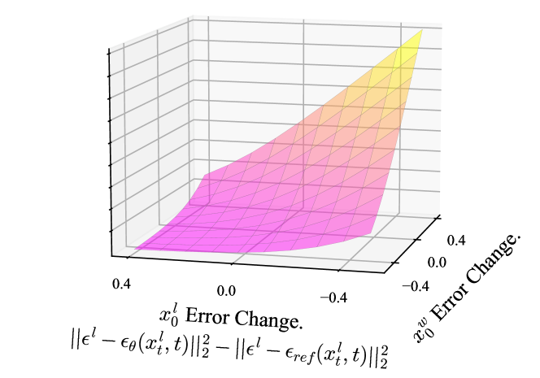
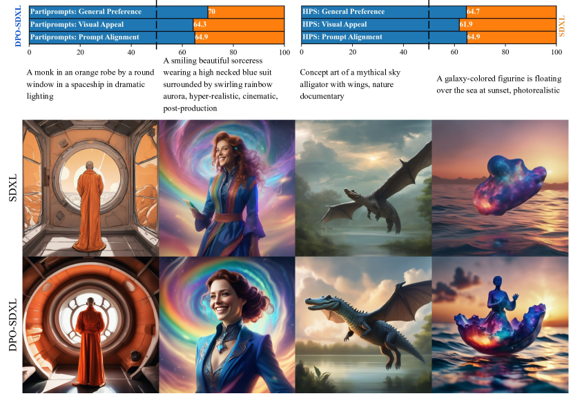

# DPO-Diffusion

## 📌 核心贡献

> 成功将大语言模型的DPO（直接偏好优化）算法迁移至扩散模型，重新推导了基于证据下界（ELBO）的可微对齐目标。该方法无需训练显式的奖励模型，直接利用偏好数据微调即可在视觉效果和提示词对齐上实现跨越式提升。

## 📖 摘要

Large language models (LLMs) are fine-tuned using human comparison data with Reinforcement Learning from Human Feedback (RLHF) methods to make them better aligned with users' preferences. In contrast to LLMs, human preference learning has not been widely explored in text-to-image diffusion models; the best existing approach is to fine-tune a pretrained model using carefully curated high quality images and captions to improve visual appeal and text alignment. We propose Diffusion-DPO, a method to align diffusion models to human preferences by directly optimizing on human comparison data. Diffusion-DPO is adapted from the recently developed Direct Preference Optimization (DPO), a simpler alternative to RLHF which directly optimizes a policy that best satisfies human preferences under a classification objective. We re-formulate DPO to account for a diffusion model notion of likelihood, utilizing the evidence lower bound to derive a differentiable objective. Using the Pick-a-Pic dataset of 851K crowdsourced pairwise preferences, we fine-tune the base model of the state-of-the-art Stable Diffusion XL (SDXL)-1.0 model with Diffusion-DPO. Our fine-tuned base model significantly outperforms both base SDXL-1.0 and the larger SDXL-1.0 model consisting of an additional refinement model in human evaluation, improving visual appeal and prompt alignment. We also develop a variant that uses AI feedback and has comparable performance to training on human preferences, opening the door for scaling of diffusion model alignment methods.

## 🔍 关键信息

| 字段 | 内容 |
|------|------|
| 机构 | Salesforce Research / Stanford University |
| 发表 | 2023-11-21 |
| 分类 | cs.CV, cs.AI, cs.GR, cs.LG |
| 链接 | [arXiv](https://arxiv.org/abs/2311.12908) |

## 📝 我的笔记

使用 Pick-a-Pic 的 851k 配对偏好数据微调 SDXL-1.0 基础模型。核心：将 DPO loss 适配到扩散模型的 ELBO 框架。

### 方法总览

### 动机与问题定义

LLM 领域已广泛使用 RLHF/DPO 对齐人类偏好，但文本到图像扩散模型的偏好学习探索很少。当时最好的做法仅是用精选高质量图文对微调预训练模型。本文的核心问题是：**如何将 DPO 的直接偏好优化思想迁移到扩散模型？**

主要挑战在于：扩散模型的似然函数（likelihood）不像 LLM 那样可以直接计算——扩散模型的边际似然 $p_\theta(\boldsymbol{x}_0|\boldsymbol{c})$ 需要对所有扩散路径 $\boldsymbol{x}_{1:T}$ 进行积分，这是 intractable 的。因此需要利用 ELBO 重新推导 DPO 目标。

与已有方法的对比优势：

| 方法 | 无需在线生成 | 开放词表 | 无额外推理开销 | 散度控制 |
|------|:---:|:---:|:---:|:---:|
| DPOK | - | + | + | + |
| DDPO | - | + | - | - |
| DOODL | + | - | - | - |
| DRaFT / AlignProp | + | + | - | - |
| **Diffusion-DPO** | **+** | **+** | **+** | **+** |

Diffusion-DPO 是唯一同时满足四个条件的方法：离线学习（无需在线生成样本）、开放词表、不增加推理成本、有 KL 散度正则化防止模式坍缩。

### 方法推导

#### 1. Bradley-Terry 偏好模型

给定 prompt $\boldsymbol{c}$，一对生成图像 $\boldsymbol{x}^w_0$（preferred）和 $\boldsymbol{x}^l_0$（rejected），偏好概率由 Bradley-Terry 模型定义：

$$p_{\text{BT}}(\boldsymbol{x}^w_0 \succ \boldsymbol{x}^l_0|\boldsymbol{c}) = \sigma\big(r(\boldsymbol{c},\boldsymbol{x}^w_0) - r(\boldsymbol{c},\boldsymbol{x}^l_0)\big)$$

其中 $\sigma$ 是 sigmoid 函数，$r$ 是隐式奖励函数。

#### 2. 扩散模型的 RLHF 目标

标准 RLHF 目标为最大化奖励同时约束策略不偏离参考模型过远：

$$\max_{p_\theta} \mathbb{E}_{\boldsymbol{c}, \boldsymbol{x}_0 \sim p_\theta}[r(\boldsymbol{c},\boldsymbol{x}_0)] - \beta \mathbb{D}_{\text{KL}}[p_\theta(\boldsymbol{x}_0|\boldsymbol{c}) \| p_{\text{ref}}(\boldsymbol{x}_0|\boldsymbol{c})]$$

由于扩散模型的边际似然 intractable，本文将优化扩展到完整扩散轨迹空间 $\boldsymbol{x}_{0:T}$：

$$\max_{p_\theta} \mathbb{E}_{\boldsymbol{c}, \boldsymbol{x}_{0:T} \sim p_\theta(\boldsymbol{x}_{0:T}|\boldsymbol{c})}[r(\boldsymbol{c},\boldsymbol{x}_0)] - \beta \mathbb{D}_{\text{KL}}[p_\theta(\boldsymbol{x}_{0:T}|\boldsymbol{c}) \| p_{\text{ref}}(\boldsymbol{x}_{0:T}|\boldsymbol{c})]$$

#### 3. 奖励重参数化

遵循 DPO 理论，最优策略满足：

$$p^*_\theta(\boldsymbol{x}_{0:T}|\boldsymbol{c}) = p_{\text{ref}}(\boldsymbol{x}_{0:T}|\boldsymbol{c}) \cdot \exp\big(R(\boldsymbol{c},\boldsymbol{x}_{0:T})/\beta\big) / Z(\boldsymbol{c})$$

由此可将奖励重参数化为策略和参考模型的对数似然比：

$$R(\boldsymbol{c},\boldsymbol{x}_{0:T}) = \beta \log\frac{p^*_\theta(\boldsymbol{x}_{0:T}|\boldsymbol{c})}{p_{\text{ref}}(\boldsymbol{x}_{0:T}|\boldsymbol{c})} + \beta \log Z(\boldsymbol{c})$$

#### 4. Diffusion-DPO 损失函数

将奖励重参数化代入 Bradley-Terry 目标，得到完整的 Diffusion-DPO 损失：

$$\mathcal{L}_{\text{DPO}}(\theta) = -\mathbb{E}_{(\boldsymbol{x}^w_0,\boldsymbol{x}^l_0)\sim\mathcal{D}} \log\sigma\bigg(\beta \mathbb{E}_{\boldsymbol{x}^w_{1:T}, \boldsymbol{x}^l_{1:T}} \bigg[\log\frac{p_\theta(\boldsymbol{x}^w_{0:T})}{p_{\text{ref}}(\boldsymbol{x}^w_{0:T})} - \log\frac{p_\theta(\boldsymbol{x}^l_{0:T})}{p_{\text{ref}}(\boldsymbol{x}^l_{0:T})}\bigg]\bigg)$$

#### 5. Jensen 不等式近似

为避免对完整反向过程采样，利用 $-\log\sigma$ 的凸性，通过 Jensen 不等式得到可训练的上界：

$$\mathcal{L}(\theta) \leq -\mathbb{E}_{t\sim\mathcal{U}(0,T)} \log\sigma\bigg(\beta T \log\frac{p_\theta(\boldsymbol{x}^w_{t-1}|\boldsymbol{x}^w_t)}{p_{\text{ref}}(\boldsymbol{x}^w_{t-1}|\boldsymbol{x}^w_t)} - \beta T \log\frac{p_\theta(\boldsymbol{x}^l_{t-1}|\boldsymbol{x}^l_t)}{p_{\text{ref}}(\boldsymbol{x}^l_{t-1}|\boldsymbol{x}^l_t)}\bigg)$$

#### 6. 最终可训练形式（噪声预测参数化）

将反向过程用前向过程近似，并利用高斯参数化下 KL 散度与去噪误差的关系，最终损失写成噪声预测的形式：

$$\mathcal{L}(\theta) = -\mathbb{E}_{t, \boldsymbol{\epsilon}^w, \boldsymbol{\epsilon}^l} \log\sigma\bigg(-\beta T \omega(\lambda_t) \Big[\big(\|\boldsymbol{\epsilon}^w - \boldsymbol{\epsilon}_\theta(\boldsymbol{x}^w_t, t)\|^2 - \|\boldsymbol{\epsilon}^w - \boldsymbol{\epsilon}_{\text{ref}}(\boldsymbol{x}^w_t, t)\|^2\big) - \big(\|\boldsymbol{\epsilon}^l - \boldsymbol{\epsilon}_\theta(\boldsymbol{x}^l_t, t)\|^2 - \|\boldsymbol{\epsilon}^l - \boldsymbol{\epsilon}_{\text{ref}}(\boldsymbol{x}^l_t, t)\|^2\big)\Big]\bigg)$$

其中 $\boldsymbol{x}_t = \alpha_t \boldsymbol{x}_0 + \sigma_t \boldsymbol{\epsilon}$，$\lambda_t = \alpha^2_t / \sigma^2_t$ 是信噪比，$\omega(\lambda_t)$ 是权重函数。

**直觉理解**：损失函数鼓励模型在 preferred 样本上降低去噪误差（更好地去噪），同时在 rejected 样本上增大去噪误差（更差地去噪），二者的差值通过 sigmoid 转化为分类损失。

### 训练细节

| 配置项 | 值 |
|--------|-----|
| 数据集 | Pick-a-Pic v2，851,293 对偏好对（排除约 12% 平局），58,960 个唯一 prompt |
| Batch Size | 2,048 对（1 对/GPU，128 梯度累积步） |
| 硬件 | 16 x NVIDIA A100 GPU |
| 学习率 | $(2000/\beta) \times 2.048 \times 10^{-8}$（与 $\beta$ 成反比，因为 DPO 梯度的范数与 $\beta$ 成正比） |
| Warmup | 25% 线性预热 |
| $\beta$ | SD1.5: 2,000；SDXL: 5,000 |
| 优化器 | SD1.5: AdamW；SDXL: Adafactor（节省显存） |
| 训练步数 | SDXL 约 2,000 步 |

### 关键实验结果

#### Human Evaluation

**DPO-SDXL vs SDXL-Base（PartiPrompts）：**

| 评估维度 | DPO-SDXL 胜率 |
|----------|:---:|
| General Preference（整体偏好） | 70.0% |
| Visual Appeal（视觉吸引力） | ~70% |
| Prompt Alignment（提示词对齐） | ~70% |

**DPO-SDXL vs SDXL-Base（HPSv2）：**

| 评估维度 | DPO-SDXL 胜率 |
|----------|:---:|
| General Preference | 64.7% |

**DPO-SDXL (base only) vs SDXL (base + refiner)：**

| 基准 | DPO-SDXL 胜率 |
|------|:---:|
| PartiPrompts General | 69% |
| HPSv2 General | 64% |
| PartiPrompts People 类别 | 67.2% |

这一结果尤其值得注意：仅使用 base 模型的 DPO-SDXL 显著超过了参数量更大的 SDXL base + refiner pipeline。

**Image-to-Image 编辑（TEdBench，SDEdit）：**

| 偏好 | 比例 |
|------|:---:|
| DPO-SDXL 更好 | 65% |
| SDXL 更好 | 24% |
| 持平 | 11% |

#### 隐式奖励模型准确率

DPO 训练的模型可以作为隐式奖励模型，通过比较去噪损失来预测偏好。在 Pick-a-Pic v2 验证集上的偏好分类准确率：

| 模型 | 准确率 |
|------|:---:|
| Aesthetics Score | 51.4% |
| CLIP Score | 57.1% |
| HPSv2 | 59.3% |
| PickScore | 64.2% |
| **DPO-SDXL（隐式）** | **72.0%** |

DPO-SDXL 的隐式奖励模型超过了所有现有的专用评分模型，说明 DPO 训练确实学到了对人类偏好的深层理解。

### AI Feedback 变体分析

论文探索了用 AI 反馈替代人类标注的可行性。具体做法是用现有的评分模型（PickScore、HPSv2、CLIP、Aesthetics）对 Pick-a-Pic 数据集重新标注偏好，然后用这些伪标签训练 DPO。

关键发现：

- **PickScore 伪标签**训练效果最好，General Preference 胜率从 59.8% 提升到 63.3%，接近人类标注的效果
- **Prompt-aware 的评分模型**（PickScore、HPS）作为标注器效果优于 prompt-agnostic 的模型（Aesthetics、CLIP），因为它们能同时优化视觉质量和文本对齐
- 用 **Aesthetics** 训练会提升美学评分但牺牲 CLIP 对齐，存在目标之间的 trade-off
- 用 **CLIP** 训练主要提升文本对齐但视觉质量改善有限
- AI feedback 方法为扩散模型对齐的 **规模化扩展** 打开了大门——无需昂贵的人类标注

### Ablation 分析

#### $\beta$ 值的影响

$\beta$ 控制 KL 正则化强度。论文发现 $\beta \in [2000, 5000]$ 表现较好。SD1.5 用 $\beta=2000$，SDXL 用 $\beta=5000$。学习率与 $\beta$ 成反比缩放（$\text{lr} = (2000/\beta) \times 2.048 \times 10^{-8}$），因为 DPO 梯度范数与 $\beta$ 成正比。

#### 数据质量 vs 模型能力

一个重要发现是：**即使训练数据的质量低于模型自身生成能力，DPO 训练仍然有效**。SDXL 的生成质量明显高于 Pick-a-Pic 训练数据（由 SD2.1 等较弱模型生成），但 DPO 训练仍显著提升了 SDXL 的表现。这说明 DPO 学习的是偏好的相对排序信息，而非绝对质量。

然而，当 Dreamlike 模型仅在自身生成的数据上训练时，由于数据量较小，提升有限。

### 总结性评价

**优势：**
- 方法理论推导完整，从 LLM DPO 到扩散模型 DPO 的迁移在数学上严谨（ELBO + Jensen 不等式）
- 实现简单，无需训练额外的奖励模型，无需在线采样，训练开销低
- 效果显著——仅 base model 就超过 base + refiner pipeline
- 隐式奖励模型效果超过所有专用评分模型，验证了方法的有效性
- AI feedback 变体使方法可以低成本扩展

**局限：**
- Jensen 不等式近似引入了上界优化，理论上可能不够紧
- 依赖静态离线数据，无法在训练过程中探索新的偏好空间（与 RLHF 的在线方法相比）
- $\beta$ 需要调参，且学习率需与 $\beta$ 联合调整
- 仅在 SDXL 上验证，未探索其他架构

## 🔗 相关论文

**基于/改进自：** [[DPO]]

**同方向（DPO思路用于diffusion）：** [[RAFT]], [[DDPO]]
