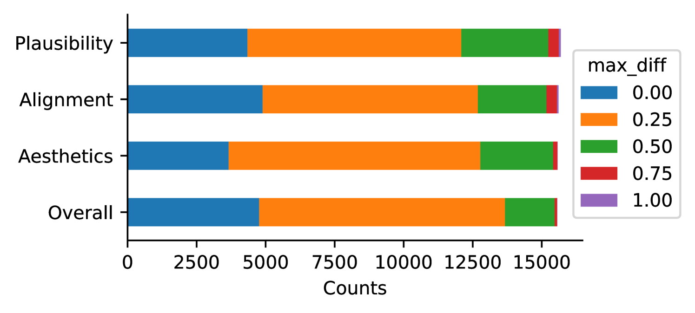

# RichFeedback

## 📌 核心贡献

> 提出空间细粒度、多维度的丰富人类反馈框架用于 T2I 生成：在图像上标注不合理区域和文本不对齐区域的热力图，在文本上标注缺失/错误表示的词语，并训练多模态 Transformer 自动预测这些丰富反馈，用于数据筛选、区域修复和引导生成。

## 📖 摘要

Recent Text-to-Image generation models such as Stable Diffusion and Imagen have made significant progress in generating high-resolution images based on text descriptions. However, many generated images still suffer from issues such as artifacts/implausibility, misalignment with text descriptions, and low aesthetic quality. Inspired by the success of Reinforcement Learning with Human Feedback (RLHF) for large language models, prior works collected human-provided scores as feedback on generated images and trained a reward model to improve the T2I generation. In this paper, we enrich the feedback signal by (i) marking image regions that are implausible or misaligned with the text, and (ii) annotating which words in the text prompt are misrepresented or missing on the image. We collect such rich human feedback on 18K generated images (RichHF-18K) and train a multimodal transformer to predict the rich feedback automatically. We show that the predicted rich human feedback can be leveraged to improve image generation, for example, by selecting high-quality training data to finetune and improve the generative models, or by creating masks with predicted heatmaps to inpaint the problematic regions. Notably, the improvements generalize to models (Muse) beyond those used to generate the images on which human feedback data were collected (Stable Diffusion variants).

## 🔍 关键信息

| 字段 | 内容 |
|------|------|
| 机构 | Google Research |
| 发表 | 2023-12-15 |
| 分类 | cs.CV |
| 链接 | [arXiv](https://arxiv.org/abs/2312.10240) |

## 📝 我的笔记

### 方法总览

### 动机

现有 T2I 人类反馈方法（如 ImageReward、HPSv2）仅收集整体偏好分数，信号过于稀疏。关键问题：
- 图像的**哪些区域**有问题？（伪影、不合理）
- 文本的**哪些词**没有被正确表示？
- 问题属于**哪个维度**？（合理性、对齐性、美学）

### 丰富反馈的定义

**图像侧反馈：**
- 不合理区域热力图（Implausibility Heatmap）：标注包含伪影或不合理内容的区域
- 文本不对齐热力图（Misalignment Heatmap）：标注与文本描述不符的区域
- 四维评分：合理性、文本对齐、美学、综合评分（1-5 分）

**文本侧反馈：**
- 标注 prompt 中缺失或被错误表示的词语

### 模型架构（RAHF）

- **图像编码器**：ViT-B/16
- **文本编码器**：T5-Base
- **融合方式**：拼接图像和文本 token 后进行 self-attention
- **三个预测头**：
  1. 热力图预测（implausibility + misalignment）
  2. 评分预测（4 个维度）
  3. 文本对齐序列生成（标注缺失/错误词语）

### 反馈应用方式

1. **数据筛选微调**：用预测评分筛选高质量训练数据微调生成模型
2. **区域修复（Inpainting）**：用预测热力图生成 mask，对问题区域进行重新生成
3. **分类器引导**：在扩散过程中用预测评分进行引导

### 关键结果

**反馈预测性能：**

| 预测任务 | PLCC |
|----------|------|
| Plausibility 评分 | 0.693 |
| Alignment 评分 | 0.474 |
| Aesthetics 评分 | 0.600 |
| Overall 评分 | 0.580 |

| 热力图预测 | MSE |
|-----------|-----|
| Implausibility Heatmap | 0.00920 |
| Misalignment Heatmap | 0.00304 |

**下游应用效果：**
- Muse 微调：51.83% 的生成结果被评为"显著/略微更好"
- 跨模型泛化：在 Stable Diffusion 数据上训练的反馈模型可用于改善 Muse 的生成

**数据集统计：** RichHF-18K，16K 训练 / 1K 验证 / 1K 测试，来源于 Pick-a-Pic，约 3000 标注者小时。

### 个人思考

- 丰富反馈的思路很有启发性：从"整体好不好"升级到"哪里有问题、什么类型的问题"
- 热力图标注天然适合 inpainting 应用
- 局限性：标注成本高（18K 样本需 3000 小时），规模化依赖自动预测模型的质量
- 与后续 VLM-as-judge 的趋势形成有趣对比

## 🔗 相关论文

**基于/改进自：** --

**同方向：** [[ImageReward]], [[HPSv2]], [[PickScore]]
