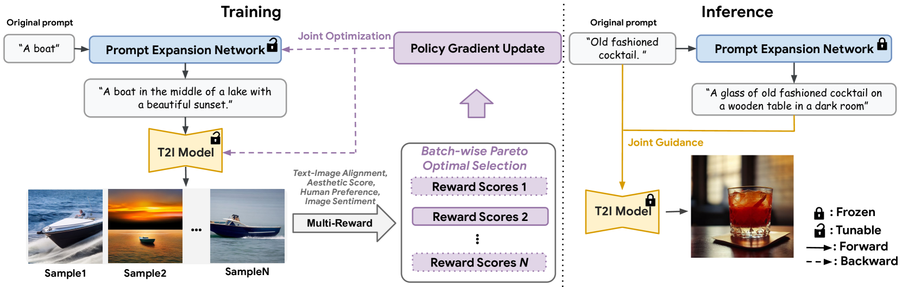
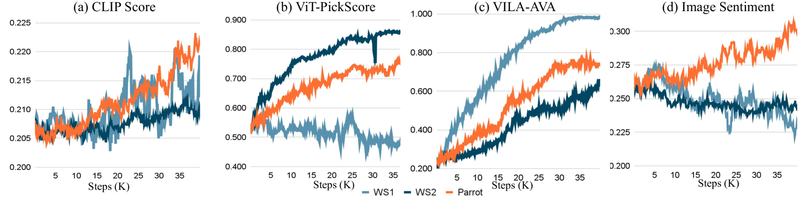

# Parrot

## 📌 核心贡献

> 提出 Parrot 多奖励帕累托最优 RL 框架，通过批量级帕累托最优选择自动平衡多个质量奖励的 trade-off，并联合优化 T2I 模型和 Prompt 扩展网络，同时引入原始 Prompt 中心引导保持用户输入保真度。

## 📖 摘要

Recent works have demonstrated that using reinforcement learning (RL) with multiple quality rewards can improve the quality of generated images in text-to-image (T2I) generation. However, manually adjusting reward weights poses challenges and may cause over-optimization in certain metrics. To solve this, we propose Parrot, which addresses the issue through multi-objective optimization and introduces an effective multi-reward optimization strategy to approximate Pareto optimal. Utilizing batch-wise Pareto optimal selection, Parrot automatically identifies the optimal trade-off among different rewards. We use the novel multi-reward optimization algorithm to jointly optimize the T2I model and a prompt expansion network, resulting in significant improvement of image quality and also allow to control the trade-off of different rewards using a reward related prompt during inference. Furthermore, we introduce original prompt-centered guidance at inference time, ensuring fidelity to user input after prompt expansion. Extensive experiments and a user study validate the superiority of Parrot over several baselines across various quality criteria, including aesthetics, human preference, text-image alignment, and image sentiment.

## 🔍 关键信息

| 字段 | 内容 |
|------|------|
| 机构 | Google Research, Korea University, Georgia Tech |
| 发表 | 2024-01-11 |
| 分类 | cs.CV |
| 链接 | [arXiv](https://arxiv.org/abs/2401.05675) |

## 📝 我的笔记

### 方法总览

### 动机与问题

使用多个质量奖励进行 RL 微调 T2I 模型时，手动调整奖励权重面临两个问题：
1. 权重组合空间大，调参代价高
2. 简单加权可能导致某些指标过度优化而其他指标退化

### 核心方法

**批量级帕累托最优选择：**
在每个 batch 中识别非支配点（Pareto-optimal samples）——即不存在其他样本在所有目标上都优于它的样本。只有非支配点参与梯度更新，自动平衡多个奖励目标。约 20-30% 的 batch 样本成为非支配点。

**4 个奖励模型：**
- 美学（VILA-R）
- 人类偏好（ViT-B/16 on Pick-a-Pic）
- 文本-图像对齐（CLIP）
- 图像情感

**联合优化：**
- Prompt 扩展网络（PEN）：PaLM 2-L-IT
- T2I 模型：Stable Diffusion 1.5（仅更新 U-Net 的 cross-attention 层）
- 学习率 $1 \times 10^{-5}$，Adam 优化器，batch size 256

**原始 Prompt 中心引导（推理时）：**
组合三个引导源：原始 prompt ($w_1=5$)、扩展 prompt ($w_2=5$)、无条件引导。确保扩展后仍保持对用户原始输入的忠实度。

### 关键结果

| 方法 | 文本对齐 | 美学 | 人类偏好 | 情感 | 平均 |
|------|----------|------|----------|------|------|
| SD 1.5 | 0.2322 | 0.5755 | 0.1930 | 0.3010 | 0.3254 |
| DPOK (加权) | 0.2337 | 0.5813 | 0.1932 | 0.3013 | 0.3273 (+0.6%) |
| **Parrot** | **0.1667** | **0.7396** | **0.3411** | **0.3132** | **0.3901 (+19.8%)** |

加权求和（WS1/WS2）导致人类偏好和情感指标下降，而 Parrot 在所有指标上保持稳定提升。用户研究中 Parrot 在全部四个维度上优于所有基线。

### 总结

Parrot 将多目标优化引入 T2I RL 微调，帕累托最优选择完全避免了手动权重调整。联合优化 Prompt 扩展网络是一个有价值的设计，原始 prompt 中心引导则解决了 prompt 扩展引入的保真度问题。

## 🔗 相关论文

**基于/改进自：** [[DDPO]]

**同方向：** [[Diffusion-DPO]], [[ImageReward]]
