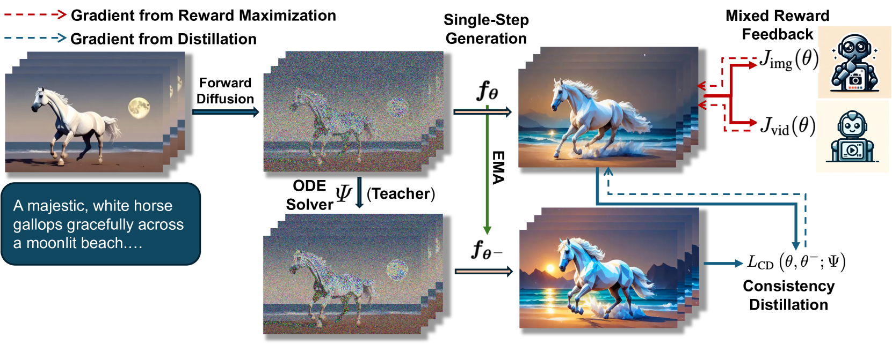
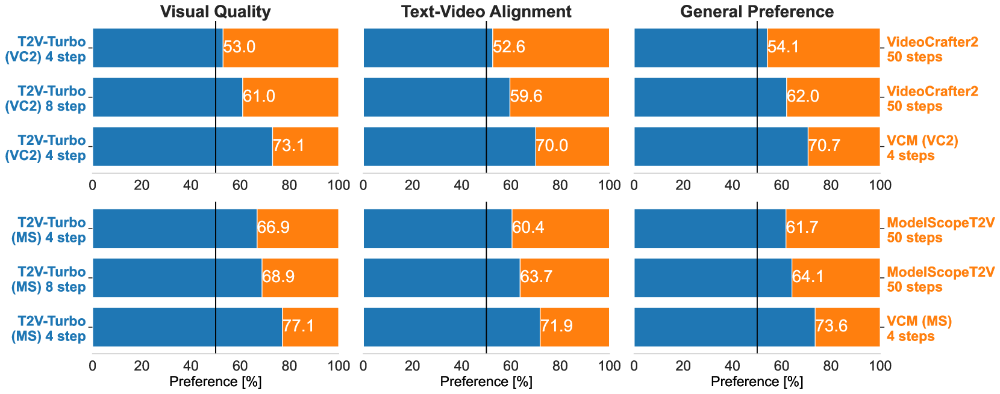

# T2V-Turbo

## 📌 核心贡献

> 提出将混合奖励反馈（图像-文本 RM + 视频-文本 RM）融入视频一致性模型蒸馏过程，仅需 4 步推理即可生成超越商业模型质量的视频，实现超过 10 倍加速且质量提升。

## 📖 摘要

Consistency distillation has been a primary approach to accelerate the inference of diffusion models by distilling a consistency model from a pre-trained teacher diffusion model. While consistency distillation avoids the iterative inference process and can generate decent results in just a few steps, it still lags behind in terms of generation quality. In this work, we address this quality bottleneck by integrating feedback from a mixture of differentiable reward models into the consistency distillation process of a pre-trained text-to-video model. This results in our proposed model, T2V-Turbo, which can generate high-quality videos with 4-step inference. We find that the 4-step generations from T2V-Turbo surpass the quality of results from both its teacher model and existing commercial video generation systems, achieving more than a tenfold acceleration while improving video generation quality. Our comprehensive evaluations on VBench demonstrate T2V-Turbo's state-of-the-art performance across multiple quality dimensions.

## 🔍 关键信息

| 字段 | 内容 |
|------|------|
| 机构 | UC Santa Barbara, Google, University of Waterloo |
| 发表 | 2024-05-29 |
| 分类 | cs.CV |
| 链接 | [arXiv](https://arxiv.org/abs/2405.18750) |

## 📝 我的笔记

### 方法总览

### 动机与问题定义

扩散模型生成视频质量高但推理慢（需 50 步迭代采样）。一致性模型（Consistency Model）可实现少步推理（4-8 步），但生成质量受限于教师模型的上限。先前工作 InstructVideo 尝试通过奖励优化提升质量，但面临两个关键限制：

1. **显存瓶颈**：通过迭代采样链反向传播梯度需要巨大显存
2. **反馈单一**：仅使用图像级别奖励，无法捕捉视频的时序动态

T2V-Turbo 的核心洞察是：一致性蒸馏过程中自然产生单步生成结果，可以直接在这些单步生成上优化奖励，绕开了显存瓶颈。

### 方法细节

#### 一致性函数参数化

$$f_\theta(z, \omega, c, t) = c_{\text{skip}}(t) \cdot z + c_{\text{out}}(t) \cdot F_\theta(z, \omega, c, t)$$

其中 $c_{\text{skip}}(\epsilon) = 1$，$c_{\text{out}}(\epsilon) = 0$，确保模型能将 ODE 轨迹上任意点映射回原点。

#### 基础一致性蒸馏损失

$$\mathcal{L}_{\text{CD}}(\theta, \theta^-; \Psi) = \mathbb{E}\left[d\left(f_\theta(z_{t_{n+k}}, \omega, c, t_{n+k}),\; f_{\theta^-}(\hat{z}_{t_n}^{\Psi, \omega}, \omega, c, t_n)\right)\right]$$

其中 $\theta^-$ 通过指数移动平均更新，$\hat{z}_{t_n}^{\Psi, \omega}$ 为带 classifier-free guidance 的 DDIM 求解器估计值。

#### 混合奖励反馈

**图像-文本奖励模型 $R_{\text{img}}$**（HPSv2.1）：优化单帧图像质量

$$J_{\text{img}}(\theta) = \mathbb{E}\left[\sum_{m=1}^{M} R_{\text{img}}(\hat{x}_0^m, c)\right]$$

其中 $M=6$，从生成视频中随机采样 6 帧计算奖励。

**视频-文本奖励模型 $R_{\text{vid}}$**：评估时序动态和视频-文本对齐

- T2V-Turbo (VC2) 使用 InternVideo2 Stage 2
- T2V-Turbo (MS) 使用 ViCLIP

$$J_{\text{vid}}(\theta) = \mathbb{E}\left[R_{\text{vid}}(\hat{x}_0, c)\right]$$

#### 联合训练目标

$$\mathcal{L}(\theta, \theta^-; \Psi) = \mathcal{L}_{\text{CD}}(\theta, \theta^-; \Psi) - \beta_{\text{img}} \cdot J_{\text{img}}(\theta) - \beta_{\text{vid}} \cdot J_{\text{vid}}(\theta)$$

超参数设置：
- T2V-Turbo (VC2)：$\beta_{\text{img}}=1$，$\beta_{\text{vid}}=2$
- T2V-Turbo (MS)：$\beta_{\text{img}}=2$，$\beta_{\text{vid}}=3$

#### 训练细节

- 数据集：WebVid-10M
- 硬件：8 x NVIDIA A100 GPU
- 训练步数：10,000
- 批大小：每 GPU 1 个视频
- 学习率：1e-5
- Guidance scale 范围：[5, 15]
- 跳跃间隔 $k=20$
- 仅训练 LoRA 权重，训练后合并

### 关键结果

#### VBench 评估

| 模型 | 总分 | 质量分 | 语义分 |
|------|------|--------|--------|
| Gen-2 | 80.58 | 82.47 | 73.03 |
| Pika | 80.40 | 82.68 | 71.26 |
| VideoCrafter2 (50 步) | 80.44 | 82.20 | 73.42 |
| VCM (VC2) baseline | 73.97 | 78.54 | 55.66 |
| **T2V-Turbo (VC2, 4 步)** | **81.01** | **82.57** | **74.76** |
| **T2V-Turbo (MS, 4 步)** | **80.62** | **82.15** | **74.47** |

T2V-Turbo (VC2) 仅用 4 步推理即超越 Gen-2、Pika 等商业模型，实现 SOTA。

#### 人类评估

- 4 步 T2V-Turbo 在约 60% 的对比中优于 50 步教师模型
- 8 步 T2V-Turbo 偏好率提升至约 70%
- 实现 >12.5x 加速的同时提升质量

### Ablation 分析

| 配置 | 总分 | 质量分 | 语义分 |
|------|------|--------|--------|
| VCM (VC2) baseline | 73.97 | 78.54 | 55.66 |
| + $R_{\text{vid}}$ only | 77.57 | 80.08 | 67.55 |
| + $R_{\text{img}}$ only | 80.42 | 82.59 | 71.70 |
| + Both (Full) | **81.01** | **82.57** | **74.76** |

关键发现：
- 仅 $R_{\text{img}}$ 已能带来显著提升（+6.45 总分），说明单帧质量对视频生成至关重要
- $R_{\text{vid}}$ 在语义理解和时序一致性上贡献显著（+3.06 语义分）
- 两者结合达到最优，验证了混合奖励反馈的必要性

### 总结性评价

T2V-Turbo 的核心创新在于巧妙利用一致性蒸馏过程中自然产生的单步生成结果来优化奖励，避免了通过迭代采样链反向传播的显存瓶颈。混合使用图像级和视频级奖励模型是合理且有效的设计：图像 RM 保证帧质量，视频 RM 保证时序一致性和语义对齐。训练成本低（8 A100，10K 步），方法简洁优雅。

## 🔗 相关论文

**基于/改进自：** [[HPSv2]]

**同方向：** [[VideoScore]], [[VideoAlign]]
