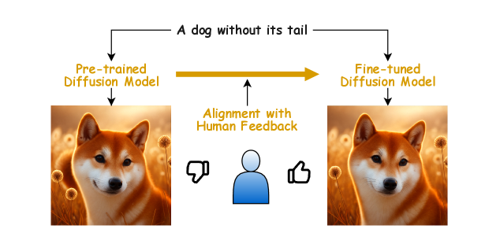
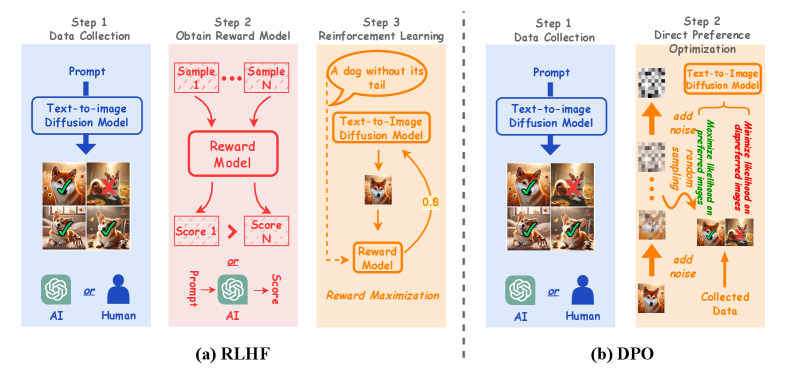

# DiffusionAlignment-Survey

## 📌 核心贡献

> 首篇系统性综述扩散模型对齐的论文，从基础理论（偏好建模、对齐算法）、对齐技术（RLHF、DPO、推理时对齐）、偏好基准与评估四个维度全面梳理了扩散模型与人类意图对齐的研究进展，并分析了当前挑战与未来方向。

## 📖 摘要

Diffusion models have emerged as the leading paradigm in generative modeling, excelling in various applications. Despite their success, these models often misalign with human intentions and generate results with undesired properties or even harmful content. Inspired by the success and popularity of alignment in tuning large language models, recent studies have investigated aligning diffusion models with human expectations and preferences. This work mainly reviews alignment of diffusion models, covering advancements in fundamentals of alignment, alignment techniques of diffusion models, preference benchmarks, and evaluation for diffusion models. Moreover, we discuss key perspectives on current challenges and promising future directions on solving the remaining challenges in alignment of diffusion models. To the best of our knowledge, our work is the first comprehensive review paper for researchers and engineers to comprehend, practice, and research alignment of diffusion models.

## 🔍 关键信息

| 字段 | 内容 |
|------|------|
| 机构 | HKUST(GZ) / CAS / MBZUAI / Baidu / HKUST / University of Bologna |
| 发表 | 2024-09-11 |
| 分类 | cs.CV, cs.LG |
| 链接 | [arXiv](https://arxiv.org/abs/2409.07253) |

## 📝 我的笔记

### 综述框架

本文是扩散模型对齐方向的首篇系统性综述，将该领域组织为三大板块：

1. **对齐基础**：偏好数据与建模、对齐算法、对齐的核心挑战
2. **对齐技术**：RLHF、DPO、推理时对齐、T2I 以外的扩展
3. **基准与评估**：偏好数据集、评估指标

---

### 一、对齐基础

#### 1.1 偏好建模

两种主流偏好模型：

**Bradley-Terry 模型**（成对偏好）：

$$p_{\text{BT}}(x^w \succ x^l \mid c) = \sigma(r^*(c, x^w) - r^*(c, x^l))$$

其中 $x^w$ 为偏好样本，$x^l$ 为非偏好样本。对应的奖励模型训练损失：

$$\mathcal{L}_{\text{RM-BT}}(\phi) = -\mathbb{E}_{(c,x^w,x^l) \sim \mathcal{D}} \left[\log \sigma(r_\phi(c, x^w) - r_\phi(c, x^l))\right]$$

**Plackett-Luce 模型**（排序偏好）：

$$p_{\text{PL}}(\tau \mid x_1, \ldots, x_K, c) = \prod_{k=1}^{K} \frac{\exp(r^*(c, x_{\tau(k)}))}{\sum_{j=k}^{K} \exp(r^*(c, x_{\tau(j)}))}$$

支持 $K$ 个候选的排序，是 Bradley-Terry 的推广。

#### 1.2 核心对齐算法

**RLHF 目标**：

$$\max_{p_\theta} \mathbb{E}\left[r_\phi(c, x) - \beta D_{\text{KL}}(p_\theta(x|c) \| p_{\text{ref}}(x|c))\right]$$

**DPO 目标**（免去显式奖励模型）：

$$\mathcal{L}_{\text{DPO}} = -\mathbb{E}_{(c,x^w,x^l) \sim \mathcal{D}} \left[\log \sigma\left(\beta \log \frac{p_\theta(x^w|c)}{p_{\text{ref}}(x^w|c)} - \beta \log \frac{p_\theta(x^l|c)}{p_{\text{ref}}(x^l|c)}\right)\right]$$

---

### 二、对齐技术分类

#### 2.1 RLHF 方法

##### (a) 奖励加权微调 (Reward-Weighted)

- **Lee et al. (2023)**：奖励加权似然最大化，同时利用模型生成数据和预训练数据
- **RWR (Black et al., 2023)**：使用指数加权或稀疏二值加权的奖励加权回归

##### (b) 策略梯度 / RL 微调

| 方法 | 核心思路 |
|------|----------|
| [[DDPO]] | 将去噪过程建模为 MDP，使用 REINFORCE / PPO 风格的重要性采样 |
| [[DPOK]] | 在 DDPO 基础上加入逐步 KL 散度约束 |
| PRDP | 将 RL 重构为有监督的差异预测问题 |
| TDPO-R | 引入 critic 活性神经元重置机制 |
| SDPO | 专门针对少步模型的步级策略优化 |

##### (c) 直接奖励微调 (Direct Reward Fine-Tuning)

| 方法 | 核心思路 |
|------|----------|
| [[ReFL]] | 首个通过可微奖励模型反向传播的方法，在单步预测上评估 |
| [[AlignProp]] | 通过反向传播对齐，处理全链路梯度 |
| [[DRaFT]] | LoRA 缩放 + 早停策略，提升训练稳定性 |
| DRTune | 支持选择性逐步梯度应用 |
| LaSRO | 在潜空间使用可微代理奖励 |
| ADT | 对抗性扩散调优 |

#### 2.2 DPO 方法

##### (a) 基础方法

- **Diffusion-DPO** ([[DPO-Diffusion]])：将 DPO 适配到扩散模型的迭代去噪过程，使用前向过程近似

$$\mathcal{L}_{\text{Diff-DPO}} = -\mathbb{E}_{(c,x_0^w,x_0^l), t \sim U(0,T)} \left[\log \sigma\left(-\beta T \left[\Delta D_{\text{KL}}\right]\right)\right]$$

- **D3PO**：使用模型自身的反向过程获取噪声潜变量

##### (b) 步级感知扩展

- **Step-aware DPO**：解决静态偏好假设问题，引入时序折扣偏好
- **Curriculum DPO**：渐进式引入更难的样本对
- **MaPO**：免参考模型目标，提升鲁棒性
- **Diffusion-KTO**：扩展到二值反馈（无需成对数据）

#### 2.3 推理时对齐 (Test-Time Alignment)

**隐式引导 (Implicit Guidance)**：

| 类型 | 方法 | 思路 |
|------|------|------|
| Prompt 优化 | RePrompt, Promptist, OPT2I | 利用 RL 或 LLM 迭代优化输入提示词 |
| 注意力控制 | Attend-and-Excite | 操纵交叉注意力图引导生成 |
| 噪声优化 | InitNO, ReNO | 搜索更优的初始噪声 |

**显式奖励引导 (Explicit Reward-Guided)**：

| 类型 | 方法 | 思路 |
|------|------|------|
| 输入优化 | ReNeg, DNO | 通过梯度上升优化噪声/嵌入 |
| 轨迹引导 | SVBD, Z-Sampling | 在采样过程中基于奖励信号调整轨迹 |
| SMC 采样 | Kim et al. (2025) | 基于序贯蒙特卡洛的重采样，对抗过优化 |

---

### 三、三种范式对比

| 维度 | RLHF | DPO | 推理时对齐 |
|------|------|-----|-----------|
| 计算开销 | 高：多步 rollout + 轨迹存储 + RL 优化 | 中等：免去 RL 循环和显式奖励模型 | 低-中等：无需重训练 |
| 反馈类型 | 显式：学习的/启发式的标量奖励 | 隐式：基于对数似然比的相对偏好 | 混合：启发式或外部奖励 |
| 可扩展性 | 低：受标注成本和不稳定 RL 训练限制 | 中等：依赖高质量偏好对 | 高：模型无关且无需训练 |
| 核心局限 | 高方差、训练不稳定、奖励欺骗、内存密集 | 对分布偏移敏感 | 推理延迟增加 |
| 最佳场景 | 奖励函数明确且易于学习 | 有偏好数据但奖励建模困难 | 轻量级、个性化、即时对齐 |

---

### 四、奖励模型设计

综述梳理了几类奖励模型：

| 类型 | 代表模型 | 特点 |
|------|----------|------|
| 视觉-语言模型 | CLIP, BLIP | 通用的图文对齐评分 |
| 专用偏好模型 | [[ImageReward]], PickScore, HPSv2 | 针对人类偏好训练的评分器 |
| 视频奖励模型 | LiFT-Critic, VisionReward | 支持多维偏好、带文本理由 |
| 3D 奖励模型 | Reward3D | 3D 感知的偏好建模 |
| AI 反馈 | GPT-4 等大模型 | 合成偏好数据，可扩展但有偏差风险 |

---

### 五、基准与评估

**偏好数据集类型**：

- 标量人类偏好数据集（成对偏好格式）
- 多维反馈数据集（步级偏好、多方面评估）
- AI 反馈数据集（基于质量指标的合成偏好对）
- 领域专用数据集（3D、视频、分子等）

**评估指标**：

- 奖励模型评估：交叉熵损失准确率、Bradley-Terry 校准
- T2I 模型评估：GenEval、CLIP 相似度、美学质量、人类偏好评估

---

### 六、核心挑战与未来方向

#### 挑战

1. **AI 反馈的可靠性 (RLAIF)**：代理模型的偏差继承、数据多样性不足、合成数据递归可能导致模型坍缩
2. **多样化与动态偏好**：冲突的人类偏好难以建模、多目标对齐中的权衡
3. **分布偏移**：离线偏好数据与在线策略之间的分布不匹配，KL 正则化可能过于保守
4. **对齐效率**：标注成本高、计算开销大，需要数据高效和参数高效的方案
5. **丰富奖励结构**：单一终端奖励忽略了多步生成过程的序列特性，步级反馈设计困难
6. **对齐机制的理解**：RLHF vs DPO 的理论比较不足、对噪声偏好数据的鲁棒性、对抗攻击的脆弱性

#### 扩散模型对齐的独特挑战（vs. LLM）

- LLM 预测离散 token 序列，扩散模型在高维连续空间反转加噪过程
- 多步轨迹优化的复杂性远高于自回归生成
- 步级反馈的计算开销和内存约束
- 领域专用偏好数据稀缺

#### 未来方向

- 建立标准化跨域基准
- 通用奖励框架覆盖多模态
- 混合训练-推理对齐策略
- 3D/结构化生成中的几何与语义一致性
- 对齐学习动态的理论形式化
- 对抗攻击和偏好噪声的鲁棒性

---

### 七、个人思考

这篇综述的分类体系非常清晰：**训练时对齐**（RLHF / DPO）vs. **推理时对齐**的划分抓住了核心区别。几个值得关注的观察：

1. **RLHF vs DPO 的争论尚未定论**：综述指出 well-tuned PPO 在某些场景下可以超越 DPO，范式选择取决于训练稳定性、样本效率、鲁棒性的权衡
2. **推理时对齐的潜力被低估**：作为无需重训练的方案，推理时对齐在个性化和轻量级场景有独特优势，但目前研究相对较少
3. **步级奖励是关键瓶颈**：扩散模型的多步去噪过程使得逐步反馈的设计异常困难，这是区别于 LLM 对齐的核心挑战
4. **跨模态统一对齐框架**是重要方向：当前图像/视频/3D/音频的对齐方法各自独立，缺乏统一框架

## 🔗 相关论文

**同方向（本文综述的核心方法）：**
- RLHF 类：[[DDPO]], [[DPOK]], [[ReFL]], [[AlignProp]], [[DRaFT]]
- DPO 类：[[DPO-Diffusion]]
- 奖励模型：[[ImageReward]]
- 后续工作：[[Flow-GRPO]], [[OnlineVPO]], [[DenseDPO]]
