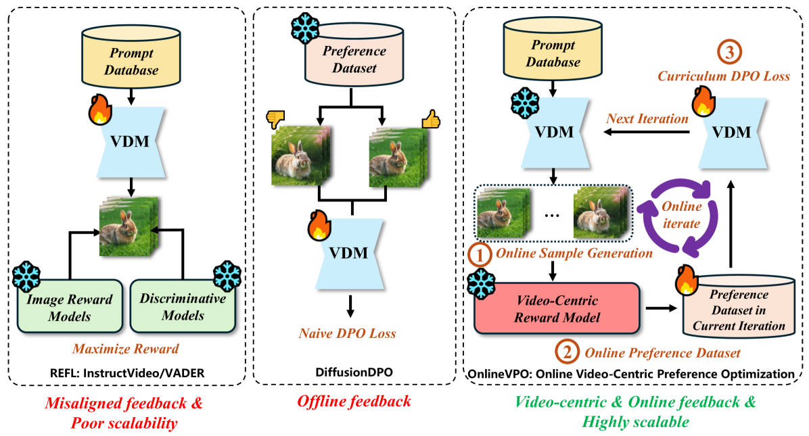
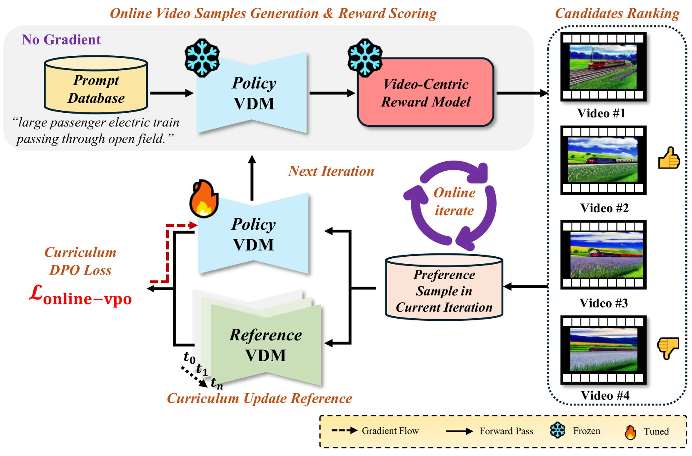

# OnlineVPO

## 📌 核心贡献

> 提出面向视频扩散模型的在线偏好优化框架 OnlineVPO，发现视频质量评估（VQA）模型比图像级奖励模型更好地对齐人类对视频质量的感知，并通过在线 DPO 和课程式参考模型更新实现了可扩展的视频偏好学习。

## 📖 摘要

Video diffusion models (VDMs) have demonstrated remarkable capabilities in text-to-video (T2V) generation. Despite their success, VDMs still suffer from degraded image quality and flickering artifacts. To address these issues, some approaches have introduced preference learning to exploit human feedback to enhance the video generation. However, these methods primarily adopt the routine in the image domain without an in-depth investigation into video-specific preference optimization. In this paper, we reexamine the design of the video preference learning from two key aspects: feedback source and feedback tuning methodology, and present OnlineVPO, a more efficient preference learning framework tailored specifically for VDMs. On the feedback source, we found that the image-level reward model commonly used in existing methods fails to provide a human-aligned video preference signal due to the modality gap. In contrast, video quality assessment (VQA) models show superior alignment with human perception of video quality. Building on this insight, we propose leveraging VQA models as a proxy of humans to provide more modality-aligned feedback for VDMs. Regarding the preference tuning methodology, we introduce an online DPO algorithm tailored for VDMs. It not only enjoys the benefits of superior scalability in optimizing videos with higher resolution and longer duration compared with the existing method, but also mitigates the insufficient optimization issue caused by off-policy learning via online preference generation and curriculum preference update designs. Extensive experiments on the open-source video-diffusion model demonstrate OnlineVPO as a simple yet effective and, more importantly, scalable preference learning algorithm for video diffusion models.

## 🔍 关键信息

| 字段 | 内容 |
|------|------|
| 机构 | HKU / ByteDance |
| 发表 | 2024-12-19 |
| 分类 | cs.CV |
| 链接 | [arXiv](https://arxiv.org/abs/2412.15159) |

## 📝 我的笔记

### 方法总览

### 动机与问题

现有视频扩散模型对齐方法存在两大问题：
1. **反馈源错位**：直接沿用图像级奖励模型（如 HPSv2, ImageReward）评估视频，忽略了时序一致性和运动质量等视频特有维度
2. **离线优化不足**：基于预收集偏好数据的 DPO 方法存在 off-policy 学习问题，且对高分辨率长视频扩展性差

### 核心方法

**1. 视频中心反馈源**

实验发现 VQA 模型与人类视频偏好的对齐度远优于图像奖励模型：

| 反馈模型 | MRR @1 |
|----------|--------|
| Aesthetic Score | 12.45% |
| ImageReward | 14.25% |
| HPSv2 | 24.60% |
| VideoScore | **41.38%** |

因此采用 VQA 模型（如 VideoScore）作为人类代理提供视频级反馈信号。

**2. 在线 DPO 算法**

标准 DPO 损失适配视频扩散：

$$\mathcal{L}_{\text{DPO}}(\theta) = \mathbb{E}_{(y_w, y_l) \sim \mathcal{D}}\left[\log \sigma\left(\beta \log \frac{\pi_\theta(y_w|x)}{\pi_{ref}(y_w|x)} - \beta \log \frac{\pi_\theta(y_l|x)}{\pi_{ref}(y_l|x)}\right)\right]$$

三个关键设计：
- **在线样本生成**：每步用当前策略模型采样多个视频 $\{v_1, v_2, ..., v_n\}$，通过 VQA 评分动态构建偏好对
- **课程式参考模型更新**：每 K=200 步将参考模型更新为当前对齐策略，支持持续探索
- **显存高效**：相比 ReFL 需要反向传播穿过采样过程，DPO 只需前向计算 log-probability

### 关键实验结果

**VBench 基准：**

| 模型 | Quality Score |
|------|--------------|
| VideoCrafter2 baseline | 80.78 |
| VideoCrafter2 + OnlineVPO | **82.91** |
| OpenSora baseline | 79.43 |
| OpenSora + OnlineVPO | **81.98** |

**扩展性优势：**

| 方法 | 最大分辨率/帧数 | GPU 显存余量 |
|------|----------------|-------------|
| ReFL | 240p/68帧 或 360p/17帧 | 受限 |
| OnlineVPO | **720p/68帧** | 25% 余量 |

OnlineVPO 的 DPO 范式避免了反向传播穿过采样过程，显著降低了显存需求，可扩展到高分辨率长视频。

### 总结

OnlineVPO 的核心发现是视频偏好优化需要"视频原生"的反馈信号，VQA 模型在这方面远优于图像奖励模型。在线 DPO + 课程式更新的组合既解决了 off-policy 问题，又保证了训练可扩展性。这是将偏好学习从图像领域迁移到视频领域时需要重新审视的关键设计选择。

## 🔗 相关论文

**基于/改进自：** [[DPO-Diffusion]]

**同方向：** [[DanceGRPO]], [[ReFL]], [[BranchGRPO]]
