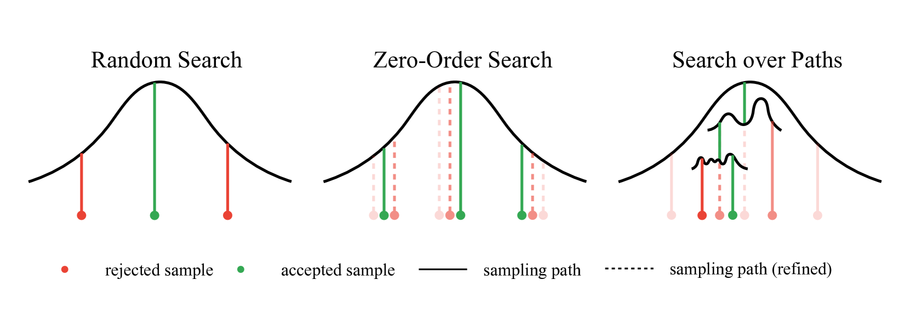
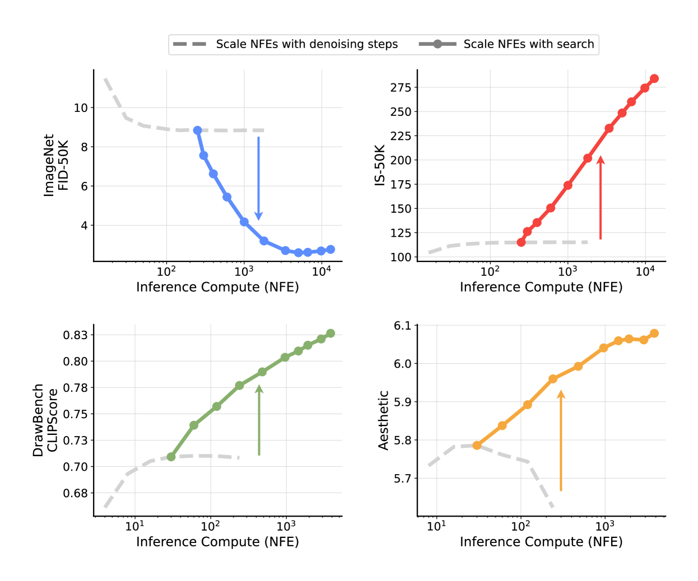
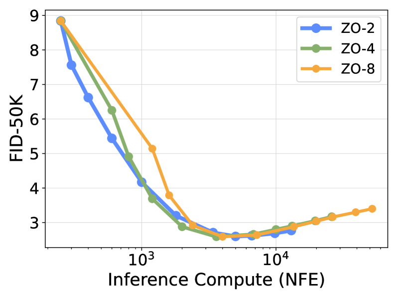

# InferenceTimeScaling

## 📌 核心贡献

> 系统性探索扩散模型在推理时的计算扩展规律：将生成过程建模为在噪声空间中的搜索问题，通过验证器反馈和搜索算法（随机搜索、零阶搜索、路径搜索）寻找更优初始噪声，证明增加推理时计算量可以持续提升生成质量。

## 📖 摘要

Generative models have made significant impacts across various domains, largely due to their ability to scale during training by increasing data, computational resources, and model size, a phenomenon characterized by the scaling laws. Recent research has begun to explore inference-time scaling behavior in Large Language Models (LLMs), revealing how performance can further improve with additional computation during inference. Unlike LLMs, diffusion models inherently possess the flexibility to adjust inference-time computation via the number of denoising steps, although the performance gains typically flatten after a few dozen. In this work, we explore the inference-time scaling behavior of diffusion models beyond increasing denoising steps and investigate how the generation performance can further improve with increased computation. Specifically, we consider a search problem aimed at identifying better noises for the diffusion sampling process. We structure the design space along two axes: the verifiers used to provide feedback, and the algorithms used to find better noise candidates. Through extensive experiments on class-conditioned and text-conditioned image generation benchmarks, our findings reveal that increasing inference-time compute leads to substantial improvements in the quality of samples generated by diffusion models, and with the complicated nature of images, combinations of the components in the framework can be specifically chosen to conform with different application scenario.

## 🔍 关键信息

| 字段 | 内容 |
|------|------|
| 机构 | Google / NYU / MIT |
| 发表 | 2025-01-16 |
| 分类 | cs.CV |
| 链接 | [arXiv](https://arxiv.org/abs/2501.09732) |

## 📝 我的笔记

### 方法总览

### 动机

- LLM 领域已展示推理时计算扩展的收益（如 best-of-N、tree search）
- 扩散模型虽然可以增加去噪步数，但收益在几十步后即趋于平坦
- 核心洞察：**噪声空间中存在更优的初始噪声**，增加推理计算应当用于搜索这些更好的噪声

### 框架设计

沿两个轴组织设计空间：

**轴 1：验证器（Verifiers）**

| 类型 | 描述 | 示例 |
|------|------|------|
| Oracle | 使用特权评估知识 | ground-truth 分类器 |
| Supervised | 预训练判别模型 | CLIP、DINO 分类器 |
| Self-supervised | 基于特征相似度 | 特征空间内的一致性 |
| Reward Model | 人类偏好对齐 | ImageReward、Aesthetic Score |

**轴 2：搜索算法（Search Algorithms）**

1. **Random Search（Best-of-N）**：独立采样 N 个噪声，选择验证器评分最高的结果
2. **Zero-Order Search**：在当前最优噪声的邻域内迭代搜索，逐步优化
3. **Search over Paths**：在扩散轨迹层面进行搜索和优化

### 关键结果

**ImageNet 类条件生成：**
- Oracle 验证器：随搜索预算增加，FID/IS 持续改善
- DINO 验证器在 FID 上优于 CLIP，同时保持 IS 增益
- Zero-Order Search（N=4）提供高效的局部优化

**DrawBench 文本条件生成：**
- ImageReward 验证器在各指标上展示一致的增益
- 验证器集成（Ensemble）展现鲁棒的泛化性
- Aesthetic 和 CLIP 验证器存在任务相关的权衡

**T2I-CompBench：**

| 验证器 | Complex 组合分数 |
|--------|-----------------|
| ImageReward | **0.3810** |
| Aesthetic | 微小提升 |

### 个人思考

- 将 LLM 的 inference-time scaling 思路迁移到扩散模型，方向很重要
- 关键洞察：噪声空间是可搜索的，验证器的选择决定了搜索的上限
- 实际应用中计算成本可能过高（N 倍推理），但可以作为质量上限的参考
- 与 RL-based 后训练（如 DDPO）形成互补：一个优化模型参数，一个优化推理过程
- 验证器的质量是瓶颈，reward hacking 问题在搜索预算大时可能加剧

## 🔗 相关论文

**基于/改进自：** --

**同方向：** [[DDPO]], [[ImageReward]]
