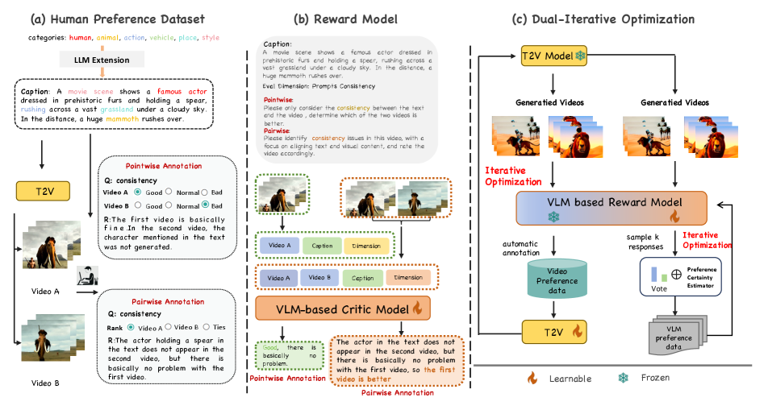
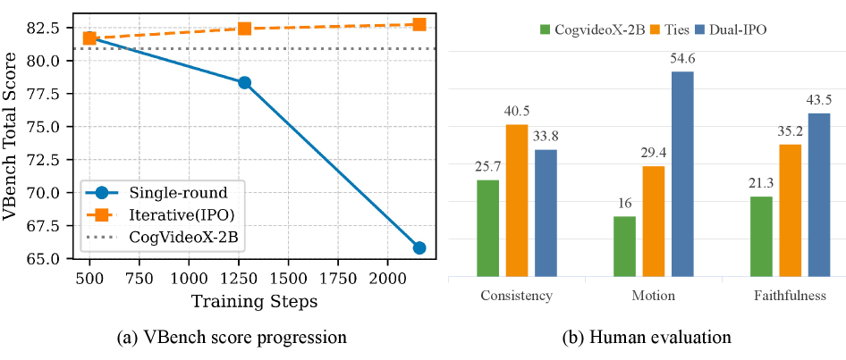

# Dual-IPO

## 📌 核心贡献

> 提出 Dual-IPO 迭代范式，交替优化奖励模型和视频生成模型，通过 CoT 引导推理、投票自一致性和偏好确定性估计确保可靠奖励信号，使 2B 参数模型超越 5B 模型，无需人工偏好标注。

## 📖 摘要

Recent advances in video generation have enabled thrilling experiences in producing realistic videos driven by scalable diffusion transformers. However, they usually fail to produce satisfactory outputs that are aligned to users' authentic demands and preferences. In this work, we introduce Dual-Iterative Optimization (Dual-IPO), an iterative paradigm that sequentially optimizes both the reward model and the video generation model for improved synthesis quality and human preference alignment. For the reward model, our framework ensures reliable and robust reward signals via CoT-guided reasoning, voting-based self-consistency, and preference certainty estimation. Given this, we optimize video foundation models with guidance of signals from reward model's feedback, thus improving the synthesis quality in subject consistency, motion smoothness and aesthetic quality, etc. The reward model and video generation model complement each other and are progressively improved in the multi-round iteration, without requiring tediously manual preference annotations. Comprehensive experiments demonstrate that the proposed Dual-IPO can effectively and consistently improve the video generation quality of base model with various architectures and sizes, even help a model with only 2B parameters surpass a 5B one. Moreover, our analysis experiments and ablation studies identify the rational of our systematic design and the efficacy of each component.

## 🔍 关键信息

| 字段 | 内容 |
|------|------|
| 机构 | Fudan University, Fuxi AI Lab |
| 发表 | 2025-02-04 |
| 分类 | cs.CV, cs.AI |
| 链接 | [arXiv](https://arxiv.org/abs/2502.02088) |

## 📝 我的笔记

### 方法总览

### 动机与问题

现有视频生成模型在主题一致性、运动流畅性和美学质量等方面仍难以满足用户真实需求。直接使用偏好优化面临两个挑战：
1. 奖励模型质量有限，可能提供不可靠的偏好信号
2. 人工偏好标注成本高昂且难以规模化

### 核心方法

**双迭代优化框架：**

**1. 自精炼偏好优化（SRPO）— 奖励模型侧**
- 使用 VLM（VILA 13B/40B）进行 CoT 引导标注
- 多路径推理 + 投票自一致性聚合偏好
- 偏好确定性估计器（PCE）过滤不确定样本，作为置信权重加入损失

**2. 迭代对齐 — 生成模型侧**
- 支持配对策略（Diffusion-DPO）和逐点策略（Diffusion-KTO）
- 动态生成视频 → 奖励模型评分 → 重构偏好数据集
- Diffusion-DPO 包含时间依赖权重和辅助 NLL 正则化
- Diffusion-KTO 使用效用优化 + 真实视频数据正则化

**迭代协同：**
- 奖励模型和生成模型在多轮迭代中互补提升
- 每轮生成更高质量的训练数据给对方

### 关键结果

| 模型 | VBench Total | Quality | Semantic |
|------|-------------|---------|----------|
| CogVideoX-2B baseline | 80.91 | 82.18 | 75.83 |
| CogVideoX-2B + Dual-IPO-3 | 82.74 | 83.92 | 78.00 |
| CogVideoX-5B + Dual-IPO-3 | 84.63 | 85.40 | 81.54 |
| Wan-1.3B + Dual-IPO-3 | 86.28 | 86.38 | 85.87 |

**奖励模型性能：**

| 奖励模型 | 人类偏好对齐准确率 |
|----------|-------------------|
| Dual-IPO RM | **81.33%** |
| VideoReward | 68.44% |
| VideoAlign | 65.21% |
| VideoScore | 63.58% |

- 2B 参数模型经 Dual-IPO 优化后超越 5B 模型
- 在运动自然性和文本对齐方面有明显提升
- 无需任何人工偏好标注

### 总结

Dual-IPO 的核心创新在于将奖励模型和生成模型的优化视为协同过程，通过迭代互相提升。CoT 引导推理和投票自一致性是确保偏好信号质量的关键。该方法跨架构（CogVideoX、Wan）和跨规模（1.3B-5B）的一致有效性证明了其通用性。

## 🔗 相关论文

**基于/改进自：** [[Diffusion-DPO]]

**同方向：** [[T2V-Turbo]], [[VideoAlign]]
