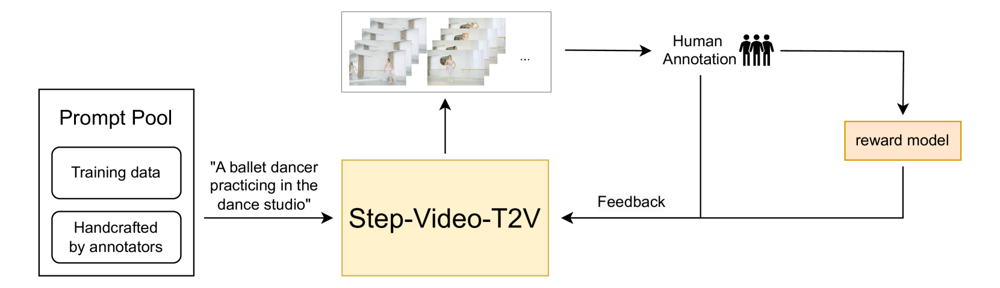
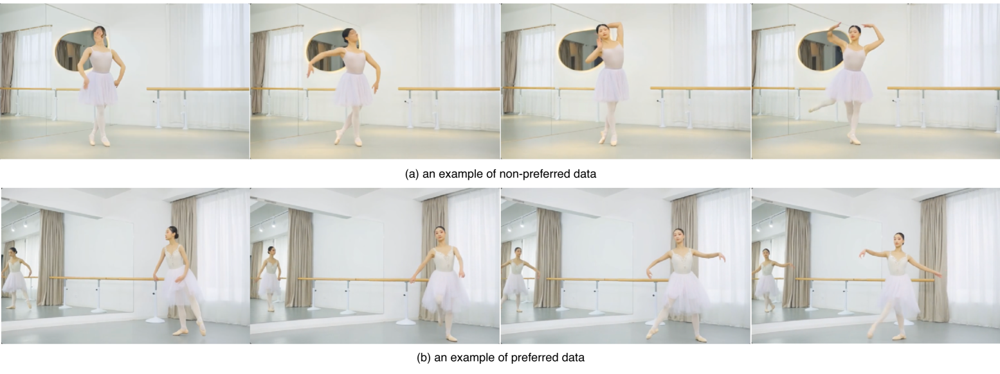

# Step-Video-T2V

## 📌 核心贡献

> 提出 30B 参数的文本生成视频基础模型，设计了完整的 Pretrain-SFT-DPO 后训练流水线，将 DPO 适配到 Flow Matching 框架，并引入 reward model 解决 DPO 训练饱和问题，显著提升视频生成质量。

## 📖 摘要

We present Step-Video-T2V, a state-of-the-art text-to-video pre-trained model with 30B parameters, capable of generating videos up to 204 frames. The model is built on several key designs. We propose a deep compression Variational Autoencoder, Video-VAE, achieving 16x16 spatial and 8x temporal compression ratios, while maintaining exceptional video reconstruction quality. We also build bilingual text encoders for both English and Chinese. We employ a DiT with 3D full attention trained via Flow Matching. Furthermore, we propose a video-based DPO approach, Video-DPO, which effectively reduces artifacts and improves the visual quality of the generated videos. We also propose a Step-Video-T2V-Eval benchmark for evaluating text-to-video generation, with results available at GitHub and an online platform.

## 🔍 关键信息

| 字段 | 内容 |
|------|------|
| 机构 | StepFun |
| 发表 | 2025-02-14 |
| 分类 | cs.CV, cs.CL |
| 链接 | [arXiv](https://arxiv.org/abs/2502.10248) |

## 📝 我的笔记

### 方法总览

Step-Video-T2V 是一个 30B 参数的文本生成视频模型，核心组件包括：

- **Video-VAE**：深度压缩变分自编码器，实现 8x16x16（时间x空间）压缩比
- **双语文本编码器**：支持中英文 prompt
- **DiT with 3D Full Attention**：48 层、48 注意力头、128 维头维度，FFN 维度 24,576
- **Flow Matching 训练**：基于线性插值的速度场预测

### 训练流水线

模型采用四阶段级联训练策略：

| 阶段 | 名称 | 目标 |
|------|------|------|
| Step-1 | T2I 预训练 | 获取丰富的视觉先验知识 |
| Step-2 | T2VI 预训练 | 低分辨率下学习运动动力学 |
| Step-3 | T2V 精调 (SFT) | 高质量视频 + 精确 caption 进行精调，控制生成风格 |
| Step-4 | DPO 训练 | 基于人类偏好对齐，减少伪影、提升视觉质量 |

关键观察：T2I 预训练对于视频模型获取丰富视觉知识至关重要；低分辨率 T2V 预训练对学习运动动力学不可或缺。

### Flow Matching 训练目标

模型基于 Flow Matching 框架训练，核心公式：

采样 $X_0 \sim \mathcal{N}(0, 1)$，随机时间步 $t \in [0, 1]$，线性插值：

$$X_t = (1-t) \cdot X_0 + t \cdot X_1$$

真实速度场：

$$V_t = \frac{dX_t}{dt} = X_1 - X_0$$

训练损失：

$$\mathcal{L} = \mathbb{E}_{t, X_0, X_1, y} \left[ \| u(X_t, y, t; \theta) - V_t \|^2 \right]$$

推理时通过 ODE 求解：

$$X_1 = \sum_{i=0}^{n-1} u(X_{t_i}, y, t_i; \theta) \cdot (t_{i+1} - t_i)$$

### Video-DPO：Flow Matching 适配的 DPO

#### DPO 损失函数

将 Diffusion-DPO 扩展到 Flow Matching 框架，损失函数为：

$$\mathcal{L}_{\text{DPO}} = -\mathbb{E}_{(y, x_w, x_l) \sim \mathcal{D}} \left[ \log \sigma \left( \beta \left( \log \frac{\pi_\theta(x_w|y)}{\pi_{\text{ref}}(x_w|y)} - \log \frac{\pi_\theta(x_l|y)}{\pi_{\text{ref}}(x_l|y)} \right) \right) \right]$$

其中 $\pi_\theta$ 为当前策略，$\pi_{\text{ref}}$ 为参考策略，$x_w / x_l$ 分别为偏好/非偏好样本，$y$ 为条件 prompt。

梯度公式（令 $z$ 为括号内项）：

$$\frac{\partial \mathcal{L}_{\text{DPO}}}{\partial \theta} \propto -\beta (1 - \sigma(\beta z)) \cdot \frac{\partial z}{\partial \theta}$$

#### 关键适配：$\beta$ 缩小 + 学习率增大

先前工作（如 Diffusion-DPO）使用较大的 $\beta$（约 5,000），但在 Flow Matching 中当 $z < 0$ 时会导致梯度爆炸。Step-Video 的解决方案是**降低 $\beta$ 并增大学习率**，实现更快收敛。

#### 训练对齐

DPO 训练中**固定初始噪声和时间步**，确保正负样本之间的对齐一致性。

### 人类偏好数据收集

偏好数据收集流程：

1. **Prompt 来源**：随机选取训练数据子集 + 标注员根据「模拟真实用户交互模式」的指南合成 prompt
2. **视频生成**：对每个 prompt 使用不同种子生成多个视频
3. **人工标注**：标注员对视频进行偏好排序
4. **质量控制**：由质量控制人员全程监控标注过程

### Reward Model 应对 DPO 饱和

DPO 训练中的一个关键挑战：当模型能轻松区分正负样本时，**改进会饱和**。这是因为训练数据来自早期模型迭代，与当前演化后的策略不再对齐。

解决方案：

1. 使用人类标注反馈数据**训练 reward model**
2. Reward model **动态评估**训练过程中新生成样本的质量（on-policy 评分）
3. 对训练数据进行**实时打分和排序**，提升数据利用效率
4. Reward model **定期用新标注数据微调**，保持与当前策略的对齐

这一机制本质上将 DPO 从 off-policy 转向 on-policy，通过持续更新偏好数据来防止训练饱和。

### 模型配置

| 配置 | 参数 |
|------|------|
| 总参数量 | 30B |
| 层数 | 48 |
| 注意力头数 | 48 |
| 头维度 | 128 |
| FFN 维度 | 24,576 |
| 交叉注意力维度 | (6,144, 1,024) |
| 激活函数 | GELU-approx |
| 归一化 | RMSNorm |
| 位置编码 | RoPE-3D |
| 最大帧数 | 204 |
| 输出分辨率 | 544 x 992 |
| VAE 压缩比 | 8x16x16 (时间x空间) |

### 关键结果

- 在 Step-Video-T2V-Eval benchmark（128 条 prompt，11 个类别）上与 Sora、Gen-3、Kling、Hailuo 等商业模型和 HunyuanVideo、CogVideoX 等开源模型进行对比
- Video-DPO 有效减少伪影，确保更平滑、更真实的视频输出
- Turbo 版本通过蒸馏实现 10x 加速（10 NFE vs. 50 NFE），生成质量基本不降
- 训练基础设施：数千张 NVIDIA H800 GPU，1.6Tbps RoCEv2 网络，32% MFU，一个月内 99% 有效训练时间

### 总结性评价

Step-Video-T2V 的核心贡献在于将完整的后训练流水线（SFT + DPO + Reward Model）系统性地应用于大规模视频生成模型。其 Video-DPO 方法对 Flow Matching 的适配（$\beta$ 调整策略）和通过 reward model 解决 DPO 饱和问题的思路具有实用价值。不过论文在后训练效果的定量消融方面披露有限，reward model 的具体架构和训练细节也未充分公开，更多是工程实践层面的经验总结。

## 🔗 相关论文

**基于/改进自：** [[Diffusion-DPO]]

**同方向：** [[HunyuanVideo]], [[Seedance]]
