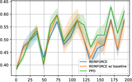

# LOOP

## 📌 核心贡献

> 提出 Leave-One-Out PPO（LOOP），系统分析 REINFORCE 与 PPO 在扩散模型微调中的样本效率与性能权衡，结合 REINFORCE 的多样本方差缩减技术与 PPO 的裁剪重要性采样，在多种黑盒目标上实现更优的效率-性能平衡。

## 📖 摘要

Reinforcement learning (RL)-based fine-tuning has emerged as a powerful approach for aligning diffusion models with black-box objectives. Proximal policy optimization (PPO) is a popular choice of method for policy optimization. While effective in terms of performance and sample complexity, PPO is highly sensitive to hyper-parameters and involves substantial computational overhead. REINFORCE, on the other hand, mitigates some implementation complexities such as high memory overhead and sensitive hyper-parameter tuning, but has suboptimal performance due to high variance and crucially sample inefficiency, which is the primary notion of efficiency we study in this work. While the variance of the REINFORCE can be reduced by sampling multiple actions per input prompt and using a baseline correction term, it still suffers from sample inefficiency. To address these challenges, we systematically analyze the sample efficiency-effectiveness trade-off between REINFORCE and PPO, and propose leave-one-out PPO (LOOP), a novel RL for diffusion fine-tuning method. LOOP combines variance reduction techniques from REINFORCE, such as sampling multiple actions per input prompt and a baseline correction term, with the robustness and sample efficiency of PPO via clipping and importance sampling. Our results demonstrate that LOOP effectively improves diffusion models on various black-box objectives, and achieves a better balance between sample efficiency and final performance.

## 🔍 关键信息

| 字段 | 内容 |
|------|------|
| 机构 | Meta AI / University of Amsterdam / Radboud University |
| 发表 | 2025-03-02 |
| 分类 | cs.LG, cs.AI, cs.CV |
| 链接 | [arXiv](https://arxiv.org/abs/2503.00897) |

## 📝 我的笔记

### 方法总览

### 动机

现有扩散模型 RL 微调方法存在效率与性能的权衡：
- **PPO（如 DDPO）**：样本高效但超参数敏感、计算开销大（需维护 value model）
- **REINFORCE**：实现简单、内存低，但方差大、样本效率差

核心问题：能否结合两者优势？

### 方法

**1. Leave-One-Out 基线**

对每个 prompt 采样 $K$ 条轨迹，第 $i$ 条轨迹的基线为其余 $K-1$ 条的平均奖励：

$$b^i = \frac{1}{K-1} \sum_{j \neq i} r(\mathbf{x}_0^j)$$

这是一个无偏的方差缩减估计器。

**2. PPO 裁剪 + 重要性采样**

将 REINFORCE 的多样本策略与 PPO 的裁剪机制结合：

$$\mathcal{L}_{\text{LOOP}} = \frac{1}{K} \sum_{i=1}^{K} \sum_{t} \min\left(\frac{\pi_\theta}{\pi_{\text{old}}} \hat{A}_i, \text{clip}\left(\frac{\pi_\theta}{\pi_{\text{old}}}, 1-\epsilon, 1+\epsilon\right) \hat{A}_i\right)$$

其中 $\hat{A}_i = r(\mathbf{x}_0^i) - b^i$ 为优势函数估计。

**3. 关键设计选择**
- 多样本采样（K=4）提供组内对比信号
- Leave-one-out 基线无需额外 critic 网络
- PPO 裁剪防止策略更新过大，保证训练稳定性
- 重要性采样允许复用旧策略样本，提升样本效率

### 关键结果

**T2I-CompBench 属性绑定（Table 2）：**

| 方法 | Color | Shape | Texture | Spatial |
|------|-------|-------|---------|---------|
| SD v2 (base) | 0.5765 | 0.4495 | 0.5882 | 0.1496 |
| DDPO | 0.6821 | 0.5656 | 0.6909 | 0.1961 |
| REINFORCE (k=4) | 0.7466 | 0.6141 | 0.7200 | 0.1969 |
| PPO | 0.7542 | 0.6402 | 0.7374 | 0.2112 |
| **LOOP (k=4)** | **0.7859** | **0.6676** | **0.7519** | **0.2137** |

**美学评分任务（Table 3）：**

| 方法 | Aesthetic Score |
|------|----------------|
| SD v2 (base) | 5.2493 |
| DDPO | 6.6795 |
| **LOOP (k=4)** | **7.7061** |

### 个人思考

- 方法本质是 GRPO 的一个变体（leave-one-out baseline + PPO clipping），与 DanceGRPO 思路相似
- 系统性的消融实验很有价值，清晰展示了每个组件的贡献
- 样本效率的定义和度量方式值得参考

## 🔗 相关论文

**基于/改进自：** [[DDPO]]

**同方向：** [[DDPO]], [[DPOK]], [[DanceGRPO]], [[AlignProp]]
