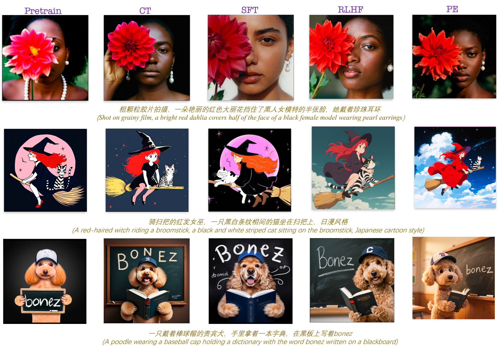
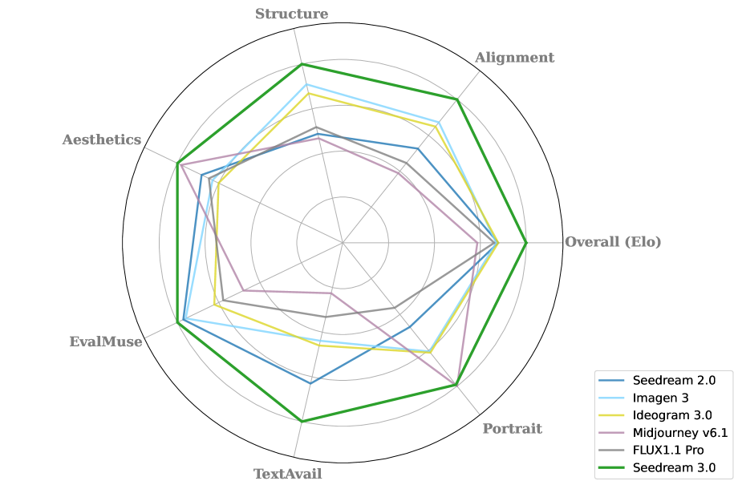

# Seedream 3.0

## 📌 核心贡献

> 提出高性能中英双语图像生成基座模型 Seedream 3.0，通过 VLM-based 奖励模型的 scaling（1B 到 >20B 参数）驱动四阶段后训练流水线（CT->SFT->RLHF->PE），在 prompt 对齐、排版、视觉美学和分辨率能力上全面超越前代及竞品，同时实现 4-8 倍推理加速。

## 📖 摘要

We present Seedream 3.0, a high-performance Chinese-English bilingual image generation foundation model that addresses challenges in its predecessor through improvements in prompt alignment, typography, visual aesthetics, and resolution capabilities. The team employed dataset expansion, mixed-resolution training, and VLM-based reward models. Seedream 3.0 pioneers a novel acceleration paradigm achieving 4-8x speedup while enhancing text-rendering and supporting up to 2K native resolution output.

## 🔍 关键信息

| 字段 | 内容 |
|------|------|
| 机构 | ByteDance Seed |
| 发表 | 2025-04-15 |
| 分类 | cs.CV |
| 链接 | [arXiv](https://arxiv.org/abs/2504.11346) |

## 📝 我的笔记

### 方法总览

Seedream 3.0 是 ByteDance Seed 团队的第三代中英双语文生图基座模型，基于 MMDiT 架构，采用 flow matching 训练范式。核心改进集中在三个方面：(1) 数据构建与扩展；(2) VLM-based 奖励模型 scaling；(3) 四阶段后训练流水线。

### 模型架构与训练目标

基座模型继承 Seedream 2.0 的 MMDiT 架构，联合处理图像和文本 token。训练目标结合 flow matching loss 和表征对齐损失（REPA）：

$$\mathcal{L} = \mathbb{E}\left[\left\|\mathbf{v}_\theta(\mathbf{x}_t, t; \mathcal{C}) - \frac{d\mathbf{x}_t}{dt}\right\|_2^2\right] + \lambda \mathcal{L}_{\text{REPA}}$$

其中 $\lambda = 0.5$，REPA loss 计算 MMDiT 中间特征与预训练 DINOv2-L 视觉编码器特征之间的余弦距离，增强生成图像的语义一致性。

### 奖励模型（RM）设计与 Scaling

**从 CLIP 到 VLM 的范式转换：** Seedream 3.0 的关键创新之一是将奖励模型从 Seedream 2.0 的 CLIP-based 方案升级为基于 VLM 的生成式奖励建模框架。具体做法是将评估指令（如美学质量、prompt 对齐度等）显式构造为查询，通过归一化 "Yes" 响应 token 的概率来推导奖励值。

**Scaling 效果：** 团队系统地将奖励模型从 1B 参数扩展到 >20B 参数，观察到了 reward model scaling 的涌现现象——奖励模型容量的增加与奖励建模性能的提升呈正相关。更大的 RM 能更准确地捕捉人类偏好的细微差异，进而提升后训练的对齐质量。

**RM 的多重用途：**
- **数据筛选：** 用 RM 评分过滤低质量训练数据
- **RLHF 信号：** 在 RLHF 阶段提供奖励信号指导模型优化
- **质量评估：** 作为自动评估工具衡量生成质量

### 后训练流水线：CT -> SFT -> RLHF -> PE

Seedream 3.0 采用四阶段后训练流水线，每一阶段逐步提升模型能力：

**1. Continuing Training (CT) — 持续训练**
- 数据集扩展，引入缺陷感知训练范式
- 使用专门的缺陷检测器（基于 15,000 张人工标注样本训练）识别图像中的问题区域
- 当缺陷面积 < 图像面积的 20% 时保留样本，通过空间注意力掩码机制处理，数据集扩增 21.7%
- 双轴数据采样：视觉形态维度（层次聚类）+ 语义分布维度（TF-IDF）

**2. Supervised Fine-Tuning (SFT) — 监督微调**
- 使用多版本美学描述模型（aesthetic caption model）生成精细化的训练描述
- 描述涵盖美学、风格、布局等专业领域
- 分辨率从 512x512 到 2048x2048 的混合分辨率训练

**3. Human Feedback Alignment (RLHF) — 人类反馈对齐**
- 利用 VLM-based 奖励模型（>20B 参数）提供奖励信号
- 基于生成式 RM 的偏好对齐优化
- 技术报告中未公开具体的 RLHF loss 公式和策略梯度细节

**4. Prompt Engineering (PE) — 提示工程**
- 最终优化阶段，进一步提升生成质量
- 注意：Seedream 3.0 省略了 Refiner 阶段，因为模型本身能够直接在任意分辨率（512x512 到 2048x2048）生成高质量图像

### 混合分辨率训练

- **两阶段策略：** 先在平均 256x256 分辨率（多种宽高比）预训练，再在 512x512 到 2048x2048 高分辨率图像上微调
- **Cross-Modality RoPE：** 将文本 token 视为形状 [1, L] 的 2D token，施加 2D RoPE，文本 token 的列位置 ID 在对应图像 token 之后连续分配，增强视觉-文本对齐和文字渲染精度
- **分辨率感知时间步采样：** 高分辨率训练时移动分布，增加低 SNR 采样概率
- **Size Embedding：** 将目标分辨率作为额外条件注入模型

### 推理加速

提出 Consistent Noise Expectation 框架，通过引入从预训练模型估计的统一噪声期望向量，使每个样本能够沿各自的自适应生成轨迹运行。结合 Importance-Aware Timestep Sampling（基于 Stochastic Stein Discrepancy），实现 4-8 倍加速，1K 分辨率图像生成仅需约 3 秒（不含 PE 阶段）。

### 关键定量结果

**自动评估指标（Table 1）：**

| 指标 | FLUX1.1 | Ideogram 2.0 | MJ v6.1 | Imagen 3 | Seedream 2.0 | Seedream 3.0 |
|------|---------|-------------|---------|----------|--------------|--------------|
| EvalMuse | 0.617 | 0.632 | 0.583 | 0.680 | 0.684 | **0.694** |
| HPSv2 | 0.2946 | 0.2932 | 0.2850 | 0.2951 | 0.2994 | **0.3011** |
| MPS | 13.11 | 13.01 | 13.67 | 13.33 | 13.61 | **13.93** |
| Internal-Align | 27.75 | 27.92 | 28.93 | 28.75 | 29.05 | **30.16** |
| Internal-Aes | 25.15 | 26.40 | 27.07 | 26.72 | 26.97 | **27.68** |

Seedream 3.0 在所有指标上均排名第一。

**文字渲染能力：**

| 语言 | 可用率 | 准确率 | 命中率 |
|------|--------|--------|--------|
| 中文 | 94% | 90% | 88% |
| 英文 | 94% | 93% | 91% |

中文文字可用率相比 Seedream 2.0 提升 16%。

**Artificial Analysis Arena：** ELO 评分 1158，在超过 50,000 轮评估中表现领先。

**人像评估：** Seedream 3.0 与 Midjourney v6.1 并列第一。

### 与 RewardDance 的关系

Seedream 3.0 技术报告中未直接提及 RewardDance，但两者出自同一团队（ByteDance Seed）。RewardDance 专注于利用奖励模型指导扩散模型的后训练优化，而 Seedream 3.0 中 VLM-based RM 驱动 RLHF 的思路与 RewardDance 的核心理念高度一致——均强调 RM 在生成模型对齐中的关键作用。Seedream 3.0 的 RM scaling 实践可视为这一方向的工业级验证。

### 总结性评价

Seedream 3.0 是一份工业级系统技术报告，其核心贡献不在于单一方法论的创新，而在于系统性地整合了数据工程、RM scaling、多阶段后训练等技术路线。特别值得关注的是：

1. **RM Scaling 的涌现性：** 从 1B 到 >20B 的 VLM-based RM 展现出持续的性能提升，说明奖励模型的 scaling law 在图像生成领域同样成立
2. **去 Refiner 设计：** 模型直接在 512-2048 分辨率范围生成高质量图像，简化了生产部署
3. **技术细节的保留：** 报告在 RLHF 具体算法、RM 架构细节等方面有所保留，未公开核心实现
4. **中英双语优势：** 94% 的中英文字渲染可用率是商业化的重要卖点

## 🔗 相关论文

**基于/改进自：** [[Seedream 2.0]]

**同方向：** [[RewardDance]], [[Diffusion-DPO]], [[HPSv3]]
