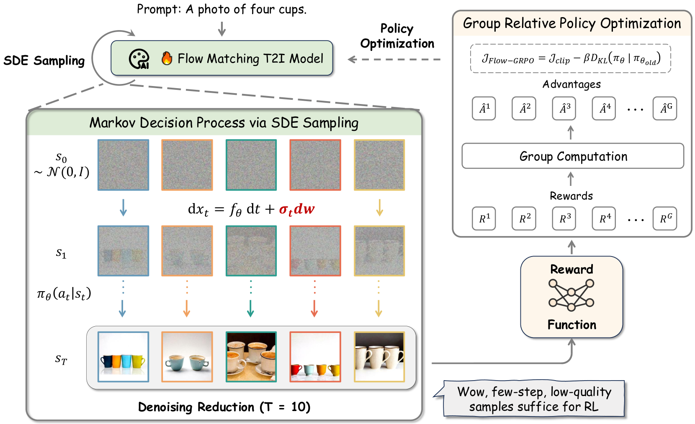
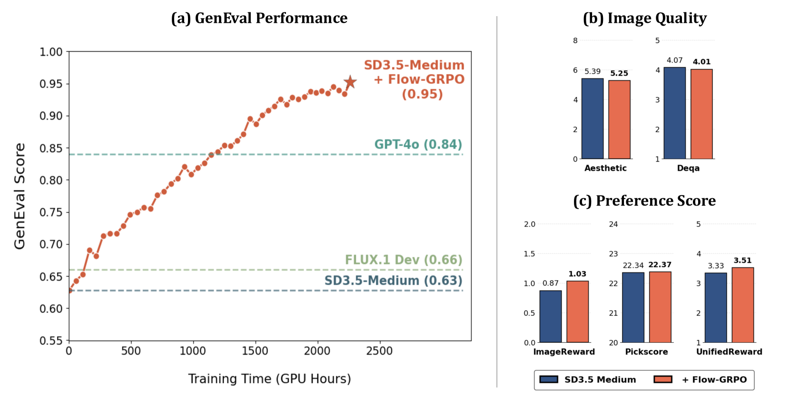
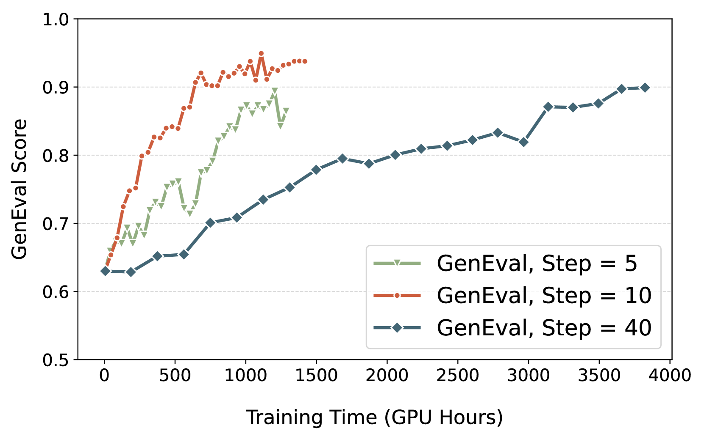

# Flow-GRPO

## 📌 核心贡献

> 首次将在线策略梯度强化学习（GRPO）集成到 Flow Matching 模型中，通过 ODE-to-SDE 转换实现随机探索，并提出 Denoising Reduction 策略大幅提升训练效率，在 GenEval 上将组合生成准确率从 63% 提升至 95%。

## 📖 摘要

We propose Flow-GRPO, the first method to integrate online policy gradient reinforcement learning into flow matching models. Key strategies include: (1) an ODE-to-SDE conversion transforming deterministic equations into stochastic equivalents matching marginal distributions, enabling RL exploration; (2) Denoising Reduction strategy reducing training denoising steps while maintaining inference steps, improving efficiency. Flow-GRPO achieves 95% GenEval accuracy (up from 63%), 92% text rendering accuracy (up from 59%), and substantial human preference gains. Notably, minimal reward hacking occurred — rewards increased without appreciable image quality or diversity degradation.

## 🔍 关键信息

| 字段 | 内容 |
|------|------|
| 机构 | CUHK MMLab / Kuaishou Technology / Shanghai AI Lab |
| 发表 | 2025-05-08 |
| 分类 | cs.CV, cs.AI |
| 链接 | [arXiv](https://arxiv.org/abs/2505.05470) |

## 📝 我的笔记

### 方法总览

### 动机与问题

Flow Matching 模型（如 SD3, FLUX）使用确定性 ODE 采样，无法直接应用需要随机探索的 RL 算法。现有对齐方法（DPO, ReFL）要么是离线的，要么只微调单步预测，难以充分优化整个生成过程。

### 核心方法

**1. ODE-to-SDE 转换**

将确定性 flow ODE 转换为等价 SDE，保持边际分布不变的同时引入随机性：

$$dx_t = \left[v_t(x_t) + \frac{\sigma_t^2}{2t}\left(x_t + (1-t)v_t(x_t)\right)\right]dt + \sigma_t dw$$

其中 $\sigma_t = a\sqrt{t/(1-t)}$，参数 $a$ 控制噪声强度（最优设置 $a=0.7$）。该转换使 Flow Matching 可以被建模为 MDP，每个去噪步对应一个 action。

**2. GRPO 目标函数**

$$J_{\text{Flow-GRPO}} = \mathbb{E}\left[\frac{1}{G}\sum_{i}\frac{1}{T}\sum_{t}\left(\min\left(r_t^i(\theta)\hat{A}^i, \text{clip}(r_t^i(\theta), 1-\varepsilon, 1+\varepsilon)\hat{A}^i\right) - \beta D_{KL}(\pi_\theta \| \pi_{ref})\right)\right]$$

优势估计通过组内归一化：$\hat{A}^i = (R^i - \text{mean}(R)) / \text{std}(R)$

KL 散度有闭式解：

$$D_{KL}(\pi_\theta \| \pi_{ref}) = \frac{\Delta t}{2}\left(\frac{\sigma_t(1-t)}{2t} + \frac{1}{\sigma_t}\right)^2 \|v_\theta - v_{ref}\|^2$$

**3. Denoising Reduction**

训练时仅使用 T=10 步去噪，推理时使用 T=40 步，实现 4 倍训练加速且不影响性能。关键发现是低步数的粗糙样本已足以提供有效的 RL 信号。

### 关键实验结果

**GenEval 基准（SD3.5-Medium）：**

| 任务 | Baseline | Flow-GRPO |
|------|----------|-----------|
| Overall | 0.63 | **0.95** |
| Counting | 0.50 | **0.95** |
| Position | 0.24 | **0.99** |
| Attribute Binding | 0.52 | **0.86** |

**多任务结果：**

| 任务 | 指标 | Baseline | Flow-GRPO (w/ KL) |
|------|------|----------|-------------------|
| GenEval | Overall | 0.63 | **0.95** |
| OCR Accuracy | — | 0.59 | **0.92** |
| PickScore | Reward | 21.72 | **23.31** |

**质量保持（DrawBench）：**

| 指标 | Baseline | Flow-GRPO |
|------|----------|-----------|
| Aesthetic Score | 5.39 | 5.25 |
| PickScore | 22.34 | 22.37 |
| ImageReward | 0.87 | **1.03** |

### 总结

Flow-GRPO 的核心贡献在于解决了 Flow Matching 模型无法直接进行 RL 训练的问题。ODE-to-SDE 转换理论优雅，Denoising Reduction 实用性强。GenEval 上的提升幅度巨大（63% -> 95%），且通过 KL 正则化有效避免了 reward hacking。

## 🔗 相关论文

**基于/改进自：** [[DanceGRPO]]

**同方向：** [[DDPO]], [[ReFL]], [[Diffusion-DPO]]
