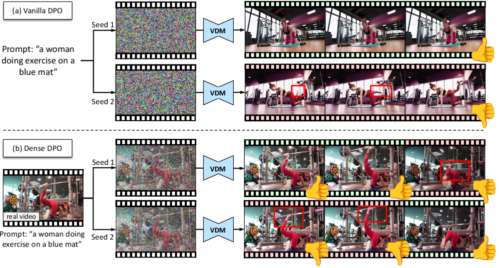
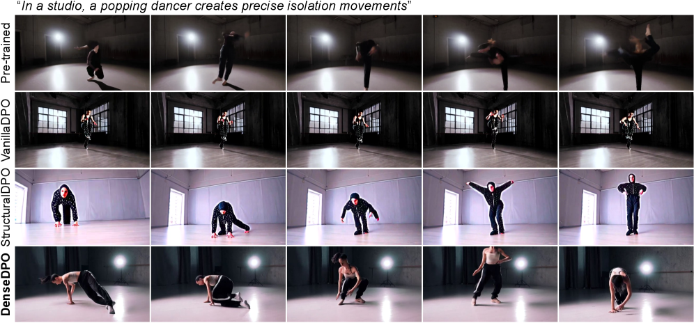
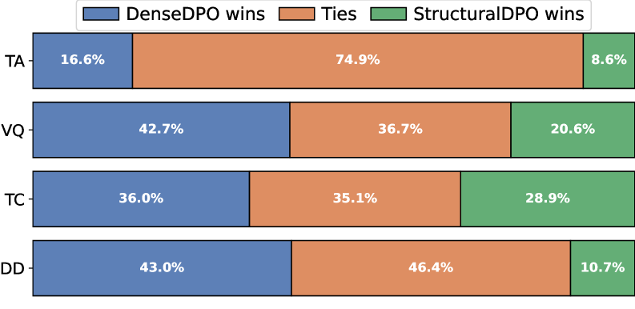

# DenseDPO

## 📌 核心贡献

> 提出面向视频扩散模型的细粒度时序偏好优化方法 DenseDPO：通过对齐视频对生成消除运动偏差，并将偏好标注从视频级别细化到片段级别，仅需 1/3 标注数据即可大幅改善运动生成质量；同时证明 VLM 可自动完成片段级偏好标注。

## 📖 摘要

Direct Preference Optimization (DPO) has recently been applied as a post-training technique for text-to-video diffusion models. To obtain training data, annotators are asked to provide preferences between two videos generated from independent noise. However, this approach prohibits fine-grained comparisons, and we point out that it biases the annotators towards low-motion clips as they often contain fewer visual artifacts. In this work, we introduce DenseDPO, a method that addresses these shortcomings by making three contributions. First, we create each video pair for DPO by denoising corrupted copies of a ground truth video. This results in aligned pairs with similar motion structures while differing in local details, effectively neutralizing the motion bias. Second, we leverage the resulting temporal alignment to label preferences on short segments rather than entire clips, yielding a denser and more precise learning signal. With only one-third of the labeled data, DenseDPO greatly improves motion generation over vanilla DPO, while matching it in text alignment, visual quality, and temporal consistency. Finally, we show that DenseDPO unlocks automatic preference annotation using off-the-shelf Vision Language Models (VLMs): GPT accurately predicts segment-level preferences similar to task-specifically fine-tuned video reward models, and DenseDPO trained on these labels achieves performance close to using human labels.

## 🔍 关键信息

| 字段 | 内容 |
|------|------|
| 机构 | Snap Research / University of Toronto / Vector Institute |
| 发表 | 2025-06-04 |
| 分类 | cs.CV |
| 链接 | [arXiv](https://arxiv.org/abs/2506.03517) |

## 📝 我的笔记

### 方法总览

### 动机

传统 Video DPO 存在两个核心问题：
1. **运动偏差（Motion Bias）**：从独立噪声生成的视频对，运动结构差异大，标注者倾向于选择低运动量（因伪影少）的视频，导致训练后模型生成静态视频
2. **粗粒度标注**：视频级别的单一偏好标签无法捕捉局部细节差异，学习信号稀疏且不精确

### 方法

DenseDPO 的三个核心设计：

**1. 对齐视频对生成（Aligned Pair Generation）**

从真实视频 $\mathbf{x}_0$ 出发，通过 forward diffusion 添加噪声后再去噪，生成两个结构对齐的视频：

$$\mathbf{x}_T^{(i)} = \sqrt{\bar{\alpha}_T} \mathbf{x}_0 + \sqrt{1 - \bar{\alpha}_T} \boldsymbol{\epsilon}^{(i)}, \quad i \in \{0, 1\}$$

引导参数 $\eta$ 控制生成视频与原始视频的相似度。两个视频共享运动结构，仅在局部细节上有差异，有效消除运动偏差。

**2. 片段级偏好标注（Segment-Level Preferences）**

将视频切分为 1 秒的短片段，对每个片段独立标注偏好，产生更密集和精确的学习信号。

**3. DenseDPO 损失函数**

$$\mathcal{L}(\theta) = -\mathbb{E} \log \sigma\left(-\beta \sum_f l(\mathbf{x}^0_f, \mathbf{x}^1_f) \cdot \left(s(\mathbf{x}^0, c, t, \theta)_f - s(\mathbf{x}^1, c, t, \theta)_f\right)\right)$$

其中 $l(\mathbf{x}^0_f, \mathbf{x}^1_f) \in \{-1, +1\}$ 为片段 $f$ 的偏好标签，$s$ 为隐式奖励得分。

**4. VLM 自动标注**

利用 GPT-4o 对短片段进行偏好判断，通过多数投票聚合结果，性能接近人工标注。

### 关键结果

| 方法 | Dynamic Degree | Text Alignment | Visual Quality |
|------|---------------|----------------|----------------|
| Pre-trained | 80.25 | 0.860 | 0.376 |
| VanillaDPO | 80.25 | 0.863 | 0.376 |
| DenseDPO | **85.38** | 0.863 | 0.376 |

- DenseDPO 使用仅 1/3 的标注数据即超越 VanillaDPO 的运动生成质量
- 在文本对齐、视觉质量和时序一致性上与 VanillaDPO 持平
- VLM 自动标注版本性能接近人工标注版本

### 个人思考

- 对齐视频对生成的思路很巧妙，从根本上解决了运动偏差问题
- 片段级标注是自然的扩展，但仅对时序对齐的视频对可行
- VLM 自动标注的可行性说明短片段比长视频更适合自动评估

## 🔗 相关论文

**基于/改进自：** [[DPO-Diffusion]]

**同方向：** [[DPO-Diffusion]], [[DDPO]]
