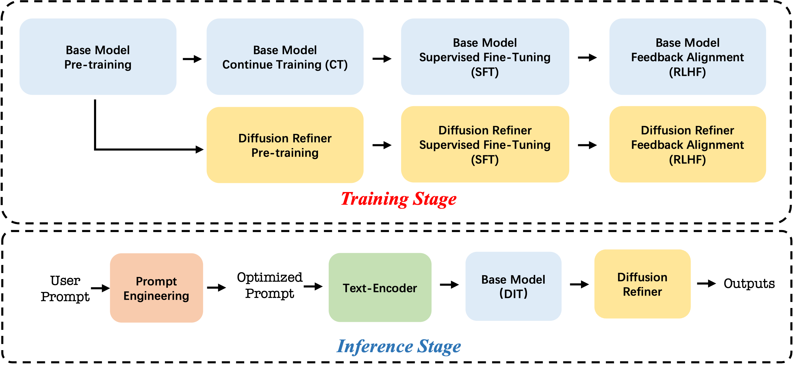

# Seedance 1.0

## 📌 核心贡献

> 提出 Seedance 1.0 视频生成系统，通过 CT-SFT-RLHF 三阶段后训练流程和三维度专用 Reward Model（基础能力/运动质量/美学），结合 10 倍推理加速蒸馏策略，在文本生成视频和图像生成视频任务上取得领先性能。

## 📖 摘要

Notable breakthroughs in diffusion modeling have propelled rapid improvements in video generation, yet current foundational model still face critical challenges in simultaneously balancing prompt following, motion plausibility, and visual quality. In this report, we introduce Seedance 1.0, a high-performance and inference-efficient video foundation generation model that integrates several core technical improvements. First, we develop a carefully optimized Diffusion Transformer (DiT) architecture with decoupled spatial-temporal layers and a high-compression VAE, enabling efficient training and high-quality video synthesis. Second, we design a multi-stage post-training pipeline—spanning continue training, supervised fine-tuning, and reinforcement learning from human feedback—to progressively enhance the model's prompt following, visual quality, and motion expressiveness. Third, we achieve a 10× inference speedup through a combined strategy of multi-stage distillation (trajectory segmented consistency distillation, score distillation, and adversarial training) and system-level optimization. Seedance 1.0 achieves top ranking on the Artificial Analysis video generation leaderboard, leading in both text-to-video and image-to-video tasks.

## 🔍 关键信息

| 字段 | 内容 |
|------|------|
| 机构 | ByteDance Seed |
| 发表 | 2025-06-10 |
| 分类 | cs.CV |
| 链接 | [arXiv](https://arxiv.org/abs/2506.09113) |

## 📝 我的笔记

### 方法总览

Seedance 1.0 是 ByteDance Seed 推出的视频生成基础模型，核心创新在于系统化的后训练流程（CT → SFT → RLHF）和多维度 Reward Model 设计。整体系统包括：DiT 基础架构、高压缩 VAE、三阶段后训练、以及 10 倍推理加速。

### 基础架构

- **DiT 架构**：采用解耦的空间-时序层（decoupled spatial-temporal layers），空间层使用 MMDiT（Stable Diffusion 3）设计的多模态自注意力，时序层使用窗口分区注意力
- **位置编码**：MM-RoPE（Multi-Modal Rotary Position Embedding）
- **VAE**：高压缩 VAE，时空压缩比 $(r_t, r_h, r_w) = (4, 16, 16)$，潜空间通道数 $C=48$，整体压缩比 $r = \frac{C}{3 \times r_t \times r_h \times r_w}$

### 后训练流程：CT → SFT → RLHF

#### 1. Continue Training (CT)

- 将图像-视频训练比从 20% 提升至 40%
- 数据筛选使用专用评估模型（美学评分器 + 基于光流的运动评估器）
- 两种 caption 策略：完整描述 + 纯运动描述
- 训练课程：
  - Stage 1：256px 分辨率，3-12 秒视频（12fps）
  - Stage 2：640px 分辨率，保持相同时长
  - Stage 3：24fps 视频训练
- 使用退火学习率调度，GPU 数量少于预训练阶段

#### 2. Supervised Fine-Tuning (SFT)

- 使用精心策划的高质量视频-文本对，配以人工验证的 caption
- 定义数百个类别（基于视觉风格、运动类型等关键属性）
- **模型融合策略**：在不同策划子集上分别训练模型，再合并各自优势
- 使用 early stopping 防止过拟合，维持文本可控性

#### 3. RLHF（核心创新）

RLHF 阶段是 Seedance 后训练的关键环节，采用三个维度的专用 Reward Model。

##### 三维度 Reward Model

**Foundational RM（基础能力）**：
- 目标：增强图文对齐和结构稳定性
- 架构：基于 Vision-Language Model (VLM)
- 训练数据：从不同训练阶段的合成视频中收集人类偏好对
- 评估维度：prompt 遵循度和结构正确性

**Motion RM（运动质量）**：
- 目标：抑制视频伪影，增强运动幅度和生动性
- 工作空间：视频空间输入
- 训练数据：模型输出 + 运动质量标注
- 评估维度：运动合理性、稳定性、生动性

**Aesthetic RM（美学评分）**：
- 目标：视觉质量评估
- 架构设计：受 Seedream 启发，基于图像空间输入设计，将数据源改为视频关键帧
- 核心思想：利用图像美学评分模型的能力，通过提取视频关键帧来评估视频美学质量
- 评估维度：感知质量和艺术协调性

##### 多维度标注策略

数据标注采用"多维度标注"方法：在特定标注维度上选择最佳和最差视频，同时确保最佳视频在其他维度上不劣于最差视频。这保证了 RM 在优化单一维度时不损害其他维度的质量。

##### RLHF 优化策略

- 直接预测 $x_0$（生成的干净视频），当 RM 能够充分评估视频质量时
- 优化策略直接最大化来自多个 RM 的组合奖励
- 在训练过程中模拟视频推理流程
- 采用多轮迭代学习（diffusion model 与 RM 之间）
- 比 DPO/PPO/GRPO 基线更高效稳定
- 同时对 base model 和 super-resolution model 分别进行 RLHF

### 10 倍推理加速蒸馏

加速策略包含三个层次：

#### DiT 蒸馏（主要加速来源，4 倍）

1. **Trajectory Segmented Consistency Distillation (TSCD)**：将去噪轨迹分割为多个片段，在每个片段内强制预测状态与目标状态之间的一致性，实现 4 倍加速
2. **Score Distillation (RayFlow)**：对齐学生模型的预测噪声（即 score function）与教师模型，使用期望噪声一致性
3. **对抗训练**：将 APT 的对抗训练策略扩展到多步蒸馏设定，引入人类偏好数据

#### VAE 优化（2 倍）

- 设计"thin VAE decoder"：在像素空间阶段使用窄通道宽度
- 实现 2 倍加速，视觉质量无损

#### 系统级优化

- Kernel fusion：15% 吞吐量提升
- 细粒度混合精度量化（Attention/Gemm 操作）
- 稀疏注意力：分层和块状结构
- 定制混合并行 + context parallelism
- 异步 offloading：内存受限设备性能损失 < 2%

### 关键定量结果

| 指标 | 数值 |
|------|------|
| 推理速度 | 5 秒 1080p 视频仅需 41.4 秒（NVIDIA L20） |
| 端到端加速比 | 10 倍 |
| DiT 蒸馏加速 | 4 倍 |
| VAE 解码加速 | 2 倍 |
| I2V 排行榜领先幅度 | 超过第二名（Veo 3）和第三名（Kling 2.1）100+ Elo 分 |
| 评测维度 | 运动质量、Prompt 遵循、美学质量、保真度（I2V） |

- 在 Artificial Analysis Arena 排行榜上，T2V 和 I2V 双赛道排名第一
- SeedVideoBench 1.0 评测（T2V 和 I2V 各 300 条 prompt），涵盖四个维度的绝对评分（1-5 Likert 量表）和 GSB 配对比较
- 三个 Reward Model 在 RLHF 过程中展示稳定且持续上升的奖励趋势

### 总结性评价

Seedance 1.0 的最大亮点在于其系统化的后训练方案设计：

1. **三维度 RM 解耦**是一个务实的设计选择——基础能力、运动质量和美学是视频生成中相对独立的维度，分别建模比单一 RM 更容易训练和调优
2. **Aesthetic RM 复用图像空间设计**（来自 Seedream）并通过关键帧适配视频，是一个高效的跨模态迁移思路
3. **多维度标注策略**（确保最佳视频在其他维度不劣于最差视频）解决了多目标优化中的维度冲突问题
4. 蒸馏方案（TSCD + RayFlow + 对抗训练）的三阶段组合实现了 4 倍 DiT 加速，配合 thin VAE 和系统优化达到 10 倍总加速
5. 论文对具体 RM 架构细节和损失函数的描述较为模糊（未公开 VLM backbone、具体参数量、训练步数等），属于工业报告的典型特征

## 🔗 相关论文

**同方向：** [[RewardDance]], [[T2V-Turbo]], [[VideoScore]]
