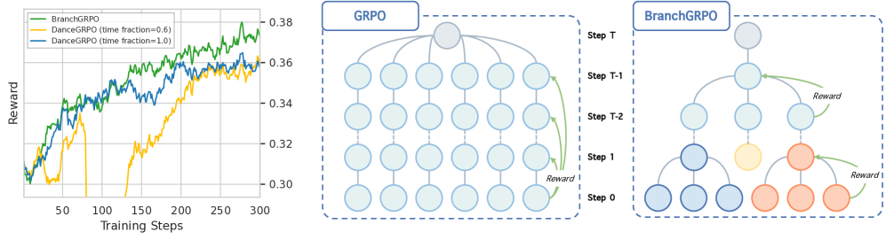
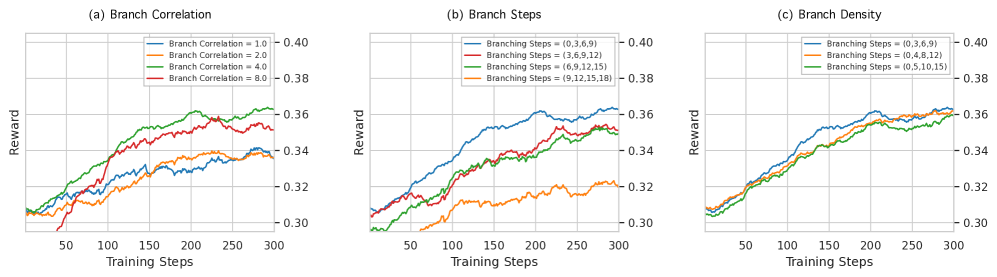

# BranchGRPO

## 📌 核心贡献

> 提出 BranchGRPO，将扩散模型 GRPO 的 rollout 过程重构为树状分支结构，通过共享前缀分摊计算、剪枝移除低价值路径，并引入奖励融合和深度归一化实现密集逐步信号，在对齐得分提升最高 16% 的同时减少 55% 的训练时间。

## 📖 摘要

Recent progress in aligning image and video generative models with Group Relative Policy Optimization (GRPO) has improved human preference alignment, but existing variants remain inefficient due to sequential rollouts and large numbers of sampling steps, unreliable credit assignment, as sparse terminal rewards are uniformly propagated across timesteps, failing to capture the varying criticality of decisions during denoising. In this paper, we present BranchGRPO, a method that restructures the rollout process into a branching tree, where shared prefixes amortize computation and pruning removes low-value paths and redundant depths. We introduce correlated noise injection to balance diversity with prefix reuse, a reward fusion mechanism that aggregates leaf rewards into dense step-level signals, and depth-wise advantage normalization that prevents late-step dominance. Experiments on both image and video generation show that BranchGRPO achieves alignment score improvements of up to 16% over existing approaches with 55% reduction in training time per iteration.

## 🔍 关键信息

| 字段 | 内容 |
|------|------|
| 机构 | Peking University / ByteDance |
| 发表 | 2025-09-07 |
| 分类 | cs.CV, cs.AI, cs.LG |
| 链接 | [arXiv](https://arxiv.org/abs/2509.06040) |

## 📝 我的笔记

### 方法总览

### 动机与问题

现有 GRPO 用于扩散模型对齐存在两个核心问题：
1. **效率低下**：每个样本需要完整的顺序 rollout（多步去噪），组内多个样本之间无法共享计算
2. **信用分配不可靠**：稀疏的终端奖励均匀传播到所有时间步，无法反映不同去噪步的重要性差异

### 核心方法

**1. 树状分支结构**

将 G 个样本的顺序 rollout 重构为分支树：共享早期去噪步（前缀），在关键决策点分叉。每个节点的子节点通过关联噪声注入生成：

子节点共享父节点的部分噪声成分，既保持多样性又最大化前缀复用。

**2. 关联噪声注入（Correlated Noise Injection）**

分支时子节点的噪声由共享噪声和独立噪声混合而成，通过参数控制相关性强度，平衡探索多样性与计算效率。

**3. 奖励融合（Reward Fusion）**

将叶子节点的终端奖励通过软加权机制向上聚合到树的每一层，生成密集的逐步奖励信号：

每个中间节点的融合奖励是其所有后代叶子奖励的加权平均，权重由子树路径的相对质量决定。

**4. 深度归一化（Depth-wise Advantage Normalization）**

在每个深度层独立做优势归一化，防止后期步骤（更接近最终图像）主导梯度更新：

$$\hat{A}_d^i = \frac{R_d^i - \text{mean}_d(R)}{\text{std}_d(R)}$$

**5. 宽度和深度剪枝**

奖励融合后剪除低价值分支和冗余深度，减少反向传播的计算开销。

### 关键实验结果

**图像生成（FLUX 基准模型）：**

| 方法 | HPS-v2.1 | PickScore | ImageReward | 时间(s) |
|------|----------|-----------|-------------|---------|
| FLUX baseline | 0.313 | 0.227 | 1.112 | — |
| DanceGRPO | 0.360 | 0.234 | 1.612 | 698 |
| BranchGRPO-DepPru | **0.369** | **0.235** | **1.625** | 314 |
| BranchGRPO-Mix | 0.363 | 0.230 | 1.598 | **148** |

- BranchGRPO-DepPru：对齐得分最优（+16%），训练时间减少 55%
- BranchGRPO-Mix：极致效率，训练时间仅为 DanceGRPO 的 21%

**关键优势：**
- 树状结构天然支持并行化，GPU 利用率更高
- 密集奖励信号改善了信用分配，训练更稳定
- 同时适用于图像和视频生成任务

### 总结

BranchGRPO 从计算结构层面优化了 GRPO 在扩散模型上的应用。树状 rollout 的核心洞察是：去噪过程的早期步骤在不同样本间高度相似，可以共享计算。奖励融合和深度归一化则从信用分配角度改善了稀疏奖励问题。相比 DanceGRPO，在效果和效率上都有显著提升，是 GRPO for diffusion 方向的重要进展。

## 🔗 相关论文

**基于/改进自：** [[DanceGRPO]], [[Flow-GRPO]]

**同方向：** [[DDPO]], [[Flow-GRPO]]
