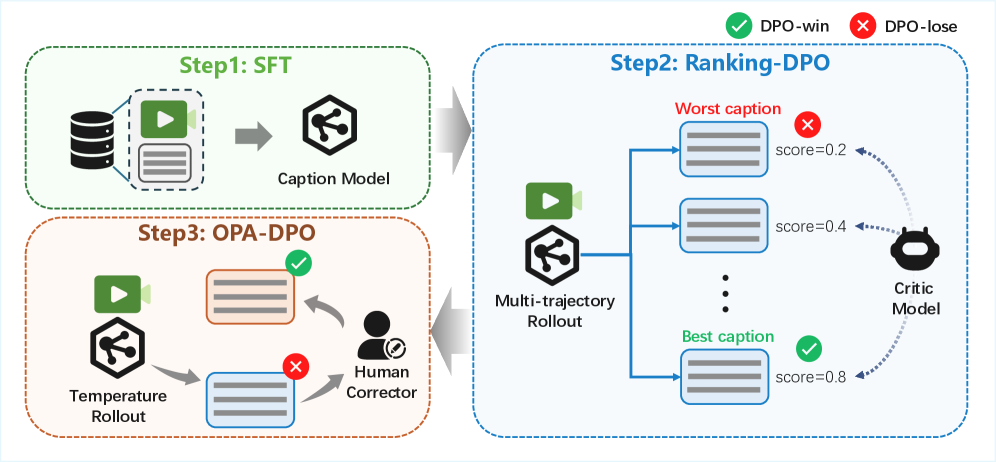
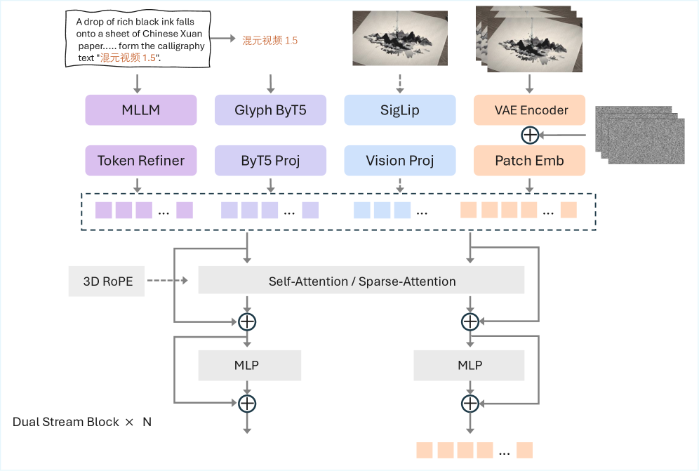
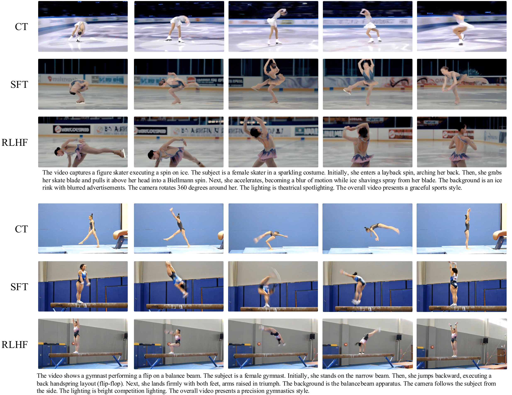

# HunyuanVideo 1.5

## 📌 核心贡献

> 提出 HunyuanVideo 1.5，一个 8.3B 参数的轻量级开源视频生成模型，通过精细数据筛选、SSTA 稀疏注意力架构、渐进式预训练与完整的 CT-SFT-RLHF 后训练流程（含 VLM-based 奖励模型和 DPO+在线 RL 的混合策略），在开源模型中达到 SOTA 的视觉质量和运动连贯性。

## 📖 摘要

We present HunyuanVideo 1.5, a lightweight yet powerful open-source video generation model that achieves state-of-the-art visual quality and motion coherence with only 8.3 billion parameters, enabling efficient inference on consumer-grade GPUs. This achievement is built upon several key components, including meticulous data curation, an advanced DiT architecture featuring selective and sliding tile attention (SSTA), enhanced bilingual understanding through glyph-aware text encoding, progressive pre-training and post-training, and an efficient video super-resolution network. Leveraging these designs, we developed a unified framework capable of high-quality text-to-video and image-to-video generation across multiple durations and resolutions. Extensive experiments demonstrate that this compact and proficient model establishes a new state-of-the-art among open-source video generation models.

## 🔍 关键信息

| 字段 | 内容 |
|------|------|
| 机构 | Tencent Hunyuan |
| 发表 | 2025-11-24 |
| 分类 | cs.CV |
| 链接 | [arXiv](https://arxiv.org/abs/2511.18870) |

## 📝 我的笔记

### 方法总览

### 核心动机

现有开源视频生成模型在视觉质量和运动连贯性上与闭源模型仍有差距。HunyuanVideo 1.5 的目标是通过精细的数据策略、高效架构设计和完整的后训练流程，在仅 8.3B 参数下实现 SOTA 性能，并能在消费级 GPU（如 RTX 4090，峰值显存 13.6 GB）上推理。

### 模型架构

- **统一 DiT**：54 个 Dual-stream Block，模型维度 2048，FFN 维度 8192，16 个注意力头（head dim=128）
- **3D Causal VAE**：空间压缩 16x，时间压缩 4x，32 个 latent channel
- **文本编码**：Qwen2.5-VL 用于语义理解 + 多语言 Glyph-ByT5 用于精确文字渲染
- **SSTA（Selective and Sliding Tile Attention）**：通过 3D block 划分、重要性评分生成选择性 mask、局部 STA 窗口 mask、块稀疏注意力执行四步实现；在 720p 10s 视频生成上相比 FlashAttention-3 达到 1.87x 加速

### 后训练 Pipeline: CT → SFT → RLHF

后训练对 T2V 和 I2V 任务分别独立进行，分三个阶段：

**阶段一：Continuing Training (CT)**
- 每个任务使用 100 万高质量视频片段，类别均衡分布
- T2V：优先选择高动态运动的片段以增强时序建模
- I2V：使用指令性 caption，专注描述相对首帧的运动和变换

**阶段二：Supervised Fine-Tuning (SFT)**
- 严格筛选的高质量片段，依据美学、清晰度和运动平滑度过滤
- 具体数据量未公开

**阶段三：RLHF**
- 针对 I2V 和 T2V 采用不同策略（详见下文）

### VLM-based 奖励模型（I2V 任务）

基于视觉语言模型（VLM）微调的奖励模型，从 4 个维度评估生成视频：

| 维度 | 说明 |
|------|------|
| Text alignment | 视频与文本提示的语义一致性 |
| Image alignment | 生成视频与输入图像的一致性 |
| Visual quality | 视觉质量（清晰度、美学） |
| Motion dynamics | 运动真实性和流畅度 |

实现策略：
- 从 100+ 类别的高美学图像中构建 prompt 集
- 使用 VLM 候选生成 + 人工验证
- 混合采样策略：变换随机种子和 CFG scale
- 使用 **MixGRPO**（混合 ODE-SDE 求解器）在探索与质量之间取得平衡

### DPO 阶段（T2V 任务）

**Prompt 集构建：**
- 规模：$O(10K)$ 个平衡 prompt
- 来源：LLM 生成 + 训练视频 caption
- 覆盖维度：运动、场景、主体等多样化维度

**偏好对构建流程：**
1. 使用高质量 SFT checkpoint，对每个 prompt 生成 N 个候选视频
2. 构建不重复的对比对
3. 人工以 **GSB 框架**（Good/Same/Bad）从三个维度标注：
   - 语义保真度（Semantic fidelity）
   - 运动质量（Motion quality）
   - 美学（Aesthetics）

DPO 应用于高质量偏好对数据上，显著减少运动伪影，建立更优的策略起点。

### I2V vs. T2V RLHF 策略差异

| 方面 | I2V | T2V |
|------|-----|-----|
| 策略 | 在线强化学习 | 混合离线-在线（offline-then-online） |
| 核心原因 | 运动与结构伪影校正 | T2V 运动伪影更复杂，现有 RM 难以区分细粒度运动质量 |
| 离线阶段 | 无 | DPO（人工标注偏好对） |
| 在线阶段 | VLM-based RM + MixGRPO | 复用 I2V 的在线 RL 框架 |
| 评估维度 | 4 维（含 image alignment） | 3 维（语义、运动、美学） |

**关键洞察**：T2V 采用先离线 DPO 再在线 RL 的原因是「现有奖励模型难以有效区分细粒度运动质量」，因此先通过 DPO 利用人工标注建立好的策略起点，再用在线 RL 进一步优化。

### 预训练流程

渐进式分辨率训练策略：

| 阶段 | 类型 | 分辨率 | 数据量 | 任务 |
|------|------|--------|--------|------|
| I | Pretrain | 256p | 50 亿 | T2I |
| II | Pretrain | 512p | 10 亿 | T2I |
| III | Pretrain | 256p 16fps 2-10s | 8 亿 | T2V/I2V/T2I |
| IV | Pretrain | 480p 16fps 2-10s | 2 亿 | T2V/I2V/T2I |
| V | Pretrain | 720p 16fps 2-10s | 1 亿 | T2V/I2V/T2I |
| VI | Pretrain | 720p 24fps 2-10s | 1 亿 | T2V/I2V/T2I |
| VII | CT | 480p/720p 24fps | 100 万 | T2V |
| VIII | CT | 480p/720p 24fps | 100 万 | I2V |

### 关键结果

**T2V Rating 对比（720p）：**

| 维度 | HY1.5 | Wan2.2 | Kling2.1 | Seedance Pro | Veo3 |
|------|-------|--------|----------|-------------|------|
| Instruction following | **61.57** | 44.07 | 50.03 | 53.19 | **73.77** |
| Aesthetic quality | 63.30 | 65.98 | 68.00 | 68.22 | 67.98 |
| Visual quality | 57.35 | 56.37 | 59.68 | 60.20 | 58.64 |
| Structural stability | **79.75** | 73.75 | 66.74 | 68.69 | 75.62 |
| Motion effects | 57.67 | 53.08 | 58.59 | 55.17 | **60.81** |

**I2V Rating 对比（720p）：**

| 维度 | HY1.5 720p | Wan2.2 | Kling2.1 | Seedance Pro | Veo3 |
|------|-----------|--------|----------|-------------|------|
| Instruction following | 63.05 | 56.19 | **68.43** | 62.90 | 67.86 |
| Image consistency | 72.07 | **73.53** | 64.09 | 73.06 | 72.19 |
| Visual quality | **60.33** | 58.31 | 59.28 | 58.95 | 59.29 |
| Structural stability | 66.67 | **69.03** | 59.71 | 68.01 | 69.25 |
| Motion effects | 58.62 | 57.41 | 57.36 | **60.47** | **60.91** |

**GSB 人工评测（T2V 720p，HY1.5 胜率）：**

| 对比模型 | HY 更好 | 对方更好 | HY 净胜率 |
|---------|---------|---------|----------|
| Wan2.2 | 34.90% | 17.78% | **+17.12%** |
| Kling2.1 Master | 31.55% | 18.95% | **+12.60%** |
| Seedance Pro | 31.67% | 20.65% | **+11.02%** |
| Veo3 | 24.64% | 34.96% | -10.32% |

**GSB 人工评测（I2V 720p，HY1.5 胜率）：**

| 对比模型 | HY 更好 | 对方更好 | HY 净胜率 |
|---------|---------|---------|----------|
| Wan2.2 | 45.60% | 32.95% | **+12.65%** |
| Kling2.1 Master | 40.60% | 30.88% | **+9.72%** |
| Seedance Pro | 30.62% | 36.39% | -5.77% |
| Veo3 | 37.44% | 41.05% | -3.61% |

评测方法：300 个文本 prompt + 300 个图像样本，超过 100 名专业评估员，单次生成无 cherry-picking。

### RLHF 带来的具体改善

从 Figure 4 的可视化对比可以看到后训练各阶段的渐进提升：
- **CT 阶段**：提升基础视频质量和运动连贯性
- **SFT 阶段**：进一步提升美学和清晰度
- **RLHF 阶段**：显著改善运动真实性，尤其在结构稳定性（Structural stability）上 HY1.5 以 79.75 大幅领先其他开源模型

论文未提供独立的 RLHF ablation 实验数据表，但强调 RLHF 在运动真实性上带来了一致性的改善。

### 推理效率

- 峰值显存 13.6 GB（开启 pipeline offloading、group offloading、VAE tiling）
- 支持单张消费级 GPU（RTX 4090）推理
- SSTA 在 720p 241 帧视频上推理提速 ~1.87x（2.95s/step vs. 5.51s/step）

### 总结性评价

HunyuanVideo 1.5 是一份全面的视频生成系统技术报告，亮点在于完整的后训练流程设计：针对 I2V 和 T2V 的不同特性采用差异化的 RLHF 策略（I2V 直接在线 RL，T2V 先 DPO 再在线 RL），以及 VLM-based 多维度奖励模型的设计。SSTA 稀疏注意力在推理效率上的提升也值得关注。不足之处在于论文对 RLHF 部分的细节披露有限——没有给出具体的 DPO/RL 损失函数、MixGRPO 的数学公式化描述、以及 RLHF 的独立 ablation 实验，更多是工程层面的描述。

## 🔗 相关论文

**基于/改进自：** --

**同方向：** [[VideoAlign]], [[Diffusion-DPO]], [[VideoScore]], [[DanceGRPO]]
