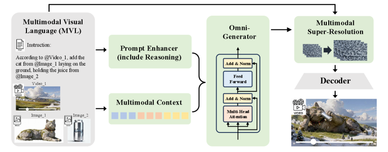
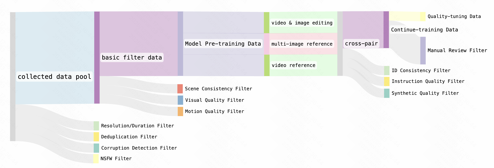
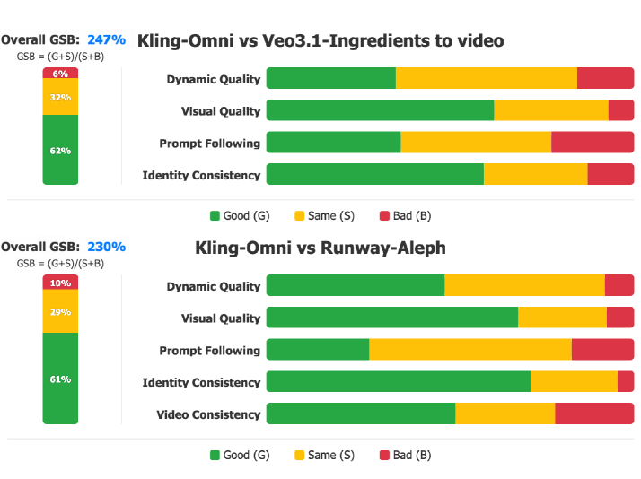

# Kling-Omni

## 📌 核心贡献

> 提出 Kling-Omni 统一视频生成框架，通过多轮 DPO 偏好对齐后训练优化运动动态和视觉完整性，将视频生成、编辑和智能推理整合为端到端系统。

## 📖 摘要

We present Kling-Omni, a generalist generative framework designed to synthesize high-fidelity videos directly from multimodal visual language inputs. Adopting an end-to-end perspective, Kling-Omni bridges the functional separation among diverse video generation, editing, and intelligent reasoning tasks, integrating them into a holistic system. Unlike disjointed pipeline approaches, Kling-Omni supports a diverse range of user inputs, including text instructions, reference images, and video contexts, processing them into a unified multimodal representation to deliver cinematic-quality and highly-intelligent video content creation. To support these capabilities, we constructed a comprehensive data system that serves as the foundation for multimodal video creation. The framework is further empowered by efficient large-scale pre-training strategies and infrastructure optimizations for inference. Comprehensive evaluations reveal that Kling-Omni demonstrates exceptional capabilities in in-context generation, reasoning-based editing, and multimodal instruction following. Moving beyond a content creation tool, we believe Kling-Omni is a pivotal advancement toward multimodal world simulators capable of perceiving, reasoning, generating and interacting with the dynamic and complex worlds.

## 🔍 关键信息

| 字段 | 内容 |
|------|------|
| 机构 | Kuaishou |
| 发表 | 2025-12-18 |
| 分类 | cs.CV |
| 链接 | [arXiv](https://arxiv.org/abs/2512.16776) |

## 📝 我的笔记

### 方法总览

Kling-Omni 是快手推出的统一视频生成框架，核心目标是将视频生成、编辑和推理任务整合到一个端到端系统中。整个框架由三个主要组件构成：

1. **Prompt Enhancer (PE)**：基于多模态大语言模型（MLLM），将用户的文本指令、参考图像和视频上下文映射到与训练数据分布一致的统一表示。先通过 SFT 训练推理链，再通过 RL 优化事实准确性、内容丰富性和语义合理性。

2. **Omni-Generator**：核心扩散 Transformer，在共享 embedding 空间中处理视觉和文本 token，实现跨模态交互，确保视觉一致性和指令遵循。

3. **Multimodal Super-Resolution (VSR)**：级联扩散框架，使用局部窗口注意力和 shifted window 策略，结合非对称注意力机制实现 2 倍加速。

### DPO 后训练：为什么选择 DPO 而非 GRPO

这是本文后训练部分的核心设计决策。论文明确指出：

> **选择 DPO 而非 GRPO 的原因**：GRPO 需要在训练过程中进行计算代价高昂的轨迹采样（trajectory sampling），而 DPO 绕过了这一步骤，仅需一步扩散前向过程（one-step diffusion forward process），在计算效率上有显著优势。

这个选择在视频生成场景下尤为关键——视频生成模型的单次前向推理本身就非常昂贵（涉及大量时空 token），如果还要像 GRPO 那样在训练中反复采样完整轨迹，计算成本将难以承受。DPO 将问题转化为基于偏好对的离线优化，大幅降低了训练开销。

### 多轮偏好对齐训练 Pipeline

后训练采用多轮 DPO 偏好对齐，具体流程：

1. **偏好数据构建**：
   - 从多样化的多模态视觉语言（MVL）条件中采样，构建候选池
   - 使用不同随机噪声种子从同一条件生成多个视频变体
   - 由人工评估者对生成视频进行评价，识别偏好对（preferred vs. dispreferred）

2. **DPO 训练**：
   - 将偏好对连同对应的噪声和时间步信息一起用于计算 DPO loss
   - 通过多轮迭代训练，模型逐步优化

3. **优化目标聚焦两个维度**：
   - **运动动态（Motion Dynamics）**：帧间时序连续性、运动幅度合理性、多角色交互、叙事性镜头运动
   - **视觉完整性（Visual Integrity）**：属性稳定性、运动的物理合理性、主体与背景的无缝融合

### 完整训练阶段

整个训练分为四个阶段：

| 阶段 | 内容 | 细节 |
|------|------|------|
| Pre-training | 大规模文本-视频对数据预训练 | 多样化 caption（简洁到详细），图生视频任务 |
| SFT (Continue-training) | 参考图生视频、图像/视频编辑、语义理解等任务 | 交错格式多任务训练 |
| SFT (Quality-tuning) | 高质量数据集精调 | 均衡任务分布 + 精确指令标注 |
| RL (DPO) | 多轮 DPO 偏好对齐 | 聚焦运动动态和视觉完整性 |

此外还有模型蒸馏阶段，将推理步数从 150 NFE 降到 10 NFE，分两步完成：
- 阶段 1：轨迹匹配蒸馏（分阶段时序结构化）
- 阶段 2：分布匹配蒸馏（ODE 采样 + 轨迹正则化）

### 数据系统

论文构建了三层数据过滤体系：

1. **基础过滤**：分辨率/时长阈值、去重、音视频损坏检测、内容安全
2. **时序质量评估**：质量评分、模糊/抖动/噪声检测、场景切换检测、动作语义密度过滤
3. **视频-文本/图像-视频对齐**：Caption 内容一致性、参考图像保真度、编辑指令对齐、角色身份一致性

### 关键实验结果

评估基于自建 OmniVideo-1.0 基准（500+ 评测用例），采用 Good-Same-Bad (GSB) 人工评估：

| 评估维度 | 关注点 |
|----------|--------|
| Dynamic Quality | 帧间连续性、属性稳定性、运动物理合理性、多角色交互 |
| Prompt Following | 指令遵循、语义约束捕获 |
| Identity Consistency | 跨视角/表情/运动/光照的主体保持 |
| Video Consistency | 未编辑区域的保真度（编辑任务） |

对比结果显示 Kling-Omni 在所有维度上优于 Veo 3.1（图像参考任务）和 Runway Aleph（视频编辑任务），功能覆盖范围也更广（涵盖图像/元素库参考、指令编辑、视频参考、帧条件生成、组合生成、视觉提示理解、推理增强生成等）。

### 总结性评价

Kling-Omni 的后训练方案有几个值得关注的设计选择：

- **DPO vs GRPO 的务实选择**：在视频生成这种计算密集场景下，DPO 的离线偏好学习相比 GRPO 的在线轨迹采样有明显的效率优势，这是一个工程导向但合理的技术选择。
- **多轮迭代对齐**：不是一次性 DPO 训练，而是多轮迭代，每轮使用当前模型生成新的偏好数据，逐步提升对齐质量。
- **人工评估驱动**：偏好数据来自人工标注而非奖励模型打分，这保证了对齐信号的质量但限制了规模。
- **论文技术细节偏少**：作为技术报告，DPO loss 的具体公式未给出（仅引用 Rafailov et al. 2023），多轮训练的轮数、每轮数据量等关键超参数也未披露。系统工程贡献（基础设施、数据系统）的篇幅远大于算法创新。

## 🔗 相关论文

**基于/改进自：** [[Diffusion-DPO]]

**同方向：** [[VideoAlign]], [[HunyuanVideo]]
