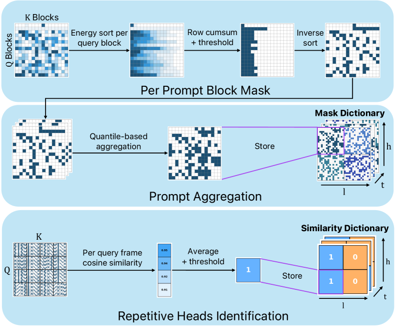
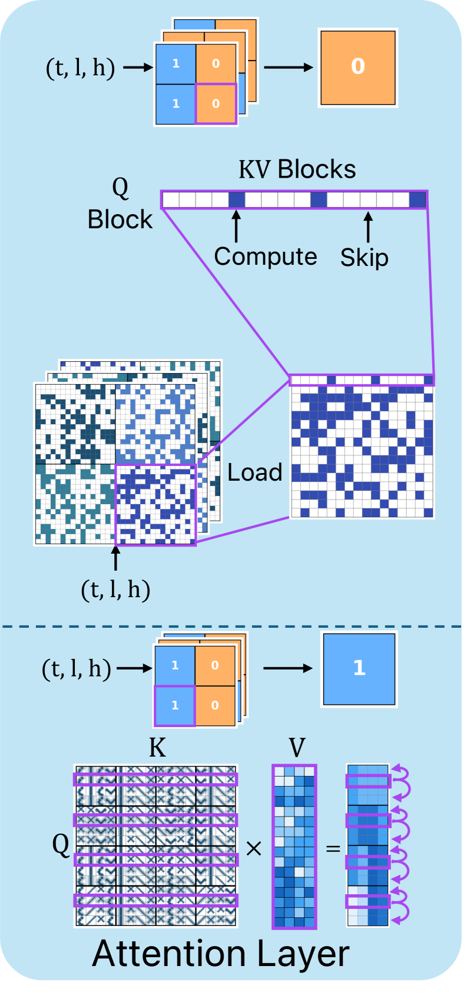
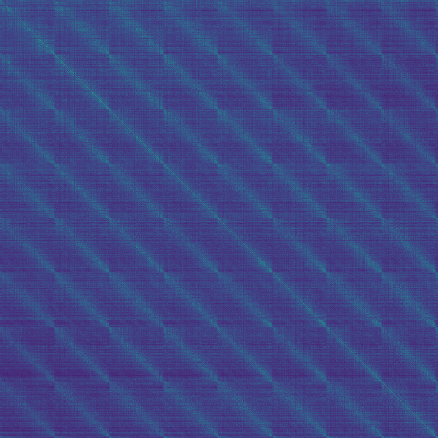
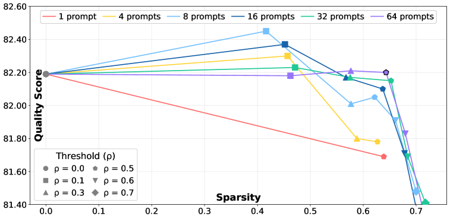

# Accelerating Text-to-Video Generation with Calibrated Sparse Attention

## 📌 核心贡献

> 提出 CalibAtt，一种无需训练的视频扩散 Transformer 加速方法：通过离线校准发现注意力中稳定存在的 block 级稀疏性和空间重复模式，编译为逐层/逐头/逐时间步的优化稀疏注意力算子，在 Wan 2.1 14B 上实现最高 1.58x 端到端加速且不损失生成质量。

## 📖 摘要

Recent diffusion models enable high-quality video generation, but suffer from slow runtimes. The large transformer-based backbones used in these models are bottlenecked by spatiotemporal attention. In this paper, we identify that a significant fraction of token-to-token connections consistently yield negligible scores across various inputs, and their patterns often repeat across queries. Thus, the attention computation in these cases can be skipped with little to no effect on the result. This observation continues to hold for connections among local token blocks. Motivated by this, we introduce CalibAtt, a training-free method that accelerates video generation via calibrated sparse attention. CalibAtt performs an offline calibration pass that identifies block-level sparsity and repetition patterns that are stable across inputs, and compiles these patterns into optimized attention operations for each layer, head, and diffusion timestep. At inference time, we compute the selected input-dependent connections densely, and skip the unselected ones in a hardware-efficient manner. Extensive experiments on Wan 2.1 14B, Mochi 1, and few-step distilled models at various resolutions show that CalibAtt achieves up to 1.58x end-to-end speedup, outperforming existing training-free methods while maintaining video generation quality and text-video alignment.

## 🔍 关键信息

| 字段 | 内容 |
|------|------|
| 发表 | 2026-03-05 |
| 机构 | Apple & Tel Aviv University |
| 分类 | cs.CV |
| 链接 | [arXiv](https://arxiv.org/abs/2603.05503) |

## 📝 我的笔记

### 动机与问题定义

当前高质量视频生成模型（如 Wan 2.1 14B、Mochi 1）依赖大规模 Transformer 骨干网络，其核心瓶颈在于**时空注意力（spatiotemporal attention）**的计算开销。生成一段 720p/81 帧视频需要 1244 秒（约 20 分钟），严重限制了实际应用。

现有加速方法（SpargeAttention、RadialAttention、SVG2）要么依赖运行时动态判断稀疏性（引入额外开销），要么使用全局固定模式（忽略层间/头间差异），加速效果有限。

CalibAtt 的核心洞察是：**注意力的稀疏模式在不同输入之间高度一致**，因此可以通过离线校准一次性发现这些模式，编译为硬件友好的稀疏注意力算子，在推理时直接使用。

### 方法总览

CalibAtt 包含两个阶段：

**离线校准阶段**：使用少量校准 prompt（默认 64 个）运行完整扩散过程，在每一层、每个注意力头、每个时间步上收集 block 级注意力能量，提取稀疏 mask 并聚合为跨 prompt 一致的模式。同时检测具有空间重复性的注意力头。

**推理阶段**：将校准得到的稀疏模式编译为 skip-list，加载到 GPU 上。推理时直接按 skip-list 执行稀疏注意力，跳过不重要的 block 连接；对于空间重复头，仅计算锚点行的注意力并广播到相邻行。

### 四个关键观察

1. **注意力稀疏性**：大部分注意力权重集中在少量 token 上，即使在 $B \times B$ block 粒度下稀疏性仍然明显。
2. **层/头/时间步差异**：不同层、头、时间步的注意力模式差异巨大，不能使用统一的全局模式——必须为每个 (timestep, layer, head) 组合定制 mask。
3. **跨 prompt 一致性**：同一 (t, l, h) 位置的稀疏模式在不同 prompt 和噪声初始化下高度一致，使离线校准成为可能。
4. **空间重复性**：某些注意力头在同一帧内的不同空间行之间呈现高度相似的注意力模式，可以通过锚点行 + 广播进一步加速。

### 核心技术细节

#### 1. 基于能量的 Block 选择

将 query 和 key 序列划分为大小为 $B$ 的 block。对于 query block $r$ 和 key block $c$，定义 block 能量：

$$E_{r,c} = \frac{1}{B} \sum_{i \in I_r} \sum_{j \in J_c} P_{ij}$$

其中 $P_{ij}$ 是 softmax 后的注意力权重。对每个 query block $r$，选择最少的 key block 集合 $S_r$ 使得累计能量达到阈值 $\varepsilon(t)$：

$$\min |S_r| \quad \text{s.t.} \quad \sum_{c \in S_r} E_{r,c} \geq \varepsilon(t)$$

能量阈值随时间步变化，遵循指数调度：

$$\varepsilon(t) = A + (C - A) \exp\left(-\frac{kt}{T}\right)$$

其中 $A$、$C$、$k$ 为超参数。早期时间步（噪声大）使用较宽松的阈值（更多稀疏），后期时间步（细节重要）使用较严格的阈值。

具体参数设定：对于高步数模型（50 步），$A(N) = 0.796 + 1.41 \times 10^{-6} N$，$C = 0.99$，$k = 16$；对于少步蒸馏模型（4 步），$A = 0.763$，$C = 0.863$，$k = 5.64$。

#### 2. 跨 Prompt Mask 聚合

在校准集 $D$ 上对每个 prompt 得到的二值 mask 取平均：

$$\bar{M}^{(t,l,h)} = \frac{1}{|D|} \sum_{p \in D} M_p^{(t,l,h)}$$

然后以一致性阈值 $\rho$ 二值化：

$$[M^{(t,l,h)}]_{r,c} = \begin{cases} 1, & \text{if } [\bar{M}^{(t,l,h)}]_{r,c} \geq \rho \\ 0, & \text{otherwise} \end{cases}$$

默认 $\rho = 0.5$，即超过一半校准 prompt 认为需要保留的 block 连接才被保留。

#### 3. 空间重复检测与锚点行机制

对于具有空间重复性的注意力头，选择每帧 $k = 5$ 个等距锚点行。计算空间相似性分数 $s^{(t,l,h)}$：对每一行的注意力模式与最近锚点行的注意力模式计算余弦相似度，取中位数。若 $s^{(t,l,h)} \geq \gamma$（默认 $\gamma = 0.87$），则该头被标记为空间重复头。

推理时，空间重复头仅对锚点行执行标准 FlashAttention3，然后将结果广播到相邻行。这种机制与 block 稀疏性互补——空间重复性高的头通常 block 稀疏度较低，反之亦然。

#### 4. 硬件高效实现

- **校准阶段**：自定义 CUDA kernel 直接计算 block 能量，无需物化完整注意力矩阵。
- **推理阶段**：基于 FlashAttention3 的自定义 CUDA kernel 支持 block-sparse 注意力，使用预加载到 GPU 的 skip-list。
- **内存优化**：原始 2D skip-list 占 52 GB（Wan 2.1 14B 720p），通过逐层裁剪（21.5 GB）、区间合并（6.3 GB）、1D 扁平化（4.0 GB）、时间步共享（$\tau = 0.97$, 2.2 GB）逐步压缩。

### 关键实验结果

#### Wan 2.1 14B 主实验

| 方法 | 分辨率 | 稀疏度 | 加速比 | 延迟 (s) | VBench 语义 | VBench 质量 | VBench 总分 |
|------|--------|--------|--------|----------|-------------|-------------|-------------|
| Dense FA3 | 480p | 0% | 1.00x | 363 | 73.68 | 82.45 | 80.69 |
| SpargeAttention | 480p | 49.5% | 1.15x | 315 | 72.76 | 82.16 | 80.27 |
| RadialAttention | 480p | 49.0% | 1.20x | 303 | 71.97 | 82.08 | 80.05 |
| SVG2 | 480p | 53.4% | 1.25x | 290 | 72.65 | 82.33 | 80.39 |
| **CalibAtt** | **480p** | **68.1%** | **1.45x** | **250** | 72.80 | 82.30 | 80.40 |
| Dense FA3 | 720p | 0% | 1.00x | 1244 | 73.20 | 82.11 | 80.32 |
| SpargeAttention | 720p | 49.9% | 1.33x | 936 | 72.57 | 81.67 | 79.84 |
| RadialAttention | 720p | 54.7% | 1.32x | 942 | 70.10 | 81.50 | 79.21 |
| SVG2 | 720p | 46.3% | 1.47x | 846 | 71.08 | 81.04 | 79.04 |
| **CalibAtt** | **720p** | **62.5%** | **1.58x** | **785** | 72.81 | 81.41 | 79.69 |

#### Mochi 1 (480p, 85 帧, 64 步)

| 方法 | 稀疏度 | 加速比 | 延迟 (s) | VBench 总分 |
|------|--------|--------|----------|-------------|
| Dense FA3 | 0% | 1.00x | 188 | 74.49 |
| SpargeAttention | 49.6% | 1.05x | 179 | 74.01 |
| RadialAttention | 37.8% | 1.07x | 176 | 72.62 |
| SVG2 | 55.6% | 0.79x | 238 | 72.27 |
| **CalibAtt** | **69.1%** | **1.16x** | **161** | **74.57** |

#### 少步蒸馏模型 LightX2V（4 步）

| 分辨率 | 稀疏度 | 加速比 | 延迟 (s) | VBench 总分 |
|--------|--------|--------|----------|-------------|
| 480p | 70.9% | 1.29x | 11.2 | 81.26 |
| 720p | 73.9% | 1.57x | 30.6 | 77.84 |

CalibAtt 在所有模型和分辨率上均取得最佳加速比，且 VBench 总分与 Dense 基线差距极小（通常 < 0.7 分）。值得注意的是在 Mochi 1 上 CalibAtt 甚至超过了 Dense 基线的 VBench 总分，说明适度剪枝可能有轻微的正则化效果。

### Ablation 分析

#### 校准预算

- 使用 64 个校准 prompt 配合 $\rho = 0.5$ 提供最优平衡。
- 质量随校准集大小快速稳定，仅 16 个 prompt 即可获得接近最优的效果。
- 完整校准成本（Wan 2.1 14B 720p）：89.6 H100 GPU-hours；减少预算方案可降至 13.7 hours。
- 校准为一次性开销，可在无限次推理中复用。

#### Block 大小

| Block 大小 | 稀疏度 | 加速比 | VBench 总分 |
|------------|--------|--------|-------------|
| 128×64 | ~64.6% | 1.41x | ~80.4 |
| 128×96 | ~64.6% | 1.42x | ~80.4 |
| 128×128 | ~62.5% | 1.42x | ~80.4 |
| 128×192 | ~62% | 1.41x | ~80.3 |

方法对 block 大小不敏感，默认选择 128×128 以兼容 FlashAttention3。

#### 空间重复锚点行

- $k = 5$ 锚点行 + $\gamma = 0.87$ 阈值。
- 原始 kernel 级加速：$k = 5$ 时 5.3x（83.3% 稀疏度）。
- 空间重复机制与 block 稀疏化互补：高空间重复性的头通常 block 稀疏度较低，两种机制覆盖不同的注意力头。

### 总结性评价

**优点：**
- 核心思路非常优雅——利用注意力模式的跨输入一致性，将"运行时判断"转化为"编译时确定"，从根本上消除了动态稀疏检测的开销。
- 在所有测试模型和分辨率上一致性地优于现有方法，尤其在 720p 高分辨率下优势更明显（1.58x vs 次优 1.47x）。
- 方法设计考虑周全：block 稀疏 + 空间重复两种机制互补，时间步自适应阈值调度，内存优化从 52 GB 压缩到 2.2 GB。
- 兼容少步蒸馏模型，说明方法的通用性。

**局限：**
- 校准成本较高（完整方案 89.6 H100 GPU-hours），虽然可摊销但对小团队不友好。
- 数据无关的 mask 可能错过某些 prompt 特定的加速机会——如果结合轻量级运行时调整可能进一步提升。
- 对 Mochi 1 的加速比相对有限（1.16x），可能是因为该模型的注意力结构不同。
- 内存占用需要额外优化才能实际部署（未优化时 21.5 GB skip-list）。

## 🔗 相关论文

**对比基线：** [[SpargeAttention]], [[RadialAttention]], [[SVG2]]

**测试模型：** [[Wan 2.1]], [[Mochi 1]], [[LightX2V]]

**相关技术：** [[FlashAttention3]]
