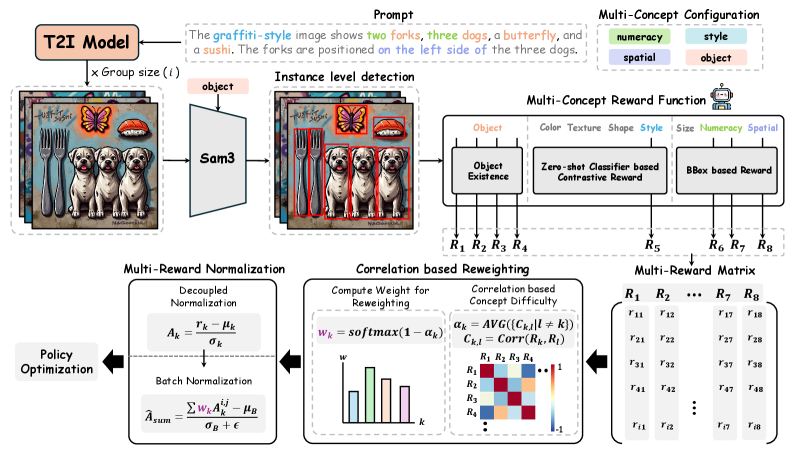
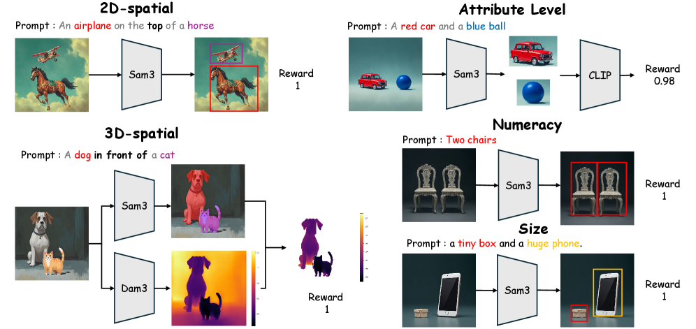
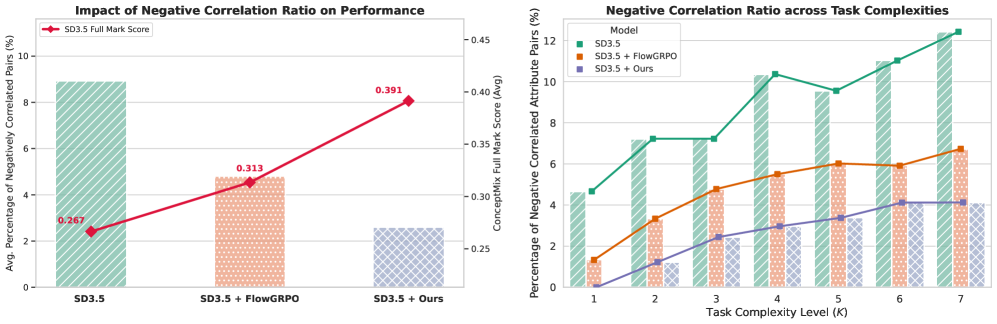
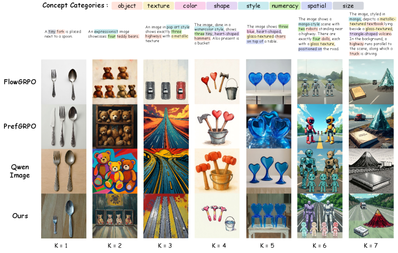

# CMO

## 📌 核心贡献

> 提出 Correlation-Weighted Multi-Reward Optimization（CMO），通过分析多概念奖励信号之间的相关性结构，自适应加权困难/冲突概念，解决组合式 T2I 生成中朴素奖励聚合忽略难概念的问题，在 ConceptMix、GenEval 2、T2I-CompBench 上取得 SOTA，且仅需 4 GPU 84 小时训练。

## 📖 摘要

Text-to-image models produce images that align well with natural language prompts, but compositional generation has long been a central challenge. Models often struggle to satisfy multiple concepts within a single prompt, frequently omitting some concepts and resulting in partial success. Such failures highlight the difficulty of jointly optimizing multiple concepts during reward optimization, where competing concepts can interfere with one another. To address this limitation, we propose Correlation-Weighted Multi-Reward Optimization (CMO), a framework that leverages the correlation structure among concept rewards to adaptively weight each attribute concept in optimization. By accounting for interactions among concepts, CMO balances competing reward signals and emphasizes concepts that are partially satisfied yet inconsistently generated across samples, improving compositional generation. Specifically, we decompose multi-concept prompts into pre-defined concept groups (e.g., objects, attributes, and relations) and obtain reward signals from dedicated reward models for each concept. We then adaptively reweight these rewards, assigning higher weights to conflicting or hard-to-satisfy concepts using correlation-based difficulty estimation. By focusing optimization on the most challenging concepts within each group, CMO encourages the model to consistently satisfy all requested attributes simultaneously. We apply our approach to train state-of-the-art diffusion models, SD3.5 and FLUX.1-dev, and demonstrate consistent improvements on challenging multi-concept benchmarks, including ConceptMix, GenEval 2, and T2I-CompBench.

## 🔍 关键信息

| 字段 | 内容 |
|------|------|
| 机构 | - |
| 发表 | 2026-03-19 |
| 分类 | cs.AI |
| 链接 | [arXiv](https://arxiv.org/abs/2603.18528) |

## 📝 我的笔记

### 动机

现有 T2I 模型在处理包含多个概念的 prompt 时（如 "a red cat and a blue dog on a green sofa"），常常只能满足部分概念。将 RL 方法（如 GRPO）应用于多概念生成时，朴素的奖励平均聚合会导致：
- 模型倾向于优化"容易"的概念，忽略"困难"概念
- 概念间存在负相关——满足一个概念往往以牺牲另一个为代价
- 随着概念数量 K 增加，负相关概念对比例急剧上升，full-mark score 显著下降

### 方法

#### 1. 基础框架

基于两个已有工作构建：
- **MixGRPO**：混合 ODE-SDE 采样策略，在 stochastic window S 内使用 SDE 增加探索性，其余用 ODE
- **GDPO**：独立的 per-reward group-relative advantage 归一化，避免不同奖励尺度间的干扰

#### 2. Multi-Concept Reward Decomposition

将 prompt 分解为细粒度概念组，每组使用专用奖励函数：

**Object Existence Reward**：使用 SAM 3 进行文本引导的实例检测，输出二值奖励 $r_{\text{exist}} \in \{0, 1\}$

**Attribute-Level Reward**：
- Color/Texture/Shape/Style：OpenCLIP-H 对裁剪区域计算 cosine similarity
- Numeracy（数量）：可微启发式 $r_{\text{num}} = \frac{1}{(|c - c^*| + 1)^2}$
- Size（大小）：基于 rank 的 inverse squared decay

**Spatial-Relation Reward**：
- 2D 关系（left/right/above/below/inside/outside）：几何启发式，输出 1.0/0.5/0.0
- 3D 关系（in front of/behind）：Depth Anything 3 估计深度，设定容差裕度

#### 3. Correlation-based Reweighting（核心创新）

**难度估计**：对 G 个样本计算 K 个概念奖励的 Pearson 相关矩阵 $C$，每个概念的平均相关性：

$$\alpha_k = \frac{1}{K-1} \sum_{j \neq k} C_{k,j}$$

- $\alpha_k$ 低/负 → 概念 k 与其他概念冲突，是"困难概念"
- 零方差概念（所有样本奖励相同）赋默认最高难度分

**自适应加权**：

$$w_k = \text{softmax}\left(\frac{1 - \alpha_k}{\tau}\right)$$

最终 advantage = 各概念 advantage 的加权求和后 batch normalize。温度 $\tau$ 控制权重分布的平滑度。

### 关键实验结果

**ConceptMix Full Mark Score（不同概念数 K）**：

| 方法 | K=1 | K=2 | K=3 | K=4 | K=5 | K=6 | K=7 |
|------|-----|-----|-----|-----|-----|-----|-----|
| SD3.5+CMO | **0.8410** | **0.7063** | **0.5700** | **0.3947** | **0.3560** | **0.2317** | **0.1883** |
| Qwen-Image | 0.8183 | 0.6583 | 0.5060 | 0.3803 | 0.3353 | 0.2213 | 0.1747 |

**GenEval 2**：

| 方法 | Soft-TIFA (AM) | Soft-TIFA (GM) |
|------|----------------|----------------|
| SD3.5+CMO | **80.0** | **34.0** |
| Qwen-Image | 80.0 | 31.4 |

**T2I-CompBench**：SD3.5+CMO avg 0.6141，FLUX.1-dev+CMO avg 0.5961

**训练效率**：4 GPUs, 84 GPU hours vs 基线 24-64 GPUs, 2000+ hours

**图像质量**：Aesthetic/PickScore/HPSv2/HPSv3 等指标保持不变（AVG 10.519 vs FlowGRPO 10.520）

### Ablation

- Correlation-based reweighting 贡献 +0.0382 mean score
- Group size N=16 是关键，N=4 导致训练崩溃（相关性估计不稳定）
- 温度 $\tau$ 和 KL 系数 $\beta$ 存在 trade-off

### 个人评价

- 核心 insight 直观且合理：概念间负相关是多概念生成的关键瓶颈，用相关性分析做难度估计很自然
- 方法设计偏工程化（SAM 3 + OpenCLIP + Depth Anything 组合），但每个模块选择有理由
- 训练效率是一大亮点（84 GPU hours vs 2000+），主要得益于 LoRA fine-tuning + MixGRPO 的高效采样
- 局限：奖励分解依赖预定义的概念类型和专用检测器，对更开放的概念组合（如抽象概念）可能不适用

## 🔗 相关论文

**基于/改进自：** [[Flow-GRPO]], [[DanceGRPO]]

**对比基线：** [[DDPO]], [[DPOK]], [[DRaFT]], [[AlignProp]], [[Diffusion-DPO]]

**同方向：** [[T2I-CompBench]], [[GenEval]], [[HPSv3]]
