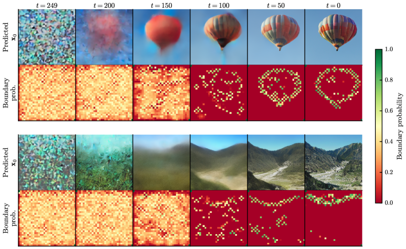
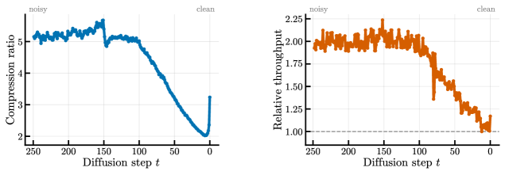
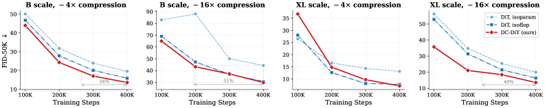

# DC-DiT

## 📌 核心贡献

> 提出 DC-DiT，通过可学习的 encoder-router-decoder 结构对 DiT 的输入 token 序列进行内容自适应动态压缩（chunking），在不引入显式监督的情况下自动学会对低信息区域压缩、高细节区域保留，并沿去噪时间步自适应调整压缩率，在 ImageNet 256x256 上以更少参数/FLOPs 超越 DiT 基线。

## 📖 摘要

Diffusion Transformers process images as fixed-length sequences of tokens produced by a static $\textit{patchify}$ operation. While effective, this design spends uniform compute on low- and high-information regions alike, ignoring that images contain regions of varying detail and that the denoising process progresses from coarse structure at early timesteps to fine detail at late timesteps. We introduce the Dynamic Chunking Diffusion Transformer (DC-DiT), which augments the DiT backbone with a learned encoder-router-decoder scaffold that adaptively compresses the 2D input into a shorter token sequence in a data-dependent manner using a chunking mechanism learned end-to-end with diffusion training. The mechanism learns to compress uniform background regions into fewer tokens and detail-rich regions into more tokens, with meaningful visual segmentations emerging without explicit supervision. Furthermore, it also learns to adapt its compression across diffusion timesteps, using fewer tokens at noisy stages and more tokens as fine details emerge. On class-conditional ImageNet $256{\times}256$, DC-DiT consistently improves FID and Inception Score over both parameter-matched and FLOP-matched DiT baselines across $4{\times}$ and $16{\times}$ compression, showing this is a promising technique with potential further applications to pixel-space, video and 3D generation. Beyond accuracy, DC-DiT is practical: it can be upcycled from pretrained DiT checkpoints with minimal post-training compute (up to $8{\times}$ fewer training steps) and composes with other dynamic computation methods to further reduce generation FLOPs.

## 🔍 关键信息

| 字段 | 内容 |
|------|------|
| 机构 | AMD (Advanced Micro Devices) |
| 发表 | 2026-03-06 |
| 分类 | cs.CV, cs.AI, cs.LG |
| 链接 | [arXiv](https://arxiv.org/abs/2603.06351) |

## 📝 我的笔记

### 动机与问题定义

标准 DiT 使用固定的 patchify 操作将图像切分为等长 token 序列（如 $P=2$ 对应 $4\times$ 压缩），对所有空间区域分配相同计算量。这存在两个问题：

1. **空间维度的浪费**：图像中大量低信息区域（均匀背景、天空等）与高细节区域（纹理、边缘等）获得完全相同的计算资源。
2. **时间维度的浪费**：扩散去噪过程从粗结构到细节逐步推进，早期噪声阶段不需要精细的空间分辨率，但标准 DiT 在所有时间步都使用相同长度的 token 序列。

DC-DiT 的核心思路是：用一个可学习的动态压缩机制替代固定 patchify，让模型自主决定在哪里"多看"、在哪里"少看"。

### 方法概览

DC-DiT 在 DiT 主干外围添加一个 **encoder-router-decoder scaffold**，整体流程为：

**输入 → P=1 Patchify → Encoder → Chunking Layer (Router) → DiT Blocks → De-chunking Layer → Decoder → 输出**

关键设计：首先以 $P=1$（即每个 latent pixel 对应一个 token）进行 patchify，得到完整分辨率的 token 序列，然后通过学习到的 chunking 机制将其压缩为更短的序列送入 Transformer。

### Encoder 与 Decoder

Encoder 的作用是聚合局部上下文，使后续 Router 能做出信息充分的边界决策；Decoder 则在 de-chunking 后将特征映射回预测空间。

**实现细节：**
- 采用各向同性的卷积残差块（参考 Rombach et al.）
- 每个块：reshape 为 2D $(H, W, D)$ → 两层 $3\times3$ 卷积 + GroupNorm + SiLU
- 条件向量在第一层卷积后注入
- 残差连接在第二层卷积后
- 在 $1/4$ 的中间隐藏维度上操作以提高效率

| 配置 | Transformer 隐藏维度 | Encoder/Decoder 维度 | 残差块数 |
|------|---------------------|---------------------|---------|
| DC-DiT-B | 768 | 192 | 2 |
| DC-DiT-XL | 1152 | 288 | 2 |

### Chunking Layer（核心机制）

Chunking Layer 将输入 $X \in \mathbb{R}^{B \times L \times d}$ 压缩为 $X' \in \mathbb{R}^{B \times M \times d}$（$M < L$），具体步骤：

**1. 路由得分计算**（改编自 H-Net 的 1D 方法到 2D 空间）：

- 通过线性投影得到 query $W_Q$ 和 key $W_K$ 向量
- $\ell_2$ 归一化后 reshape 为 $(H \times W)$ 网格
- 对 key 施加 depthwise $3\times3$ 卷积（初始化为均匀平均核），得到邻域 key 均值 $\bar{k}_i$
- 计算相似度：

$$s_i = q_i \cdot \bar{k}_i$$

- 转换为边界概率：

$$p_i = \frac{1 - s_i}{2}$$

**直觉**：与局部上下文不相似的 token（即边界/细节区域）获得高边界概率而被保留；与周围 key 均值一致的 token（均匀区域）则被丢弃。

**2. 硬边界掩码**：阈值 $p > 0.5$ 确定边界 token。

**3. 批处理对齐**：将序列 padding 到 batch 内最大 $M_{\max}$，用次高概率的非边界 token 填充 padding 位置。

### De-chunking Layer

De-chunking 分两阶段将压缩后的 token 恢复到原始分辨率：

**阶段 1：空间平滑（Spatial Smoothing）**

对边界 token $i$（位置 $(r_i, c_i)$，表示 $h_i$，概率 $p_i$），计算与所有边界 token 的加权聚合：

$$d^2_{ij} = (r_i - r_j)^2 + (c_i - c_j)^2$$

$$W_{ij} = \exp\left(-\frac{d^2_{ij}}{2\sigma^2}\right) \cdot p_j$$

$$\tilde{W}_{ij} = \frac{W_{ij}}{\sum_k W_{ik}}$$

$$\tilde{h}_i = \sum_j \tilde{W}_{ij} h_j$$

最终通过边界概率混合：

$$h_i^{\text{out}} = p_i \cdot h_i + (1 - p_i) \cdot \tilde{h}_i$$

高置信度边界 token 保留原始特征，低置信度 token 平滑到空间邻居。

**阶段 2：Plug-back 映射**

将每个原始位置分配给空间上最近的边界 token 表示，重建完整的 $L$-token 网格。

### 训练目标

总损失由扩散损失和压缩率正则化组成：

$$\mathcal{L} = \mathcal{L}_{\text{diffusion}} + \lambda \mathcal{L}_{\text{ratio}}$$

其中 $\lambda = 0.03$（网格搜索确定）。

**压缩率正则化**（load-balancing 机制）：

$$\mathcal{L}_{\text{ratio}} = \frac{N}{N-1} \left[ (1 - \hat{r})(1 - \bar{p}) + (N-1)\hat{r}\bar{p} \right]$$

- $\hat{r} = \mathbb{E}[m]$：期望边界掩码
- $\bar{p} = \mathbb{E}[p]$：期望边界概率
- $N$：目标压缩率（4 或 16）

该损失引导 router 趋向目标平均压缩率，但不严格约束——模型收敛到接近但不完全等于 $N$ 的压缩率。

### 时间步自适应压缩

一个重要发现是，chunking 机制在端到端训练中**自动学会了沿扩散时间步调整压缩率**，无需任何显式的时间步相关监督：

- **早期（高噪声）时间步**：激进压缩，保留更少 boundary token，吞吐量更高
- **晚期（低噪声）时间步**：保留更多 token 以恢复精细细节

### Upcycling：从预训练 DiT 初始化

DC-DiT 可以从预训练 DiT checkpoint 高效初始化，分三步：

1. **初始化**：内部 DiT blocks 直接加载预训练权重
2. **稳定化**：冻结 timestep 和 class embedder；在 encoder/decoder 条件向量上添加可训练 LayerNorm adaptor
3. **蒸馏热身**（5K 步）：用冻结的预训练 DiT 作为 teacher，通过 MSE 损失对齐 student 与 teacher 的 block 输出

### 关键实验结果

所有实验在 class-conditional ImageNet $256\times256$ 上进行，训练 400K 步。

#### 主实验：B-scale

| 模型 | 参数量 | TFLOPs/img | 平均压缩率 | FID ↓ | IS ↑ |
|------|--------|-----------|-----------|-------|------|
| DiT P=2 (isoparam) | 141M | 24.84 | 4.0 | 19.45 | 73.95 |
| DiT P=2 (isoflop) | 180M | 32.50 | 4.0 | 15.78 | 86.50 |
| **DC-DiT N=4** | **138M** | **32.72** | **4.49** | **13.51** | **96.30** |
| DiT P=4 (isoparam) | 141M | 6.01 | 16.0 | 44.31 | 36.01 |
| DiT P=4 (isoflop) | 301M | 12.92 | 16.0 | 30.82 | 51.49 |
| **DC-DiT N=16** | **138M** | **12.98** | **17.2** | **29.92** | **61.84** |

#### 主实验：XL-scale

| 模型 | 参数量 | TFLOPs/img | 平均压缩率 | FID ↓ | IS ↑ |
|------|--------|-----------|-----------|-------|------|
| DiT P=2 (isoparam) | 699M | 122.41 | 4.0 | 13.14 | 99.91 |
| DiT P=2 (isoflop) | 818M | 143.75 | 4.0 | 7.82 | 132.59 |
| **DC-DiT N=4** | **690M** | **147.50** | **4.4** | **7.17** | **140.90** |
| DiT P=4 (isoparam) | 699M | 29.96 | 16.0 | 20.01 | 73.84 |
| DiT P=4 (isoflop) | 1201M | 51.65 | 16.0 | 16.35 | 86.74 |
| **DC-DiT N=16** | **690M** | **50.89** | **15.61** | **13.60** | **110.93** |

DC-DiT 在所有规模和压缩率设置下均超越参数匹配和 FLOP 匹配的 DiT 基线。XL-scale $4\times$ 压缩下 FID 从 7.82 降至 7.17，IS 从 132.59 提升至 140.90。

### Ablation 分析

#### 随机边界 vs. 学习边界

| 模型 | FID ↓ | IS ↑ |
|------|-------|------|
| DiT P=2 (isoflop) | 15.78 | 86.50 |
| DC-DiT N=4（随机边界） | 16.69 | 91.00 |
| DC-DiT N=4（学习边界） | **13.51** | **96.30** |

随机边界选择下 FID 和 IS 均显著退化，证实内容自适应的边界选择是有意义的贡献，而非仅靠 encoder-decoder 结构带来增益。

#### Upcycling 效果（XL-scale, N=4）

| 方法 | 训练步数 | 占比 | FID ↓ | IS ↑ |
|------|---------|------|-------|------|
| DiT P=2 基线 | 400K | 100% | 7.82 | 132.59 |
| DC-DiT 从零训练 | 400K | 100% | 7.17 | 140.90 |
| DC-DiT Upcycled | 50K | 12.5% | 14.55 | 127.33 |
| DC-DiT Upcycled + 蒸馏 | 50K | 12.5% | **4.97** | **199.70** |
| DC-DiT Upcycled + 蒸馏 | 100K | 25% | 5.43 | 201.68 |

关键发现：仅用 12.5% 训练预算（50K 步），带蒸馏的 upcycled 模型已超越从零训练 400K 步的 DC-DiT 和 DiT 基线，FID 达到 4.97（vs. 7.17 / 7.82）。

#### 与 DyDiT 的组合（B-scale）

| 模型 | TFLOPs/img | FID ↓ | IS ↑ |
|------|-----------|-------|------|
| DyDiT $\lambda$=0.7 P=2 (isoflop) | 22.75 | 15.47 | 90.40 |
| **DC-DiT + DyDiT $\lambda$=0.7 N=4** | **22.90** | **13.60** | **96.30** |
| DyDiT $\lambda$=0.7 P=4 (isoflop) | 9.04 | 36.64 | 42.65 |
| **DC-DiT + DyDiT $\lambda$=0.7 N=16** | **9.08** | **30.12** | **59.72** |

DC-DiT 的 token 压缩与 DyDiT 的层级动态计算正交互补，组合后在相同 FLOPs 下进一步提升性能。

### 总结性评价

**优点：**
- 方法设计优雅——在 DiT 外围添加轻量 scaffold，不修改核心 Transformer 架构，易于与现有 DiT 变体组合
- 时间步自适应压缩的涌现行为很有启发性，说明端到端训练可以自动发现合理的计算分配策略
- Upcycling + 蒸馏方案实用性强，大幅降低训练成本
- 在 $16\times$ 高压缩率下优势更为明显（FID 相对提升 17-32%）

**局限：**
- 目前仅在 class-conditional ImageNet $256\times256$ 上验证，未扩展到 text-to-image 或更高分辨率
- De-chunking 中的 Gaussian 空间平滑和最近邻 plug-back 相对简单，可能在极高压缩率下成为瓶颈
- 动态序列长度导致 batch 内需要 padding，可能影响实际硬件利用率

## 🔗 相关论文

**基于/改进自：** [[DiT]], [[DyDiT]], [[H-Net]]

**同方向：** [[DyDiT]]
