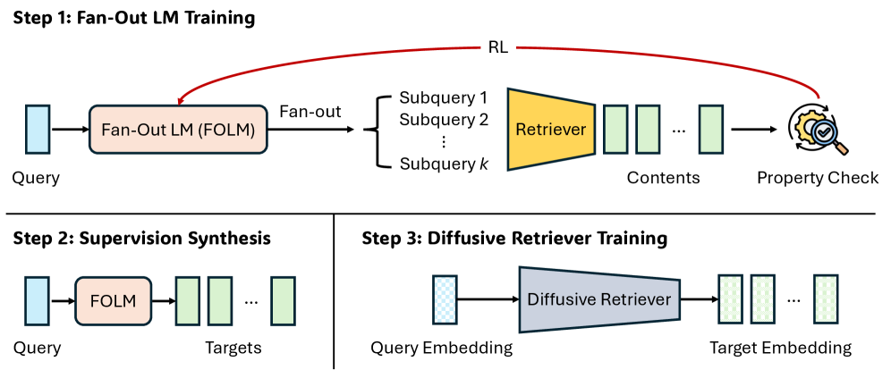
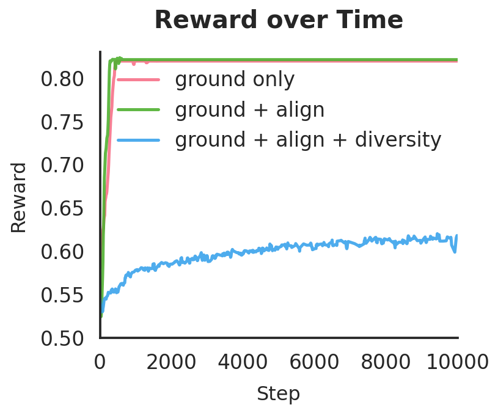
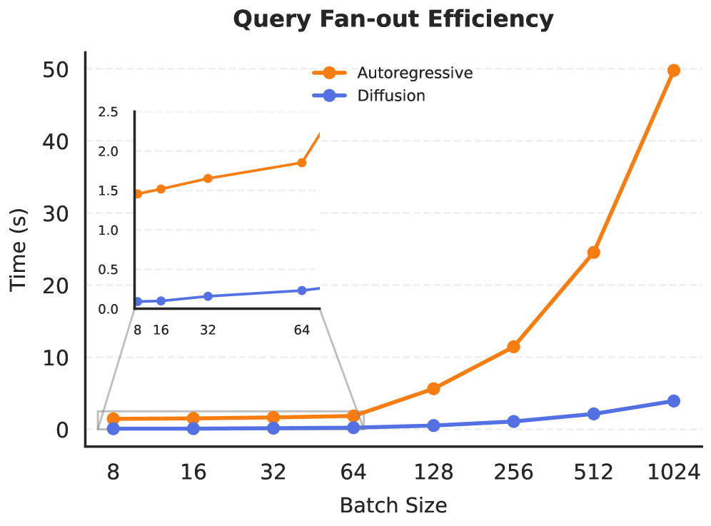

# Efficient, Property-Aligned Fan-Out Retrieval via RL-Compiled Diffusion

## 📌 核心贡献

> 提出 R4T 框架，将强化学习作为"目标转换器"：先用 RL 训练 fan-out 语言模型优化集合级检索目标，再将其蒸馏为轻量扩散检索器，实现单次前向推理即可生成多样性对齐的集合值检索结果，推理延迟降低一个数量级。

## 📖 摘要

Many modern retrieval problems are set-valued: given a broad intent, the system must return a collection of results that optimizes higher-order properties   (e.g., diversity, coverage, complementarity, coherence) while remaining grounded with respect to a fixed database. Set-valued objectives are typically   non-decomposable and are not captured by existing supervised (query, content) datasets which only prioritize top-1 retrieval. Consequently, fan-out   retrieval is often employed to generate diverse subqueries to retrieve item sets. While reinforcement learning (RL) can optimize set-level objectives via   interaction, deploying an RL-tuned LLM for fan-out retrieval is prohibitively expensive at inference time. Conversely, diffusion-based generative   retrieval enables efficient single-pass fan-out in embedding space, but requires objective-aligned training targets. To address these issues, we propose   R4T (Retrieve-for-Train), which uses RL once as an objective transducer in a three-step process: (i) train a fan-out LLM with composite set-level rewards,   (ii) synthesize objective-consistent training pairs, and (iii) train a lightweight diffusion retriever to model the conditional distribution of set-valued   outputs. Across large-scale fashion and music benchmarks consisting of curated item sets, we show that R4T improves retrieval quality relative to strong   baselines while reducing query-time fan-out latency by an order of magnitude.

## 🔍 关键信息

| 字段 | 内容 |
|------|------|
| 发表 | 2026-03-06 |
| 机构 | Google, University of Illinois Urbana-Champaign |
| 分类 | cs.IR, cs.LG |
| 链接 | [arXiv](https://arxiv.org/abs/2603.06397) |

## 📝 我的笔记

### 方法总览

### 动机与问题定义

现代检索任务中，许多场景需要**集合值检索（set-valued retrieval）**——给定一个宽泛的查询意图，系统需返回一组结果，满足多样性、覆盖度、互补性、连贯性等**集合级属性**。这类目标是**不可分解的（non-decomposable）**，传统的 (query, content) 监督数据只优化 top-1 检索，无法处理。

**Fan-out 检索**是一种常见策略：将一个宽泛查询展开为 $k$ 个子查询 $Q = \{q_1, \dots, q_k\}$，各自检索后聚合。核心矛盾在于：

- **RL 优化 LLM** 可以直接优化集合级目标，但推理代价极高（自回归生成多个子查询）
- **扩散模型**可以单次前向生成多个检索方向，但缺乏目标对齐的训练数据

R4T 的核心思路：**用 RL 一次性训练好策略 -> 生成合成数据 -> 蒸馏到轻量扩散模型**，将 RL 的优化能力与扩散模型的推理效率结合。

### 方法细节

#### Stage 1：Soft-GRPO 强化学习优化 Fan-Out LM

Fan-Out Language Model (FOLM) $\pi_\theta$ 以查询 $q$ 为输入，生成 $k$ 个子查询。使用 Group Relative Policy Optimization (GRPO) 训练，对每组采样计算优势函数：

$$A_i = \frac{r_i - \mu_G}{\sigma_G + \epsilon}, \quad \mu_G = \frac{1}{G}\sum_{j=1}^{G} r_j$$

在标准 GRPO 基础上加入**前向和反向 KL 正则化**（Soft-PPO），防止策略过度偏离：

$$\mathcal{J}(\theta) = \mathbb{E}_{\pi_{\text{old}}}\left[\mathcal{L}_{\text{GRPO}} - \beta_1 D_{\text{KL}}(\pi_\theta \| \pi_{\text{old}}) - \beta_2 D_{\text{KL}}(\pi_{\text{old}} \| \pi_\theta)\right]$$

实际实现的 per-token loss：

$$\mathcal{L}(\theta) = \mathbb{E}_t\left[-\min(\rho_t A_t, \text{clip}(\rho_t, 1-\epsilon, 1+\epsilon)A_t) + \beta_1 \cdot \rho_t(\log \pi_\theta(o_t) - \log \pi_{\text{old}}(o_t)) + \beta_2 \cdot (-\log \pi_\theta(o_t))\right]$$

其中 $\rho_t = \pi_\theta / \pi_{\text{old}}$ 为重要性比率。

#### 集合级奖励设计

论文定义了两类检索任务，各有不同的奖励函数：

**任务一：Open-Ended Abstract Retrieval (OAR)** —— 无参考集，组合三项奖励：

$$\mathcal{R}_{\text{abs}}(q, Q) = \lambda_g \cdot r_{\text{ground}}(Q) + \lambda_d \cdot r_{\text{div}}(Q) + \lambda_a \cdot r_{\text{align}}(q, Q)$$

- **Groundedness（接地性）**：惩罚子查询与数据库最近邻的距离
  $$r_{\text{ground}}(Q) = 1 - \frac{1}{k}\sum_{i=1}^{k} \min_{c \in \mathcal{D}} \|e_{\text{text}}(q_i) - e_{\text{content}}(c)\|_2$$
- **Diversity（多样性）**：使用 Vendi Score 衡量检索结果的多样性
  $$r_{\text{div}}(Q) = \text{Vendi}(\{e_{\text{content}}(c_i^*)\}_{i=1}^{k})$$
- **Alignment（对齐性）**：子查询与原始查询的余弦相似度
  $$r_{\text{align}}(q, Q) = \frac{1}{k}\sum_{i=1}^{k} \cos(e_{\text{text}}(q_i), e_{\text{text}}(q))$$

默认权重：$\lambda_g = 0.6, \lambda_d = \lambda_a = 0.2$。

**任务二：Weakly Supervised Compositional Retrieval (WSCR)** —— 有弱参考集 $\mathcal{Y}$，直接优化覆盖率：

$$\mathcal{R}_{\text{set}}(q, Q; \mathcal{Y}) = \frac{|\mathcal{Y} \cap \mathcal{R}(Q)|}{|\mathcal{Y}|}$$

#### Stage 2：合成监督数据生成

RL 优化后的 FOLM $\pi_\theta^*$ 作为行为生成器。对每个查询，采样 128 组 fan-out 输出并执行检索，构造目标张量：

- **OAR 任务**：$\mathbf{Z}_{\text{target}} \in \mathbb{R}^{L \times d}$，由检索到的内容 embedding $\{z_{c_1}, \dots, z_{c_L}\}$ 构成
- **WSCR 任务**：$\mathbf{Z}_{\text{target}}$ 由优化后的子查询 embedding $\{e_{\text{text}}(q_1), \dots, e_{\text{text}}(q_L)\}$ 构成

训练时随机置换行顺序以增强置换鲁棒性。合成数据集：$\mathcal{T}_{\text{syn}} = \{(z_q, \mathbf{Z}_{\text{target}})\}$。

#### Stage 3：扩散模型单次 Fan-out

使用 Transformer-based denoiser $D_\phi(\mathbf{Z}_t; \sigma, z_q)$，采用 Variance Exploding (VE) 扩散框架：

$$\mathcal{L}_{\text{diff}} = \mathbb{E}_{\sigma, \epsilon}\left[\lambda(\sigma) \cdot \|D_\phi(\mathbf{Z}_{\text{target}} + \sigma\epsilon; \sigma, z_q) - \mathbf{Z}_{\text{target}}\|^2\right]$$

其中 $\lambda(\sigma) = \frac{(\sigma^2 + \sigma_{\text{data}}^2)}{(\sigma \cdot \sigma_{\text{data}})^2}$。

关键设计：
- 使用 EDM 预条件化的 Transformer 架构
- 查询 embedding $z_q$ 通过 cross-attention 注入
- 训练时随机 drop $z_q$ 以支持 Classifier-Free Guidance (CFG)
- 推理时用 probability flow SDE 生成 $\mathbf{Z}_0$，再通过最近邻映射到数据库

**两种部署变体**：
1. **R4T-FOLM**：直接部署 RL 优化后的 FOLM（自回归，高质量但慢）
2. **R4T-Diffusion**：蒸馏到扩散模型（非自回归，单次前向，快 12-20 倍）

### 扩散模型架构细节

| 参数 | 值 |
|------|------|
| 骨架 | Coherent Transformer |
| 序列长度 $L$ | 12 |
| Embedding 维度 $d$ | 128 |
| 隐藏维度 | 1024 |
| MLP 维度 | 1024 |
| 注意力头数 | 16 |
| 层数 | 6 |
| 参数量 | 53.9M |
| 噪声调度 | Tangent, 范围 $[10^{-4}, 80.0]$ |
| $\sigma_{\text{data}}$ | 0.088 |
| CFG 强度 | 0.1 |
| 推理步数 | 256 |

### 关键实验结果

#### OAR 任务（LLM-as-a-Judge 评估，Gemini-2.5-Pro 评分，5 点 Likert 量表 x20）

**Polyvore 数据集（时尚）：**

| 方法 | Groundedness | Diversity | Alignment | Average |
|------|-------------|-----------|-----------|---------|
| No Fan-out | 22.4 | 34.4 | 21.4 | 26.1 |
| Gemma3-4B Zero-shot | 28.4 | 56.0 | 31.2 | 38.5 |
| Gemma3-4B Best-of-5 | 28.9 | 61.0 | 32.7 | 40.9 |
| **R4T-FOLM (Gemma)** | **30.8** | **76.8** | **39.8** | **49.1** |
| R4T-Diffusion (Gemma) | - | 74.3 | 37.6 | - |
| Qwen3-4B Zero-shot | 23.8 | 37.0 | 23.4 | 28.1 |
| Qwen3-4B Best-of-5 | 27.0 | 40.3 | 24.0 | 30.4 |
| **R4T-FOLM (Qwen)** | **37.0** | **62.8** | **28.0** | **42.6** |

**Music 数据集：**

| 方法 | Groundedness | Diversity | Alignment | Average |
|------|-------------|-----------|-----------|---------|
| No Fan-out | 48.8 | 20.0 | 41.8 | 36.9 |
| Gemma3-4B Zero-shot | 49.8 | 42.6 | 51.8 | 48.1 |
| **R4T-FOLM (Gemma)** | **63.1** | **49.2** | **62.0** | **58.1** |
| R4T-Diffusion (Gemma) | - | 46.7 | 59.6 | - |

#### WSCR 任务（Polyvore，弱参考集评估）

| 方法 | Recall@5K | Hit@5K | Vendi Score |
|------|-----------|--------|-------------|
| Gemini-2.5-Flash | 15.7 | 52.1 | 33.4 |
| Gemma3-4B | 6.0 | 25.9 | 44.2 |
| **R4T-FOLM (Gemma)** | **16.9** | **54.4** | 40.5 |
| **R4T-FOLM (Qwen)** | **20.9** | **64.6** | 27.5 |
| R4T-Diffusion (Gemma) | 15.0 | 54.1 | **46.2** |
| R4T-Diffusion (Qwen) | 16.5 | 57.5 | 34.7 |

值得注意的 trade-off：FOLM 的 Recall/Hit 更高但 Vendi Score 较低，说明自回归 fan-out 倾向于集中在主导语义模式上；扩散检索器的多样性更高。

### Ablation 分析

#### 奖励组件消融

奖励函数设计是 R4T 成功的关键。消融实验揭示了严重的 **reward hacking** 现象：

- **仅 Groundedness**：策略迅速收敛到退化字符串（如"line ending line ending..."），通过生成数据库中已有的文本碎片获得高分
- **Groundedness + Alignment**：通过简单复述原始查询实现捷径解（query paraphrasing collapse）
- **三项奖励组合（$\lambda_g{:}\lambda_d{:}\lambda_a = 6{:}2{:}2$）**：多样性和对齐性互为"反锚"，迫使策略进入平衡区域，捷径解失效，训练稳定收敛

#### 权重比例消融

| 权重比例 $\lambda_g{:}\lambda_d{:}\lambda_a$ | 效果 |
|------|------|
| 6:2:2 | 偏重接地性，多样性/对齐性受抑制 |
| 4:3:3 | 较均衡表现 |
| 2:4:4 | 偏重对齐/多样性，接地性探索不足 |

### 推理效率

| Batch Size | 自回归 LLM | 扩散模型 | 加速比 |
|------------|-----------|---------|--------|
| 8 | ~1.46s | ~0.07s | ~20x |
| 1024 | ~50s | ~4.21s | ~12x |

扩散模型（53.9M 参数）在所有 batch size 下均实现 12-20 倍加速，证实了从重量级自回归"System 2"到轻量级扩散"System 1"的蒸馏对于实时部署至关重要。

### 总结性评价

**优点：**
- 提出了一种优雅的三阶段框架，将 RL 的优化能力与扩散模型的推理效率解耦，避免了推理时部署 RL-tuned LLM 的高代价
- 奖励函数设计经过深入消融验证，reward hacking 分析具有实践指导意义
- 扩散蒸馏带来 12-20 倍推理加速，对工业部署有实际价值
- 在 embedding 空间而非 token 空间做生成式检索，天然支持多模态

**局限：**
- RL 训练阶段仍需与检索器反复交互，前期训练成本高
- 奖励函数需要人工设计，主观性质（创意、文化敏感性等）难以编码
- 评估依赖 LLM-as-a-Judge，可能引入评判模型自身的偏差
- 实验仅在时尚和音乐两个领域验证，泛化性待考察

## 🔗 相关论文

**基于/改进自：** [[GRPO]]

**同方向：** [[Diffusion-DPO]], [[DDPO]]
