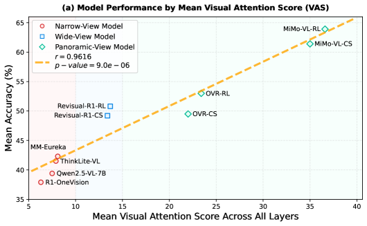
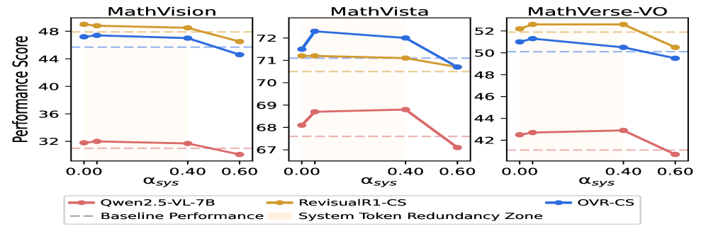
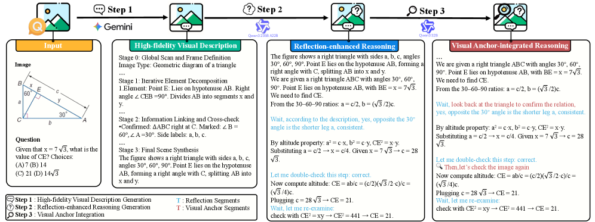

# From Narrow to Panoramic Vision: Attention-Guided Cold-Start Reshapes Multimodal Reasoning

## 📌 核心贡献

> 提出 Visual Attention Score (VAS) 指标揭示多模态冷启动的"懒注意力"现象（多模态数据冷启动反而无法提升视觉注意力），并据此设计 AVAR 框架——通过注意力引导的数据合成、训练目标和奖励塑形，在 7 个多模态推理基准上平均提升 7.0%。

## 📖 摘要

The cold-start initialization stage plays a pivotal role in training Multimodal Large Reasoning Models (MLRMs), yet its mechanisms remain insufficiently understood. To analyze this stage, we introduce the Visual Attention Score (VAS), an attention-based metric that quantifies how much a model attends to visual tokens. We find that reasoning performance is strongly correlated with VAS (r=0.9616): models with higher VAS achieve substantially stronger multimodal reasoning. Surprisingly, multimodal cold-start fails to elevate VAS, resulting in attention distributions close to the base model, whereas text-only cold-start leads to a clear increase. We term this counter-intuitive phenomenon Lazy Attention Localization. To validate its causal role, we design training-free interventions that directly modulate attention allocation during inference, performance gains of 1$-$2% without any retraining. Building on these insights, we further propose Attention-Guided Visual Anchoring and Reflection (AVAR), a comprehensive cold-start framework that integrates visual-anchored data synthesis, attention-guided objectives, and visual-anchored reward shaping. Applied to Qwen2.5-VL-7B, AVAR achieves an average gain of 7.0% across 7 multimodal reasoning benchmarks. Ablation studies further confirm that each component of AVAR contributes step-wise to the overall gains. The code, data, and models are available at https://github.com/lrlbbzl/Qwen-AVAR.

## 🔍 关键信息

| 字段 | 内容 |
|------|------|
| 发表 | 2026-03-04 |
| 机构 | Tsinghua University, Alibaba (Qwen), USC, UCSD, ZJU, SJTU |
| 分类 | cs.CV, cs.AI |
| 链接 | [arXiv](https://arxiv.org/abs/2603.03825) |

## 📝 我的笔记

### 动机与问题定义

多模态大语言推理模型（MLRMs）的训练通常分为两个阶段：**冷启动 SFT**（学习推理格式和基础能力）和 **RL 强化学习**（提升推理质量）。已有工作大量聚焦于 RL 阶段的优化，但对冷启动阶段的机制理解非常有限。

本文的核心问题：**冷启动训练究竟如何影响多模态推理能力？** 作者从注意力分配的角度切入，发现了一个反直觉的现象。

### 关键发现：Lazy Attention Localization

#### Visual Attention Score (VAS)

作者定义了 VAS 来量化模型对视觉 token 的注意力程度：

**单头 VAS：**

$$VAS_i(l,h) = \frac{\sum_{j \in V} A_{i,j}(l,h)}{\sum_{j \in S} A_{i,j}(l,h)}$$

**模型级 VAS：**

$$VAS = \frac{1}{L \cdot H \cdot |U|} \sum_l \sum_h \sum_{i \in U} VAS_i(l,h)$$

其中 $V$ 为视觉 token 集合，$S$ 为系统 token 集合，$U$ 为用户 token 集合，$L$ 为层数，$H$ 为注意力头数。

在 12 个 7B 级模型、200 个 MathVista 样本上的实验表明，VAS 与推理性能的 Pearson 相关系数高达 **r = 0.9616**。

#### "懒注意力"现象

关键发现：**多模态数据冷启动反而无法提升 VAS**，其注意力分布与基座模型几乎一致。相比之下，纯文本冷启动反而能让视觉注意力提升 15-20%。这种反直觉现象被命名为 **Lazy Attention Localization**。

原因分析：多模态冷启动数据中，模型倾向于依赖系统提示中的任务描述（system tokens），而非真正"看"图片。

### 训练无关干预验证

为验证注意力分配的因果性，作者设计了一种无需重训练的推理时干预方法：

$$\hat{Z}_{l,h} = Z_{l,h} + \alpha_{img} \cdot M_{l,h}^{enh} \odot Z_{l,h} - \alpha_{sys} \cdot M_{l,h}^{sup} \odot Z_{l,h}$$

其中 $M^{enh}$ 和 $M^{sup}$ 分别为视觉增强和系统抑制的注意力掩码。仅通过调整推理时的注意力分配，就能在多个模型上获得 **1-2% 的性能提升**，无需任何重训练。

### AVAR 框架

基于以上洞察，作者提出 **Attention-Guided Visual Anchoring and Reflection (AVAR)** 框架，包含三个组件：

#### 1. Visual-Anchored Reflection Data (VARD) — 视觉锚定反思数据合成

三步流程：
- **Step 1：高保真视觉描述** — 用 Gemini 2.5-Pro 生成详细的视觉描述（全局扫描 + 元素分解 + 信息链接 + 最终合成）
- **Step 2：反思增强推理** — 用 Qwen3-235B-A22B 生成带有反思和自我纠错的推理链
- **Step 3：视觉锚点整合** — 用 Qwen3-32B 将视觉描述中的关键信息嵌入推理链，形成视觉锚定的推理过程

数据规模：约 **30.6K** 实例，来源包括 R1-ShareVL (~22.2K)、Geo3K (~2.1K)、M3COT (~3.2K)、AlgoPuzzleVQA (~1.8K)、SOLIDGEO (~1.3K)。

#### 2. Attention-Guided Training Objectives (AGTO) — 注意力引导训练目标

在标准语言模型损失之上，增加两个注意力引导损失：

**视觉增强损失（鼓励关注图像 token）：**

$$\mathcal{L}_{enhance\text{-}img} = -\frac{1}{|L|} \sum_l \frac{1}{H} \sum_h \log\left(\frac{1}{|Q| \cdot |K_{img}|} \sum_q \sum_k A_{q,k}^{l,h}\right)$$

**系统抑制损失（抑制对系统 token 的过度关注）：**

$$\mathcal{L}_{suppress\text{-}sys} = \frac{1}{|L|} \sum_l \frac{1}{H} \sum_h \log\left(\frac{1}{|Q| \cdot |K_{sys}|} \sum_q \sum_k A_{q,k}^{l,h} + \epsilon\right)$$

**总损失：**

$$\mathcal{L}_{total} = \mathcal{L}_{LM} + 0.15 \cdot \mathcal{L}_{enhance\text{-}img} + 0.15 \cdot \mathcal{L}_{suppress\text{-}sys}$$

#### 3. Visual-Anchored Reward Shaping (VARS) — 视觉锚定奖励塑形

在 GRPO 强化学习阶段，设计视觉注意力奖励：

$$r_{visual} = \begin{cases} 0 & \text{if incorrect} \\ \frac{1}{|T|} \sum_t \frac{1}{|L|} \sum_l \frac{\sum_{k \in K_{img}} A_{t,k}^l}{\sum_{k \in K_{sys}} A_{t,k}^l + \epsilon} & \text{if correct} \end{cases}$$

**总奖励：**

$$r_{total} = r_{accuracy} + \lambda_v \cdot r_{visual} + \lambda_f \cdot r_{format}$$

其中 $\lambda_v = 0.3$，$\lambda_f = 0.1$。只有在回答正确时才给予视觉注意力奖励，避免鼓励"看了图但答错了"的情况。

### 训练细节

| 阶段 | 学习率 | Batch Size | Epochs | 硬件 |
|------|--------|-----------|--------|------|
| Cold-start SFT | $5 \times 10^{-6}$ | 512 | 20 | 16 x A100 |
| GRPO RL | $1 \times 10^{-6}$ | 256 | 4 | 16 x A100 |

RL 阶段使用 8 次 rollout，KL 散度系数为 0.0，训练数据为 17.9K 公开样本。

### 关键实验结果

#### 主实验：7 个多模态推理基准

| 模型 | MathVista | MathVision | MathVerse-VO | MMMU-VAL | MMMU-Pro | MMStar | HalluBench | Avg. |
|------|-----------|-----------|--------------|----------|----------|--------|------------|------|
| Qwen2.5-VL-7B | 68.2 | 25.2 | 41.1 | 58.1 | 38.3 | 62.1 | 50.7 | 49.1 |
| InternVL2.5-8B | 64.4 | 22.0 | 39.5 | 56.0 | 38.2 | 63.2 | 51.1 | 47.8 |
| R1-OneVision | 64.1 | 29.9 | 40.0 | 49.1 | 32.2 | 52.2 | 46.0 | 44.8 |
| ThinkLite-VL | 75.1 | 32.9 | 45.8 | 55.5 | 40.0 | 65.0 | 52.3 | 53.1 |
| MM-Eureka-7B | 73.0 | 26.9 | 48.1 | 52.0 | 42.4 | 65.2 | 50.7 | 51.2 |
| **AVAR-Thinker** | **74.7** | **37.4** | **50.4** | **63.8** | **42.9** | **64.1** | **59.5** | **56.1** |
| **vs. Qwen 基线** | **+6.5** | **+12.2** | **+9.3** | **+5.7** | **+4.6** | **+2.0** | **+8.8** | **+7.0** |

AVAR-Thinker 在 7 个基准上平均提升 7.0%，其中 MathVision (+12.2%) 和 MathVerse-VO (+9.3%) 提升最为显著。

#### 冷启动数据对比

| 冷启动数据 | MathVista | MathVision | MathVerse-VO | MMStar | MMMU-val | MMMU-Pro | HalluBench | Avg. |
|-----------|-----------|-----------|--------------|--------|----------|----------|------------|------|
| Baseline | 68.2 | 25.2 | 41.1 | 62.1 | 58.1 | 38.3 | 50.7 | 49.1 |
| R1-OneVision | 63.3 | 26.3 | 39.7 | 54.9 | 49.9 | 34.6 | 43.8 | 44.6 |
| OpenVLThinker | 68.9 | 25.3 | 37.8 | 58.7 | 55.7 | 36.0 | 54.1 | 48.1 |
| Vision-SR1 | 67.6 | 27.9 | 42.3 | 46.9 | 50.7 | 36.3 | 42.1 | 44.8 |
| **VARD (Ours)** | **70.6** | **32.9** | **43.5** | **61.1** | **55.2** | **38.7** | **55.3** | **51.0** |

VARD 数据在仅 SFT 阶段就超越了其他所有冷启动数据方案，且是唯一超过基线的方法。

### Ablation 分析

#### 组件逐步叠加

| 配置 | VARD | AGTO | VARS | Avg. |
|------|------|------|------|------|
| Baseline | - | - | - | 49.1 |
| + VARD | Y | - | - | 51.0 (+1.9) |
| + AGTO | Y | Y | - | 52.6 (+3.5) |
| **AVAR-Thinker** | **Y** | **Y** | **Y** | **56.1 (+7.0)** |

三个组件逐步叠加，每一步都有稳定提升。RL 阶段（VARS）贡献最大（+3.5%），说明奖励塑形对引导视觉注意力的重要性。

#### VAS 随训练阶段的演变

| 阶段 | VAS | Avg. 性能 |
|------|-----|----------|
| Qwen2.5-VL-7B (基线) | 7.5 | 49.3 |
| + VARD 数据 SFT | 10.1 | 51.0 |
| + AGTO (AVAR-CS) | 13.8 | 52.6 |
| + VARS (AVAR-Thinker) | 18.9 | 56.1 |

VAS 从 7.5 提升到 18.9（2.5 倍），推理性能同步提升，进一步验证了 VAS 与推理能力之间的强因果关系。

### 总结性评价

**优点：**
- 分析视角新颖：从注意力分配角度解释冷启动的作用机制，Lazy Attention Localization 是一个有价值的发现
- 方法论完整：从观察 -> 因果验证（训练无关干预）-> 系统性解决方案（AVAR），逻辑链条清晰
- 三个组件（数据、训练目标、奖励）从不同层面协同引导注意力分配，设计合理
- 实验充分：7 个基准、详细的 ablation、VAS 追踪、多种冷启动数据对比

**局限：**
- 仅在 Qwen2.5-VL-7B 上验证，缺乏对更大模型和其他架构的泛化验证
- VARD 数据合成依赖 Gemini 2.5-Pro 和 Qwen3-235B 等强模型，成本较高
- VAS 指标基于注意力权重，而注意力权重是否真正反映"理解"仍有争议
- 注意力损失的超参数 ($\alpha = \beta = 0.15$, $\lambda_v = 0.3$) 的敏感性分析不够充分

## 🔗 相关论文

<!-- 可手动添加 [[wiki-link]] -->
