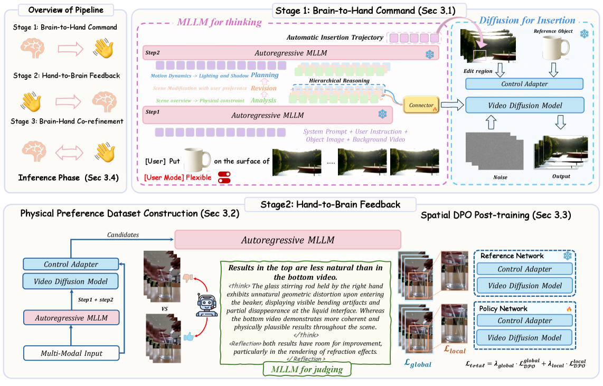
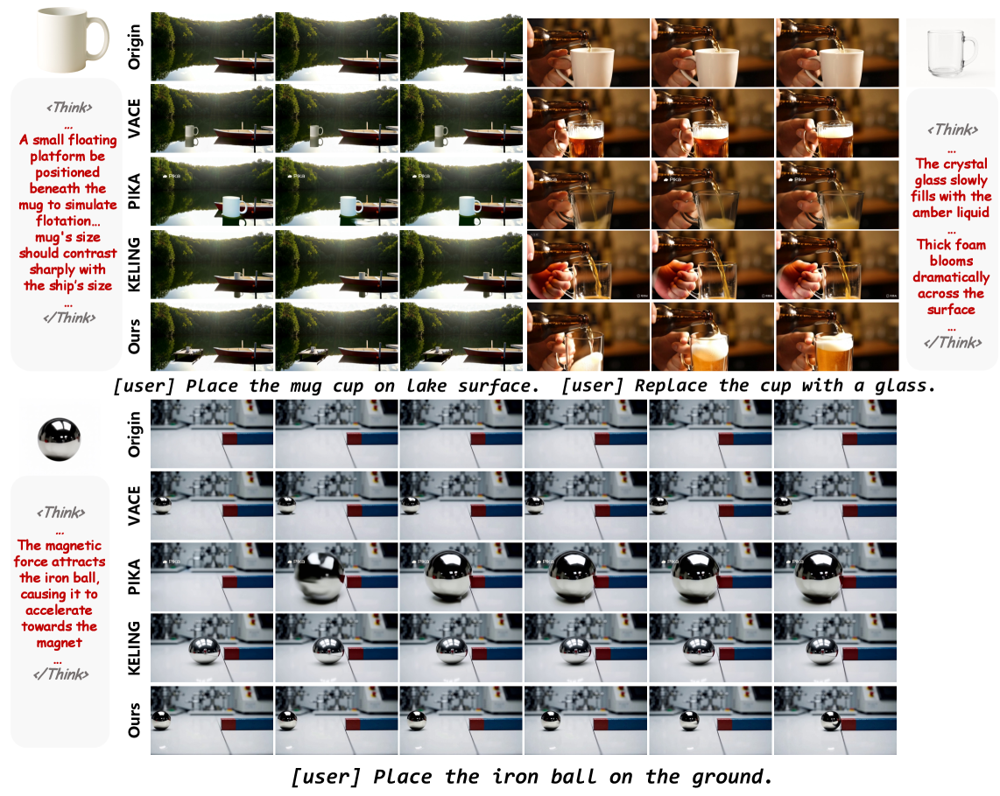
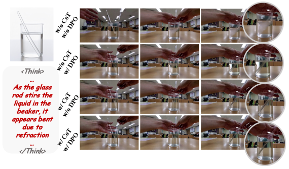

# Place-it-R1: Unlocking Environment-aware Reasoning Potential of MLLM for Video Object Insertion

## 📌 核心贡献

> 提出 Think-then-Place 范式，利用 MLLM 的 CoT 推理能力进行物理场景理解和交互推理，结合 Spatial DPO 后训练和闭环 co-refinement 机制，实现物理合理的视频物体插入，性能超越商业模型（Kling、PIKA）。

## 📖 摘要

Modern video editing techniques have achieved high visual fidelity when inserting video objects. However, they focus on optimizing visual fidelity rather than physical causality, leading to edits that are physically inconsistent with their environment. In this work, we present Place-it-R$1$, an end-to-end framework for video object insertion that unlocks the environment-aware reasoning potential of Multimodal Large Language Models (MLLMs). Our framework leverages the Chain-of-Thought (CoT) reasoning of MLLMs to orchestrate video diffusion, following a Think-then-Place paradigm. To bridge cognitive reasoning and generative execution, we introduce three key innovations: First, MLLM performs physical scene understanding and interaction reasoning, generating environment-aware chain-of-thought tokens and inferring valid insertion regions to explicitly guide the diffusion toward physically plausible insertion. Then, we introduce MLLM-guided Spatial Direct Preference Optimization (DPO), where diffusion outputs are fed back to the MLLM for scoring, enabling visual naturalness. During inference, the MLLM iteratively triggers refinement cycles and elicits adaptive adjustments from the diffusion model, forming a closed-loop that progressively enhances editing quality. Furthermore, we provide two user-selectable modes: a plausibility-oriented flexible mode that permits environment modifications (\eg, generating support structures) to enhance physical plausibility, and a fidelity-oriented standard mode that preserves scene integrity for maximum fidelity, offering users explicit control over the plausibility-fidelity trade-off. Extensive experiments demonstrate Place-it-R1 achieves physically-coherent video object insertion compared with state-of-the-art solutions and commercial models.

## 🔍 关键信息

| 字段 | 内容 |
|------|------|
| 发表 | 2026-03-06 |
| 机构 | HKUST, Tencent Video, Peking University |
| 分类 | cs.CV, cs.AI |
| 链接 | [arXiv](https://arxiv.org/abs/2603.06140) |

## 📝 我的笔记

### 动机与问题定义

现有视频物体插入方法（如 VACE、UNIC）主要优化视觉保真度，但忽略了**物理因果性**——插入的物体往往与环境物理不一致（例如杯子漂浮在水面上没有支撑、铁球在磁铁旁边没有加速运动）。核心问题是：视频扩散模型缺乏对物理世界的推理能力，无法理解物体与环境之间的交互关系。

Place-it-R1 的核心思路是利用 MLLM（多模态大语言模型）的 CoT 推理能力作为"大脑"，指导视频扩散模型（"手"）完成物理合理的插入。框架遵循 **Think-then-Place** 范式，分三个阶段：Brain-to-Hand Command、Hand-to-Brain Feedback、Brain-Hand Co-refinement。

### 方法总览

### Stage 1: Brain-to-Hand Command（MLLM 推理指导扩散生成）

**层级推理（Hierarchical Reasoning）**：MLLM 分三步进行推理：

1. **Analysis（分析）**：综合理解背景视频上下文、物体属性、用户指令、物理约束
2. **Revision（修正）**：根据用户选择的模式分支——**Flexible 模式**允许修改环境（如生成支撑结构）以增强物理合理性；**Standard 模式**保持场景完整性
3. **Planning（规划）**：生成插入引导，包括运动规格和光照/阴影分析

**自动插入轨迹**：MLLM 输出精确的边界框 $[x_1, y_1, x_2, y_2]$，指定目标物体位置和需修改区域，转换为二值 mask 提供像素级扩散引导。

**Thinking-aligned Training**：基于 VACE 框架扩展 WAN 2.1，通过两条互补的条件路径桥接推理与生成：

- **语义条件路径（Semantic Conditioning）**：轻量级连接器模块（两层 MLP）将 MLLM 的"环境感知交互推理 token"投影到文本嵌入空间，用 Flow Matching 损失训练：

$$\mathcal{L}_{FM} = \mathbb{E}_{t, x_t} \| v_\theta(x_t, t, c) - u_t \|^2$$

- **空间条件路径（Spatial Conditioning）**：直接利用空间定位生成的二值 mask 指定修改区域

连接器训练时其余组件冻结，在 32 张 H20 GPU 上训练 500K 步。

### Stage 2: Hand-to-Brain Feedback（Spatial DPO 后训练）

**物理偏好数据集构建**：对每个样本用不同随机种子生成 5 个插入候选。MLLM 从三个维度评估：
- 物体尺度合理性
- 光度一致性（光照/阴影渲染）
- 与环境的物理交互

质量保障策略：(1) 在视频中用红色框标注候选区域帮助 MLLM 定位；(2) 一致性排序协议——每组候选以不同顺序排列两次，仅当两次排序一致时才接受偏好对。

**Spatial DPO 损失设计**：

标准全局 DPO 损失：

$$\mathcal{L}_{DPO}^{global} = -\mathbb{E}_{(v_w, v_l)} \left[ \log \sigma \left( \beta \cdot \Delta_{\theta, ref} \right) \right]$$

其中 $\Delta_{\theta, ref} = (L_\theta^l - L_\theta^w) - (L_{\theta_{ref}}^l - L_{\theta_{ref}}^w)$，$L = \| \epsilon(v^t, t) - \epsilon_{target} \|^2$。

**关键创新——Spatial DPO**：引入 mask 加权的去噪损失，聚焦插入区域：

$$L(v, \mathcal{M}) = \| (\epsilon(v^t, t) - \epsilon_{target}) \odot \mathcal{M} \|^2$$

$$\mathcal{L}_{DPO}^{local} = -\mathbb{E}_{(v_w, v_l, \mathcal{M})} \left[ \log \sigma \left( \beta \cdot \Delta_{\theta, ref}^{local} \right) \right]$$

**总损失**结合全局和局部：

$$\mathcal{L}_{total} = \lambda_{global} \cdot \mathcal{L}_{DPO}^{global} + \lambda_{local} \cdot \mathcal{L}_{DPO}^{local}$$

超参数：$\beta = 100$，$\lambda_{global} = 0.5$，$\lambda_{local} = 0.5$。DPO 阶段使用 LoRA（rank=128）微调 WAN 和 VACE，10K 步，batch size=8。

### Stage 3: Brain-Hand Co-refinement（推理时闭环精修）

推理阶段 MLLM 在每次生成后从物体尺度、光度一致性、物理交互三个维度迭代评估，不满足则触发修正循环。通常 2-3 轮即可收敛（主实验中设为 1 轮以控制计算开销）。

### 实现细节

- MLLM：QwenVL 2.5-7B
- 扩散骨干：WAN 1.3B
- 控制适配器：初始化自 VACE 1.3B
- 数据集：自建主体整合数据集，人-物交互视频 10,198 条 + 物理演示视频 10,352 条

### 关键实验结果

**三个基准测试的定量对比：**

UNIC Benchmark（20 samples）：

| 方法 | CLIP-I | DINO-I | Smooth | Aesth | PC | PP |
|------|--------|--------|--------|-------|-----|-----|
| UNIC | 0.598 | 0.245 | 0.961 | 0.563 | 4.20 | 5.33 |
| Kling（商业） | 0.620 | 0.251 | 0.954 | 0.564 | 4.41 | 5.93 |
| PIKA（商业） | 0.686 | 0.375 | 0.994 | 0.615 | 4.34 | 6.11 |
| Lucy-edit pro（商业） | 0.602 | 0.263 | 0.987 | 0.569 | 4.28 | 5.79 |
| **Place-it-R1 (standard)** | 0.604 | 0.290 | 0.993 | 0.568 | 4.53 | 6.21 |
| **Place-it-R1 (flexible)** | 0.604 | 0.290 | 0.992 | 0.579 | **4.60** | **6.63** |

FlexInsert Benchmark（100 samples）：

| 方法 | CLIP-I | DINO-I | Smooth | Aesth | PC | PR | PP |
|------|--------|--------|--------|-------|-----|------|------|
| AnyV2V + Anydoor | 0.785 | 0.381 | 0.985 | 0.483 | 3.87 | 0.66 | 3.38 |
| VACE + Trajectory (w/o CoT) | 0.729 | 0.254 | 0.991 | 0.492 | 4.03 | 0.67 | 5.21 |
| **Place-it-R1 (standard)** | 0.794 | 0.492 | 0.992 | 0.529 | 4.13 | 0.78 | 7.28 |
| **Place-it-R1 (flexible)** | 0.794 | 0.493 | 0.991 | 0.531 | **4.17** | **0.86** | **7.93** |

其中 PC = Physical Commonsense，PR = Physical Rules，PP = Physical Plausibility。Place-it-R1 在物理合理性指标（PC/PR/PP）上全面领先，flexible 模式下 PP 分数显著优于所有基线（UNIC 上 6.63 vs PIKA 的 6.11；FlexInsert 上 7.93 vs 最强基线 5.21）。

### Ablation 分析

**组件消融（FlexInsert Benchmark）：**

| 变体 | CLIP-I | DINO-I | Smooth | Aesth | PC | PR |
|------|--------|--------|--------|-------|-----|------|
| w/o CoT | 0.768 | 0.449 | 0.986 | 0.499 | 3.92 | 0.67 |
| w/o DPO | 0.772 | 0.455 | 0.989 | 0.494 | 4.09 | 0.75 |
| w CoT (Text) | 0.783 | 0.449 | 0.989 | 0.510 | 4.02 | 0.69 |
| w Trajectory (w/o CoT) | 0.731 | 0.375 | 0.992 | 0.514 | 4.05 | 0.70 |
| **Full Place-it-R1** | **0.794** | **0.493** | 0.991 | **0.531** | **4.17** | **0.86** |

关键发现：
- 去掉 CoT 后各指标全面下降，尤其 PR 从 0.86 降至 0.67
- 用纯文本替代 CoT token 效果更差，说明 MLLM 语言空间具有更丰富的表征能力
- 去掉 DPO 后物理指标显著退化
- CoT 和 Spatial DPO 存在**协同效应**，缺一不可

**Spatial DPO 超参数消融：**

| $\lambda_{local}$, $\lambda_{global}$ | CLIP-I | DINO-I | PC | PR |
|------|--------|--------|-----|------|
| 0.9, 0.1 | 0.793 | 0.483 | 4.06 | 0.69 |
| **0.5, 0.5** | **0.794** | **0.493** | **4.17** | **0.86** |
| 0.3, 0.7 | 0.792 | 0.471 | 4.15 | 0.79 |

均衡权重最优。过度偏重 local 导致背景闪烁；过度偏重 global 则丧失细节精修能力。

**推理迭代次数消融（HumanSync）：**

| 配置 | 时间(s) | DINO-I | Smooth | Aesth | PC |
|------|---------|--------|--------|-------|-----|
| VACE baseline | 15.15 | 0.421 | 0.991 | 0.495 | 4.12 |
| Place-it-R1（无迭代） | 18.07 | 0.450 | 0.993 | 0.530 | 4.37 |
| +1 轮精修 | 38.06 | 0.455 | 0.993 | 0.532 | 4.46 |
| +2 轮精修 | 60.13 | 0.457 | 0.993 | 0.533 | 4.53 |

迭代精修带来稳定提升但边际收益递减，1 轮精修性价比最高。

### 总结性评价

**优点：**
- 首次将 MLLM 的 CoT 推理能力系统性地整合进视频物体插入流程，Think-then-Place 范式非常优雅
- Spatial DPO 的设计（mask 加权 + 全局/局部双重损失）是标准 DPO 应用于空间局部编辑任务的自然扩展，方法合理
- 两种用户可选模式（flexible/standard）在物理合理性和保真度之间提供了显式控制
- 闭环 co-refinement 在推理阶段带来持续提升，思路值得借鉴

**局限性：**
- 推理效率随迭代次数线性增长（2 轮精修耗时 60s vs 基线 15s），实际部署受限
- 框架高度依赖 MLLM 的推理质量，对异常/抽象的编辑请求可能产生次优引导
- WAN 1.3B 作为扩散骨干相对较小，可能限制了视觉质量上限

**个人思考：**
- 这篇工作的核心洞察是"生成模型缺乏物理推理能力，但 MLLM 有"，通过 CoT token 桥接两者。这个范式可能推广到更多需要推理指导的生成任务
- Spatial DPO 的思路（用 mask 聚焦编辑区域的偏好优化）对所有局部编辑类任务（inpainting、local editing）都有参考价值
- 偏好数据构建中的一致性排序协议（两次排序取交集）是个小但有效的细节，减少了 MLLM 评估的位置偏差

## 🔗 相关论文

**基于/改进自：** [[VACE]], [[WAN]]

**对比基线：** [[UNIC]], [[AnyV2V]]

**同方向：** [[Diffusion-DPO]], [[VideoDPO]]
