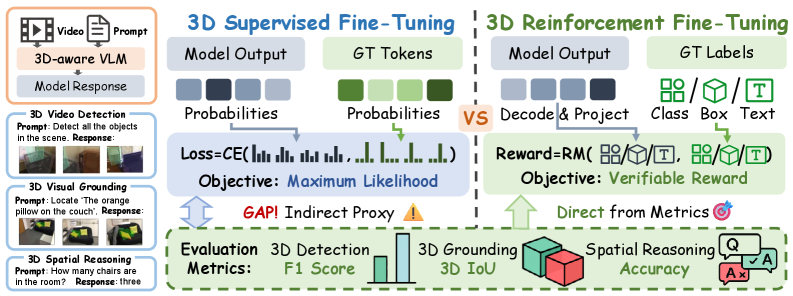
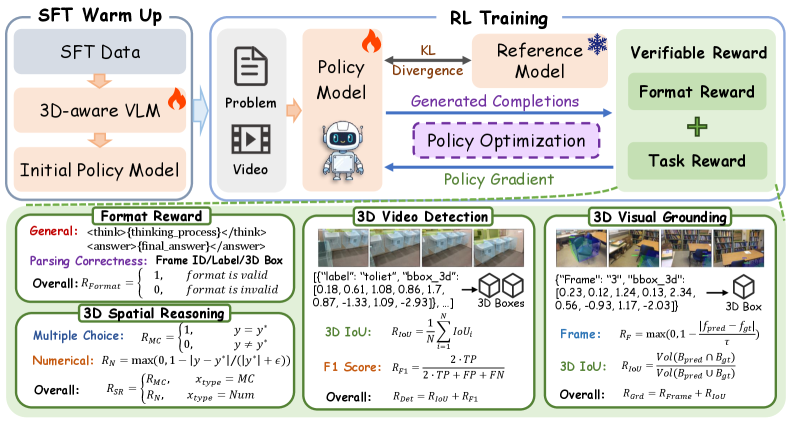
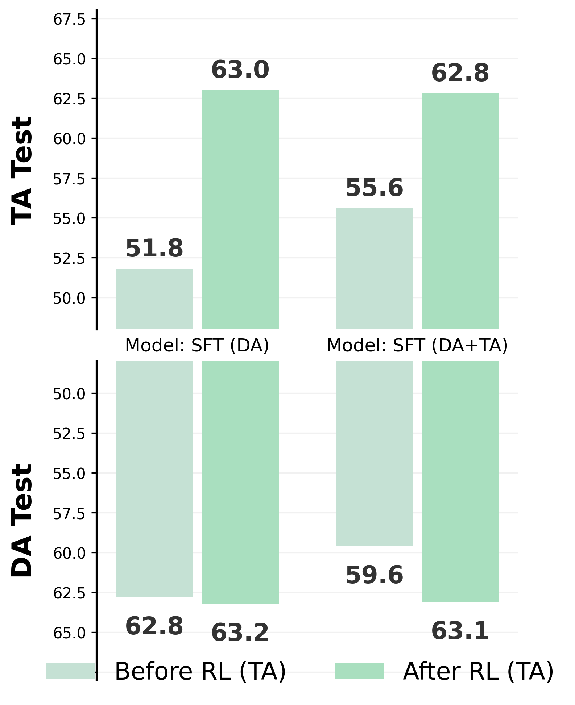

# 3D-RFT: Reinforcement Fine-Tuning for Video-based 3D Scene Understanding

## 📌 核心贡献

> 首次将 RLVR（Reinforcement Learning with Verifiable Rewards）扩展到基于视频的 3D 场景理解，通过 GRPO + 任务特定可验证奖励函数（3D IoU、F1-Score）直接优化评估指标，4B 模型即超越 8B SFT 基线。

## 📖 摘要

Reinforcement Learning with Verifiable Rewards ( RLVR ) has emerged as a transformative paradigm for enhancing the reasoning capabilities of Large Language Models ( LLMs), yet its potential in 3D scene understanding remains under-explored. Existing approaches largely rely on Supervised Fine-Tuning ( SFT), where the token-level cross-entropy loss acts as an indirect proxy for optimization, leading to a misalignment between training objectives and task performances. To bridge this gap, we present Reinforcement Fine-Tuning for Video-based 3D Scene Understanding (3D-RFT ), the first framework to extend RLVR to video-based 3D perception and reasoning. 3D-RFT shifts the paradigm by directly optimizing the model towards evaluation metrics. 3D-RFT first activates 3D-aware Multi-modal Large Language Models ( MLLM s) via SFT, followed by reinforcement fine-tuning using Group Relative Policy Optimization ( GRPO) with strictly verifiable reward functions. We design task-specific reward functions directly from metrics like 3D IoU and F1-Score to provide more effective signals to guide model training. Extensive experiments demonstrate that 3D-RFT-4B achieves state-of-the-art performance on various video-based 3D scene understanding tasks. Notably, 3D-RFT-4B significantly outperforms larger models (e.g., VG LLM-8B) on 3D video detection, 3D visual grounding, and spatial reasoning benchmarks. We further reveal good properties of 3D-RFT such as robust efficacy, and valuable insights into training strategies and data impact. We hope 3D-RFT can serve as a robust and promising paradigm for future development of 3D scene understanding.

## 🔍 关键信息

| 字段 | 内容 |
|------|------|
| 发表 | 2026-03-05 |
| 机构 | BIGAI (Beijing Institute for General Artificial Intelligence) |
| 分类 | cs.CV, cs.AI |
| 链接 | [arXiv](https://arxiv.org/abs/2603.04976) |

## 📝 我的笔记

### 动机与问题定义

现有 3D 场景理解方法主要依赖 SFT，其 token 级交叉熵损失只是评估指标的间接代理，导致训练目标与任务性能之间存在 **misalignment**。例如：
- 3D 检测任务关心的是 IoU 和 F1-Score，而不是逐 token 的 log-likelihood
- SFT 无法区分"差一点命中"和"完全偏离"的输出——两者在交叉熵视角下差异有限

RLVR（Reinforcement Learning with Verifiable Rewards）已在 LLM 推理任务中展现强大效果（如 DeepSeek-R1），但在 3D 视觉理解领域尚无探索。本文首次将 RLVR 扩展到基于视频的 3D 感知与推理。

### 方法总览

#### 模型架构

基础模型为 **VG LLM-4B**，由以下组件构成：
- **MLLM 主干**：Qwen2.5-VL-3B-Instruct
- **视觉几何主干**：VGGT-1B（提供 3D 先验）
- 两者特征通过 **逐元素加法** 融合

#### 任务定义

三类任务统一为条件文本生成，输出格式强制使用 `<think>` 标签（推理过程）和 `<answer>` 标签（预测结果）。

**9-DoF 边界框表示**：

$$b = (x, y, z, w, h, d, \psi, \theta, \phi)$$

- **3D 视频检测**：检测视频中所有物体 $\{(b_i, c_i)\}$，统一到第一帧坐标系
- **3D 视觉定位**：给定文本描述，预测 $(f_{pred}, b_{pred})$，包含帧索引和局部坐标系 9-DoF 框
- **3D 空间推理**：回答关于空间属性与关系的文本问题

#### 阶段一：SFT 预热

标准监督微调，激活模型的 3D 感知能力：

$$\mathcal{L}_{SFT}(\theta) = -\sum_{t=1}^{T} \log \pi_\theta(y_t^* \mid x, I, y_{<t}^*)$$

#### 阶段二：GRPO 强化微调

使用 Group Relative Policy Optimization 直接优化评估指标：

$$\mathcal{L}_{GRPO}(\theta) = -\frac{1}{\sum T_i} \sum_i \sum_t \mathcal{L}_{i,t}(\theta) + \beta \mathcal{D}_{KL}[\pi_\theta \| \pi_{ref}]$$

其中 clipped objective 为：

$$\mathcal{L}_{i,t}(\theta) = \min\left(r_{i,t} A_i, \; \text{clip}(r_{i,t}, 1-\varepsilon, 1+\varepsilon) A_i\right)$$

概率比和优势函数：

$$r_{i,t} = \frac{\pi_\theta(y_{i,t} \mid I_i, x_i, y_{i,<t})}{\pi_{\theta_{old}}(y_{i,t} \mid I_i, x_i, y_{i,<t})}$$

$$A_i = \frac{R_i - \text{mean}(\{R_1, \ldots, R_m\})}{\text{std}(\{R_1, \ldots, R_m\})}$$

### 可验证奖励设计

这是本文的核心创新——为每类任务设计直接基于评估指标的奖励函数。

#### 3D 视频检测奖励

平均 IoU 奖励：

$$R_{IoU}^{(Det)} = \frac{1}{N} \sum_{i=1}^{N} \mathcal{I}_i$$

F1-Score 奖励（TP 判定阈值 $\tau_{F1} = 0.25$）：

$$R_{F1} = \frac{2 \cdot TP}{2 \cdot TP + FP + FN}$$

综合检测奖励：

$$R_{Det} = R_{IoU}^{(Det)} + R_{F1}$$

#### 3D 视觉定位奖励

时序帧奖励（$\tau_{frame} = 5$）：

$$R_{frame} = \max\left(0, \; 1 - \frac{|f_{pred} - f_{gt}|}{\tau_{frame}}\right)$$

IoU 奖励（需将预测框对齐到全局坐标系后计算）：

$$R_{IoU}^{(Grd)} = \frac{|b_{pred}' \cap b_{gt}|}{|b_{pred}' \cup b_{gt}|}$$

其中 $b_{pred}' = M_{align} \cdot M_{c \to g}^{(f_{pred})} \cdot b_{pred}$

综合定位奖励：

$$R_{Grd} = R_{frame} + R_{IoU}^{(Grd)}$$

#### 3D 空间推理奖励

选择题：

$$R_{MC} = \mathbb{1}(y = y^*)$$

数值推理（在 10 个阈值上评估相对误差）：

$$R_{num} = \frac{1}{10} \sum_{\tau \in \mathcal{C}} \mathbb{1}\left(\frac{|y - y^*|}{|y^*|} < 1 - \tau\right)$$

其中 $\mathcal{C} = \{0.50, 0.55, \ldots, 0.95\}$

### 关键实验结果

#### 3D 视频检测（ScanNetDetection，4 帧）

| 模型 | Chair | Cabinet | Table | Bathtub | Toilet | P25 | R25 | **F1_25** |
|------|-------|---------|-------|---------|--------|-----|-----|-----------|
| Qwen2.5-VL-3B | 37.7 | 10.2 | 35.0 | 32.4 | 68.8 | 32.6 | 27.9 | 30.0 |
| Qwen2.5-VL-7B | 41.2 | 11.6 | 36.5 | 36.6 | 68.7 | 34.6 | 31.0 | 32.5 |
| VG LLM-4B (SFT) | 49.7 | 13.1 | 41.3 | 33.5 | 83.4 | 41.7 | 35.7 | 38.2 |
| VG LLM-8B (SFT) | 54.0 | 17.1 | 46.5 | 42.1 | 82.5 | 43.4 | 39.6 | 41.2 |
| **3D-RFT-4B** | **55.3** | **18.7** | **48.2** | **50.0** | **86.1** | **54.2** | **38.2** | **43.7** |

关键发现：
- 3D-RFT-4B 的 F1@25 比 SFT 基线 (VG LLM-4B) 高 **+5.5**，比 VG LLM-8B 高 **+2.5**
- Precision 提升尤为显著：**+12.5**（41.7 -> 54.2），说明 RL 训练大幅减少了误检
- Bathtub 类别提升最大：**+16.5**（33.5 -> 50.0）

#### 3D 视觉定位（ScanRefer）

| 模型 | 3D 场景输入 | Acc@0.25 | Acc@0.5 |
|------|------------|----------|---------|
| Video-3D LLM | 是 | 58.1 | 51.7 |
| VG LLM-4B (SFT) | 否 | 36.4 (53.5) | 11.8 (47.5) |
| VG LLM-8B (SFT) | 否 | 41.6 (57.6) | 14.9 (50.9) |
| **3D-RFT-4B** | 否 | **42.9 (54.6)** | **15.9 (48.1)** |

注：括号内为包含"帧定位正确"条件的评估值。3D-RFT-4B 在不使用 3D 场景输入的条件下，Acc@0.25 比 SFT 基线提升 **+6.5**。

#### 3D 空间推理（VSI-Bench）

| 模型 | 类型 | Avg. | Obj.Count | Abs.Dist. | Obj.Size | Room Size | Rel.Dist. | Rel.Dir. |
|------|------|------|-----------|-----------|----------|-----------|-----------|----------|
| GPT-4o | Base | 34.0 | 46.2 | 5.3 | 43.8 | 38.2 | 37.0 | 41.3 |
| Gemini-2.5 Pro | Base | 51.5 | 43.8 | 34.9 | 64.3 | 42.8 | 61.1 | 47.8 |
| InternVL3-8B | Base | 42.1 | 68.1 | 39.0 | 48.4 | 33.6 | 48.3 | 36.4 |
| VG LLM-4B | SFT | 47.3 | 66.0 | 37.8 | 55.2 | 59.2 | 44.6 | 45.6 |
| VLM-3R-7B | SFT | 60.9 | 70.2 | 49.4 | 69.2 | 67.1 | 65.4 | 80.5 |
| SpaceR-7B | RFT | 43.5 | 61.9 | 28.6 | 60.9 | 35.2 | 38.2 | 46.0 |
| VST-RL-3B | RFT | 57.7 | 66.6 | 45.0 | 72.8 | 60.9 | 59.9 | 47.6 |
| **3D-RFT-4B** | **RFT** | **62.8** | **71.2** | **53.5** | **70.3** | **63.2** | **60.8** | **77.9** |

3D-RFT-4B 以 62.8% 平均准确率达到 SOTA，超越所有同类 RFT 方法和大部分 SFT 方法，特别是在数值推理类别（Abs.Dist., Obj.Size）上优势显著。

### Ablation 分析

#### 训练策略消融（3D 视觉定位）

| 训练策略 | 3D 先验 | Acc@0.25 | Acc@0.5 |
|---------|---------|----------|---------|
| SFT | 无 | 31.9 (49.9) | 9.3 (43.8) |
| SFT -> SFT | 无 | 34.2 (50.6) | 10.4 (44.9) |
| SFT -> RL | 无 | 38.2 (52.7) | 12.1 (46.6) |
| SFT | VGGT | 36.4 (53.5) | 11.8 (47.5) |
| **SFT -> RL** | **VGGT** | **42.9 (54.6)** | **15.9 (48.1)** |

关键结论：
- **RL 优于继续 SFT**：SFT->RL 在无 3D 先验时比 SFT->SFT 高 +4.0（Acc@0.25），说明 RL 提供了比交叉熵更有效的优化信号
- **3D 先验与 RL 互补**：两者结合时提升最大（31.9 -> 42.9），总提升 +11.0
- **RL 的收益独立于视觉输入**：无论有无 VGGT，RL 阶段都带来显著提升

#### 数据消融（空间推理）

- **DA+TA**（默认配置）：VSI-298K 域内数据 + CoT-10K 高质量思维链数据，效果最佳
- **DA+TA~**：将 CoT 数据替换为 Qwen2.5-VL-72B 生成的较低质量版本，效果下降
- **DA only**：去掉 CoT 数据，模型在训练中过拟合，泛化性下降

关键发现：TA（思维链）数据能**防止过拟合并确保可靠的推理行为**。

#### 训练动态

- 检测任务：reward 在约 200 步快速上升后趋于平稳，说明模型快速学会了格式化输出
- 空间推理任务：约 4000 步后出现饱和，作者认为原因是**离散文本空间的表达瓶颈**

### 总结性评价

**优点**：
1. 思路清晰，将 RLVR 从 NLP 推理迁移到 3D 视觉理解，是一个自然且有效的扩展
2. 奖励设计直接、可验证——3D IoU 和 F1-Score 都是确定性可计算的，不需要额外的奖励模型
3. 实验充分，覆盖三大类任务（检测/定位/推理），消融实验有说服力
4. 4B 模型超越 8B 基线，体现了 RL 训练的 parameter-efficiency 优势

**局限**：
1. 仅在 VG LLM 架构上验证，泛化性到其他 3D MLLM 未知
2. 空间推理任务在约 4000 步后饱和，离散文本空间可能限制了上限
3. 依赖 VGGT 提供 3D 先验，无法在没有几何特征提取器的场景下使用
4. 目前仅处理室内场景（ScanNet），对室外或更复杂场景的效果未验证

## 🔗 相关论文

<!-- 可手动添加 [[wiki-link]] -->
