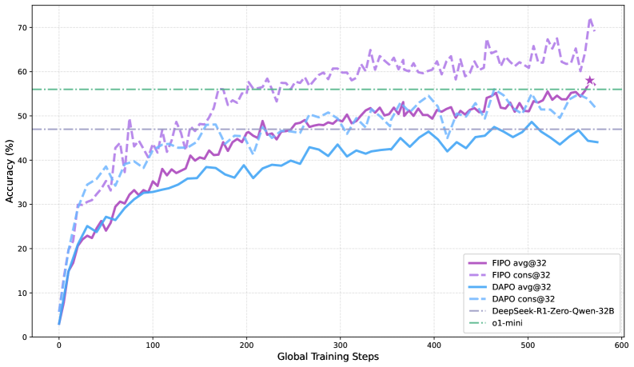
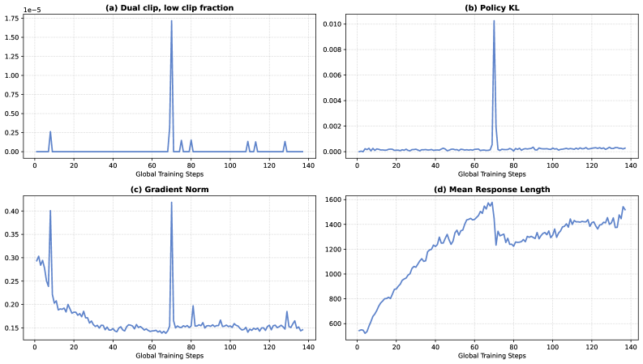
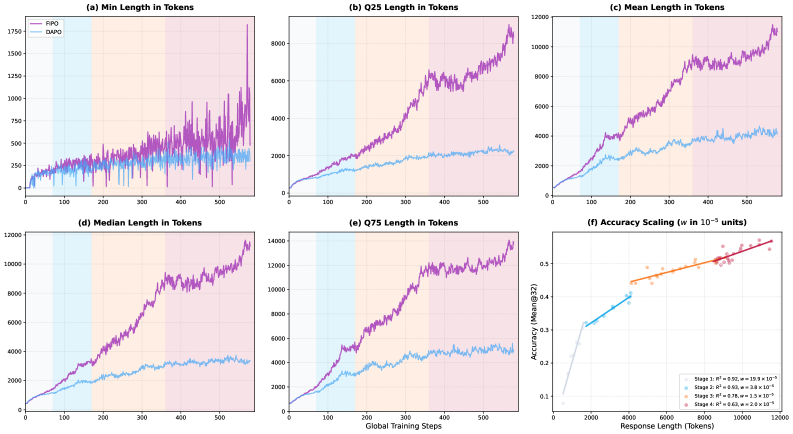

# FIPO: Eliciting Deep Reasoning with Future-KL Influenced Policy Optimization

## 📌 核心贡献

**用折扣未来 KL 散度为每个 token 计算细粒度优势权重，取代 GRPO 的均匀奖励分配，在无需 critic 模型的情况下实现 PPO 级别的密集信用分配，突破推理链长度瓶颈。**

## 📄 Abstract

We present Future-KL Influenced Policy Optimization (FIPO), a reinforcement learning algorithm designed to overcome reasoning bottlenecks in large language models. While GRPO style training scales effectively, it typically relies on outcome-based rewards (ORM) that distribute a global advantage uniformly across every token in a trajectory. We argue that this coarse-grained credit assignment imposes a performance ceiling by failing to distinguish critical logical pivots from trivial tokens. FIPO addresses this by incorporating discounted future-KL divergence into the policy update, creating a dense advantage formulation that re-weights tokens based on their influence on subsequent trajectory behavior. Empirically, FIPO enables models to break through the length stagnation seen in standard baselines. Evaluated on Qwen2.5-32B, FIPO extends the average chain-of-thought length from roughly 4,000 to over 10,000 tokens and increases AIME 2024 Pass@1 accuracy from 50.0% to a peak of 58.0% (converging at approximately 56.0%).

## 📝 我的笔记

### 方法总览

### 核心问题与动机

**GRPO/DAPO 的根本缺陷：均匀信用分配（Uniform Credit Assignment）**

GRPO 中所有 token 共享同一个 scalar advantage：

$$\hat{A}_{i,t} = \hat{A}_i = \frac{R_i - \mu}{\sigma}$$

- 关键逻辑转折点与无意义填充词被同等对待
- 模型无法学到"哪步推理真正重要"
- 推理链长度在训练中途陷入**停滞（length stagnation）**

### 方法：FIPO 三步走

#### Step 1：概率偏移（Probability Shift）

$$\Delta \log p_t = \log \pi_\theta(o_t \mid q, o_{<t}) - \log \pi_{\theta_{\text{old}}}(o_t \mid q, o_{<t})$$

- 正偏移：当前策略正在强化这步推理
- 负偏移：当前策略正在抑制这步推理

#### Step 2：Future-KL + Soft Decay Window

$$\text{FutureKL}_t = \sum_{k=t}^{T} M_k \cdot \gamma^{k-t} \cdot \Delta \log p_k$$

- **语义**：token $o_t$ 对后续整条轨迹概率分布的累积影响
- **折扣因子** $\gamma = 2^{-1/\tau}$：越远影响越小（$\tau=32$）
- **Mask $M_k$**：过滤超过 Dual-Clip 阈值的 token，防止梯度爆炸

#### Step 3：重加权 Advantage + Clipping

$$f_t = \text{clip}\left(\exp(\text{FutureKL}_t),\, 1-\epsilon_{f_{\text{low}}},\, 1+\epsilon_{f_{\text{high}}}\right), \quad \tilde{A}_t = \hat{A}_t \cdot f_t$$

- $\text{FutureKL}_t > 0$ → $f_t > 1$ → 放大正 advantage，加重负 advantage 惩罚
- $\text{FutureKL}_t < 0$ → $f_t < 1$ → 减小梯度，防止过度惩罚

**最终目标函数：**

$$J_{\text{FIPO}}(\theta) = \mathbb{E}\left[\frac{1}{\sum_i |o_i|} \sum_i \sum_t \min\left(r_{i,t} f_{i,t} \hat{A}_{i,t},\, \text{clip}(r_{i,t}, 1-\epsilon, 1+\epsilon) f_{i,t} \hat{A}_{i,t}\right)\right]$$

### 关键结果

| Method | AIME 2024 Avg@32 | AIME 2024 Cons@32 | AIME 2025 Avg@32 |
|--------|-----------------|-----------------|-----------------|
| DAPO | 50.0% | 60.0% | 38.0% |
| **FIPO** | **56.0%** | **73.0%** | **43.0%** |

- CoT 长度：DAPO ~4k → FIPO >10k tokens
- 超越 DeepSeek-R1-Zero-32B（~47%）和 o1-mini（~56%）

### 训练配置

- 基座：Qwen2.5-32B-Base
- 数据：DAPO-17K（公开）
- 框架：verl（已开源）
- FutureKL 参数：$\tau=32$，weight clipped to $[1, 1.2]$
- mini-batch：1024 samples（更大 batch 提升稳定性）

### 深度评价

FIPO 本质是在解决 temporal credit assignment 问题，但不需要 PPO 的 critic 网络。Future-KL 的直觉是：**用新旧策略在后续轨迹上的 KL 偏移来衡量当前 token 的因果影响力**——影响越大，越值得被强化或纠正。

思路来源于作者组两篇前驱工作：
1. $\Delta \log p$ 是推理改善的鲁棒指标（Huang et al., 2025）
2. 少量"稀疏但关键"的 token 主导推理走向（Meng et al., 2025）

FIPO 填补了 GRPO（高效粗糙）和 PPO（精细昂贵）之间的空白，是 RLVR 领域的重要进展。

**局限：** Pass@32 提升有限（RL 挖潜力 vs 扩知识边界）；超参调优细节有待更多消融；仅在 32B 验证。

## 🔗 相关工作

**同方向：** [[DAPO]], [[GRPO]], [[DeepSeek-R1]]
