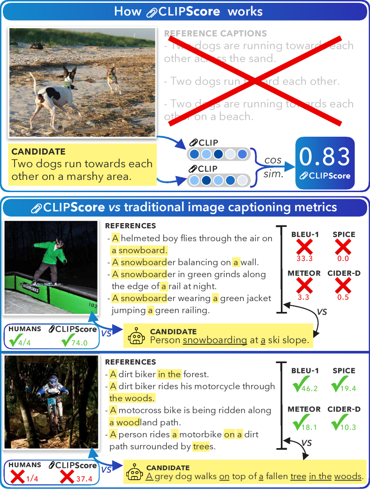
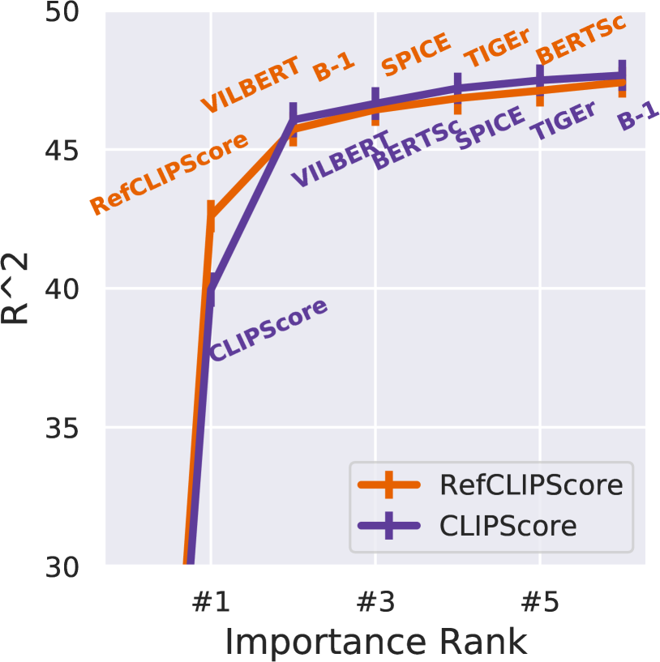
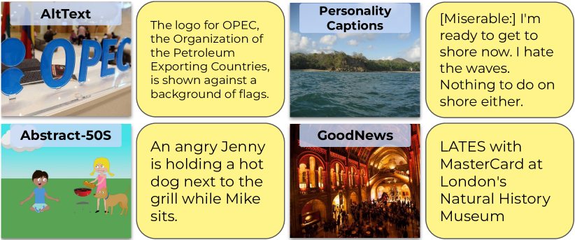

# CLIPScore

## 📌 核心贡献

> 首次证明预训练的 CLIP 模型可以直接用于无参考文本（reference-free）的图像描述质量评估，提出的 CLIPScore 在与人类判断的相关性上超越了所有传统基于参考文本的指标（CIDEr、SPICE 等），为后续所有基于 CLIP 的图像奖励模型（ImageReward、PickScore、HPS）奠定了基础。

## 📖 摘要

Image captioning has conventionally relied on reference-based automatic evaluations, where machine captions are compared against captions written by humans. This is in contrast to the reference-free manner in which humans assess caption quality. In this paper, we report the surprising empirical finding that CLIP (Radford et al., 2021), a cross-modal model pretrained on 400M image+caption pairs from the web, can be used for robust automatic evaluation of image captioning without the need for references. Experiments spanning several corpora demonstrate that our new reference-free metric, CLIPScore, achieves the highest correlation with human judgements, outperforming existing reference-based metrics like CIDEr and SPICE. Information gain experiments demonstrate that CLIPScore, with its tight focus on image-text compatibility, is complementary to existing reference-based metrics that emphasize text-text similarities. Thus, we also present a reference-augmented version, RefCLIPScore, which achieves even higher correlation. Beyond literal description tasks, several case studies reveal domains where CLIPScore performs well (clip-art images, alt-text rating), but also where it is relatively weaker in comparison to reference-based metrics, e.g., news captions that require richer contextual knowledge.

## 🔍 关键信息

| 字段 | 内容 |
|------|------|
| 机构 | Allen Institute for AI (AI2), University of Washington |
| 发表 | 2021-04-18 (EMNLP 2021) |
| 分类 | cs.CV, cs.CL |
| 链接 | [arXiv](https://arxiv.org/abs/2104.08718) |

## 📝 我的笔记

### 方法总览

### 动机与问题定义

传统图像描述评估指标（BLEU、METEOR、CIDEr、SPICE）都依赖人工撰写的参考描述（reference captions），通过比较候选描述与参考描述的文本相似度来打分。这种方式存在两个核心问题：

1. **与人类评估方式不一致**：人类评估图像描述质量时，直接看图片和描述文本，不需要参考文本
2. **参考文本的局限性**：参考文本收集成本高，且即使有多条参考文本，n-gram 匹配仍然不够充分 -- 好的描述可能使用全新的词汇（被惩罚），而差的描述可能恰好使用了常见词汇（被奖励）

本文的核心假设：CLIP 在 400M 图文对上的预训练使其学到了强大的图文对齐能力，可以直接用来评估图像描述质量。

### CLIPScore（CLIP-S）

使用 CLIP ViT-B/32 模型，分别提取图像和文本的嵌入向量，计算余弦相似度：

$$\text{CLIP-S}(\mathbf{c}, \mathbf{v}) = w \cdot \max(\cos(\mathbf{c}, \mathbf{v}), 0)$$

其中：
- $\mathbf{c}$ 为候选描述的 CLIP 文本嵌入（前缀 "A photo depicts" 可略微提升效果）
- $\mathbf{v}$ 为图像的 CLIP 视觉嵌入
- $w = 2.5$ 为缩放因子，将分数分布从 $[0, \sim 0.4]$ 拉伸到 $[0, 1]$
- $\max(\cdot, 0)$ 截断负值（实际中未观察到负余弦相似度）

关键特点：**完全不需要参考文本**，只需要图像和候选描述。

### RefCLIPScore（RefCLIP-S）

当参考文本可用时，可以通过调和平均数（harmonic mean）将 CLIP-S 与参考文本信息结合：

$$\text{RefCLIP-S}(\mathbf{c}, \mathbf{R}, \mathbf{v}) = \text{H-Mean}\left(\text{CLIP-S}(\mathbf{c}, \mathbf{v}),\ \max_{\mathbf{r} \in \mathbf{R}} \cos(\mathbf{c}, \mathbf{r}), 0\right)$$

其中 $\mathbf{R}$ 是所有参考文本的 CLIP 文本嵌入集合。RefCLIPScore 同时捕捉了图文兼容性（image-text）和文文相似性（text-text），在所有实验中都进一步提升了性能。

### 关键实验结果

#### Flickr8K-Expert（Kendall $\tau_c$ 相关性）

| 指标 | $\tau_c$ | 是否需要参考 |
|------|---------|------------|
| BLEU-1 | 32.3 | 是 |
| BLEU-4 | 30.8 | 是 |
| METEOR | 41.8 | 是 |
| CIDEr | 43.9 | 是 |
| SPICE | 44.9 | 是 |
| ViLBERTScore-F | 50.1 | 是 |
| **CLIP-S (no refs)** | **51.2** | **否** |
| **RefCLIP-S** | **53.0** | 是 |

#### Flickr8K-CF（Kendall $\tau_b$ 相关性）

| 指标 | $\tau_b$ | 是否需要参考 |
|------|---------|------------|
| BLEU-4 | 16.9 | 是 |
| CIDEr | 24.6 | 是 |
| SPICE | 24.4 | 是 |
| **CLIP-S (no refs)** | **34.4** | **否** |
| **RefCLIP-S** | **36.4** | 是 |

#### Composite（Kendall $\tau_c$ 相关性）

| 指标 | $\tau_c$ | 是否需要参考 |
|------|---------|------------|
| BLEU-4 | 30.6 | 是 |
| CIDEr | 37.7 | 是 |
| SPICE | 40.3 | 是 |
| ViLBERTScore-F | 52.4 | 是 |
| **CLIP-S (no refs)** | **53.8** | **否** |
| **RefCLIP-S** | **55.4** | 是 |

#### Pascal-50S 成对排序准确率

| 指标 | HC | HI | HM | MM | Mean |
|------|------|------|------|------|------|
| BLEU-4 | 60.4 | 90.6 | 84.9 | 54.7 | 72.6 |
| CIDEr | 65.1 | 98.1 | 90.5 | 64.8 | 79.6 |
| CLIP-S (no refs) | 56.5 | 99.3 | **96.4** | 70.4 | 80.7 |
| RefCLIP-S | 64.5 | 99.6 | 95.4 | 72.8 | **83.1** |

### 信息增益分析

通过前向选择回归实验（forward-selection），作者发现：
- CLIP-S（或 RefCLIP-S）总是**最先被选中**的指标，说明它包含的信息量最大
- CLIP-S 与传统指标（BLEU、CIDEr、SPICE）以及新指标（ViLBERTScore-F）是**互补的**
- 推荐的最小指标组合：至少一个 image-aware 指标（如 CLIP-S）+ 一个强参考指标（如 SPICE）

### 对幻觉的敏感性

在 FOIL 数据集（将正确描述中的一个名词替换为看似合理但错误的词）上测试：
- CLIP-S **无需参考文本**即可达到 87.2% 的检测准确率
- RefCLIP-S 达到 91.0%（1-ref）和 92.6%（4-ref）
- 传统指标在少参考文本时性能显著下降（如 BLEU-4 从 82.6% 降到 66.5%），但 CLIP-S 始终稳定

### 案例分析

| 领域 | CLIP-S 表现 | 说明 |
|------|-----------|------|
| Alt-Text (Twitter) | 好 ($\tau_c$ = 48.4) | 参考指标因推文噪声表现差 |
| Abstract-50S (剪贴画) | 中等 (68) | 虽不及参考指标 (79)，但远超基线 (53) |
| Personality Captions | 差 | 偏好字面描述，无法判断 "engaging" |
| News Captions | 差 (65) | 需要上下文知识（人名、地点、事件） |

### 对后续工作的影响

CLIPScore 是所有基于 CLIP 的图像评估/奖励模型的先驱：

- **ImageReward** (2023)：在 CLIP 基础上加入人类偏好标注数据的有监督训练，从 "图文匹配度" 扩展到 "生成质量偏好"
- **PickScore** (2023)：用 Pick-a-Pic 数据集微调 CLIP，专注于 T2I 生成的人类偏好预测
- **HPS / HPSv2** (2023)：Human Preference Score，同样基于 CLIP 微调但使用不同的偏好数据

CLIPScore 证明了 CLIP 嵌入空间天然包含了与人类判断高度相关的图文质量信号，后续工作本质上都是在此基础上引入更精细的人类偏好监督。

### 局限性

1. **无法捕捉细粒度质量差异**：CLIP-S 主要衡量图文语义匹配度，对图像生成质量（如真实感、美学、细节一致性）不敏感
2. **上下文知识不足**：在需要世界知识的场景（新闻描述）中表现差
3. **偏好字面描述**：对非字面、创意性描述的评估能力有限
4. **继承 CLIP 的偏见**：CLIP 预训练数据的社会偏见会传递到评分中（如性别、种族相关的不公平分类）

## 🔗 相关论文

**基于/改进自：** [[CLIP]]

**同方向（图像评估/奖励模型）：** [[ImageReward]], [[PickScore]], [[HPSv2]]
