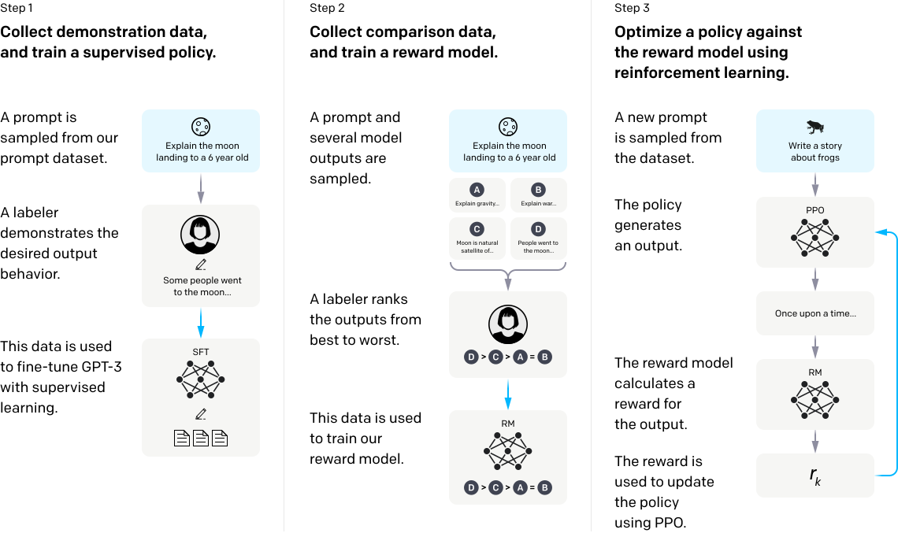

# InstructGPT

## 📌 核心贡献

> 提出基于人类反馈的强化学习（RLHF）三阶段训练流程（SFT → 奖励模型训练 → PPO 优化），首次系统性地将人类偏好对齐应用于大规模语言模型，使 1.3B 参数的 InstructGPT 在人类评估中优于 175B 的 GPT-3。

## 📖 摘要

Making language models bigger does not inherently make them better at following a user's intent. For example, large language models can generate outputs that are untruthful, toxic, or simply not helpful to the user. In other words, these models are not aligned with their users. In this paper, we show an avenue for aligning language models with user intent on a wide range of tasks by fine-tuning with human feedback. Starting with a set of labeler-written prompts and prompts submitted through the OpenAI API, we collect a dataset of labeler demonstrations of the desired model behavior, which we use to fine-tune GPT-3 using supervised learning. We then collect a dataset of rankings of model outputs, which we use to further fine-tune this supervised model using reinforcement learning from human feedback. We call the resulting models InstructGPT. In human evaluations on our prompt distribution, outputs from the 1.3B parameter InstructGPT model are preferred to outputs from the 175B GPT-3, despite having 100x fewer parameters. Moreover, InstructGPT models show improvements in truthfulness and reductions in toxic output generation while having minimal performance regressions on public NLP datasets.

## 🔍 关键信息

| 字段 | 内容 |
|------|------|
| 机构 | OpenAI |
| 发表 | 2022-03-04 |
| 分类 | cs.CL, cs.AI, cs.LG |
| 链接 | [arXiv](https://arxiv.org/abs/2203.02155) |

## 📝 我的笔记

### 方法总览

InstructGPT 是 OpenAI 提出的将人类偏好对齐引入大规模语言模型的里程碑工作。核心思想是：**单纯增大模型规模并不能让模型更好地遵循用户意图**，需要通过人类反馈来引导模型行为。论文提出了经典的 RLHF 三阶段训练流程，这一范式深刻影响了后续几乎所有对齐相关的研究。

---

### 一、核心问题与动机

- **对齐问题（Alignment Problem）**：大语言模型的预训练目标（next token prediction）与"遵循用户指令并生成有用、真实、无害的回答"之间存在根本性错位
- **规模并非万能**：175B 的 GPT-3 在许多任务上仍会生成不真实、有毒或无用的内容
- **目标**：设计一种可扩展的方法，使语言模型的行为与人类意图对齐

---

### 二、RLHF 三阶段训练流程

#### 第一阶段：监督微调（Supervised Fine-Tuning, SFT）

- 收集标注员编写的高质量 prompt-demonstration 对（约 13,000 条）
- 在 GPT-3 预训练模型上进行监督微调
- 训练 16 个 epoch，发现虽然 1 epoch 后验证集 loss 即开始上升，但 RM 分数仍在提升，因此选择过拟合的 checkpoint

#### 第二阶段：奖励模型训练（Reward Model Training）

奖励模型是整个 RLHF 流程的核心组件，用于将人类偏好转化为标量信号。

**数据收集**：
- 对每个 prompt，让 SFT 模型生成 $K$（4-9）个候选回答
- 标注员对这些回答进行排序（ranking）
- 从 $\binom{K}{2}$ 个配对中构建偏好数据

**模型架构**：
- 基于 6B 参数的 GPT-3 模型，移除最后的 unembedding 层，替换为一个线性投影层输出标量奖励值
- 未使用 175B 模型作为 RM，因为大模型训练不稳定

**训练目标——Pairwise Ranking Loss**：

$$\mathcal{L}(\theta) = -\frac{1}{\binom{K}{2}} \mathbb{E}_{(x, y_w, y_l) \sim D} \left[ \log \sigma(r_\theta(x, y_w) - r_\theta(x, y_l)) \right]$$

其中：
- $r_\theta(x, y)$ 为奖励模型对 prompt $x$ 和回答 $y$ 的标量输出
- $y_w$ 为偏好回答（winning），$y_l$ 为非偏好回答（losing）
- $\sigma$ 为 sigmoid 函数

**关键设计决策**：
- 将同一 prompt 的所有 $\binom{K}{2}$ 个配对放入同一个 batch，避免过拟合
- 收集约 33,000 个 prompt 的排序数据用于训练

#### 第三阶段：PPO 强化学习优化

使用 PPO（Proximal Policy Optimization）算法，以 RM 的输出作为奖励信号来优化 SFT 模型。

**PPO 优化目标**：

$$\text{objective}(\phi) = \mathbb{E}_{(x, y) \sim D_{\pi_\phi^{RL}}} \left[ r_\theta(x, y) - \beta \log \frac{\pi_\phi^{RL}(y|x)}{\pi^{SFT}(y|x)} \right] + \gamma \mathbb{E}_{x \sim D_{\text{pretrain}}} \left[ \log \pi_\phi^{RL}(x) \right]$$

其中：
- 第一项：最大化 RM 给出的奖励
- 第二项（KL 惩罚）：$\beta \log \frac{\pi_\phi^{RL}(y|x)}{\pi^{SFT}(y|x)}$ 约束 RL 策略不偏离 SFT 模型太远，防止 reward hacking
- 第三项（预训练梯度混合）：$\gamma \mathbb{E}_{x \sim D_{\text{pretrain}}} [\log \pi_\phi^{RL}(x)]$ 在预训练数据上加入语言模型 loss，防止公共 NLP 任务性能退化（称为 PPO-ptx）

**关键超参数**：
- $\beta$ 控制 KL 惩罚强度
- $\gamma$ 控制预训练梯度的混合比例

---

### 三、数据收集

| 数据类型 | 数量 | 用途 |
|----------|------|------|
| SFT 标注示范 | ~13,000 | 第一阶段 SFT |
| 排序比较数据 | ~33,000 prompts | 第二阶段 RM 训练 |
| PPO 训练 prompts | ~31,000 | 第三阶段 PPO |

数据来源：
- 标注员手写的 prompts
- OpenAI API 用户提交的 prompts（经过去重和过滤）

标注团队：约 40 名标注员，经过筛选以确保与研究者在敏感话题上的一致性。

---

### 四、关键实验结果

#### 人类评估结果

| 模型 | 参数量 | 人类偏好胜率 |
|------|--------|-------------|
| GPT-3 (SFT) | 175B | 基线 |
| InstructGPT (PPO) | 1.3B | 优于 175B GPT-3 |
| InstructGPT (PPO-ptx) | 175B | 最佳 |

核心发现：**1.3B InstructGPT 在人类评估中被偏好程度超过 175B GPT-3**，尽管参数量少 100 倍。

#### 安全性评估

| 指标 | GPT-3 | InstructGPT | 改善 |
|------|-------|-------------|------|
| 真实性（TruthfulQA） | 较低 | 显著提升 | 真实且有信息量的回答比例提升 |
| 毒性（RealToxicityPrompts） | 较高 | 降低约 25% | 有毒输出减少 |
| 偏见（BBQ） | - | 轻微改善 | 但未根本解决 |

#### 公共 NLP 基准

- InstructGPT 在多数 NLP 基准上保持与 GPT-3 相当的性能
- PPO-ptx 变体（混合预训练梯度）在避免公共任务性能退化方面效果最好
- 在部分任务上出现轻微退化，称为 **alignment tax**

---

### 五、关键发现与局限

#### 重要发现

1. **RLHF 显著优于单纯 SFT**：PPO 训练后的模型在人类评估中大幅优于仅做 SFT 的模型
2. **小模型可以打败大模型**：经过对齐的 1.3B 模型优于未对齐的 175B 模型
3. **泛化能力**：InstructGPT 在未见过的指令类型上也表现出改善（held-out labelers 的评估也一致）
4. **KL 惩罚至关重要**：去掉 KL 约束后模型性能严重退化（reward hacking）

#### 局限性

- 对齐的是标注员偏好，不完全等于广泛用户的偏好
- 模型仍可能生成有毒内容（尤其在被指示这样做时）
- 无法完全消除幻觉问题
- 对齐税（alignment tax）仍然存在
- 标注员之间的一致性有限（inter-annotator agreement ~73%）

---

### 六、对后续研究的影响

InstructGPT 确立的 RLHF 范式成为后续对齐研究的基石：

- **ChatGPT / GPT-4**：直接沿用了 RLHF 流程
- **DPO**：针对 RM+PPO 的复杂性提出了直接偏好优化，跳过显式 RM 训练
- **奖励模型研究**：RM 的设计、训练和评估成为独立的研究方向（参见 [[RM-Survey]]）
- **替代方案**：RLAIF、Constitutional AI 等探索了减少人类标注依赖的路径

InstructGPT 的核心洞察——**对齐方法比模型规模更重要**——至今仍是 LLM 研究的指导原则之一。

## 🔗 相关论文

**基于/改进自：** [[GPT-3]]

**同方向：** [[DPO]], [[RM-Survey]]
