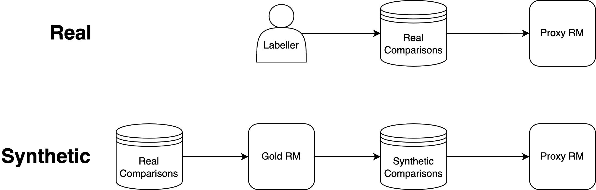
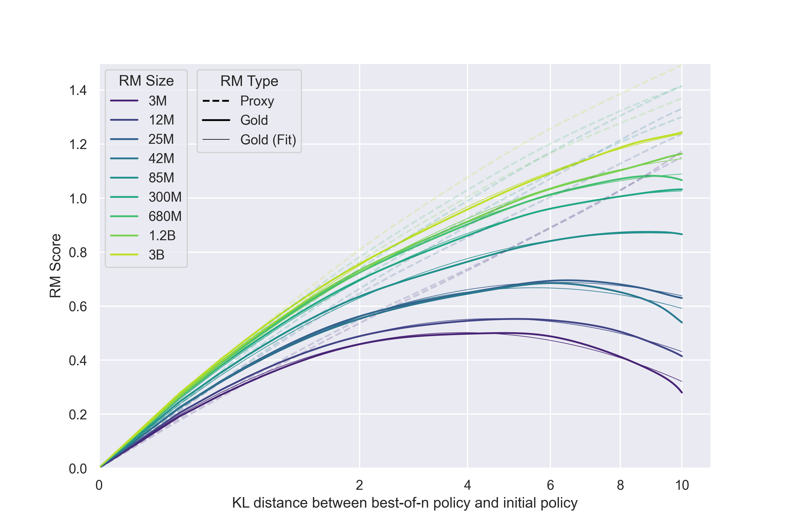
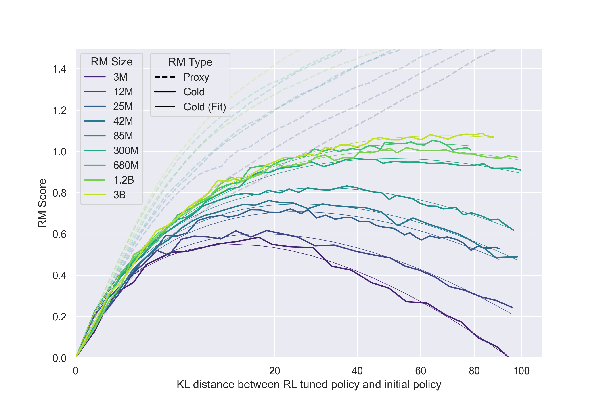

# RewardOveropt

## 📌 核心贡献

> 首次系统性地量化了 RLHF 中奖励模型过优化（Goodhart's Law）的规模定律，发现 BoN 采样和 RL 优化下 gold reward 随 KL 散度的变化遵循不同的函数形式，且其系数随 proxy RM 参数量平滑缩放。

## 📖 摘要

In reinforcement learning from human feedback, it is common to optimize against a reward model trained to predict human preferences. Because the reward model is an imperfect proxy, optimizing its value too much can hinder ground truth performance, in accordance with Goodhart's law. This effect has been frequently observed, but not carefully measured due to the expense of collecting human preference data. In this work, we use a synthetic setup in which a fixed "gold-standard" reward model plays the role of humans, providing labels used to train a proxy reward model. We study how the gold reward model score changes as we optimize against the proxy reward model using either reinforcement learning or best-of-n sampling. We find that this relationship follows a different functional form depending on the method of optimization, and that in both cases its coefficients scale smoothly with the number of reward model parameters. We also study the effect on this relationship of the size of the reward model dataset, the number of reward model and policy parameters, and the coefficient of the KL penalty added to the reward in the reinforcement learning setup. We explore the implications of these empirical results for theoretical considerations in AI alignment.

## 🔍 关键信息

| 字段 | 内容 |
|------|------|
| 机构 | OpenAI |
| 发表 | 2022-10-19 (ICML 2023) |
| 分类 | cs.LG, stat.ML |
| 链接 | [arXiv](https://arxiv.org/abs/2210.10760) |

## 📝 我的笔记

### 动机与问题定义

在 RLHF 中，我们通常训练一个 proxy reward model (RM) 来近似人类偏好，然后用 RL 或 Best-of-N (BoN) 采样对策略进行优化。由于 proxy RM 只是真实人类偏好的不完美近似，对其过度优化会导致真实质量（gold reward）先升后降——这就是 Goodhart's Law 在 RLHF 中的体现，即**奖励过优化（reward overoptimization）**。

这个现象此前已被广泛观察到，但由于收集人类偏好数据代价昂贵，从未被系统性量化。本文的核心问题是：**过优化的程度如何随 RM 规模、数据量、策略规模等因素变化？能否建立可预测的 scaling law？**

### 方法

#### 合成实验设置

为避免人类标注的高成本，作者设计了一个合成实验框架：

- **Gold RM**：一个固定的 6B 参数 RM（来自 InstructGPT），作为"真实人类偏好"的替代
- **Proxy RM**：从 3M 到 3B 参数不等的 RM，在 Gold RM 生成的合成比较数据上训练
- **基础环境**：使用 InstructGPT 环境，GPT-3 系列模型作为初始策略，经过 SFT 微调
- **数据**：生成 100K 合成比较对，保留 10% 作为测试集

#### 优化方法

- **BoN 采样**：对同一 prompt 生成 $n$ 个 response，选择 proxy RM 分数最高的那个
- **RL**：使用 PPO 算法，直接优化 proxy RM 分数

#### 核心 Scaling Laws

定义 $d := \sqrt{D_{\text{KL}}(\pi \| \pi_{\text{init}})}$ 为优化距离的度量。作者发现 gold reward 随 $d$ 的变化遵循以下函数形式：

**BoN 采样：**

$$R_{\text{bon}}(d) = d(\alpha_{\text{bon}} - \beta_{\text{bon}} d)$$

**RL 优化：**

$$R_{\text{RL}}(d) = d(\alpha_{\text{RL}} - \beta_{\text{RL}} \log d)$$

其中 $\alpha$ 和 $\beta$ 是依赖于 proxy RM 参数量等因素的系数。关键差异在于 BoN 的衰减项是线性的 $\beta d$，而 RL 的衰减项是对数的 $\beta \log d$，这意味着 RL 的过优化在高 KL 区域更为严重。

### 核心实验结果

#### RM 参数量的影响

| RM 参数量 | 趋势 |
|---------|------|
| 3M - 3B | $\alpha_{\text{bon}}$, $\beta_{\text{bon}}$, $\beta_{\text{RL}}$ 均随参数量平滑变化，近似对数线性 |
| 更大 RM | 更高的 $\alpha$（更大优化增益），更低的 $\beta$（更慢的过优化衰减） |
| 预测能力 | 可根据 scaling law 预测不同 RM 规模下的最大 gold reward |

#### RL vs BoN 对比

| 维度 | BoN | RL |
|------|-----|-----|
| KL 效率 | 高（KL 约 $\log n$ 增长） | 低（KL 约随步数二次增长） |
| 过优化函数形式 | $d(\alpha - \beta d)$ | $d(\alpha - \beta \log d)$ |
| Proxy vs Gold 关系 | proxy-gold gap 较小 | 初始 proxy-gold gap 较大，但峰值 gold reward 更高 |

#### 其他因素

- **数据量**：更多数据 → 更好的 gold score，更少 Goodharting；低于 ~2000 比较对时 RM 几乎无法超越随机水平
- **策略规模**：更大策略整体表现更好，但过优化程度（proxy-gold gap）相似，峰值出现在几乎相同的 KL 距离
- **KL 惩罚**：在 RL 中加入 KL 惩罚仅等效于 early stopping，不改善 KL-gold reward frontier

### 理论讨论：Goodhart 分类

作者使用 Manheim & Garrabrant (2018) 的 Goodhart 四分类框架分析结果：

1. **Regressional Goodhart**：proxy RM 依赖含噪特征，优化时部分优化力量花在噪声上。对应 $\alpha$ 项——导致 gold reward 的增速低于 proxy reward，但不会导致 gold reward 下降
2. **Extremal Goodhart**：优化推动分布偏离 RM 训练分布，导致 proxy-gold 相关性减弱。对应 $\beta$ 项——主要负责 gold reward 的非单调下降
3. **Causal Goodhart**：proxy RM 学到了与质量相关但无因果关系的特征（如答案长度）
4. **Adversarial Goodhart**：策略主动操纵 proxy。当前实验中模型能力不足以产生此效应

### 对迭代 RLHF 的启示

假设 $\alpha_{\text{RL}}$ 和 $\beta_{\text{RL}}$ 跨迭代保持不变，且 $d = \sqrt{\text{KL}}$ 在迭代间可加，则 $k$ 次迭代后 gold reward 增加量为 $\beta_{\text{RL}} d \log(k)$。这意味着迭代式 RLHF（定期用新数据重新训练 RM）可以对数级别地缓解过优化。

### 总结性评价

这是一篇里程碑式的实证研究，首次将 RLHF 中的过优化现象从定性观察提升为定量可预测的 scaling law。核心贡献在于：

- 明确了 BoN 和 RL 两种优化方法下过优化的不同函数形式
- 发现系数随 RM 参数量平滑缩放，使得预测成为可能
- 将实证结果与 Goodhart's Law 的理论分类框架联系起来
- 为实际 RLHF 系统的 RM 规模选择和优化停止条件提供了理论指导

局限性在于所有实验基于合成设置（Gold RM 替代人类），可能无法完全反映真实人类偏好的复杂性。此外，实验仅使用了 GPT-3/InstructGPT 环境。

## 🔗 相关论文

**基于/改进自：** [[InstructGPT]]

**同方向：** [[AccuracyParadox]], [[DPO]]
