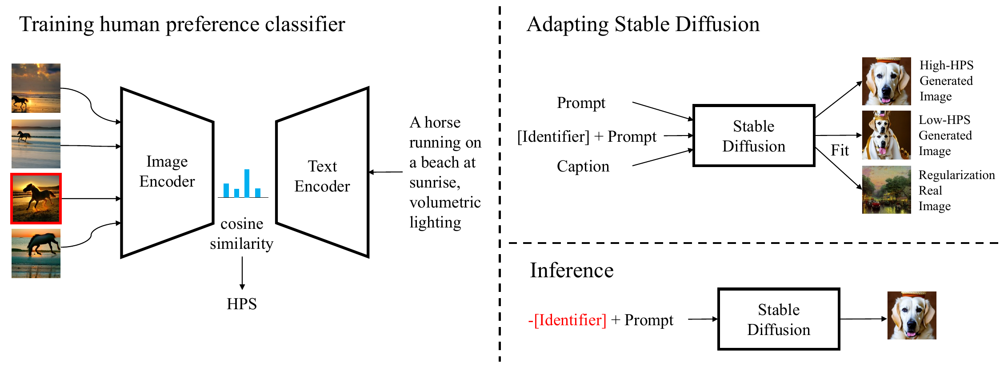
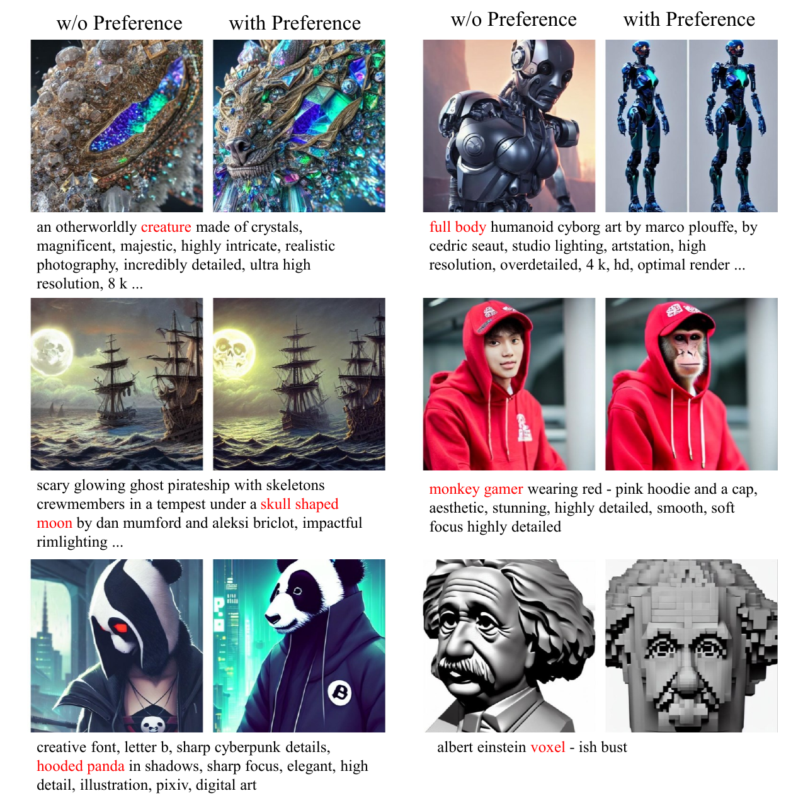
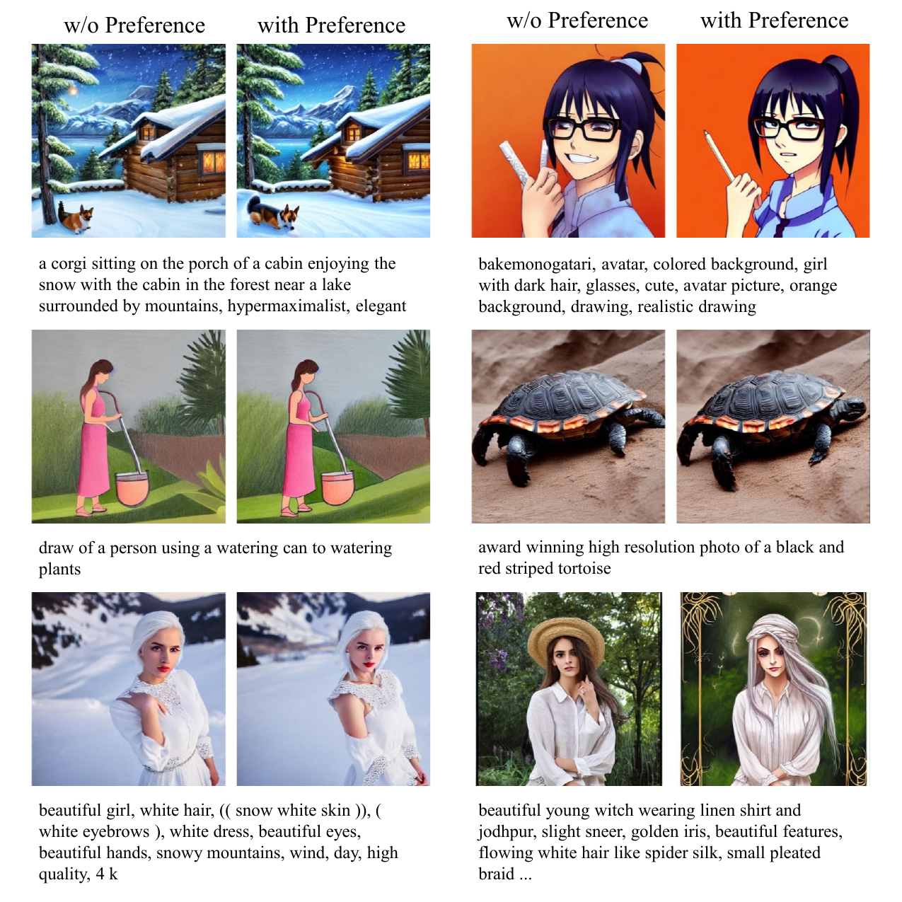

# HPS

## 📌 核心贡献

> 首次从 Stable Foundation Discord 频道大规模收集人类偏好选择数据，发现现有评估指标（IS、FID、CLIP Score）与人类偏好相关性差，提出基于 CLIP 微调的 Human Preference Score (HPS)，并用 HPS 指导 LoRA 微调 Stable Diffusion 使生成图像更符合人类偏好。

## 📖 摘要

Recent years have witnessed a rapid growth of deep generative models, with text-to-image models gaining significant attention from the public. However, existing models often generate images that do not align well with human preferences, such as awkward combinations of limbs and facial expressions. To address this issue, we collect a dataset of human choices on generated images from the Stable Foundation Discord channel. Our experiments demonstrate that current evaluation metrics for generative models do not correlate well with human choices. Thus, we train a human preference classifier with the collected dataset and derive a Human Preference Score (HPS) based on the classifier. Using HPS, we propose a simple yet effective method to adapt Stable Diffusion to better align with human preferences. Our experiments show that HPS outperforms CLIP in predicting human choices and has good generalization capability toward images generated from other models. By tuning Stable Diffusion with the guidance of HPS, the adapted model is able to generate images that are more preferred by human users.

## 🔍 关键信息

| 字段 | 内容 |
|------|------|
| 机构 | CUHK MMLab, SenseTime Research, SJTU, CPII, Shanghai AI Lab |
| 发表 | 2023-03-25 |
| 分类 | cs.CV, cs.AI |
| 链接 | [arXiv](https://arxiv.org/abs/2303.14420) |

## 📝 我的笔记

### 方法总览

### 动机与问题定义

现有 T2I 模型（如 Stable Diffusion）生成的图像常出现肢体组合不自然、面部表情怪异等问题，与人类偏好存在明显错位。现有评估指标存在三个根本性缺陷：

1. **IS 和 FID**：基于 ImageNet 预训练的 Inception Net，偏向纹理而非形状，且为单模态指标无法利用文本 prompt 信息
2. **CLIP Score**：虽能利用文本信息，但在生成图像上的人类偏好预测能力有限
3. **Aesthetic Score**：不以 prompt 为条件，无法评估 text-image 对齐

### 数据集构建

**数据来源**：Stable Foundation Discord 服务器的 "dreambot" 频道

**收集方式**：使用 DiscordChatExporter 工具导出聊天记录，利用频道中固定的交互模式提取偏好数据——用户发送 prompt，bot 生成多张图，用户选择最喜欢的一张回传给 bot。

**数据统计**：
- 98,807 张图像，来自 25,205 个 prompt
- 23,722 个 prompt 对应 4 张图，953 个对应 3 张，530 个对应 2 张
- 2,659 位不同用户的选择，每位用户最多贡献 267 个选择
- 已过滤 NSFW 内容

### 现有指标与人类偏好的相关性

| 指标 | Preferred | Non-preferred | 差异显著？ |
|------|-----------|---------------|-----------|
| IS | 16.27 ± 0.56 | 16.23 ± 0.53 | 否 |
| FID | 38.2 | 37.7 | 否 |

结论：IS 和 FID 无法区分人类偏好和非偏好图像。

### Human Preference Score

**模型架构**：微调 CLIP ViT-L/14

**训练方式**：
- 训练集 20,205 个 prompt，79,167 张图像
- 微调 CLIP image encoder 最后 10 层 + text encoder 最后 6 层
- 优化器 AdamW，学习率 $1.7 \times 10^{-5}$，权重衰减 $3.1 \times 10^{-3}$
- Batch size 5，cosine schedule，训练 1 epoch
- 图像预处理：长边 resize 到 224，短边 pad 到 224（保持原始宽高比，优于随机裁剪）
- 超参数通过贝叶斯优化调节

**训练目标**：最大化 preferred 图像与 prompt 的 CLIP 相似度，同时最小化 non-preferred 图像与 prompt 的相似度。

**HPS 定义**：

$$\text{HPS}(\text{img}, \text{txt}) = 100 \cdot \cos(enc_v(\text{img}), enc_t(\text{txt}))$$

其中 $enc_v$ 和 $enc_t$ 分别为微调后的视觉编码器和文本编码器，乘以 100 便于可视化。

### 偏好预测准确率

| 模型 | 使用文本？ | Preference Acc. (%) |
|------|----------|-------------------|
| Random guess | 否 | 26.1 |
| Human | 是 | 42.0 |
| CLIP ViT-L/14 | 是 | 32.9 |
| CLIP RN50x64 | 是 | 33.1 |
| Aesthetic Classifier | 否 | 31.4 |
| **HP classifier (ours)** | **是** | **43.5** |

HPS 不仅超越所有 CLIP 变体和 Aesthetic Classifier，甚至超过了人类参与者（43.5% vs 42.0%），这主要因为人类偏好存在较大个体差异。

### 泛化性验证

在 DALL·E 和 Stable Diffusion 生成的图像对上进行跨模型用户研究（398 对图像）：

| 对比 | Agreement (%) |
|------|--------------|
| Human vs. Human | 63.5 ± 4.3 |
| CLIP vs. Human | 56.8 ± 1.7 |
| **HPS vs. Human** | **61.5 ± 1.1** |

HPS 与人类的一致性远高于 CLIP，接近人类之间的一致性水平。

### HPS 与 CLIP Score 的关系

HPS 与 CLIP Score 正相关，但 HPS 更侧重美学质量，而 CLIP Score 更侧重文本-图像内容匹配。HPS 对直接文本匹配的关注较少，可理解为一种视觉版的 "alignment tax"。

### 利用 HPS 适配 Stable Diffusion

**训练数据构建**：
- 从 DiffusionDB 的 "large_first_1m" 分割中，用 HPS 评分选择 preferred 和 non-preferred 图像
- 选择标准：$p > \alpha / n$，其中 $p = \frac{\exp(HPS(I^*, T))}{\sum_{I \in B} \exp(HPS(I, T))}$
- $\alpha = 2.0$，最终得到 37,572 张 preferred 和 21,108 张 non-preferred 生成图像
- 正则化数据：LAION-5B 子集 625k 张，经 aesthetic score > 6.5 过滤，200,231 张参与训练

**适配方法**：
- 使用 LoRA（rank=32）微调 Stable Diffusion v1.4 的 UNet，冻结 VAE 和 text encoder
- Non-preferred 图像的 caption 前添加特殊标识符 "Weird image."
- AdamW 优化器，学习率 $1 \times 10^{-5}$，权重衰减 $1 \times 10^{-2}$
- Batch size 40，训练 10k 步
- 推理时使用 PNDM noise scheduler，50 步，guidance scale 7.5
- 特殊标识符作为 classifier-free guidance 的 negative prompt

### 适配后的定量结果

| 模型 | FID ↓ | Aesthetic Score ↑ | CLIP Score ↑ | HPS ↑ |
|------|-------|------------------|-------------|-------|
| SD 1.4 | 19.72 | 5.90 | 0.2816 | 0.1898 |
| Adapted model | 19.35 | 6.06 | 0.2831 | 0.1916 |

适配后的模型在所有指标上均优于原始 SD 1.4。

### 人类评估

从 DiffusionDB 随机抽取 100 个 prompt，20 位评估者对原始 SD 和适配模型的生成图像进行偏好投票。74% 的适配模型生成图像获得超过 10 票（满分 20），而原始模型仅 22%。

### 总结性评价

HPS 是第一个系统性研究 T2I 人类偏好的工作，开创性贡献包括：(1) 首次大规模收集真实用户偏好数据，(2) 实证证明 IS/FID/CLIP Score 与人类偏好不匹配，(3) 基于 CLIP 微调的简洁有效方案。

**局限性**：
- 数据来自 Discord 社区，偏好分布可能有偏（特定人群、特定 prompt 风格）
- 包含公众人物的 prompt 未删除（仅标记）
- HPSv2 后续在数据规模（798k 选择）和偏差纠正上做了显著改进

## 🔗 相关论文

**基于/改进自：** [[CLIPScore]]

**后续改进：** [[HPSv2]], [[HPSv3]]

**同方向：** [[ImageReward]], [[PickScore]]
