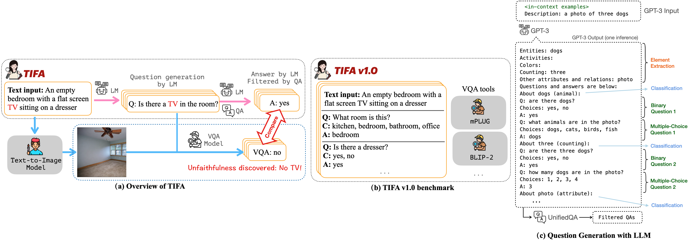
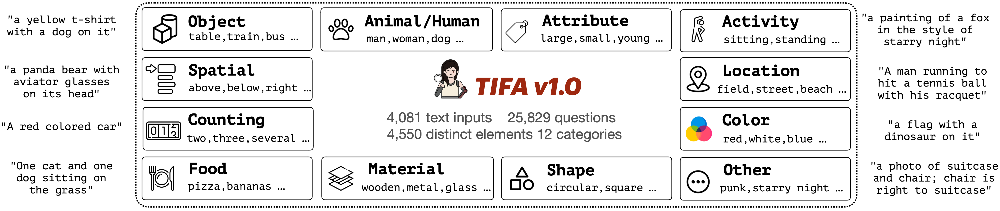
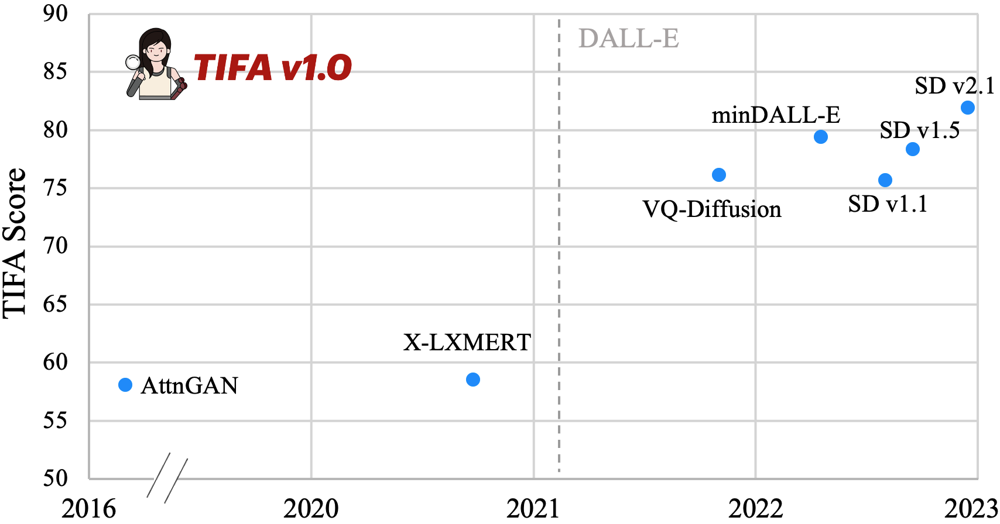

# TIFA

## 📌 核心贡献

> 提出基于视觉问答（VQA）的文本-图像忠实度自动评估指标 TIFA，通过 LLM 生成问答对并用 VQA 模型验证生成图像的语义一致性，实现了细粒度、可解释且无需参考图像的 T2I 评估，并发布了包含 4K 文本输入和 25K 问题的 TIFA v1.0 基准。

## 📖 摘要

Despite thousands of researchers, engineers, and artists actively working on improving text-to-image generation models, systems often fail to produce images that accurately align with the text inputs. We introduce TIFA (Text-to-Image Faithfulness evaluation with question Answering), an automatic evaluation metric that measures the faithfulness of a generated image to its text input via visual question answering (VQA). Specifically, given a text input, we automatically generate several question-answer pairs using a language model. We calculate image faithfulness by checking whether existing VQA models can answer these questions using the generated image. TIFA is a reference-free metric that allows for fine-grained and interpretable evaluations of generated images. TIFA also has better correlations with human judgments than existing metrics. Based on this approach, we introduce TIFA v1.0, a benchmark consisting of 4K diverse text inputs and 25K questions across 12 categories (object, counting, etc.). We present a comprehensive evaluation of existing text-to-image models using TIFA v1.0 and highlight the limitations and challenges of current models. For instance, we find that current text-to-image models, despite doing well on color and material, still struggle in counting, spatial relations, and composing multiple objects. We hope our benchmark will help carefully measure the research progress in text-to-image synthesis and provide valuable insights for further research.

## 🔍 关键信息

| 字段 | 内容 |
|------|------|
| 机构 | University of Washington & Allen Institute for AI |
| 发表 | 2023-03-21 |
| 分类 | cs.CV |
| 链接 | [arXiv](https://arxiv.org/abs/2303.11897) |

## 📝 我的笔记

### 方法总览

### 动机与问题定义

现有 T2I 评估指标（如 FID、CLIPScore）存在明显不足：
- **FID** 需要大量参考图像，且只能衡量分布级别的质量，无法评估单张图像的文本对齐度
- **CLIPScore** 虽然无需参考图像，但 CLIP 本身对组合性语义（如计数、空间关系）的理解能力有限，导致与人类判断的相关性不够高
- 两者都缺乏**可解释性**——无法告诉用户图像在哪些方面忠实、哪些方面不忠实

TIFA 的核心思路：将"图像是否忠实于文本"这个问题**分解为一系列可验证的子问题**，通过 VQA 逐一检查。

### 方法细节

TIFA 的评估流程分为三步：

**Step 1：基于 LLM 的问答对生成**

给定文本 prompt，使用 GPT-3（text-davinci-003）通过 in-context learning 生成问答对：
1. 首先从文本中提取关键语义元素（如物体、属性、关系等）
2. 对每个元素生成多个是非题或选择题形式的问题
3. 问题覆盖 12 个元素类别：**object, activity/action, animal/human, attribute, color, counting, food, location, material, shape, spatial, other**

**Step 2：问题过滤**

使用 UnifiedQA（allenai/unifiedqa-v2-t5-large）对生成的问答对进行过滤：
- 仅给 UnifiedQA 文本 prompt（不给图像），让它回答生成的问题
- 如果 UnifiedQA 能正确回答，说明问题的答案可以从文本中推断出来，是合理的问答对
- 过滤掉无法通过文本验证的低质量问答对

**Step 3：VQA 评估**

将生成的图像和过滤后的问题输入 VQA 模型：
- 如果 VQA 模型能正确回答问题，说明图像在该元素上忠实于文本
- TIFA 分数 = 正确回答的问题比例

$$\text{TIFA} = \frac{1}{N} \sum_{i=1}^{N} \mathbb{1}[\text{VQA}(q_i, \text{image}) = a_i]$$

其中 $N$ 为问题总数，$q_i$ 和 $a_i$ 分别为第 $i$ 个问题和对应的正确答案。

**VQA 模型选择：** 论文评测了多种 VQA 模型，包括 mPLUG-large, GIT-base/large, BLIP-base/large, ViLT, OFA-large, PromptCap-T5large, BLIP2-FlanT5xl 等。其中 mPLUG-large 在与人类判断的相关性上表现最佳。

### TIFA v1.0 基准

- **4,081 个文本输入**，涵盖 COCO 描述、DrawBench、PaintSkills 等多种来源
- **25,829 个预生成问题**，覆盖 12 个元素类别
- 文本来源多样化，包括简单描述和复杂组合性提示

### 关键结果

**主要发现：**

| 发现 | 详情 |
|------|------|
| 颜色/材质 | 当前模型表现较好 |
| 计数 | 模型普遍表现较差，难以生成正确数量的物体 |
| 空间关系 | 如"左边""上方"等位置关系，模型常常出错 |
| 多物体组合 | 当文本包含 5 个以上实体时，准确率显著下降 |
| 形状 | Stable Diffusion 在形状识别上尤其挣扎 |

**与 CLIPScore 的对比：**
- TIFA 与人类判断的相关性显著优于 CLIPScore
- TIFA 提供细粒度、可解释的评估结果（可以定位到具体哪个元素出错），CLIPScore 只给出一个整体分数

### 后续影响

- TIFA 是 **VQAScore** 的前身——同一作者后续提出 VQAScore，直接用 VQA 模型的 answer likelihood 作为评估分数，避免了问题生成步骤
- 开创了 "question generation + VQA" 这一 T2I 评估范式，影响了后续大量工作（如 DSG、Davidsonian Scene Graph 等）
- 2023年8月发布了基于 LLaMA 2 微调的开源问题生成模型，替代 GPT-3 API 依赖
- 发表于 **ICCV 2023**

### 总结性评价

TIFA 的核心贡献在于将 T2I 忠实度评估从"整体打分"推进到"逐元素验证"，提供了可解释的评估框架。其局限性在于：(1) 依赖 LLM 生成问答对的质量；(2) 受 VQA 模型自身能力限制；(3) 问题生成步骤引入额外计算开销。后续 VQAScore 通过去除问题生成步骤解决了部分问题。

## 🔗 相关论文

**基于/改进自：** [[CLIPScore]]

**同方向：** [[GenAI-Bench]], [[T2I-CompBench]]
