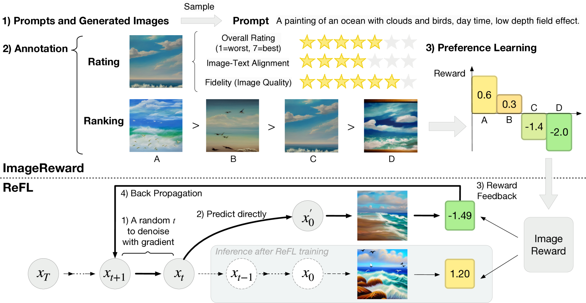
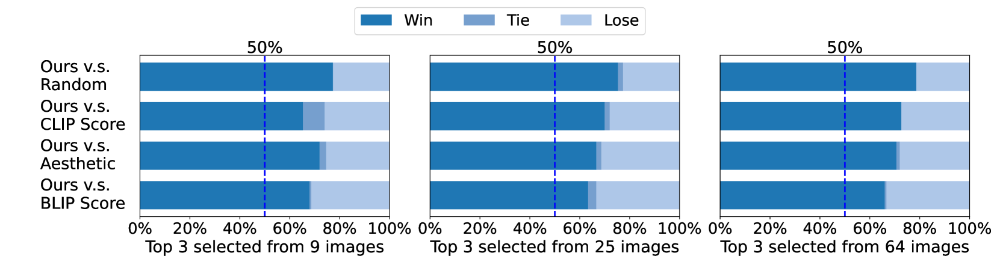

# ImageReward

## 📌 核心贡献

> 构建了首个大规模通用T2I人类偏好奖励模型，通过对137k专家比较数据的建模解决偏好冲突问题。配套提出的ReFL算法通过在扩散采样链条末端反向传播奖励梯度，实现了比传统方法更精准的人类感知对齐。

## 📖 摘要

We present a comprehensive solution to learn and improve text-to-image models from human preference feedback. To begin with, we build ImageReward -- the first general-purpose text-to-image human preference reward model -- to effectively encode human preferences. Its training is based on our systematic annotation pipeline including rating and ranking, which collects 137k expert comparisons to date. In human evaluation, ImageReward outperforms existing scoring models and metrics, making it a promising automatic metric for evaluating text-to-image synthesis. On top of it, we propose Reward Feedback Learning (ReFL), a direct tuning algorithm to optimize diffusion models against a scorer. Both automatic and human evaluation support ReFL's advantages over compared methods.

## 🔍 关键信息

| 字段 | 内容 |
|------|------|
| 机构 | Tsinghua University (THUDM) |
| 发表 | 2023-04-12 |
| 分类 | cs.CV, cs.LG |
| 链接 | [arXiv](https://arxiv.org/abs/2304.05977) |

## 📝 我的笔记

### 方法总览

### 动机与问题定义

现有 T2I 评价指标（FID、CLIP Score、Aesthetic Score）与人类真实偏好相关性较低。例如 CLIP Score 的 Spearman 相关系数仅为 0.77，零样本 FID 甚至低至 0.09。核心原因在于：

1. **多维度权衡**：人类偏好涉及文本对齐 (alignment)、保真度 (fidelity)、无害性 (harmlessness) 三个维度，现有指标只关注单一维度
2. **偏好冲突**：不同维度之间存在 trade-off（如高对齐但低保真），需要明确的优先级体系
3. **缺乏大规模人类标注数据**：此前没有系统性的 T2I 人类偏好数据集

### 数据标注流程

ImageReward 构建了一个三阶段标注管线：

**数据来源：**
- Prompt 来源：DiffusionDB 的真实用户 prompt，通过基于图的算法从 10,000 候选中筛选出 8,878 个高质量 prompt
- 图像生成：每个 prompt 生成 4-9 张图像，共 177,304 候选对

**三阶段标注：**

| 阶段 | 内容 | 细节 |
|------|------|------|
| Stage 1: Prompt 标注 | 对 prompt 进行分类和问题识别 | 12 个类别（动物、建筑、人物等） |
| Stage 2: 文本-图像评分 | 三个维度的 7 分 Likert 量表 | 对齐、保真度、无害性 |
| Stage 3: 图像排序 | 对 4-9 张图像进行完整排序 | 从排序中提取 $C_k^2$ 个配对 |

**冲突解决准则：** 保真度和无害性优先于对齐度；有害内容（毒性）的严重程度高于对齐偏差。

**最终规模：** 137,000 专家比较，覆盖 8,878 个 prompt。

### 模型架构

ImageReward 基于 **BLIP** 预训练模型构建：

- **图像编码器**：Vision Transformer-Large (ViT-L)
- **文本编码器**：12 层 Transformer
- **融合机制**：通过 **Cross Attention** 融合图像和文本特征
- **输出层**：MLP 将融合特征映射为标量分数 $f_\theta(T, x) \in \mathbb{R}$

**关键训练技巧：** 冻结 70% 的 Transformer 层以防止过拟合，学习率 $1 \times 10^{-5}$，batch size 64。

### 训练损失：Bradley-Terry 模型

使用 Bradley-Terry (BT) 偏好模型，损失函数为：

$$\mathcal{L}(\theta) = -\mathbb{E}_{(T, x_i, x_j) \sim \mathcal{D}} \left[ \log \sigma \left( f_\theta(T, x_i) - f_\theta(T, x_j) \right) \right]$$

其中 $x_i$ 是被偏好的图像，$x_j$ 是被拒绝的图像，$\sigma$ 为 sigmoid 函数。从 $k$ 张图像的完整排序中，可以提取最多 $C_k^2$ 个配对比较。

### ReFL 算法（Reward Feedback Learning）

ReFL 是基于 ImageReward 的扩散模型微调算法，核心思想是在去噪链末端直接反向传播奖励梯度。

**关键发现：** ImageReward 的打分在去噪步骤 $t \geq 30$（总步数 $T=40$）时变得可靠且可区分，这为选择反馈注入时机提供了依据。

**算法步骤：**
1. 从噪声 $x_T$ 正常去噪到 $x_{t+1}$（不记录梯度）
2. 随机选取 $t \in [T_1, T_2] = [30, 40]$，从 $x_{t+1}$ 去噪到 $x_t$（记录梯度）
3. 从 $x_t$ 直接预测干净图像 $\hat{x}_0$
4. 计算奖励损失：$\mathcal{L}_{\text{reward}} = \lambda \cdot \varphi(r(y_i, g_\theta(y_i)))$，其中 $\varphi = \text{ReLU}$，$\lambda = 10^{-3}$
5. 结合预训练损失进行正则化，防止 reward hacking

**与其他方法的对比：** ReFL 不需要 RL 框架（如 PPO），也不依赖于似然估计，而是直接通过奖励梯度优化扩散模型参数。

### 关键实验结果

**偏好预测准确率（与人类标注者的一致性）：**

| 模型 | 准确率 |
|------|--------|
| CLIP Score | 54.82% |
| Aesthetic Score | 57.35% |
| BLIP Score | 57.76% |
| **ImageReward** | **65.14%** |

**与人类个体/集体的一致性：**

| 对比对象 | 一致性 |
|----------|--------|
| ImageReward vs. 单个标注者 | 65.3% |
| ImageReward vs. 标注者集体 | 70.5% |

**模型排名的 Spearman 相关系数：**

| 指标 | Spearman $\rho$ |
|------|-----------------|
| Zero-shot FID | 0.09 |
| CLIP Score | 0.77 |
| **ImageReward** | **1.00** |

**ReFL 微调效果（vs. SD v1.4 基线的人类评估胜率）：**

| 方法 | 胜率 |
|------|------|
| Reward Weighted | 39.52% |
| Dataset Filtering | 55.17% |
| **ReFL** | **58.79%** |

### Ablation 分析

**数据规模效应：**

| 训练样本数 | 偏好准确率 |
|-----------|-----------|
| 1,000 | 63.07% |
| 8,000 | 65.14% |

**骨干网络对比：** BLIP 在相同数据规模下始终优于 CLIP（CLIP 在 8k 样本时为 62.98%，BLIP 为 65.14%），说明 cross-attention 融合机制对偏好建模至关重要。

### 总结与评价

ImageReward 是 T2I 奖励模型的奠基性工作：
- **数据层面**：首次构建了系统性的多维度标注管线，明确了偏好冲突的优先级体系
- **模型层面**：验证了 BLIP 的 cross-attention 架构优于 CLIP 的对比学习架构用于偏好建模
- **应用层面**：ReFL 提供了一种轻量级的扩散模型对齐方案，无需 RL 框架
- **局限性**：数据规模（137K）相对较小；标注者为专家而非普通用户，可能存在偏好偏差；ReFL 仅在 SD v1.4 上验证

## 🔗 相关论文

**基于/改进自：** —

**同方向（reward model）：** [[PickScore]], [[HPSv2]]
