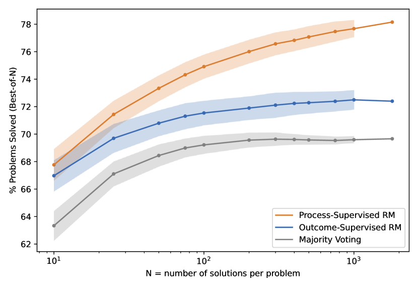
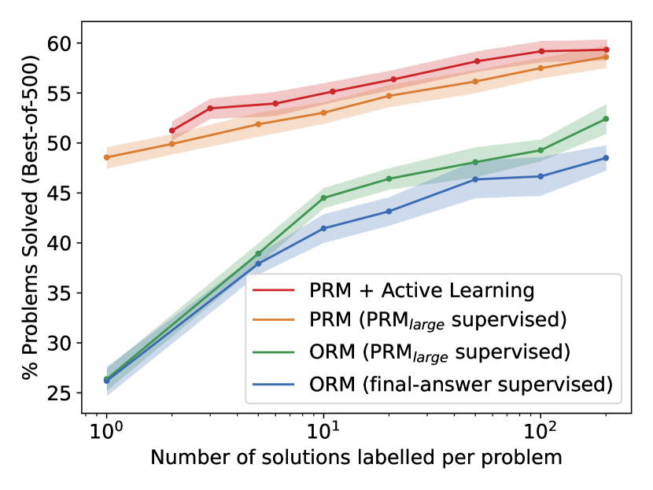

# PRM800K

## 📌 核心贡献

> 系统性地比较了过程监督（process supervision）与结果监督（outcome supervision）在数学推理任务上的效果，证明过程监督显著优于结果监督，并发布了包含 80 万条步骤级人工标注的 PRM800K 数据集。

## 📖 摘要

In recent years, large language models have greatly improved in their ability to perform complex multi-step reasoning. However, even state-of-the-art models still regularly produce logical mistakes. To train more reliable models, we can turn either to outcome supervision, which provides feedback for a final result, or process supervision, which provides feedback for each intermediate reasoning step. Given the importance of training reliable models, and given the high cost of human feedback, it is important to carefully compare the efficacy of each form of supervision. We find that process supervision significantly outperforms outcome supervision for training models to solve problems from the challenging MATH dataset. Our process-supervised model solves 78.2% of problems from a representative subset of the MATH test set. Additionally, we show that active learning significantly improves the efficacy of process supervision. To support related research, we also release PRM800K, the complete dataset of 800,000 step-level human feedback labels used to train our best reward model.

## 🔍 关键信息

| 字段 | 内容 |
|------|------|
| 机构 | OpenAI |
| 发表 | 2023-05-31 |
| 分类 | cs.LG, cs.AI, cs.CL |
| 链接 | [arXiv](https://arxiv.org/abs/2305.20050) |

## 📝 我的笔记

### 方法总览

### 核心问题与动机

大语言模型在多步推理任务中经常产生逻辑错误。为了训练更可靠的模型，存在两种监督范式：

- **结果监督（Outcome Supervision）**：仅对最终结果提供反馈，训练 Outcome Reward Model (ORM)
- **过程监督（Process Supervision）**：对每个中间推理步骤提供反馈，训练 Process Reward Model (PRM)

本文系统性地比较了这两种方法，发现过程监督在数学推理任务上显著优于结果监督。

### 方法细节

#### ORM（Outcome Reward Model）

- 仅使用最终答案的正确性作为监督信号
- 对同一问题生成多个解答，正确答案的解答标记为正样本，错误的标记为负样本
- 训练模型预测解答最终答案的正确概率

#### PRM（Process Reward Model）

- 使用人工标注的步骤级标签进行训练
- 每个步骤标注为三类：正确（positive）、错误（negative）、中性（neutral）
- 标注仅覆盖到错误解答中第一个错误步骤为止
- 解答的整体得分 = 所有步骤正确概率的乘积：

$$\text{Score}(s) = \prod_{i=1}^{n} P(\text{correct}_i)$$

其中中性标签在训练时被视为正确。

#### PRM800K 数据集

| 统计项 | 数值 |
|--------|------|
| 总标注数 | 800,000（筛选自 1,085,590） |
| 解答样本数 | ~75,000 |
| 覆盖问题数 | ~12,000 |
| 正确步骤占比 | 73.1% |
| 正确解答占比 | 14.2% |

数据收集分两个阶段：
- **Phase 1**：标注者可在所有选项错误时编写替代步骤（约 5% 的数据）
- **Phase 2**：使用主动学习策略，优先标注"最具迷惑性的错误解答"（convincing wrong-answer solutions），显著提升数据效率约 **2.6 倍**

#### 主动学习策略

- 从当前 PRM 评分最高的错误解答中选取 80% 的标注样本
- 剩余 20% 从其他高评分解答中随机选取，防止过度偏差
- 相比随机选择，数据效率提升约 2.6 倍

#### 训练细节

- 基座模型：GPT-4 base model
- 预训练语料 MathMix：约 1.5B 数学相关 token（数学问题/解答 ~275M、自由数学讨论 ~880M、合成数据 ~130M、评分批评 ~500M）
- 大模型训练 ~3B token（2 epochs），小模型 ~6.6B token（6 epochs）
- PRM 训练：从 MathMix 模型微调，2 epochs，低学习率至关重要

### 关键结果

#### 大规模实验（MATH 测试集，best-of-N）

| 方法 | best-of-1860 准确率 |
|------|---------------------|
| **PRM（过程监督）** | **78.2%** |
| ORM（结果监督） | 72.4% |
| Majority Voting | 69.6% |

#### 分布外泛化测试（best-of-100）

| 数据集 | PRM | ORM |
|--------|-----|-----|
| AP Calculus | 86.7% | 68.9% |
| AP Chemistry | 80.0% | 68.9% |
| AP Physics | 86.7% | 77.8% |
| AMC 10/12 | 53.2% | 49.1% |
| **总计（234 题）** | **72.9%** | **63.8%** |

PRM 在分布外数据上同样显著优于 ORM，表明过程监督的优势具有泛化性。

#### 小规模实验

在小模型（约 200 倍更少预训练计算量）上的实验同样证实了过程监督的优势，且主动学习策略的效果在小规模下更为显著。

#### PRM 评分策略消融

| 评分策略 | 准确率 |
|----------|--------|
| 乘积归约 + 中性视为正 | 78.2% |
| 乘积归约 + 中性视为负 | 77.4% |
| 最小值归约 + 中性视为正 | 77.7% |
| 最小值归约 + 中性视为负 | 77.9% |

不同评分策略之间的差异很小（77.4%--78.2%），说明 PRM 的性能对评分策略不敏感。

### Best-of-N 评估方法

对每个测试问题，生成 N 个候选解答，由奖励模型对每个解答打分，选择得分最高的解答，自动评判其最终答案是否正确。随着 N 增大，PRM 与 ORM 的差距进一步拉大。

### 总结性评价

本文是过程奖励模型（PRM）方向的奠基性工作，有以下核心贡献：

1. **首次大规模系统性对比**了过程监督与结果监督，在强基座模型（GPT-4）上证明过程监督的显著优势
2. **PRM800K 数据集**是首个大规模步骤级人工标注数据集，为后续 PRM 研究提供了重要基准
3. **主动学习策略**显著提升了数据收集效率，为大规模人工标注提供了实用方法论
4. 论文的实验设计严谨，对评分策略、数据规模等因素进行了充分的消融实验

局限性：依赖大量人工标注，成本高昂；实验主要在数学推理领域，其他推理任务的泛化性有待验证。后续工作如 Math-Shepherd、GenRM 等尝试通过自动化方式生成过程监督信号来降低成本。

## 🔗 相关论文

**基于/改进自：** [[InstructGPT]]

**同方向：** [[GenRM]], [[RM-R1]]
