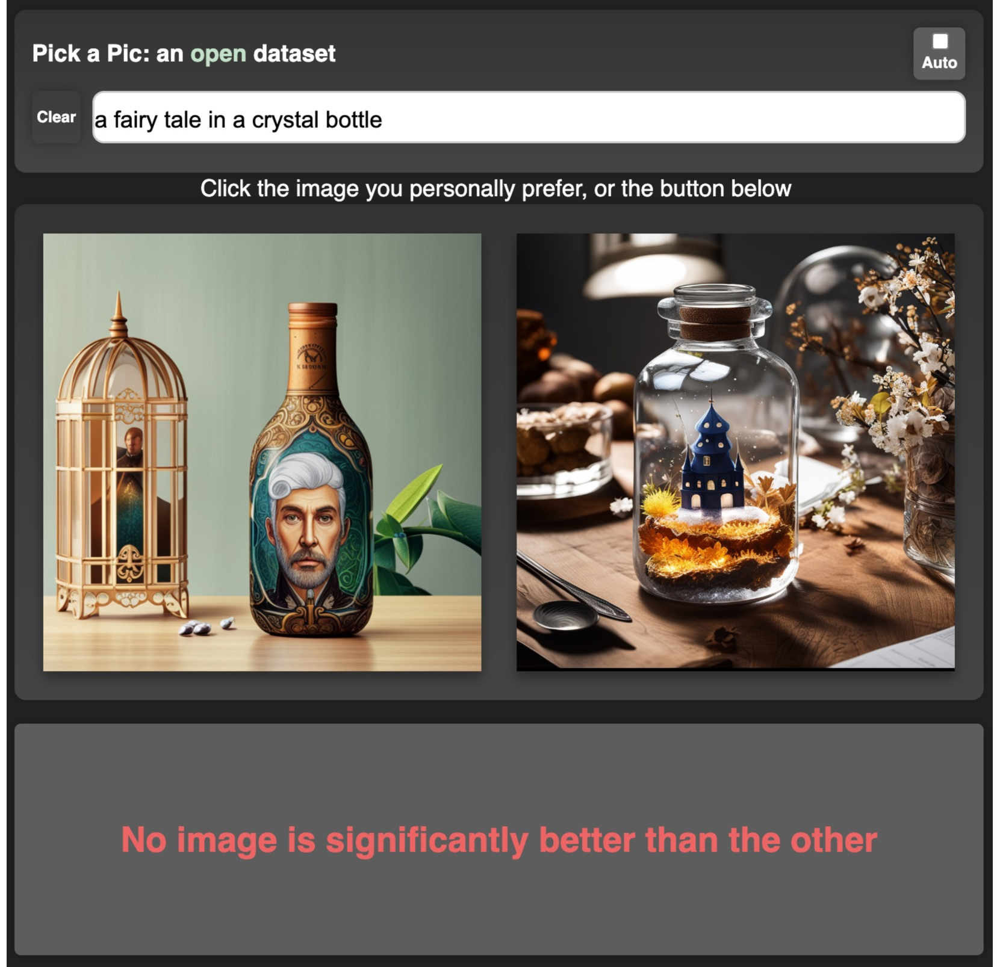
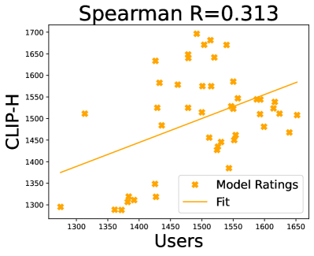
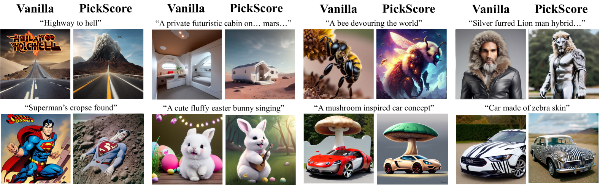

# Pick-a-Pic

## 📌 核心贡献

> 构建了首个大规模开源的文生图用户偏好数据集 Pick-a-Pic（50 万+ 真实用户偏好对），并基于此训练了超越人类预测准确率的 CLIP-based 评分函数 PickScore。

## 📖 摘要

The ability to collect a large dataset of human preferences from text-to-image users is usually limited to companies, making such datasets inaccessible to the public. To address this issue, we create a web app that enables text-to-image users to generate images and specify their preferences. Using this web app we build Pick-a-Pic, a large, open dataset of text-to-image prompts and real users' preferences over generated images. We leverage this dataset to train a CLIP-based scoring function, PickScore, which exhibits superhuman performance on the task of predicting human preferences. Then, we test PickScore's ability to perform model evaluation and observe that it correlates better with human rankings than other automatic evaluation metrics. Therefore, we recommend using PickScore for evaluating future text-to-image generation models, and using Pick-a-Pic prompts as a more relevant dataset than MS-COCO. Finally, we demonstrate how PickScore can enhance existing text-to-image models via ranking.

## 🔍 关键信息

| 字段 | 内容 |
|------|------|
| 机构 | Meta AI / Tel Aviv University |
| 发表 | 2023-05-02 |
| 分类 | cs.CV, cs.AI |
| 链接 | [arXiv](https://arxiv.org/abs/2305.01569) |

## 📝 我的笔记

### 方法总览

### 动机与问题

现有文生图模型的人类偏好数据集通常由大公司私有（如 Midjourney、DALL-E 的用户反馈数据），学术界缺乏可用的大规模开放偏好数据集。此外，FID 等传统自动评估指标与人类偏好的相关性较差（FID 与人类排名的相关性仅为 -0.900，且是负相关，高 classifier-free guidance scale 的图像人类更喜欢但 FID 反而更差）。

核心目标：
1. 构建一个**开放的、大规模的**文生图用户偏好数据集
2. 训练一个能**超越人类水平**预测偏好的自动评分函数
3. 提供比 MS-COCO 更接近真实使用场景的评估 prompt 集

### 数据收集：Pick-a-Pic Web App

**交互设计：**
- 用户输入文本 prompt，系统生成两张图像
- 用户从两张中选择偏好的一张（或标记为 tie）
- 被拒绝的图像替换为新生成的图像，用户继续选择
- 用户可以随时修改 prompt

**后端模型：**
- Stable Diffusion 2.1
- Dreamlike Photoreal 2.0
- Stable Diffusion XL (Alpha/Beta)
- 使用不同的 classifier-free guidance scales 增加多样性

**质量控制：**
- Gmail / Discord 账号认证
- 监控异常行为（过快的判断、NSFW 内容）
- NSFW 短语过滤
- 每用户交互上限 1,000 次（定期提升）
- 所有用户显式同意数据共享

**用户来源：** 通过 Twitter、Facebook、Discord、Reddit 招募真实用户

### 数据集规模与统计

| 指标 | 数值 |
|------|------|
| 总排名数 | 968,965 |
| 不同 prompts 数 | 66,798 |
| 唯一用户数 | 6,394 |
| 过滤后训练集 | 583,747 条 |
| 训练集 prompts | 37,523 |
| 训练集用户 | 4,375 |
| 验证/测试集 | 各 500 条 |
| 测试集唯一 prompts | 1,000 |

**数据划分原则：** 训练/验证/测试集之间无 prompt 重叠，防止过拟合。

### PickScore 模型

**架构：** 在 CLIP-H (ViT-H/14) 基础上微调，评分函数为：

$$s(x, y) = E_{\text{txt}}(x) \cdot E_{\text{img}}(y) \cdot T$$

其中 $E_{\text{txt}}$ 和 $E_{\text{img}}$ 分别是文本和图像编码器，$T$ 是可学习的温度参数。

**训练目标：** 最小化用户偏好分布 $p$ 与模型预测分布之间的 KL 散度：

$$\hat{p}_i = \frac{\exp s(x, y_i)}{\sum_j \exp s(x, y_j)}$$

$$L_{\text{pref}} = \sum_i p_i (\log p_i - \log \hat{p}_i)$$

偏好向量 $p$ 取值：$[1, 0]$（左偏好）、$[0, 1]$（右偏好）、$[0.5, 0.5]$（tie）。

**训练细节：**

| 超参数 | 值 |
|--------|------|
| 训练步数 | 4,000 |
| 学习率 | 3e-6 |
| Batch size | 128 |
| Warmup 步数 | 500 (线性衰减) |
| 硬件 | 8x A100 GPU |
| 训练时间 | < 1 小时 |

**关键设计：**
- 使用 inverse prompt-frequency weighting（逆 prompt 频率加权）缓解热门 prompt 的过拟合
- 每 100 步评估验证集准确率，选取最佳 checkpoint

### 关键实验结果

**偏好预测准确率（Pick-a-Pic 测试集）：**

| 模型 | 准确率 |
|------|--------|
| Random | 56.8% |
| Aesthetics | 56.8% |
| CLIP-H | 60.8% |
| ImageReward | 61.1% |
| HPS | 66.7% |
| Human Expert | 68.0% |
| **PickScore** | **70.5%** |

PickScore 是唯一超越人类专家的自动评分方法。

**Elo 评分与真实用户的相关性：**

| 模型 | Spearman 相关系数 |
|------|-------------------|
| CLIP-H | 0.313 |
| ImageReward | 0.492 |
| HPS | 0.670 |
| **PickScore** | **0.790** |

**PickScore 用于模型增强（Best-of-N 策略）：**

| 对比 | PickScore 胜率 |
|------|---------------|
| PickScore vs Random (无模板) | 71.4% |
| PickScore vs Random (有模板) | 82.0% |
| PickScore vs Aesthetics | 85.1% |
| PickScore vs CLIP-H | 71.3% |

### Ablation 分析

**In-Batch Negatives 消融：** 尝试使用 CLIP 原始的 batch 内负样本对比学习 loss，准确率仅为 65.2%，远低于简单的 pairwise KL 散度目标（70.5%）。说明偏好学习任务中，pairwise 比较比 batch 内对比更有效。

### 关于 FID 的反思

论文发现 FID 与人类偏好存在矛盾：高 classifier-free guidance scale 的图像人类更喜欢，但 FID 反而更差。PickScore 与人类排名的相关性（0.917）远优于 FID（-0.900，负相关）。论文建议用 PickScore 替代 FID 作为文生图模型的主要评估指标，用 Pick-a-Pic prompts 替代 MS-COCO。

### 总结性评价

Pick-a-Pic 的核心价值在于：
1. **开放性**：首个大规模开源的真实用户偏好数据集，后续被 DPO-Diffusion 等大量工作使用
2. **数据质量**：来自真实用户的自然偏好，而非众包标注，更贴近实际使用场景
3. **PickScore 的强大性能**：训练成本极低（< 1 小时），但超越人类专家
4. **评估范式的推动**：推动了文生图领域从 FID 转向人类偏好对齐的评估指标

局限性：数据集偏向早期 SD 模型的生成质量，可能不完全适用于更高质量的新一代模型。

## 🔗 相关论文

**基于/改进自：** --

**同方向：** [[PickScore]], [[ImageReward]], [[HPSv2]]
