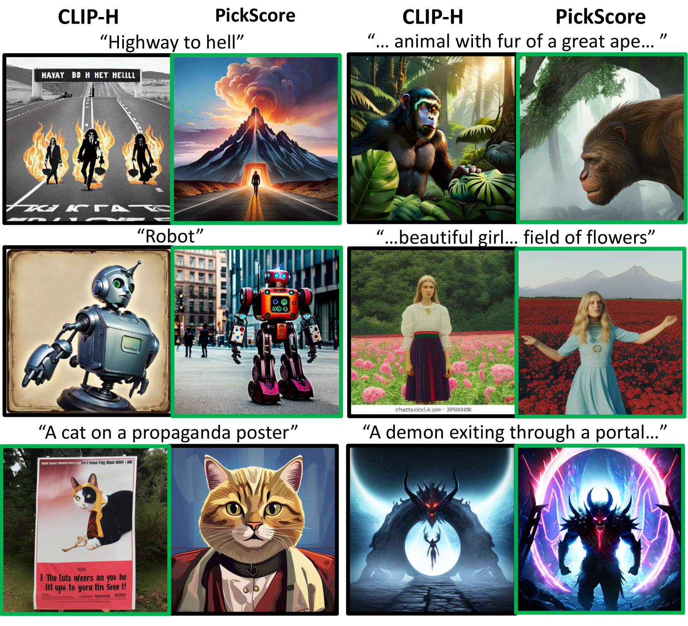

# PickScore

## 📌 核心贡献

> 利用真实用户与模型交互的大量偏好数据构建了Pick-a-Pic数据集，并训练出超越人类预测一致性的评分函数。该模型不仅能作为高效的评估指标，还可用于在推理阶段通过Best-of-N策略进行样本重排序，显著增强最终输出图像的视觉表现。

## 📖 摘要

The ability to collect a large dataset of human preferences from text-to-image users is usually limited to companies, making such datasets inaccessible to the public. To address this issue, we create a web app that enables text-to-image users to generate images and specify their preferences. Using this web app we build Pick-a-Pic, a large, open dataset of text-to-image prompts and real users' preferences over generated images. We leverage this dataset to train a CLIP-based scoring function, PickScore, which exhibits superhuman performance on the task of predicting human preferences. Then, we test PickScore's ability to perform model evaluation and observe that it correlates better with human rankings than other automatic evaluation metrics. Therefore, we recommend using PickScore for evaluating future text-to-image generation models, and using Pick-a-Pic prompts as a more relevant dataset than MS-COCO. Finally, we demonstrate how PickScore can enhance existing text-to-image models via ranking.

## 🔍 关键信息

| 字段 | 内容 |
|------|------|
| 机构 | Meta AI / Tel Aviv University |
| 发表 | 2023-05-02 |
| 分类 | cs.CV, cs.AI |
| 链接 | [arXiv](https://arxiv.org/abs/2305.01569) |

## 📝 我的笔记

### 方法总览

### 动机与问题定义

T2I 模型的评估长期依赖 FID（基于 MS-COCO）和 CLIP Score，但这些指标与人类偏好存在显著偏差。核心挑战：

1. **数据获取壁垒**：大规模人类偏好数据通常只有大公司能收集，学术界缺乏公开数据集
2. **现有指标失效**：FID 与人类偏好甚至可能负相关——更高的 classifier-free guidance scale 通常更受人类欢迎，但会恶化 FID
3. **评估 prompt 不匹配**：MS-COCO 的描述性 caption 与 T2I 用户的创意性 prompt 分布差异巨大

### Pick-a-Pic 数据集

**收集方式：** 构建了一个公开的 Web 应用，用户可以：
1. 输入创意 prompt 生成图像
2. 每轮看到两张生成图像，选择偏好（左/右/平局）
3. 被拒绝的图像替换为新生成图像，循环进行
4. 用户可随时修改 prompt

**数据规模：**

| 版本 | 样本数 | Prompt 数 | 用户数 |
|------|--------|----------|--------|
| v1 | 500,000+ | 35,000+ | — |
| v2 | 1,000,000+ | — | — |
| 实验用 (train) | 583,747 | 37,523 | 4,375 |
| 实验用 (val/test) | 各 500 | 1,000 | — |

**图像生成模型：**
- Stable Diffusion 2.1
- Dreamlike Photoreal 2.0（基于 SD 1.5 微调）
- Stable Diffusion XL 变体
- 每个模型采用多种 classifier-free guidance scale

**质量控制措施：**
- Gmail/Discord 账号认证
- NSFW prompt 过滤
- 用户行为监控（禁止同时多实例、过快判断）
- 每用户上限 1,000 次交互

**数据划分策略：** 从独立用户中采样 1,000 个 prompt（每用户一个），平均分为验证集和测试集各 500 例，确保 prompt 和用户均不与训练集重叠。

### 模型架构

PickScore 基于 **CLIP-H**（OpenCLIP 的 ViT-H 变体）微调：

$$s(x, y) = E_{\text{txt}}(x) \cdot E_{\text{img}}(y) \cdot T$$

其中：
- $E_{\text{txt}}(x)$：文本编码器输出的 $d$ 维归一化向量
- $E_{\text{img}}(y)$：图像编码器输出的 $d$ 维归一化向量
- $T$：可学习的标量温度参数

与 ImageReward 使用 BLIP 的 cross-attention 融合不同，PickScore 保留了 CLIP 的**双塔对比架构**，仅通过微调来适应偏好预测任务。

### 训练细节

**损失函数：** 最小化用户偏好分布与模型预测分布之间的 KL 散度：

$$\mathcal{L}_{\text{pref}} = \sum_{i=1}^{2} p_i \left( \log p_i - \log \hat{p}_i \right)$$

其中：
- $p$：用户偏好分布（$[1,0]$, $[0,1]$, 或 $[0.5, 0.5]$ 表示平局）
- $\hat{p}_i = \text{softmax}(s(x, y_i))$：模型预测的偏好概率

**关键设计：** 按 prompt 频率的倒数对 batch 内样本加权，避免高频 prompt 主导训练。

**超参数：**

| 参数 | 值 |
|------|-----|
| 学习率 | $3 \times 10^{-6}$ |
| Batch size | 128 |
| 训练步数 | 4,000 |
| Warmup | 500 步，线性衰减 |
| 硬件 | 8 $\times$ A100 |
| 训练时间 | < 1 小时 |

模型选择基于验证集准确率（排除平局），每 100 步评估一次。

### 关键实验结果

**偏好预测准确率（Pick-a-Pic 测试集）：**

| 模型 | 准确率 |
|------|--------|
| Random Baseline | 56.8% |
| Aesthetics Predictor | 56.8% |
| CLIP-H | 60.8% |
| ImageReward | 61.1% |
| HPS | 66.7% |
| Human Expert | 68.0% |
| **PickScore** | **70.5% $\pm$ 0.142** |

PickScore 超越了人类专家的预测准确率（**superhuman performance**），这是因为它能学习到多数用户的聚合偏好。

**平局处理：** 每个模型在验证集上搜索最优 tie threshold $t$，当 $|\hat{p}_1 - \hat{p}_2| < t$ 时预测为平局。评分规则：正确 1 分，一方为 tie 0.5 分，全错 0 分。

**模型评估相关性（与人类排名的一致性）：**

*FID 对比（MS-COCO captions，9 个模型）：*

| 指标 | 与人类排名的相关性 |
|------|------------------|
| FID | -0.900（负相关） |
| **PickScore** | **0.917** |

*Elo 评级对比（Pick-a-Pic 测试集，45 个模型配置）：*

| 指标 | 与用户 Elo 的相关性 |
|------|-------------------|
| CLIP-H | 0.313 $\pm$ 0.075 |
| ImageReward | 0.492 $\pm$ 0.086 |
| HPS | 0.670 $\pm$ 0.071 |
| **PickScore** | **0.790 $\pm$ 0.054** |

### Best-of-N 重排序实验

在每个 prompt 上生成 100 张图像（5 个随机种子 $\times$ 20 个 prompt 模板），用 PickScore 选择最佳图像：

| 对比 | PickScore 胜率 |
|------|---------------|
| vs. Random Seed + Null Template | 71.4% |
| vs. Random Template | 82.0% |
| vs. Aesthetics Predictor 选择 | 85.1% |
| vs. CLIP-H 选择 | 71.3% |

PickScore 选出的图像在美学分数上也高于 CLIP-H 的选择（68.5%），同时在 CLIP-H 文本对齐分数上也高于 Aesthetics Predictor 的选择（90.5%），说明 PickScore 能同时兼顾质量和对齐。

### Ablation 分析

**In-Batch Negatives 实验：** 尝试引入 CLIP 原始的 batch 内负样本对比损失，准确率从 70.5% 下降到 65.2%。结论：标准偏好损失优于 CLIP 风格的对比学习损失用于偏好预测。

### 总结与评价

PickScore 的核心贡献在于**数据层面**和**方法论层面**：
- **数据优势**：Pick-a-Pic 是首个来自真实用户交互的大规模公开偏好数据集，比 ImageReward 的专家标注更能反映普通用户偏好
- **架构简洁**：保留 CLIP 双塔架构 + 标量温度，训练不到 1 小时，极其高效
- **超越人类**：在 Pick-a-Pic 测试集上超越人类专家准确率，验证了大规模用户偏好数据的价值
- **下游影响**：Pick-a-Pic 数据集后来被 DPO-Diffusion (2311.12908) 用于训练，共 851k 配对偏好数据
- **局限性**：数据来源集中于特定 Web 应用用户群体，可能存在用户偏好偏差；仅在 Stable Diffusion 系列模型上验证；对图像风格多样性的泛化能力未充分评估

## 🔗 相关论文

**基于/改进自：** —

**同方向（reward model）：** [[ImageReward]], [[HPSv2]]
