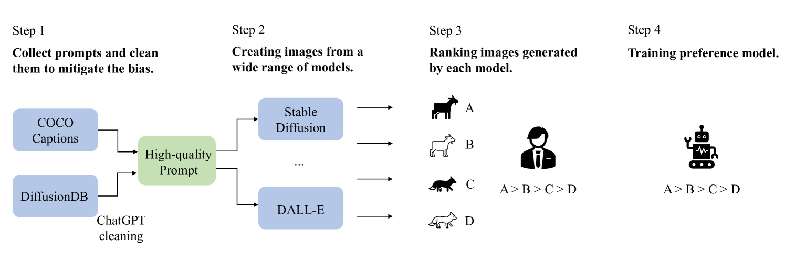
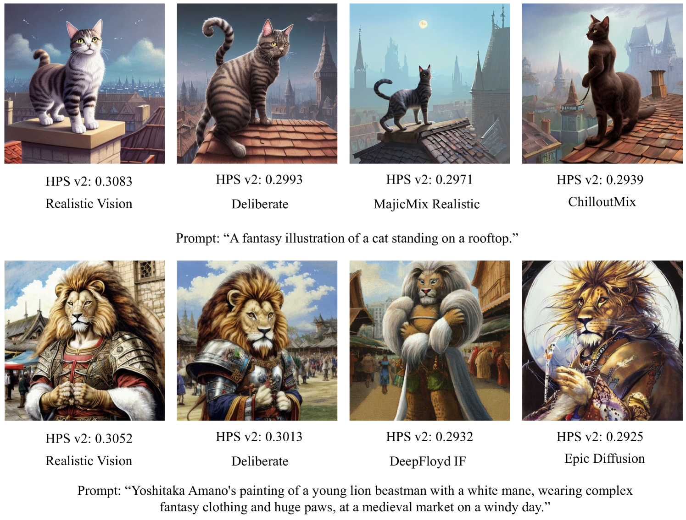

# HPSv2

## 📌 核心贡献

> 发布了包含近80万条真实偏好选择的大规模基准数据集HPD v2，并推出了经显式偏差纠正的评分模型。该研究通过消除以往数据集中的系统性偏差，为T2I模型的审美水平和指令遵循能力提供了目前业界最稳定、公平的评估基准。

## 📖 摘要

Recent text-to-image generative models can generate high-fidelity images from text inputs, but the quality of these generated images cannot be accurately evaluated by existing evaluation metrics. To address this issue, we introduce Human Preference Dataset v2 (HPD v2), a large-scale dataset that captures human preferences on images from a wide range of sources. HPD v2 comprises 798,090 human preference choices on 433,760 pairs of images, making it the largest dataset of its kind. The text prompts and images are deliberately collected to eliminate potential bias, which is a common issue in previous datasets. By fine-tuning CLIP on HPD v2, we obtain Human Preference Score v2 (HPS v2), a scoring model that can more accurately predict human preferences on generated images. Our experiments demonstrate that HPS v2 generalizes better than previous metrics across various image distributions and is responsive to algorithmic improvements of text-to-image generative models, making it a preferable evaluation metric for these models. We also investigate the design of the evaluation prompts for text-to-image generative models, to make the evaluation stable, fair and easy-to-use. Finally, we establish a benchmark for text-to-image generative models using HPS v2, which includes a set of recent text-to-image models from the academic, community and industry.

## 🔍 关键信息

| 字段 | 内容 |
|------|------|
| 机构 | CUHK MMLab |
| 发表 | 2023-06-15 |
| 分类 | cs.CV, cs.AI, cs.DB |
| 链接 | [arXiv](https://arxiv.org/abs/2306.09341) |

## 📝 我的笔记

### 方法总览

### 动机与问题定义

HPS v2 的核心动机是解决现有人类偏好数据集和评估指标中的**系统性偏差**问题：

1. **图像来源偏差**：HPS v1、ImageReward 等数据集仅使用 Stable Diffusion 生成图像，导致模型无法泛化到其他生成架构
2. **Prompt 偏差**：DiffusionDB 中大量 prompt 包含风格修饰词（如"Greg Rutkowski"出现在约 10.4% 的 prompt 中），这些风格词导致模型学习到的是"风格偏好"而非"质量偏好"
3. **评估不公平**：缺乏标准化的评估 prompt 集合，不同研究使用不同 prompt 导致结果不可比

### HPD v2 数据集构建

**整体规模：** 798,090 条人类偏好选择，430,060 个图像对。

**Prompt 来源与清洗：**

| 来源 | 用途 | 处理方式 |
|------|------|---------|
| DiffusionDB | 用户创意 prompt | ChatGPT 清洗：移除分辨率、质量描述符、平台名称等非内容修饰词 |
| COCO Captions | 真实场景描述 | 直接使用 |

清洗细节：约 11% 的 DiffusionDB prompt 包含矛盾的风格词组合，ChatGPT 负责识别和移除。清洗后，"Greg Rutkowski"等问题词的出现频率从 10.4% 降至约 2.7%。

**图像来源（9 个 T2I 模型 + 真实图像）：**

| 类型 | 模型 |
|------|------|
| 扩散模型 | Stable Diffusion v1.4, Stable Diffusion v2.0, DALL-E 2, GLIDE |
| 自回归模型 | CogView2 |
| GAN-based | LAFITE |
| VQ-based | VQ-GAN+CLIP, VQ-Diffusion |
| 优化-based | FuseDream |
| 真实图像 | COCO Captions |

**标注流程：**
- 57 名标注员：50 名负责标注，7 名负责质量控制
- 训练集：每组图像由单个标注员标注
- 测试集：每组图像由 10 个标注员标注，确保稳定性
- 标注规则：图像质量和保真度优先于完美的文本对齐

### 偏差纠正方法论

HPSv2 的偏差纠正是该论文最重要的方法论贡献：

**偏差类型及纠正措施：**

| 偏差类型 | 问题 | 纠正方法 |
|---------|------|---------|
| 图像来源偏差 | 仅用单一模型生成的图像 | 引入 9 种不同架构的模型 |
| Prompt 风格偏差 | 风格修饰词主导偏好 | ChatGPT 清洗 prompt，移除非内容修饰词 |
| 风格词矛盾 | 约 11% prompt 含矛盾风格组合 | ChatGPT 自动检测并重组为单一清晰句子 |
| 模型能力偏差 | 不同模型能力差异导致的偏好混淆 | 多模型混合训练，测试集覆盖全部 9 种模型 |

### 模型架构与训练

**架构：** 基于 CLIP-H 微调，评分函数为：

$$s_\theta(p, x) = \frac{\text{Enc}_{\text{txt}}(p) \cdot \text{Enc}_{\text{img}}(x)}{\tau}$$

其中 $\tau$ 为可学习的温度参数。

**微调范围：**
- 图像编码器：最后 20 层
- 文本编码器：最后 11 层

**训练超参数：**

| 参数 | 值 |
|------|-----|
| 学习率 | $3.3 \times 10^{-6}$ |
| 权重衰减 | 0.35 |
| Batch size | 128 |
| 训练步数 | 4,000 |
| Warmup | 500 步 |
| 学习率调度 | Cosine decay |
| 优化器 | AdamW |
| 训练数据 | 645,090 个二元比较 |

**超参数搜索：** 使用贝叶斯优化（Bayesian optimization）在测试集准确率上搜索最优超参数。

**损失函数：** 与 PickScore 相同，使用偏好分布与模型预测分布之间的 KL 散度。

### 评估 Prompt 设计

HPSv2 专门设计了标准化评估 prompt 集合：

- **总量**：3,200 个评估 prompt
- **四种风格类别**：Animation, Concept-art, Painting, Photo（每类 800 个）
- **来源**：前三类来自清洗后的 DiffusionDB prompt，Photo 类使用 COCO Captions
- **分组**：每类分为 10 组（每组 80 个 prompt），用于计算统计稳定性
- **设计目标**：使评估结果稳定、公平、易用

### 关键实验结果

**偏好预测准确率：**

| 模型 | ImageReward 测试集 | HPD v2 测试集 |
|------|-------------------|--------------|
| ImageReward | 65.1% | 70.6% |
| **HPS v2** | **65.7%** | **83.3%** |

HPS v2 在两个测试集上均优于 ImageReward，尤其在 HPD v2 测试集上优势显著（+12.7%），说明多模型多 prompt 的训练数据能显著提升泛化能力。

**T2I 模型基准测试（HPS v2 评分）：**

| 模型 | Animation | Concept-art | Painting | Photo |
|------|-----------|-------------|----------|-------|
| Realistic Vision | 0.2822 | 0.2753 | 0.2756 | 0.2775 |
| Dreamlike Photoreal 2.0 | 0.2824 | 0.2760 | 0.2759 | 0.2799 |
| DeepFloyd-XL | 0.2764 | 0.2683 | 0.2686 | 0.2775 |
| Stable Diffusion v2.0 | 0.2685 | 0.2614 | 0.2627 | 0.2718 |
| Stable Diffusion v1.4 | 0.2653 | 0.2586 | 0.2601 | 0.2679 |

**关键发现：** 社区微调模型（Realistic Vision, Dreamlike Photoreal）一致性地优于学术基础模型（SD v1.4/v2.0），工业模型（如 DALL-E 2）也表现优异。

### 应用实验

**检索初始化（Retrieval Initialization）：**
- 将先验图像的 latent 与随机噪声混合作为去噪起点
- SD v1.4 + 检索初始化：Animation 分数从 0.2726 提升至 0.2739

**人类对齐微调：**
- 使用 Wu et al. 的方法微调 SD v1.4
- Animation 分数从 0.2726 提升至 0.2780

### 总结与评价

HPSv2 的核心价值在于**偏差意识**和**标准化评估**：
- **偏差纠正**：系统性地识别和纠正了图像来源偏差和 prompt 风格偏差，这是此前工作忽视的关键问题
- **数据多样性**：9 种生成模型 + 真实图像的训练数据显著提升了泛化能力
- **评估标准化**：3,200 个四风格评估 prompt 集合成为后续研究的重要基准
- **架构选择**：与 PickScore 相同选择 CLIP-H + 温度参数，验证了这一简洁架构的有效性
- **局限性**：偏差纠正依赖 ChatGPT（可能引入新偏差）；评估 prompt 的四种风格分类较为粗粒度；模型架构上没有创新（与 PickScore 几乎一致）

**与同期工作的对比：**

| 维度 | ImageReward | PickScore | HPSv2 |
|------|-------------|-----------|-------|
| 数据规模 | 137K | 583K | 645K |
| 数据来源 | 专家标注 | 用户交互 | 标注员标注 |
| 模型数量 | 1 (SD) | 3-4 (SD系列) | 9 + 真实图像 |
| 骨干网络 | BLIP (cross-attn) | CLIP-H (双塔) | CLIP-H (双塔) |
| Prompt 处理 | 原始 | 原始 | ChatGPT 清洗 |
| 核心创新 | 标注管线 + ReFL | 公开用户偏好数据 | 偏差纠正 + 标准评估 |

## 🔗 相关论文

**基于/改进自：** [[HPS]]

**同方向（reward model）：** [[ImageReward]], [[PickScore]]
