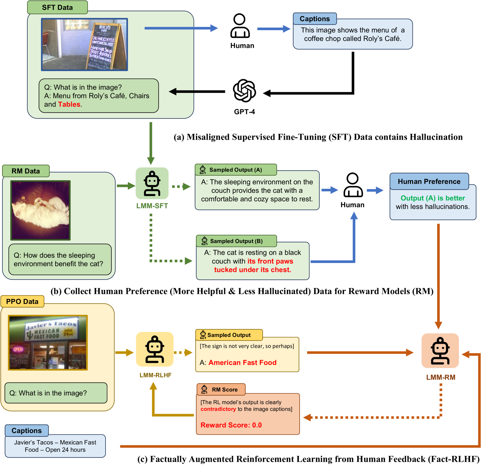
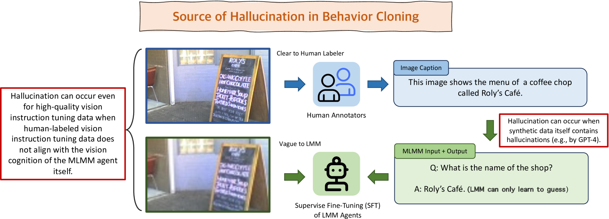

# LLaVA-RLHF

## 📌 核心贡献

> 首次将 RLHF 应用于多模态大模型，提出 Factually Augmented RLHF（Fact-RLHF）通过向奖励模型注入事实信息缓解 reward hacking，并建立 MMHAL-BENCH 评估基准。

## 📖 摘要

Large Multimodal Models (LMM) are built across modalities and the misalignment between two modalities can result in "hallucination", generating textual outputs that are not grounded by the multimodal information in context. To address the multimodal misalignment issue, we adapt the Reinforcement Learning from Human Feedback (RLHF) from the text domain to the task of vision-language alignment, where human annotators are asked to compare two responses and pinpoint the more hallucinated one, and the vision-language model is trained to maximize the simulated human rewards. We propose a new alignment algorithm called Factually Augmented RLHF that augments the reward model with additional factual information such as image captions and ground-truth multi-choice options, which alleviates the reward hacking phenomenon in RLHF and further improves the performance. We also enhance the GPT-4-generated training data (for vision instruction tuning) with previously available human-written image-text pairs to improve the general capabilities of our model. To evaluate the proposed approach in real-world scenarios, we develop a new evaluation benchmark MMHAL-BENCH with a special focus on penalizing hallucinations. As the first LMM trained with RLHF, our approach achieves remarkable improvement on the LLaVA-Bench dataset with the 94% performance level of the text-only GPT-4 (while previous best methods can only achieve the 87% level), and an improvement by 60% on MMHAL-BENCH over other baselines. We opensource our code, model, data at this https URL.

## 🔍 关键信息

| 字段 | 内容 |
|------|------|
| 机构 | UC Berkeley, CMU, Microsoft, MIT-IBM, UIUC |
| 发表 | 2023-09-25 |
| 分类 | cs.CV, cs.CL |
| 链接 | [arXiv](https://arxiv.org/abs/2309.14525) |

## 📝 我的笔记

### 方法总览

### 动机与问题

多模态大模型在 SFT 阶段容易产生幻觉，原因包括：(1) GPT-4 合成的训练数据本身含有幻觉；(2) 指令数据标注者不了解模型的视觉感知能力。直接将文本域 RLHF 迁移到多模态领域面临 reward hacking 问题——模型学会生成格式良好但内容不准确的冗长回复来欺骗奖励模型。

### 核心方法

**三阶段训练流程：**

1. **多模态 SFT**：CLIP ViT-L/14 视觉编码器 + Vicuna 语言模型联合微调
2. **偏好建模**：奖励模型基于相同架构，最后一个 token 的嵌入通过线性投影输出标量奖励
   $$\mathcal{L}(r_\theta) = -\mathbb{E}[\log \sigma(r_\theta(\mathcal{I}, x, y_i) - r_\theta(\mathcal{I}, x, y_{1-i}))]$$
3. **强化学习**：PPO + KL 惩罚优化策略
   $$\mathcal{L}(\pi_\phi^{RL}) = -\mathbb{E}[r_\theta(\mathcal{I}, x, y) - \beta \cdot D_{KL}(\pi_\phi^{RL} \| \pi^{INIT})]$$

**Fact-RLHF 的关键创新：**
- 向奖励模型注入额外事实信息：图像描述（5 个 COCO captions）、多选题正确答案（A-OKVQA rationals）
- 符号奖励：正确性惩罚（错误 0 分，正确 2 分，不完整 -8 分）+ 长度惩罚

**数据增强：**
在 LLaVA 98k 对话基础上增加 83k VQAv2 是非题、16k A-OKVQA 多选题、23k Flickr30k 描述

### 关键结果

| 模型 | LLaVA-Bench (vs GPT-4) | MMHal-Bench Score | 幻觉率 |
|------|------------------------|-------------------|--------|
| LLaVA-SFT+ 7B | 75.1% | — | — |
| LLaVA-RLHF 7B | 93.0% | 2.05 | 0.68 |
| LLaVA-RLHF 13B×336 | 93.9% | 2.53 | 0.57 |
| Standard RLHF | 93.4% | 1.8 | — |
| Fact-RLHF | 94.1% | 2.1 | — |

Fact-RLHF 相比标准 RLHF 在 LLaVA-Bench 和 MMHal-Bench 上均有提升，说明事实增强有效缓解了 reward hacking。

### 总结

LLaVA-RLHF 是首个应用 RLHF 的多模态大模型，Fact-RLHF 通过向奖励模型提供事实信息解决了多模态 reward hacking 问题。MMHAL-BENCH 也成为后续多模态幻觉研究的重要评估基准。

## 🔗 相关论文

**基于/改进自：** [[RLHF]], [[InstructGPT]], [[LLaVA]]

**同方向：** [[LLaVA-Critic]], [[RLHF-V]], [[RLAIF-V]]
