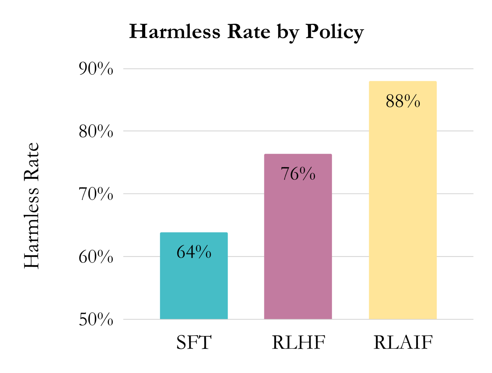
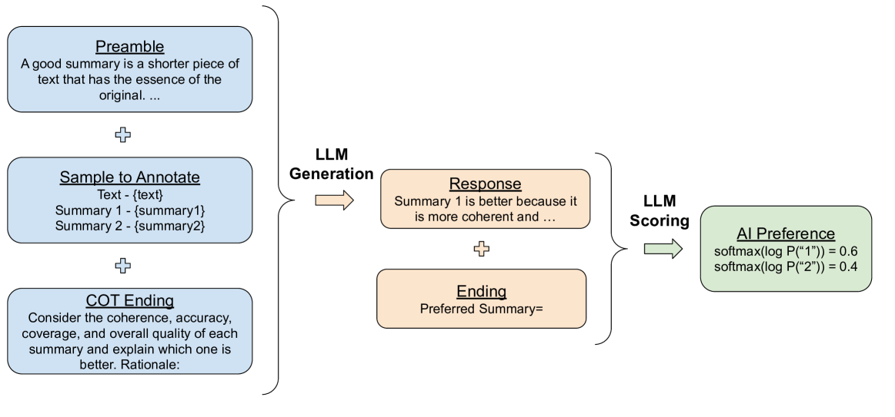
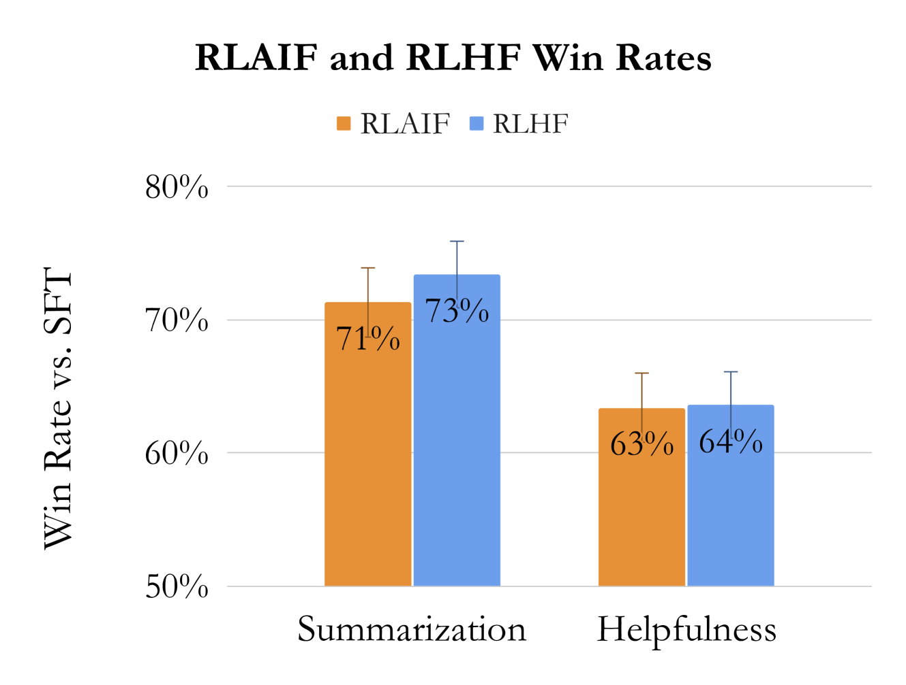

# RLAIF

## 📌 核心贡献

> 系统性地对比了 RLAIF 与 RLHF 的效果，证明 AI 生成的偏好反馈可以达到与人类反馈相当的对齐性能，并提出 direct-RLAIF (d-RLAIF) 方法直接用 LLM 作为奖励函数，绕过 reward model 训练，取得优于标准 RLAIF 的效果。

## 📖 摘要

Reinforcement learning from human feedback (RLHF) has proven effective in aligning large language models (LLMs) with human preferences, but gathering high-quality preference labels is expensive. RL from AI Feedback (RLAIF), introduced in Bai et al., offers a promising alternative that trains the reward model (RM) on preferences generated by an off-the-shelf LLM. Across the tasks of summarization, helpful dialogue generation, and harmless dialogue generation, we show that RLAIF achieves comparable performance to RLHF. Furthermore, we take a step towards "self-improvement" by demonstrating that RLAIF can outperform a supervised fine-tuned baseline even when the AI labeler is the same size as the policy, or even the exact same checkpoint as the initial policy. Finally, we introduce direct-RLAIF (d-RLAIF) - a technique that circumvents RM training by obtaining rewards directly from an off-the-shelf LLM during RL, which achieves superior performance to canonical RLAIF. Our results suggest that RLAIF can achieve performance on-par with using human feedback, offering a potential solution to the scalability limitations of RLHF.

## 🔍 关键信息

| 字段 | 内容 |
|------|------|
| 机构 | Google |
| 发表 | 2023-09-01 |
| 分类 | cs.CL, cs.AI, cs.LG |
| 链接 | [arXiv](https://arxiv.org/abs/2309.00267) |

## 📝 我的笔记

### 动机与问题定义

RLHF 是目前 LLM 对齐的主流方法，但其核心瓶颈在于高质量人类偏好标注的成本高昂且难以扩展。Bai et al. (Constitutional AI) 提出了 RLAIF 的概念——用 LLM 替代人类标注者生成偏好数据，但此前缺乏 RLAIF 与 RLHF 的系统性对比。本文的核心问题：**AI 反馈能否真正替代人类反馈？如果可以，最佳实践是什么？**

### 方法总览

#### RLAIF 流程

RLAIF 与 RLHF 的唯一区别在于偏好标注阶段：用现成的 LLM 替代人类标注者生成偏好标签，之后的 reward model 训练和 RL 优化流程完全一致。

#### LLM 偏好标注设计

Prompt 结构由四部分组成：
1. **Preamble**：任务说明（如"评估哪个摘要更好"）
2. **Few-shot exemplars**（可选）：示例标注
3. **待标注样本**：context + 两个候选回复
4. **结尾提示**：如 "Preferred Response="

**关键技术 - 位置偏差消除**：对每对候选进行两次推理，第二次交换候选顺序，将两次结果取平均。实验发现模型越小偏差越严重（PaLM 2 L/S/XS 分别有 18%/21%/56% 的位置偏好倾向）。

**Chain-of-Thought (CoT)**：采用两步流程——先让 LLM 生成推理过程，再拼接推理结果生成偏好分布。CoT 一致性地提升了 AI 标注与人类偏好的对齐度。

#### Reward Model 训练

使用 AI 生成的 soft label，以 RM 输出 score 的 softmax 作为预测，训练交叉熵损失。

#### Direct-RLAIF (d-RLAIF)

d-RLAIF 是本文的核心创新——完全绕过 reward model 训练，在 RL 阶段直接用 LLM 对生成结果打分。具体方法：让 LLM 对生成质量打 1-10 分，计算每个分数 token 的 likelihood 加权得到连续分数：

$$s(y|x) = \sum_{i=1}^{10} i \cdot P(i|y,x)$$

然后归一化到 $[-1, 1]$ 区间作为 reward。

#### RL 优化

使用 REINFORCE 算法，目标函数包含 reward 最大化项和 KL 散度惩罚项：

$$J(\theta) = \mathbb{E}_{y \sim \pi_\theta(\cdot|x)} \left[(1-\beta) r_\phi(y|x) - \beta \cdot D_{KL}(\pi^{RL}_\theta(y|x) \| \pi^{SFT}(y|x))\right]$$

其中 $\beta = 0.05$。

### 关键结果

#### 主实验：RLAIF vs RLHF

| 任务 | RLAIF vs SFT | RLHF vs SFT | RLAIF vs RLHF |
|------|-------------|-------------|---------------|
| Summarization | 71% | 73% | 50% |
| Helpful Dialogue | 63% | 64% | 52% |
| Harmless Dialogue | **88%** | 76% | - |

核心发现：RLAIF 在所有任务上与 RLHF 表现相当（head-to-head 约 50% win rate），在 harmless dialogue 上甚至显著优于 RLHF (p<0.05)。

#### Reward Model 准确率

| 任务 | Human RM | AI RM |
|------|----------|-------|
| Summarization | 79.3% | 74.2% |
| Helpful Dialogue | 76.0% | 67.8% |
| Harmless Dialogue | 72.1% | 69.7% |

AI RM 准确率略低于 Human RM，但最终 policy 质量差异不显著——说明 RM 准确率的差异不一定传导到最终对齐效果。

#### AI Labeler 对齐度 vs 模型大小

| 模型 | 与人类偏好对齐度 |
|------|-----------------|
| PaLM 2 Large | 78.0% |
| PaLM 2 Small | 73.8% |
| PaLM 2 XS | 62.7% |

#### d-RLAIF 结果

| 任务 | d-RLAIF vs SFT | d-RLAIF vs Same-size RLAIF |
|------|----------------|---------------------------|
| Summarization | 74% | 60%（显著优于） |
| Helpful Dialogue | 66% | - |

d-RLAIF 在 summarization 上显著优于标准 RLAIF，且实现了真正的"自我改进"——labeler 和 policy 可以是同一个 checkpoint。

### Ablation 分析

- **CoT 推理**：一致性提升 AI 标注质量，summarization 上从 76.1% 提升到 78.0%
- **Few-shot**：出乎意料地在 summarization/helpfulness 上降低对齐度（随示例数增加单调递减）
- **位置偏差**：小模型偏差严重（PaLM 2 XS 56% 偏好同一位置），双向推理取平均有效消除
- **成本**：LLM 标注成本估计为人类标注的 1/10 以下

### 总结性评价

本文最重要的贡献是提供了 RLAIF vs RLHF 的严格实验对比，结论令人振奋：AI 反馈可以达到人类反馈的对齐效果。d-RLAIF 进一步简化了流程，绕过 RM 训练直接用 LLM 打分，在部分任务上效果更优。这为大规模对齐提供了更 scalable 的路径。

值得注意的局限：(1) 实验基于 PaLM 2 系列模型，跨模型泛化性需验证；(2) 仅在 text 任务上评测，多模态场景待探索；(3) AI labeler 和 policy 同质化可能存在盲区（AI 偏好不等于真正的人类价值观）。

## 🔗 相关论文

**基于/改进自：** [[ConstitutionalAI]]

**同方向：** [[InstructGPT]], [[Self-Rewarding]]
