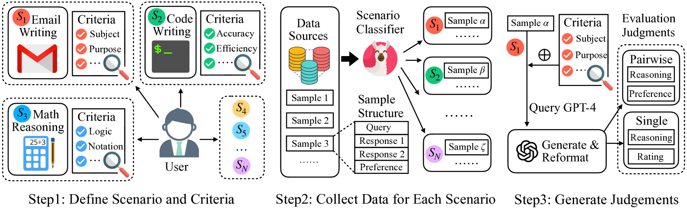
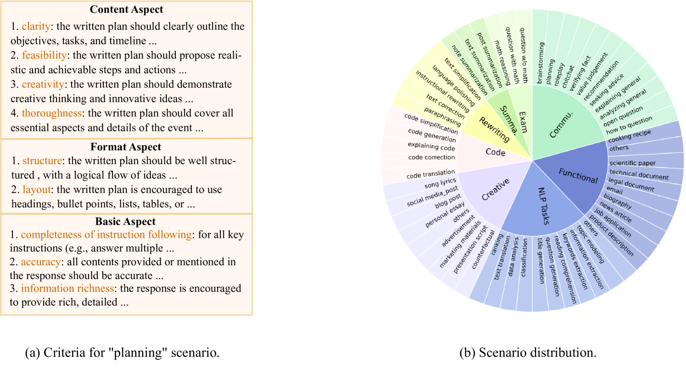
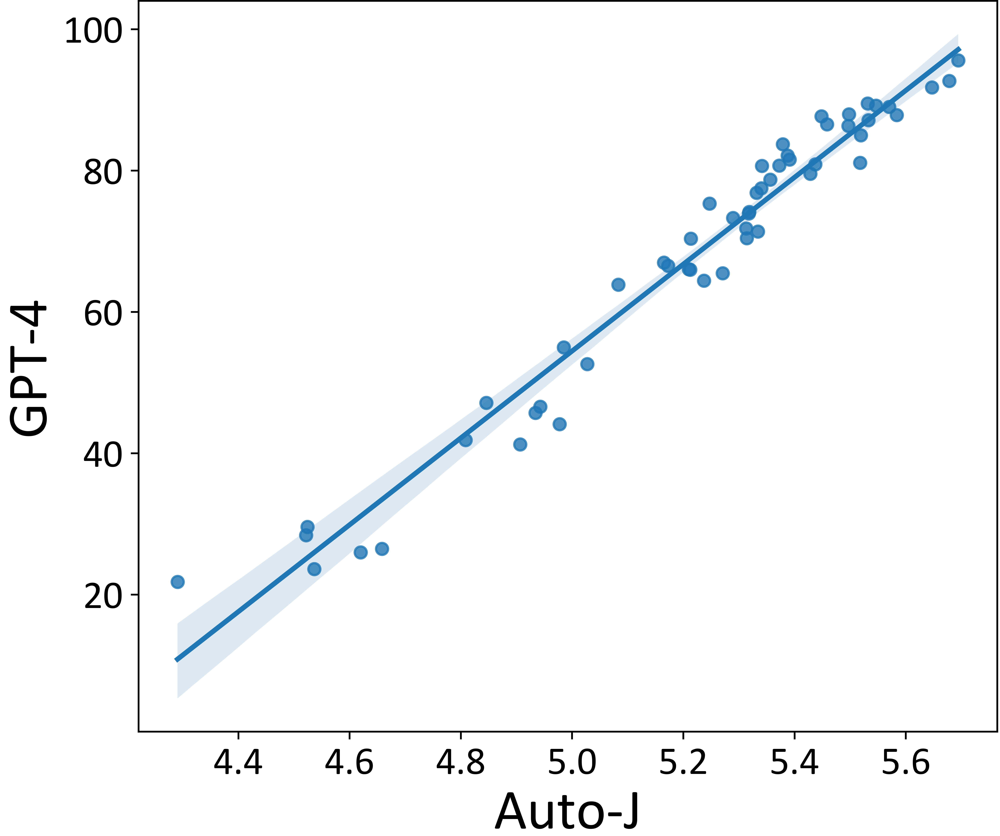

# Auto-J

## 📌 核心贡献

> 提出首个开源 13B 参数的生成式评判模型 Auto-J，覆盖 58 个真实场景，同时支持 pairwise 比较和单条评估两种协议，并生成结构化自然语言 critique，在开源模型中首次超越 ChatGPT 和 Claude-2 的评判能力。

## 📖 摘要

The rapid development of Large Language Models (LLMs) has substantially expanded the range of tasks they can address. In the field of Natural Language Processing (NLP), researchers have shifted their focus from conventional NLP tasks (e.g., sequence tagging and parsing) towards tasks that revolve around aligning with human needs (e.g., brainstorming and email writing). This shift in task distribution imposes new requirements on evaluating these aligned models regarding generality (i.e., assessing performance across diverse scenarios), flexibility (i.e., examining under different protocols), and interpretability (i.e., scrutinizing models with explanations). In this paper, we propose a generative judge with 13B parameters, Auto-J, designed to address these challenges. Our model is trained on user queries and LLM-generated responses under massive real-world scenarios and accommodates diverse evaluation protocols (e.g., pairwise response comparison and single-response evaluation) with well-structured natural language critiques.

## 🔍 关键信息

| 字段 | 内容 |
|------|------|
| 机构 | Shanghai Jiao Tong University |
| 发表 | 2023-10-09 |
| 分类 | cs.CL, cs.AI |
| 链接 | [arXiv](https://arxiv.org/abs/2310.05470) |

## 📝 我的笔记

### 动机与问题定义

评估对齐后的 LLM 面临三大挑战：

1. **通用性（Generality）**：需要在多样的真实场景下评估，不能仅依赖有 gold reference 的传统 NLP 任务
2. **灵活性（Flexibility）**：不同应用需要不同的评估协议——pairwise 比较用于 RM 训练，单条评估用于系统输出评分
3. **可解释性（Interpretability）**：不能仅给出数值分数，需要提供自然语言 critique 作为支撑

现有方案的局限：
- 闭源模型（GPT-4, Claude）成本高、不可复现
- 开源模型（PandaLM, Shepherd）仅支持单一评估协议，场景覆盖不全

### 方法总览

#### Step 1: 场景与评估标准定义

定义 **58 个场景**，组织为 8 大类别：

| 类别 | 场景数 | 示例 |
|------|--------|------|
| Summarization | 3 | post/text/note summarization |
| Exam Questions | 3 | math reasoning, exam w/ & w/o math |
| Code | 5 | generation, simplification, correction |
| Creative Writing | 8 | lyrics, essay, blog, advertisement |
| Functional Writing | 9 | news, legal, technical, recipe |
| Rewriting | 5 | simplification, polishing, paraphrasing |
| General Communication | 10 | advice, brainstorming, roleplay, planning |
| NLP Tasks | 7 | translation, classification, extraction |

为每个场景制定专属评估标准（criteria），共 332 条标准，每条包含名称和描述性指导。

#### Step 2: 查询与回复收集

从 6 个数据源聚合数据：Chatbot Arena, MTBench, OpenAI Summary/WebGPT, Stanford SHP, Synthetic GPT-J, PKU-SafeRLHF。

训练场景分类器（基于 LLaMA-2-13B），准确率 72.55%，用三步流程：合成种子数据 → 初步分类 + 人工验证 → 重训分类器。

#### Step 3: 判断生成

**Pairwise 判断：**
- 用 GPT-4 基于场景标准生成判断
- 启发式规则统一格式，过滤与人类标注不一致的样本
- 每场景最多 100 条，最终 **3,436 条**

**单条评估判断：**
- 从 Chatbot Arena 采样 960 条，场景均衡分布
- **分而治之策略**：分别让 GPT-4 生成有/无场景标准的 critique，再融合为包含 1-10 评分的综合 critique
- 最终 **960 条**

#### 关键设计：隐式标准学习

受 Context Distillation 和 Ghost Attention 启发，训练时**不在输入中包含场景标准**，让模型通过训练数据隐式学习评估标准，从而提升泛化能力。

#### 训练细节

| 配置 | 值 |
|------|-----|
| 基座模型 | LLaMA-2-13B-chat |
| 训练数据 | 3,436 pairwise + 960 single（上采样平衡） |
| 数据增强 | 交换 pairwise 回复顺序以减轻位置偏差 |
| 优化器 | AdamW ($\beta_1$=0.9, $\beta_2$=0.95, wd=0.1) |
| 学习率 | 1e-5, 3% warmup, cosine decay |
| Batch size | 64 |
| 最大序列长度 | 4,096 |
| 训练轮数 | 5 epochs (675 steps) |
| 精度 | bfloat16 + tfloat32 |
| 基础设施 | 8×A100, DeepSpeed ZeRO-3, FlashAttention |

### 关键实验结果

#### Pairwise 比较 (Eval-P)

1,392 条测试样本（58 场景 × 24），指标为与人类标注的一致率：

| 模型 | Summ. | Exam | Code | Rewrite | Creative | Functional | Comm. | NLP | Overall |
|------|-------|------|------|---------|----------|------------|-------|-----|---------|
| PandaLM | 29.2 | 33.3 | 31.7 | 23.3 | 43.5 | 32.9 | 44.8 | 48.9 | 38.9 |
| ChatGPT | 33.3 | 40.3 | 36.7 | 32.5 | 48.2 | 40.4 | 47.6 | 45.8 | 42.7 |
| Claude-2 | 30.6 | 36.1 | 42.5 | 34.2 | 48.6 | 49.6 | 36.8 | 46.6 | 42.6 |
| **Auto-J** | **45.8** | **38.9** | **47.5** | **49.2** | **59.7** | **61.7** | **55.2** | **57.6** | **55.0** |
| GPT-4 | 61.1 | 51.4 | 68.3 | 58.3 | 65.3 | 67.9 | 52.4 | 67.8 | 62.3 |

Auto-J (55.0%) 显著超越 ChatGPT (42.7%) 和 Claude-2 (42.6%)，仅次于 GPT-4 (62.3%)。

#### 位置一致性

交换回复顺序后预测一致性：

| 模型 | 一致性 |
|------|--------|
| LLaMA-2-Chat-13B | 48.6% |
| ChatGPT | 62.4% |
| Auto-J | 83.4% |
| GPT-4 | 85.9% |

Auto-J 的位置偏差显著低于 ChatGPT，接近 GPT-4 水平。

#### Best-of-N 选择 (Eval-R)

Auto-J 的评分用于 Best-of-N 选择，GPT-4 打分衡量最终质量：

| 基座模型 | N | Auto-J | ChatGPT | Open-Asst. |
|---------|---|--------|---------|------------|
| LLaMA-2-7B | 8 | **8.21** | 8.20 | 8.17 |
| LLaMA-2-7B | 32 | **8.34** | 8.14 | 8.25 |
| Vicuna-7B | 32 | **7.97** | 7.32 | 7.66 |

与 GPT-4 评分的相关性：Pearson=0.57, Spearman=0.55（显著优于其他开源基线）。

#### 系统级排名

Auto-J 与 AlpacaEval 排行榜的 LLM 排名相关性达到 Spearman=0.97, Pearson=0.96，展示了其作为系统级评估工具的可靠性。

### Ablation 分析

| 变体 | Eval-P 一致率 | 说明 |
|------|-------------|------|
| Auto-J（完整） | 55.0% | 生成 critique + 判断 |
| 仅判断（无 critique） | 55.0% | 移除 critique 生成，性能不降 |
| 标准 RM（标量） | 54.5% | 传统判别式 RM |

关键发现：生成 critique **不牺牲** pairwise 判断性能，同时额外获得可解释性和单条评估能力。标准 RM 的 GPT-4 评分相关性（Pearson=0.39）远低于 Auto-J（0.57），说明生成式 judge 在泛化评估上优势明显。

### 总结性评价

Auto-J 是 LLM-as-Judge 方向的早期重要工作，有几个值得注意的贡献：

1. **系统性场景覆盖**：58 个场景 + 332 条评估标准的设计是其核心差异化——在此之前的评估模型没有如此细粒度的场景意识
2. **隐式标准蒸馏**：训练时不喂标准但通过 GPT-4 蒸馏学习，这种 context distillation 思路在后续工作（如 J1 的 rubric internalization）中被进一步发展
3. **多协议统一**：单一模型同时支持 pairwise + single-response + critique，后续 [[GenRM]] 和 [[J1]] 也追求类似的多功能性
4. **局限性**：仅 13B、基于 LLaMA-2，在 GPT-4 面前仍有显著差距（55% vs 62.3%）；训练数据仅 ~4.4K 条，规模偏小

这项工作可视为 [[FLAMe]] 和 [[J1]] 的先驱——前者通过更大规模人类判断数据训练 foundation judge，后者通过 RL 训练进一步提升 judge 能力。

## 🔗 相关论文

**同方向：** [[J1]], [[GenRM]], [[FLAMe]], [[LLM-as-Judge-Survey]]
