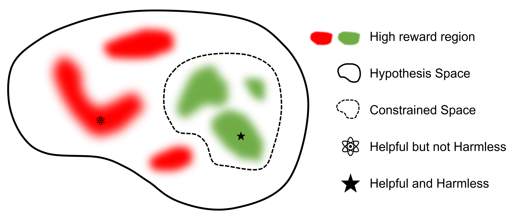
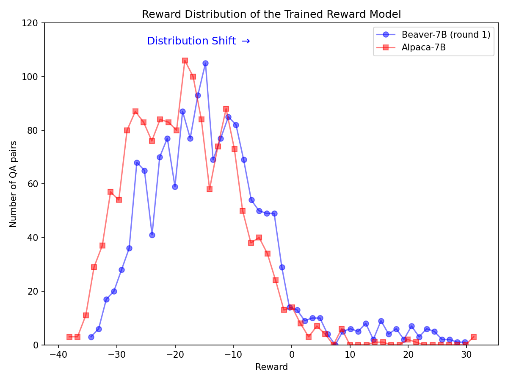

# Safe-RLHF

## 📌 核心贡献

> 提出 Safe RLHF 框架，将人类偏好中的有用性（helpfulness）和无害性（harmlessness）显式解耦为独立的奖励模型和成本模型，利用拉格朗日方法动态平衡两个目标，在三轮迭代训练中显著提升模型性能和安全性。

## 📖 摘要

With the development of large language models (LLMs), striking a balance between the performance and safety of AI systems has never been more critical. However, the inherent tension between the objectives of helpfulness and harmlessness presents a significant challenge during LLM training. To address this issue, we propose Safe Reinforcement Learning from Human Feedback (Safe RLHF), a novel algorithm for human value alignment. Safe RLHF explicitly decouples human preferences regarding helpfulness and harmlessness, effectively avoiding the crowdworkers' confusion about the tension and allowing us to train separate reward and cost models. We formalize the safety concern of LLMs as an optimization task of maximizing the reward function while satisfying specified cost constraints. Leveraging the Lagrangian method to solve this constrained problem, Safe RLHF dynamically adjusts the balance between the two objectives during fine-tuning. Through a three-round fine-tuning using Safe RLHF, we demonstrate a superior ability to mitigate harmful responses while enhancing model performance compared to existing value-aligned algorithms.

## 🔍 关键信息

| 字段 | 内容 |
|------|------|
| 机构 | Peking University |
| 发表 | 2023-10-19 |
| 分类 | cs.AI, cs.LG |
| 链接 | [arXiv](https://arxiv.org/abs/2310.12773) |

## 📝 我的笔记

### 方法总览

### 动机与问题定义

RLHF 训练中有用性和无害性目标存在本质张力：一个有用的回复可能包含有害内容（如教人做危险事），而一个安全的拒绝回复可能完全无用。传统 RLHF 让标注者在单一维度上标注偏好，导致两个目标混淆。Safe RLHF 的核心思路是解耦这两个维度。

### 方法细节

**偏好解耦标注：**
- 有用性数据集 $\mathcal{D}_R$：标注者独立评判回复的有用性排序
- 无害性数据集 $\mathcal{D}_C$：标注者独立评判回复的有害性排序 + 安全标签（14 类潜在危害）

**奖励模型（RM）：**

使用有用性数据训练，标准 Bradley-Terry 损失：

$$\mathcal{L}_R(\phi; \mathcal{D}_R) = -\mathbb{E}_{(x,y_w,y_l) \sim \mathcal{D}_R} [\log \sigma(R_\phi(y_w, x) - R_\phi(y_l, x))]$$

**成本模型（CM）：**

结合偏好排序和安全分类标签，损失函数包含两部分：

$$\mathcal{L}_C(\psi; \mathcal{D}_C) = -\mathbb{E}[\log \sigma(C_\psi(y_w, x) - C_\psi(y_l, x))] - \mathbb{E}[\log \sigma(s_w \cdot C_\psi(y_w, x)) + \log \sigma(s_l \cdot C_\psi(y_l, x))]$$

其中 $s(y) = +1$ 表示有害，$s(y) = -1$ 表示无害。

**安全约束 RL（拉格朗日方法）：**

将优化目标形式化为约束优化问题：

$$\max_\theta \mathbb{E}[R_\phi(y,x)], \quad \text{s.t. } C_\psi(y,x) \leq 0$$

转化为无约束拉格朗日对偶问题：

$$\min_\theta \max_{\lambda \geq 0} [-\mathcal{J}_R(\theta) + \lambda \cdot \mathcal{J}_C(\theta)]$$

其中 $\lambda$ 为拉格朗日乘子，在训练过程中动态更新，自适应平衡有用性和安全性。

### 关键结果

**奖励模型与成本模型精度：**

| 模型 | 指标 | Beaver-v1 | Beaver-v2 | Beaver-v3 |
|------|------|-----------|-----------|-----------|
| Reward Model | Ranking Accuracy | 78.13% | 75.73% | 77.32% |
| Cost Model | Ranking Accuracy | 74.47% | 76.07% | 74.17% |
| Cost Model | Safety Classification | 95.62% | 84.54% | 85.88% |

**Elo 评分提升（vs. Alpaca-7B）：**
- 有用性 Elo：GPT-4 评估 +244.91，人类评估 +363.86
- 无害性 Elo：GPT-4 评估 +268.31，人类评估 +237.98

**安全性改善：** 有害回复比例从 Alpaca-7B 的 53.08% 降至 Beaver-v3 的 2.45%。

### 总结评价

Safe RLHF 的核心贡献在于将"有用"和"安全"两个维度的偏好标注和模型训练完全解耦。拉格朗日方法优于固定权重的 Reward Shaping，因为它能根据模型当前安全水平自适应调整优化方向。BeaverTails 数据集（14 类安全标签）也为后续安全对齐研究提供了重要基础设施。

## 🔗 相关论文

**同方向：** [[InstructGPT]], [[ConstitutionalAI]]
